# 多租户架构

> 多租户（Multi-Tenancy）是 SaaS 系统的核心架构，让一套软件服务多个客户（租户），实现资源复用、降低成本。

## 目录

- [一、多租户概念](#一多租户概念)
- [二、隔离模型](#二隔离模型)
- [三、数据隔离方案](#三数据隔离方案)
- [四、租户识别与路由](#四租户识别与路由)
- [五、资源隔离](#五资源隔离)
- [六、租户管理](#六租户管理)
- [七、选型建议](#七选型建议)
- [八、相关资料](#八相关资料)

## 一、多租户概念

### 1.1 什么是多租户

```mermaid
flowchart TD
    A[SaaS 应用] --> B[租户A<br/>公司A]
    A --> C[租户B<br/>公司B]
    A --> D[租户C<br/>公司C]
    Note over A,D: 一套软件 多个客户
```

### 1.2 多租户 vs 单租户

| 维度 | 单租户 | 多租户 |
|------|--------|--------|
| 部署 | 每客户一套 | 共享一套 |
| 成本 | 高 | 低 |
| 隔离 | 物理隔离 | 逻辑隔离 |
| 维护 | 逐个升级 | 一次升级 |
| 定制 | 高 | 低 |
| 数据安全 | 强 | 中 |

### 1.3 应用场景

- SaaS 软件（钉钉、飞书）
- 云服务（AWS、阿里云）
- 企业内部平台（中台）

## 二、隔离模型

```mermaid
flowchart TD
    A[隔离模型] --> B[完全隔离<br/>独立部署]
    A --> C[共享应用<br/>独立数据库]
    A --> D[共享应用<br/>共享数据库]
    Note over B: 安全性高 成本高
    Note over D: 成本低 隔离弱
```

### 2.1 三种模型对比

| 模型 | 隔离性 | 成本 | 维护 | 定制 |
|------|--------|------|------|------|
| 独立部署 | 强 | 高 | 难 | 高 |
| 独立 DB | 中 | 中 | 中 | 中 |
| 共享 DB | 弱 | 低 | 易 | 低 |

### 2.2 模型选择因素

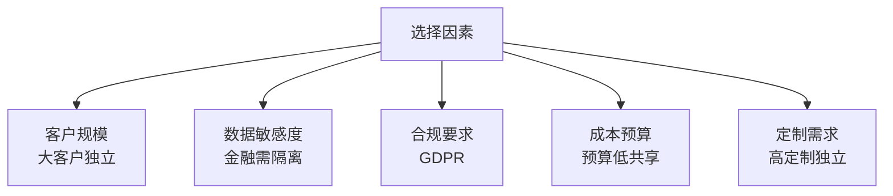

## 三、数据隔离方案

### 3.1 方案一：独立数据库

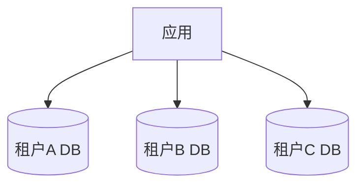

实现：
```python
def get_db_connection(tenant_id):
    db_config = tenant_db_map[tenant_id]
    return connect(db_config)
```

优点：
- 数据完全隔离
- 易备份恢复
- 单租户故障不影响

缺点：
- 成本高
- 跨租户分析难
- 运维复杂

适用：金融、政府、大客户

### 3.2 方案二：共享数据库独立 Schema

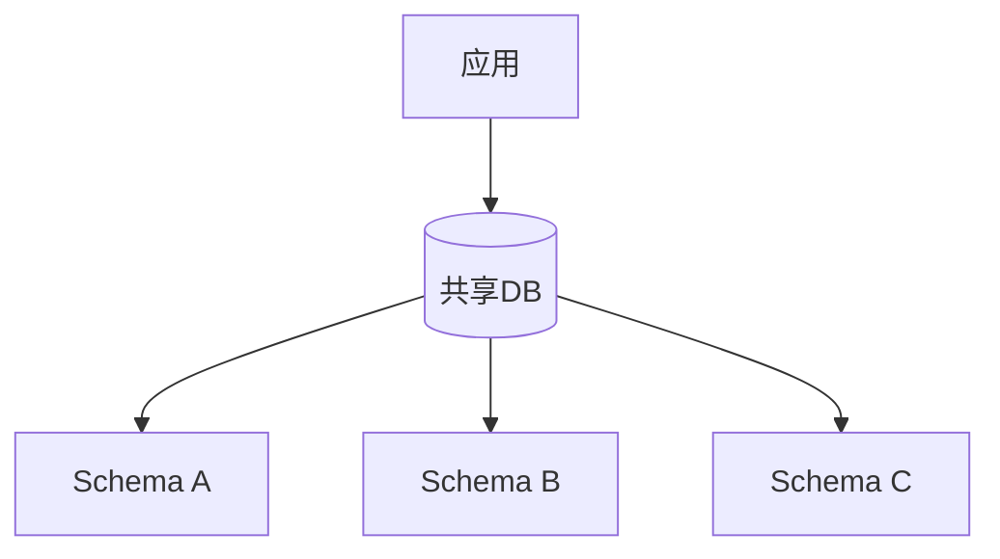

```sql
-- PostgreSQL Schema 隔离
SET search_path TO tenant_a;
SELECT * FROM users;

SET search_path TO tenant_b;
SELECT * FROM users;
```

优点：
- 一定隔离
- 成本中
- 单库管理

缺点：
- 跨 Schema 查询复杂
- Schema 数量有限

适用：中型 SaaS

### 3.3 方案三：共享数据库共享 Schema

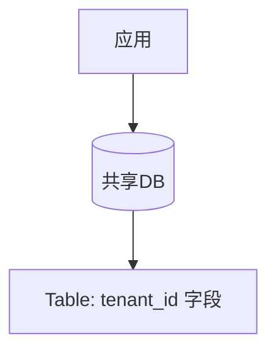

```sql
-- 所有表带 tenant_id
CREATE TABLE orders (
    id BIGINT PRIMARY KEY,
    tenant_id BIGINT NOT NULL,
    user_id BIGINT,
    amount DECIMAL,
    INDEX idx_tenant (tenant_id)
);

-- 查询必须带 tenant_id
SELECT * FROM orders WHERE tenant_id = 100 AND user_id = 200;
```

优点：
- 成本最低
- 易扩展
- 跨租户分析方便

缺点：
- 隔离最弱
- 必须每条 SQL 带 tenant_id
- 数据泄露风险

适用：成本敏感、客户规模相近

### 3.4 混合方案

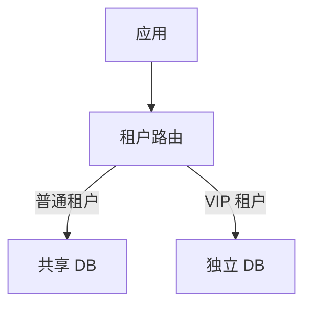

大客户独立部署，小客户共享。

## 四、租户识别与路由

### 4.1 租户识别方式

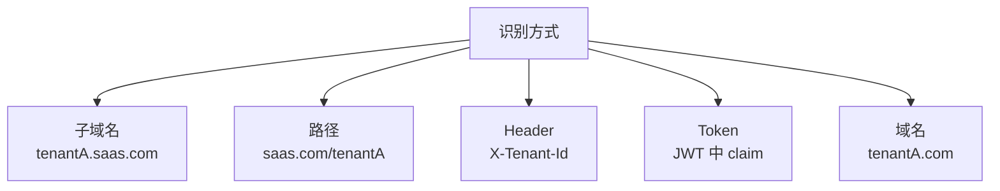

### 4.2 子域名识别

```python
def get_tenant_id(request):
    host = request.host  # tenantA.saas.com
    subdomain = host.split('.')[0]
    tenant = db.query("SELECT id FROM tenants WHERE subdomain = ?", subdomain)
    return tenant.id
```

### 4.3 JWT 中携带

```json
{
  "user_id": "u100",
  "tenant_id": "t100",
  "role": "admin",
  "exp": 1234567890
}
```

```python
def get_tenant_id(request):
    token = request.headers.get('Authorization')
    payload = jwt.decode(token)
    return payload['tenant_id']
```

### 4.4 路由层处理

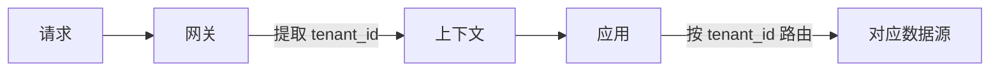

## 五、资源隔离

### 5.1 计算资源隔离

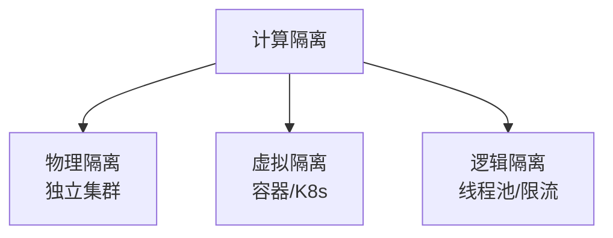

### 5.2 K8s 命名空间隔离

```yaml
apiVersion: v1
kind: Namespace
metadata:
  name: tenant-a
---
apiVersion: v1
kind: ResourceQuota
metadata:
  name: tenant-a-quota
  namespace: tenant-a
spec:
  hard:
    requests.cpu: "10"
    requests.memory: 20Gi
    limits.cpu: "20"
    limits.memory: 40Gi
```

### 5.3 限流配额

```python
# 按租户限流
def rate_limit(tenant_id):
    key = f"rate:{tenant_id}"
    current = redis.incr(key)
    if current == 1:
        # 不同租户不同配额
        quota = get_tenant_quota(tenant_id)
        redis.expire(key, 60)
    if current > quota:
        raise RateLimitExceeded()
```

### 5.4 存储配额

```sql
-- 租户配额表
CREATE TABLE tenant_quota (
    tenant_id BIGINT PRIMARY KEY,
    max_storage_gb INT,
    max_users INT,
    max_api_calls_per_day INT
);

-- 检查存储
def check_storage(tenant_id):
    used = db.query("SELECT SUM(size) FROM files WHERE tenant_id = ?", tenant_id)
    quota = get_quota(tenant_id)
    if used > quota.max_storage_gb:
        raise StorageExceeded()
```

## 六、租户管理

### 6.1 租户生命周期

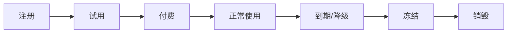

### 6.2 租户分级

| 级别 | 配置 | 价格 |
|------|------|------|
| 免费版 | 1GB / 10 用户 | 0 |
| 基础版 | 10GB / 100 用户 | 99/月 |
| 专业版 | 100GB / 1000 用户 | 999/月 |
| 企业版 | 独立部署 / 不限 | 定制 |

### 6.3 计费计量

```python
# 按使用量计费
def calculate_bill(tenant_id):
    # API 调用次数
    api_calls = redis.get(f"api_calls:{tenant_id}:{month}")
    # 存储用量
    storage = db.query("SELECT SUM(size) FROM files WHERE tenant_id = ?", tenant_id)
    # 用户数
    users = db.query("SELECT COUNT(*) FROM users WHERE tenant_id = ?", tenant_id)

    # 计算费用
    plan = get_plan(tenant_id)
    bill = plan.base_fee
    bill += max(0, api_calls - plan.api_quota) * 0.001
    bill += max(0, storage - plan.storage_quota) * 0.5
    return bill
```

### 6.4 数据迁移

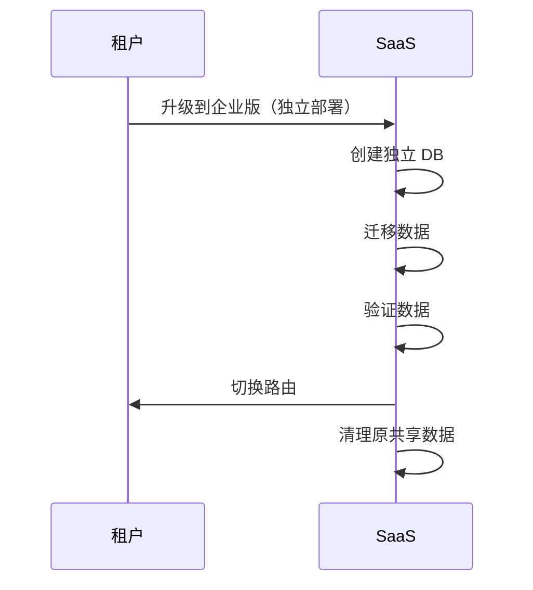

## 七、安全与合规

### 7.1 数据安全

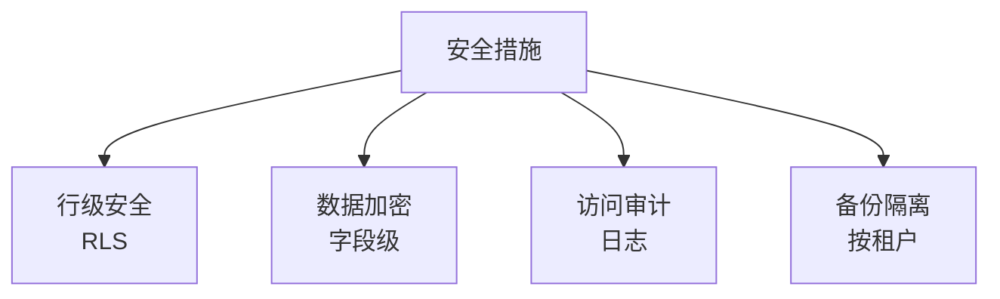

### 7.2 PostgreSQL RLS

```sql
-- 启用行级安全
ALTER TABLE orders ENABLE ROW LEVEL SECURITY;

-- 策略：只能查自己租户
CREATE POLICY tenant_isolation ON orders
    USING (tenant_id = current_setting('app.current_tenant')::bigint);

-- 设置当前租户
SET app.current_tenant = '100';
```

### 7.3 数据加密

```python
# 字段级加密
def encrypt_tenant_data(data, tenant_id):
    key = get_tenant_key(tenant_id)
    return aes_encrypt(data, key)

# 不同租户不同密钥
```

## 八、选型建议

### 8.1 决策矩阵

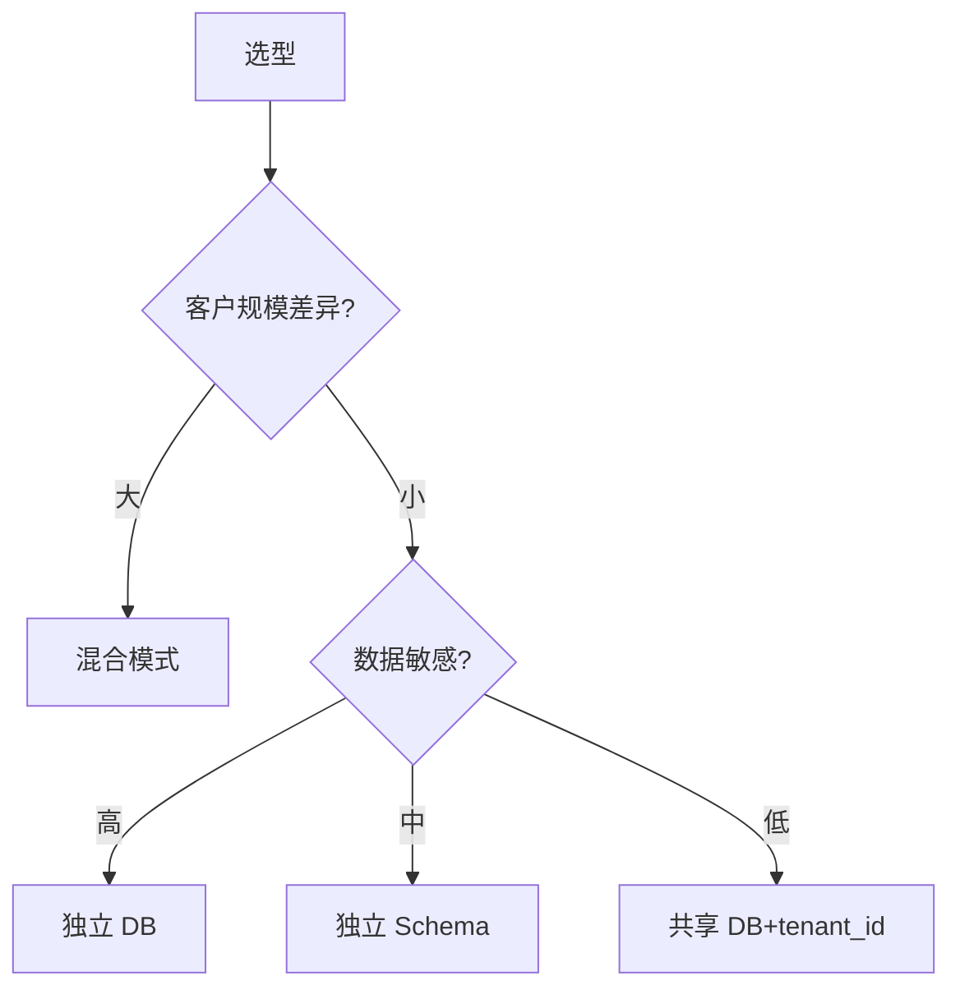

### 8.2 各方案适用场景

| 方案 | 适用 | 典型 |
|------|------|------|
| 独立部署 | 大客户、金融 | 私有云 |
| 独立 DB | 中型 SaaS | Salesforce |
| 独立 Schema | 数据库支持好 | Heroku |
| 共享 DB | 成本敏感 | 钉钉 |

## 九、相关资料

- [Multi-tenant Architecture](https://docs.microsoft.com/en-us/azure/architecture/guide/multitenant/considerations/tenancy-models)
- [SaaS 多租户架构](https://aws.amazon.com/cn/blogs/architecture/saas-multi-tenant-architecture/)
- [PostgreSQL RLS](https://www.postgresql.org/docs/current/ddl-rowsecurity.html)
- 《SaaS 架构实战》
- [Multi-Tenancy Patterns](https://www.martinfowler.com/articles/multi-tenant/)
