# 灰度发布方案

> 灰度发布（Canary Release）是降低发布风险的关键实践，让新版本逐步替换老版本，及时发现问题止损。

## 目录

- [一、灰度发布价值](#一灰度发布价值)
- [二、发布策略](#二发布策略)
- [三、灰度维度](#三灰度维度)
- [四、技术实现](#四技术实现)
- [五、监控与回滚](#五监控与回滚)
- [六、最佳实践](#六最佳实践)
- [七、相关资料](#七相关资料)

## 一、灰度发布价值

### 1.1 传统发布的痛点

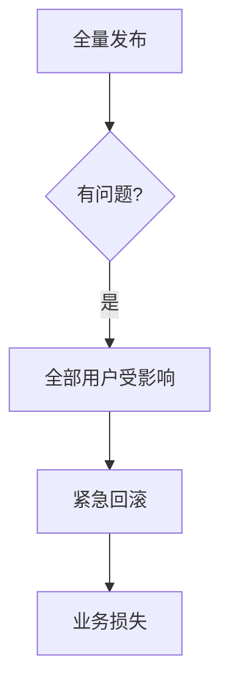

### 1.2 灰度发布的优势

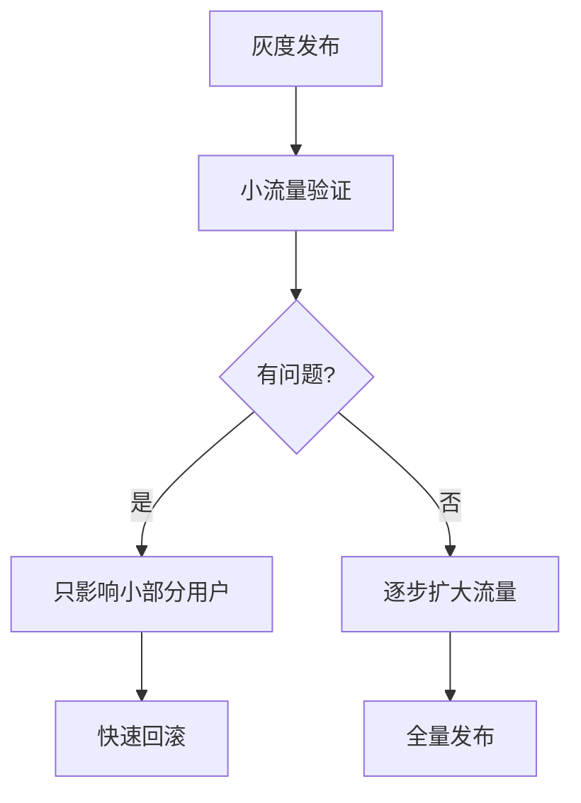

### 1.3 价值

- 降低风险：小流量先验证
- 快速反馈：及早发现问题
- 平滑过渡：用户无感知
- A/B 测试：验证业务效果

## 二、发布策略

### 2.1 主流策略对比

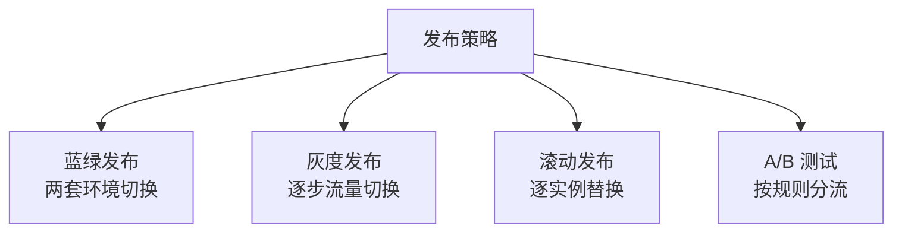

| 策略 | 资源 | 风险 | 速度 | 适用 |
|------|------|------|------|------|
| 蓝绿 | 2x | 低 | 快 | 资源充足 |
| 灰度 | 1.x | 极低 | 慢 | 互联网应用 |
| 滚动 | 1.x | 中 | 中 | 微服务 |
| A/B | 1.x | 低 | 慢 | 业务验证 |

### 2.2 蓝绿发布

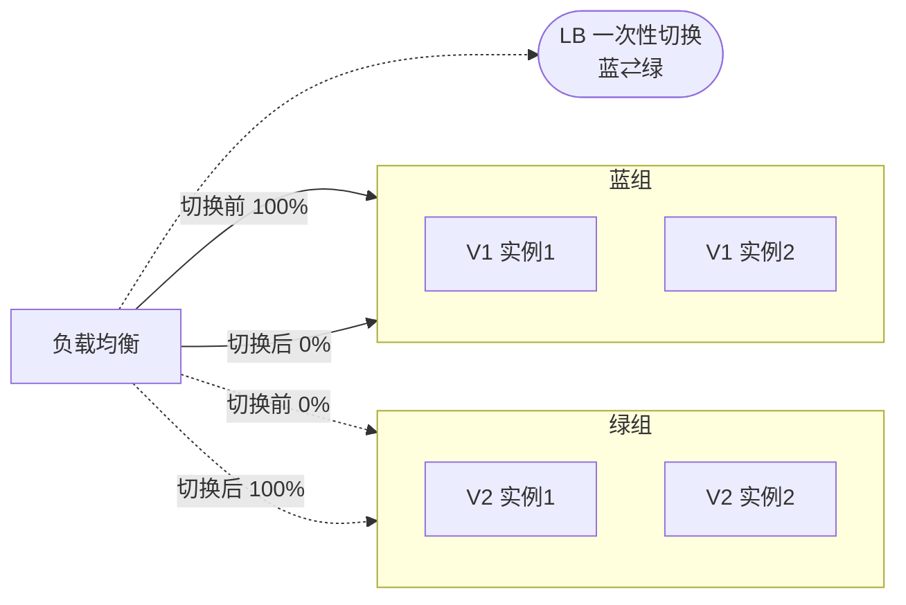

特点：
- 两套完整环境
- 一键切换
- 资源占用 2x

### 2.3 灰度发布

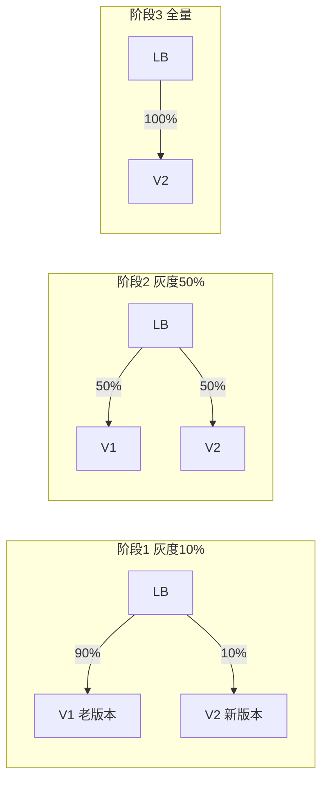

### 2.4 滚动发布

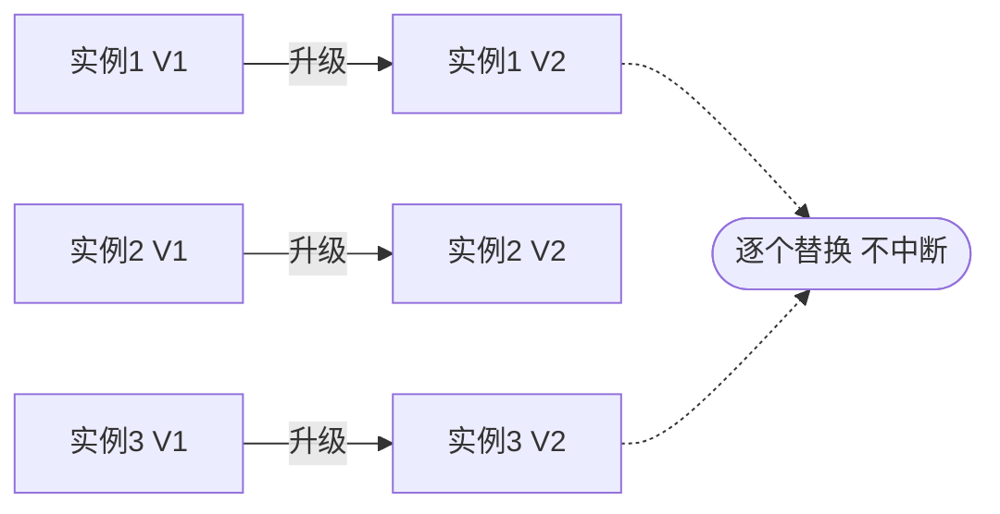

## 三、灰度维度

### 3.1 按用户维度

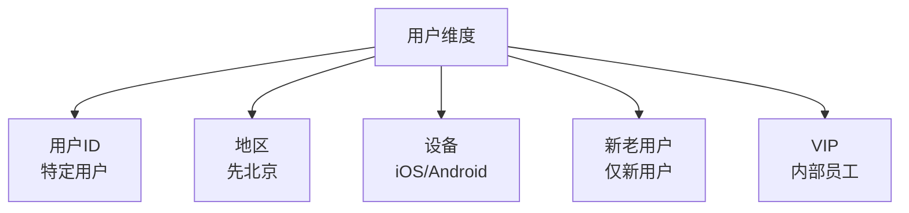

### 3.2 按流量维度

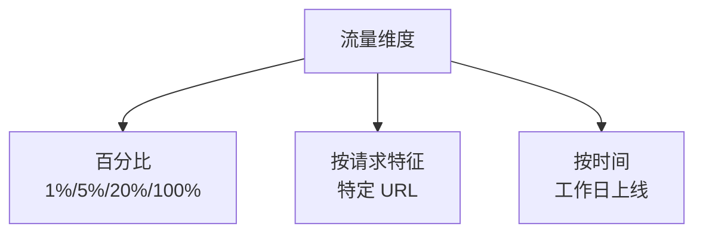

### 3.3 按业务维度

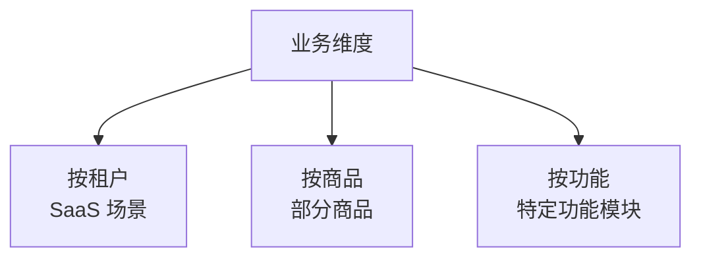

## 四、技术实现

### 4.1 Nginx 灰度

```nginx
# 按 cookie 灰度
upstream v1 {
    server 10.0.0.1:8080;
}
upstream v2 {
    server 10.0.0.2:8080;
}

split_clients "${cookie_userid}" $upstream {
    10% v2;
    * v1;
}

server {
    location / {
        proxy_pass http://$upstream;
    }
}
```

### 4.2 Spring Cloud Gateway

```yaml
spring:
  cloud:
    gateway:
      routes:
      - id: order-v1
        uri: lb://order-service-v1
        predicates:
        - Path=/api/orders/**
        - Header=X-Version, v1
      - id: order-v2
        uri: lb://order-service-v2
        predicates:
        - Path=/api/orders/**
        - Header=X-Version, v2
```

### 4.3 Istio 流量分割

```yaml
apiVersion: networking.istio.io/v1beta1
kind: VirtualService
metadata:
  name: order-service
spec:
  hosts:
  - order-service
  http:
  - route:
    - destination:
        host: order-service
        subset: v1
      weight: 90
    - destination:
        host: order-service
        subset: v2
      weight: 10
---
apiVersion: networking.istio.io/v1beta1
kind: DestinationRule
metadata:
  name: order-service
spec:
  host: order-service
  subsets:
  - name: v1
    labels:
      version: v1
  - name: v2
    labels:
      version: v2
```

### 4.4 按用户 ID 灰度

```python
def route_to_version(user_id):
    """按用户 ID 哈希灰度"""
    hash_value = hash(user_id) % 100
    if hash_value < 10:  # 10% 用户
        return 'v2'
    return 'v1'

def get_order_service(user_id):
    version = route_to_version(user_id)
    return f"http://order-service-{version}"
```

### 4.5 灰度规则引擎

```python
class CanaryRouter:
    def __init__(self):
        self.rules = load_canary_rules()

    def route(self, request):
        for rule in self.rules:
            if self.match(request, rule):
                return rule.version
        return 'v1'  # 默认走老版本

    def match(self, request, rule):
        # 用户白名单
        if rule.type == 'whitelist':
            return request.user_id in rule.users
        # 地区
        if rule.type == 'region':
            return request.region in rule.regions
        # 百分比
        if rule.type == 'percentage':
            return hash(request.user_id) % 100 < rule.percent
        return False
```

## 五、监控与回滚

### 5.1 灰度监控指标

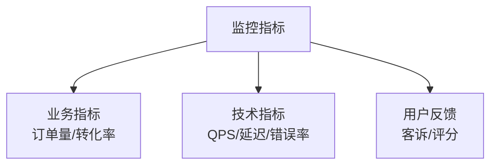

### 5.2 对比分析

```python
# 灰度组 vs 对照组
def compare_versions():
    v1_metrics = get_metrics('v1')
    v2_metrics = get_metrics('v2')

    # 关键指标对比
    compare = {
        'error_rate': v2_metrics.error_rate / v1_metrics.error_rate,
        'latency_p99': v2_metrics.p99 / v1_metrics.p99,
        'conversion': v2_metrics.conversion / v1_metrics.conversion
    }

    # 自动止损
    if compare['error_rate'] > 2:
        rollback()
    if compare['latency_p99'] > 1.5:
        rollback()
```

### 5.3 自动回滚

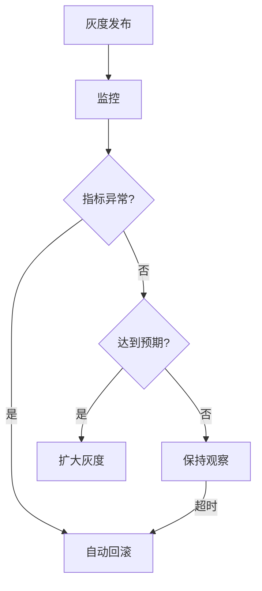

### 5.4 回滚策略

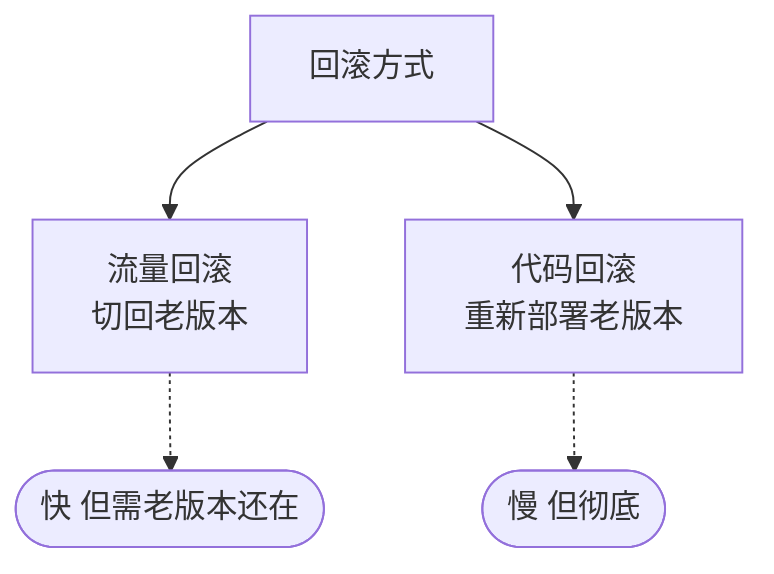

## 六、最佳实践

### 6.1 灰度流程

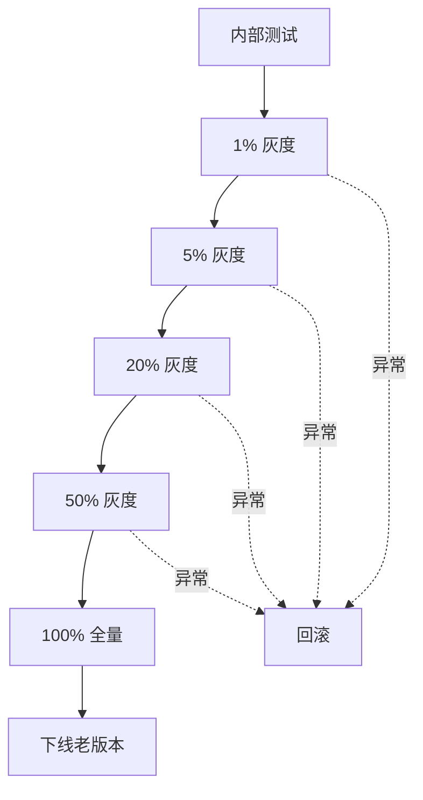

### 6.2 灰度原则

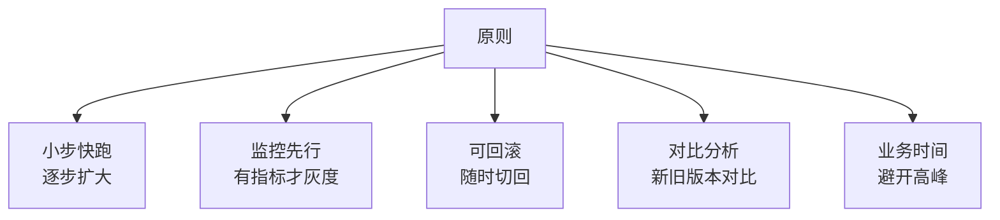

### 6.3 数据库变更兼容

灰度期间新老版本并存，DB 变更需兼容：

```sql
-- 错误：直接改字段
ALTER TABLE users MODIFY COLUMN name VARCHAR(100) NOT NULL;

-- 正确：分步迁移
-- Step 1: 加新字段（老版本不用）
ALTER TABLE users ADD COLUMN nickname VARCHAR(100);

-- Step 2: 新版本双写
-- Step 3: 数据迁移
UPDATE users SET nickname = name WHERE nickname IS NULL;

-- Step 4: 新版本只用新字段
-- Step 5: 删除老字段（全量后）
ALTER TABLE users DROP COLUMN name;
```

### 6.4 灰度避坑

| 坑 | 解决 |
|----|------|
| 灰度比例不准 | 用稳定哈希 |
| 用户一会新一会老 | 按用户 ID 固定 |
| 老版本停止维护 | 至少保留一周 |
| 监控不及时 | 实时监控+自动告警 |
| 回滚慢 | 流量切换优先 |

## 七、相关资料

- [Canary Release - Martin Fowler](https://martinfowler.com/bliki/CanaryRelease.html)
- [Istio 流量管理](https://istio.io/latest/docs/concepts/traffic-management/)
- [Flagger - 自动化灰度](https://flagger.app/)
- [蓝绿部署与灰度发布](https://www.redhat.com/zh/topics/devops/what-is-blue-green-deployment)
- [K8s Rolling Update](https://kubernetes.io/docs/tutorials/kubernetes-basics/update/update-intro/)
