# 两阶段提交（2PC）详解：分布式事务的核心协议


## 一、什么是两阶段提交？

两阶段提交（Two-Phase Commit，简称2PC）是一种分布式系统中用于保证分布式事务原子性的协议。它确保参与分布式事务的所有节点要么全部提交，要么全部回滚，从而保证数据的一致性。

### 核心概念

- **协调者（Coordinator）**：负责协调整个事务的提交或回滚
- **参与者（Participant）**：参与分布式事务的各个节点
- **事务**：需要跨多个节点执行的操作单元

## 二、两阶段提交的工作原理

两阶段提交将事务提交过程分为两个阶段：

### 阶段一：准备阶段（Prepare Phase）

1. 协调者向所有参与者发送准备请求
2. 参与者执行事务操作，但不提交
3. 参与者将Undo和Redo信息写入日志
4. 参与者回复协调者"准备就绪"或"准备失败"

### 阶段二：提交阶段（Commit Phase）

根据阶段一的结果：

**情况1：所有参与者都准备成功**
1. 协调者向所有参与者发送提交请求
2. 参与者正式提交事务
3. 参与者释放资源，回复完成

**情况2：有参与者准备失败**
1. 协调者向所有参与者发送回滚请求
2. 参与者回滚事务
3. 参与者释放资源，回复完成

## 三、流程图解

### 正常提交流程

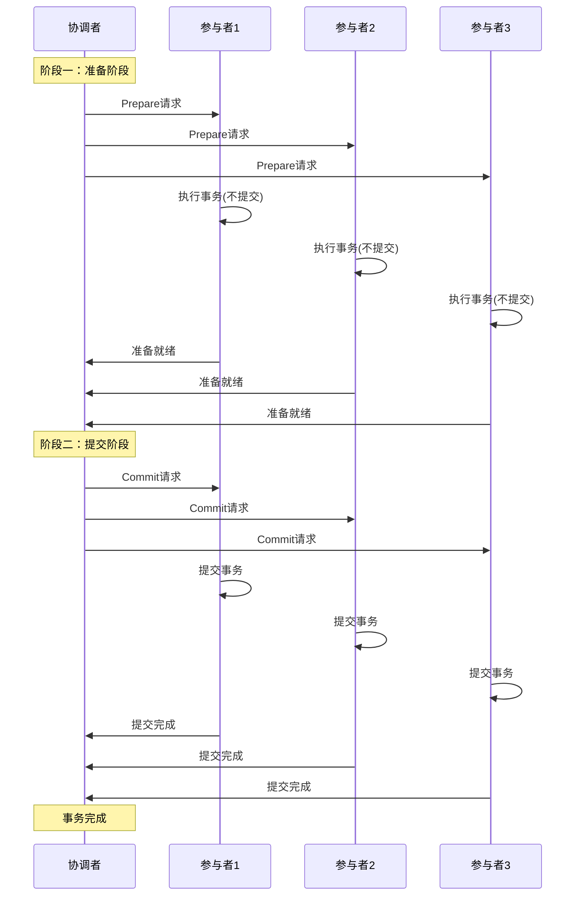
```mermaid
sequenceDiagram
    participant C as 协调者
    participant P1 as 参与者1
    participant P2 as 参与者2
    participant P3 as 参与者3
    
    Note over C: 阶段一：准备阶段
    C->>P1: Prepare请求
    C->>P2: Prepare请求
    C->>P3: Prepare请求
    
    P1->>P1: 执行事务(不提交)
    P2->>P2: 执行事务(不提交)
    P3->>P3: 执行事务(不提交)
    
    P1->>C: 准备就绪
    P2->>C: 准备就绪
    P3->>C: 准备就绪
    
    Note over C: 阶段二：提交阶段
    C->>P1: Commit请求
    C->>P2: Commit请求
    C->>P3: Commit请求
    
    P1->>P1: 提交事务
    P2->>P2: 提交事务
    P3->>P3: 提交事务
    
    P1->>C: 提交完成
    P2->>C: 提交完成
    P3->>C: 提交完成
    
    Note over C: 事务完成
```

### 异常回滚流程

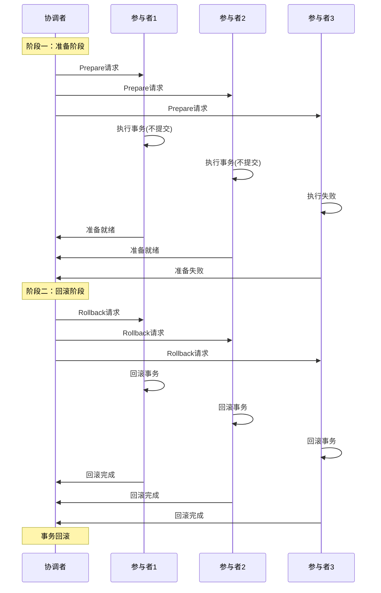
```mermaid
sequenceDiagram
    participant C as 协调者
    participant P1 as 参与者1
    participant P2 as 参与者2
    participant P3 as 参与者3
    
    Note over C: 阶段一：准备阶段
    C->>P1: Prepare请求
    C->>P2: Prepare请求
    C->>P3: Prepare请求
    
    P1->>P1: 执行事务(不提交)
    P2->>P2: 执行事务(不提交)
    P3->>P3: 执行失败
    
    P1->>C: 准备就绪
    P2->>C: 准备就绪
    P3->>C: 准备失败
    
    Note over C: 阶段二：回滚阶段
    C->>P1: Rollback请求
    C->>P2: Rollback请求
    C->>P3: Rollback请求
    
    P1->>P1: 回滚事务
    P2->>P2: 回滚事务
    P3->>P3: 回滚事务
    
    P1->>C: 回滚完成
    P2->>C: 回滚完成
    P3->>C: 回滚完成
    
    Note over C: 事务回滚
```

### 状态转换图

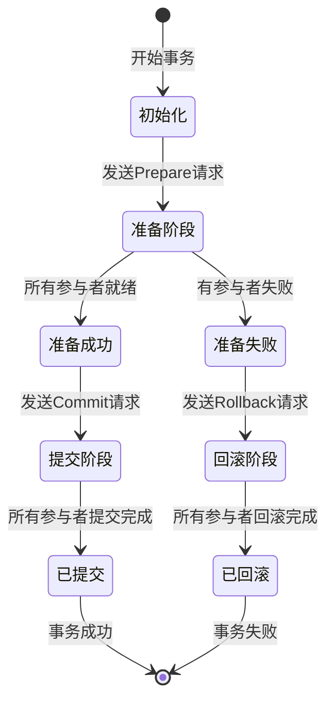
```mermaid
stateDiagram-v2
    [*] --> 初始化: 开始事务
    
    初始化 --> 准备阶段: 发送Prepare请求
    
    准备阶段 --> 准备成功: 所有参与者就绪
    准备阶段 --> 准备失败: 有参与者失败
    
    准备成功 --> 提交阶段: 发送Commit请求
    准备失败 --> 回滚阶段: 发送Rollback请求
    
    提交阶段 --> 已提交: 所有参与者提交完成
    回滚阶段 --> 已回滚: 所有参与者回滚完成
    
    已提交 --> [*]: 事务成功
    已回滚 --> [*]: 事务失败
```

## 四、详细流程说明

### 1. 准备阶段详解

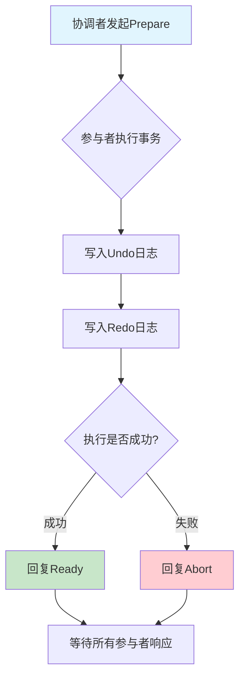
```mermaid
graph TD
    A[协调者发起Prepare] --> B{参与者执行事务}
    B --> C[写入Undo日志]
    C --> D[写入Redo日志]
    D --> E{执行是否成功?}
    E -->|成功| F[回复Ready]
    E -->|失败| G[回复Abort]
    F --> H[等待所有参与者响应]
    G --> H
    
    style A fill:#e1f5fe
    style F fill:#c8e6c9
    style G fill:#ffcdd2
```

**关键点：**
- 参与者执行事务但不提交，保持锁定状态
- 写入Undo和Redo日志，用于故障恢复
- 参与者进入"准备就绪"状态，等待协调者指令

### 2. 提交阶段详解

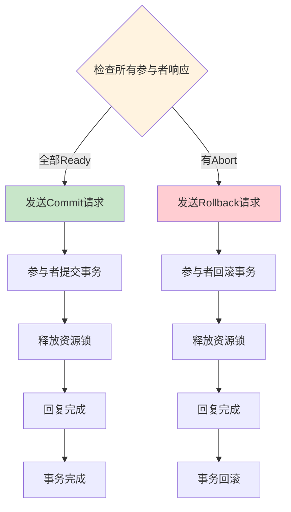
```mermaid
graph TD
    A{检查所有参与者响应} -->|全部Ready| B[发送Commit请求]
    A -->|有Abort| C[发送Rollback请求]
    
    B --> D[参与者提交事务]
    D --> E[释放资源锁]
    E --> F[回复完成]
    
    C --> G[参与者回滚事务]
    G --> H[释放资源锁]
    H --> I[回复完成]
    
    F --> J[事务完成]
    I --> K[事务回滚]
    
    style A fill:#fff3e0
    style B fill:#c8e6c9
    style C fill:#ffcdd2
```

## 五、优缺点分析

### 优点

#### 1. 强一致性保证

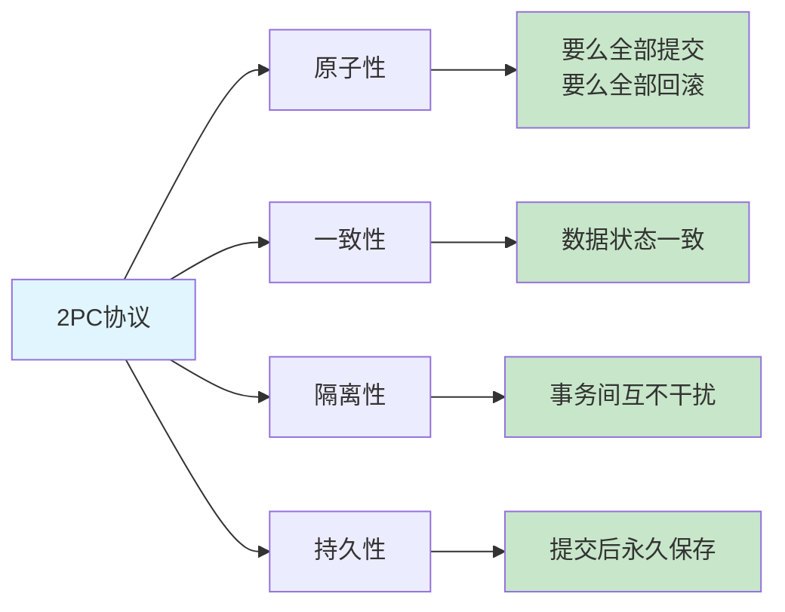
```mermaid
graph LR
    A[2PC协议] --> B[原子性]
    A --> C[一致性]
    A --> D[隔离性]
    A --> E[持久性]
    
    B --> F[要么全部提交<br/>要么全部回滚]
    C --> G[数据状态一致]
    D --> H[事务间互不干扰]
    E --> I[提交后永久保存]
    
    style A fill:#e1f5fe
    style F fill:#c8e6c9
    style G fill:#c8e6c9
    style H fill:#c8e6c9
    style I fill:#c8e6c9
```

**详细说明：**
- **原子性**：确保所有节点要么全部提交，要么全部回滚
- **一致性**：事务执行前后，系统状态保持一致
- **可靠性**：通过日志机制保证故障恢复后的数据一致性

#### 2. 实现相对简单

- 协议逻辑清晰，易于理解和实现
- 不需要复杂的冲突检测机制
- 适用于大多数分布式数据库系统

#### 3. 广泛支持

- 主流数据库都支持XA协议（2PC的标准实现）
- 成熟的中间件支持（如Atomikos、Narayana）
- 大量生产环境验证

### 缺点

#### 1. 同步阻塞问题

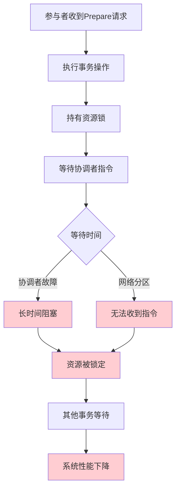
```mermaid
graph TD
    A[参与者收到Prepare请求] --> B[执行事务操作]
    B --> C[持有资源锁]
    C --> D[等待协调者指令]
    D --> E{等待时间}
    E -->|协调者故障| F[长时间阻塞]
    E -->|网络分区| G[无法收到指令]
    F --> H[资源被锁定]
    G --> H
    H --> I[其他事务等待]
    I --> J[系统性能下降]
    
    style F fill:#ffcdd2
    style G fill:#ffcdd2
    style H fill:#ffcdd2
    style J fill:#ffcdd2
```

**问题详解：**
- 参与者在等待协调者指令期间，一直持有资源锁
- 如果协调者故障，参与者会长时间阻塞
- 其他需要访问这些资源的事务会被阻塞
- 严重影响系统的并发性能和吞吐量

#### 2. 单点故障问题

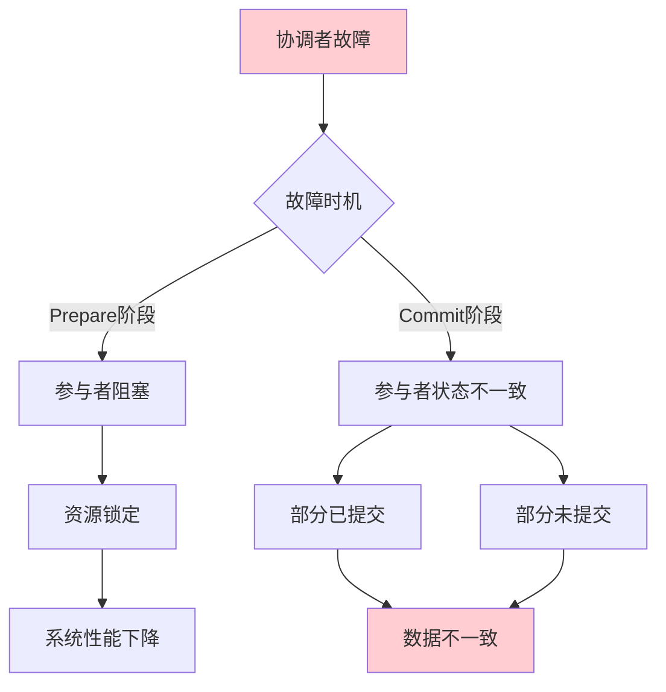
```mermaid
graph TD
    A[协调者故障] --> B{故障时机}
    B -->|Prepare阶段| C[参与者阻塞]
    B -->|Commit阶段| D[参与者状态不一致]
    
    C --> E[资源锁定]
    E --> F[系统性能下降]
    
    D --> G[部分已提交]
    D --> H[部分未提交]
    G --> I[数据不一致]
    H --> I
    
    style A fill:#ffcdd2
    style I fill:#ffcdd2
```

**单点故障的影响：**
- **协调者故障**：整个事务无法继续，所有参与者阻塞
- **参与者故障**：需要等待故障节点恢复，影响整体性能
- **网络分区**：可能导致部分参与者无法收到指令

#### 3. 数据不一致风险

**场景分析：**

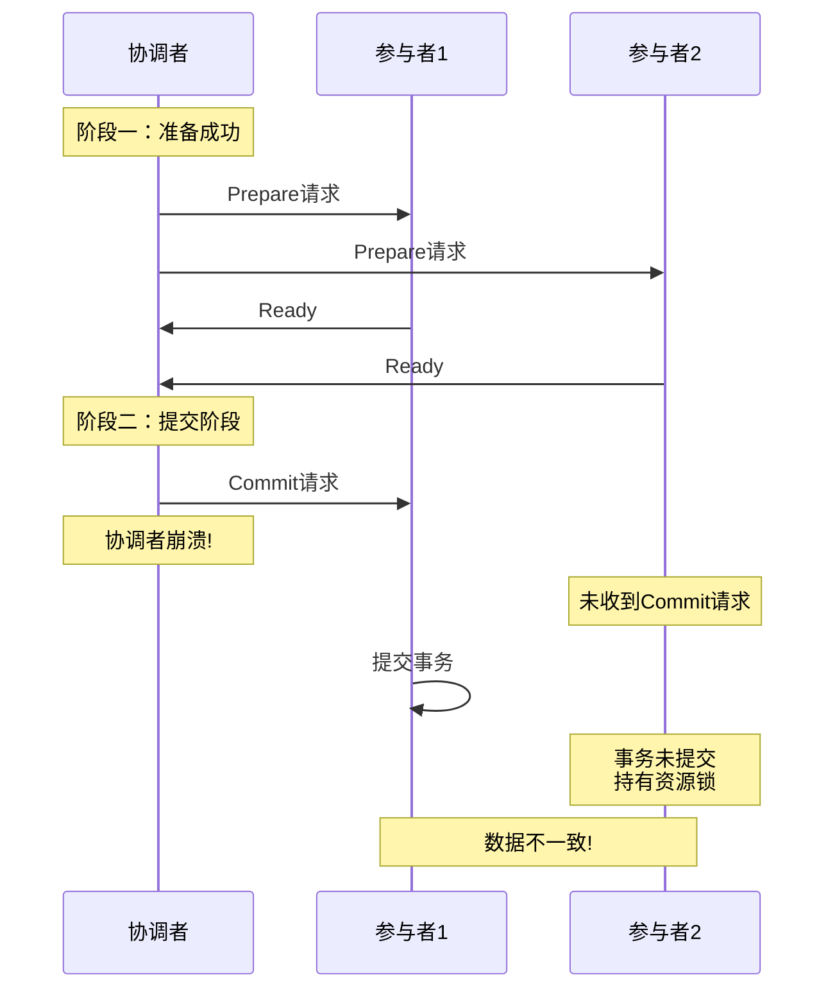
```mermaid
sequenceDiagram
    participant C as 协调者
    participant P1 as 参与者1
    participant P2 as 参与者2
    
    Note over C: 阶段一：准备成功
    C->>P1: Prepare请求
    C->>P2: Prepare请求
    P1->>C: Ready
    P2->>C: Ready
    
    Note over C: 阶段二：提交阶段
    C->>P1: Commit请求
    Note over C: 协调者崩溃!
    Note over P2: 未收到Commit请求
    
    P1->>P1: 提交事务
    Note over P2: 事务未提交<br/>持有资源锁
    
    Note over P1,P2: 数据不一致!
```

**不一致的原因：**
- 协调者在发送部分Commit请求后崩溃
- 网络故障导致部分参与者未收到Commit请求
- 参与者故障导致无法完成提交或回滚

#### 4. 性能问题

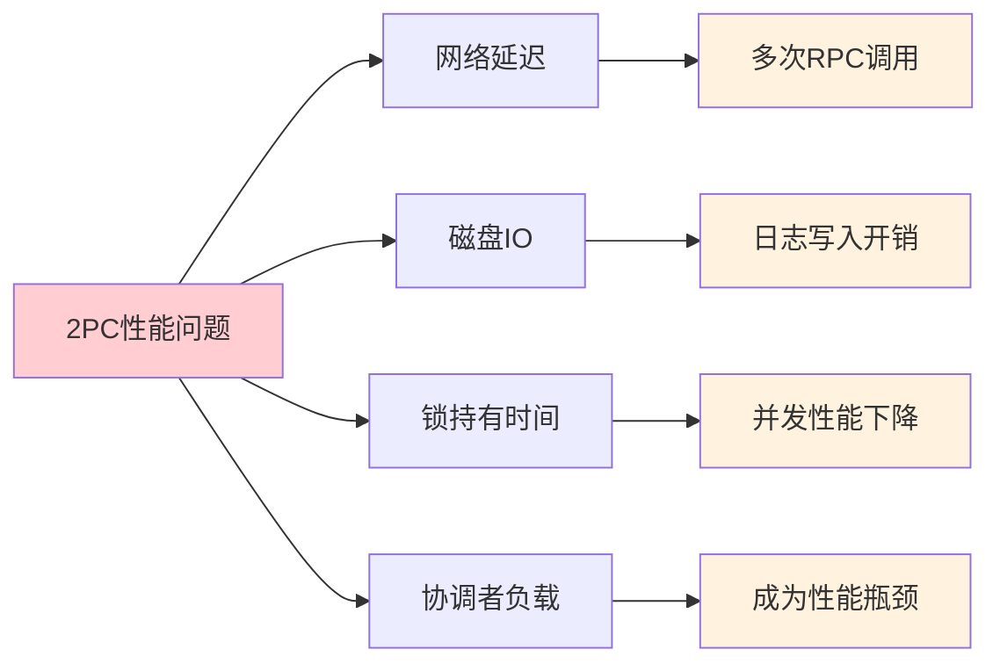
```mermaid
graph LR
    A[2PC性能问题] --> B[网络延迟]
    A --> C[磁盘IO]
    A --> D[锁持有时间]
    A --> E[协调者负载]
    
    B --> F[多次RPC调用]
    C --> G[日志写入开销]
    D --> H[并发性能下降]
    E --> I[成为性能瓶颈]
    
    style A fill:#ffcdd2
    style F fill:#fff3e0
    style G fill:#fff3e0
    style H fill:#fff3e0
    style I fill:#fff3e0
```

**性能瓶颈：**
- **网络开销**：需要多次RPC调用，网络延迟累积
- **磁盘IO**：每个参与者都需要写日志，增加IO开销
- **锁竞争**：长时间持有锁，降低并发性能
- **协调者瓶颈**：所有请求都经过协调者，容易成为瓶颈

## 六、实际应用场景

### 1. 数据库分布式事务

#### MySQL XA事务

```sql
-- 应用程序
XA START 'xid1';
INSERT INTO orders VALUES (1, 'product1', 100);
XA END 'xid1';
XA PREPARE 'xid1';

-- 其他数据库节点
XA START 'xid1';
UPDATE inventory SET stock = stock - 1 WHERE product_id = 'product1';
XA END 'xid1';
XA PREPARE 'xid1';

-- 协调者决定提交
XA COMMIT 'xid1';
```

**应用架构：**

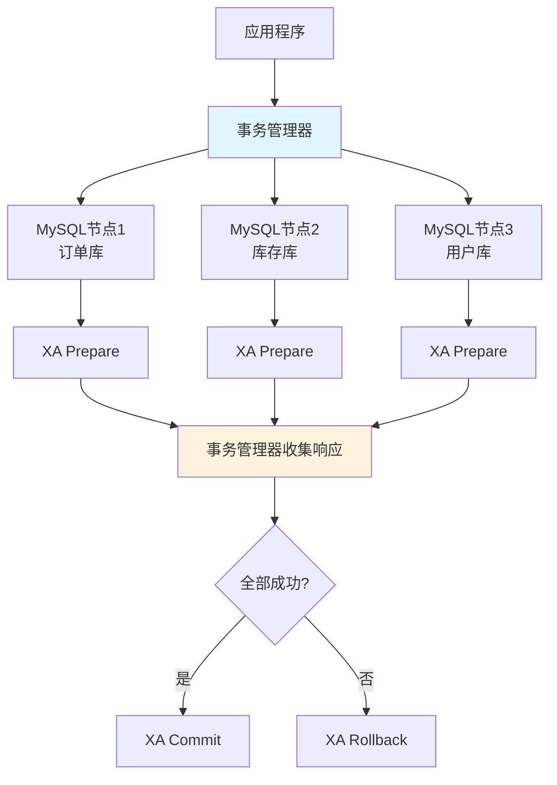
```mermaid
graph TD
    A[应用程序] --> B[事务管理器]
    B --> C[MySQL节点1<br/>订单库]
    B --> D[MySQL节点2<br/>库存库]
    B --> E[MySQL节点3<br/>用户库]
    
    C --> F[XA Prepare]
    D --> G[XA Prepare]
    E --> H[XA Prepare]
    
    F --> I[事务管理器收集响应]
    G --> I
    H --> I
    
    I --> J{全部成功?}
    J -->|是| K[XA Commit]
    J -->|否| L[XA Rollback]
    
    style B fill:#e1f5fe
    style I fill:#fff3e0
```

#### MySQL内部的两阶段提交：Binlog与Redo Log

MySQL在单机事务提交时，为了保证Binlog和Redo Log的一致性，内部也采用了两阶段提交机制。这是一个非常经典的应用案例。

**为什么需要两阶段提交？**

MySQL有两个重要的日志系统：
- **Redo Log（重做日志）**：InnoDB引擎层，用于崩溃恢复，保证事务持久性
- **Binlog（二进制日志）**：MySQL Server层，用于主从复制和数据备份

如果这两个日志不一致，会导致严重问题：
- 主从数据不一致
- 崩溃恢复后数据丢失
- 备份数据不可用

**协调者与参与者角色：**

在MySQL内部的两阶段提交中，各个组件扮演的角色如下：

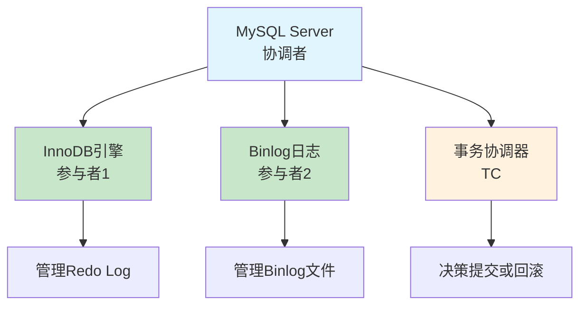
```mermaid
graph TD
    A[MySQL Server<br/>协调者] --> B[InnoDB引擎<br/>参与者1]
    A --> C[Binlog日志<br/>参与者2]
    
    B --> D[管理Redo Log]
    C --> E[管理Binlog文件]
    
    A --> F[事务协调器<br/>TC]
    F --> G[决策提交或回滚]
    
    style A fill:#e1f5fe
    style B fill:#c8e6c9
    style C fill:#c8e6c9
    style F fill:#fff3e0
```

**角色详解：**

| 角色 | 组件 | 职责 | 说明 |
|------|------|------|------|
| **协调者** | MySQL Server（事务协调器TC） | 协调InnoDB和Binlog的提交 | 决定何时Prepare、何时Commit |
| **参与者1** | InnoDB引擎 | 管理Redo Log | 执行事务操作，写入Redo Log |
| **参与者2** | Binlog日志系统 | 管理Binlog | 记录数据变更，用于主从复制 |

**为什么这样设计？**

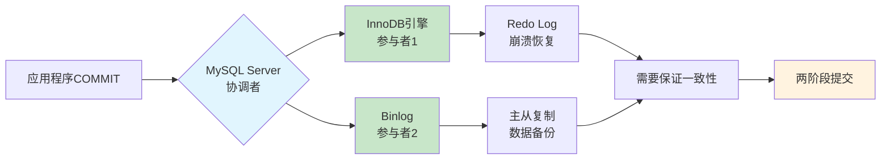
```mermaid
graph LR
    A[应用程序COMMIT] --> B{MySQL Server<br/>协调者}
    
    B --> C[InnoDB引擎<br/>参与者1]
    B --> D[Binlog<br/>参与者2]
    
    C --> E[Redo Log<br/>崩溃恢复]
    D --> F[主从复制<br/>数据备份]
    
    E --> G[需要保证一致性]
    F --> G
    
    G --> H[两阶段提交]
    
    style B fill:#e1f5fe
    style C fill:#c8e6c9
    style D fill:#c8e6c9
    style H fill:#fff3e0
```

**两阶段提交流程：**

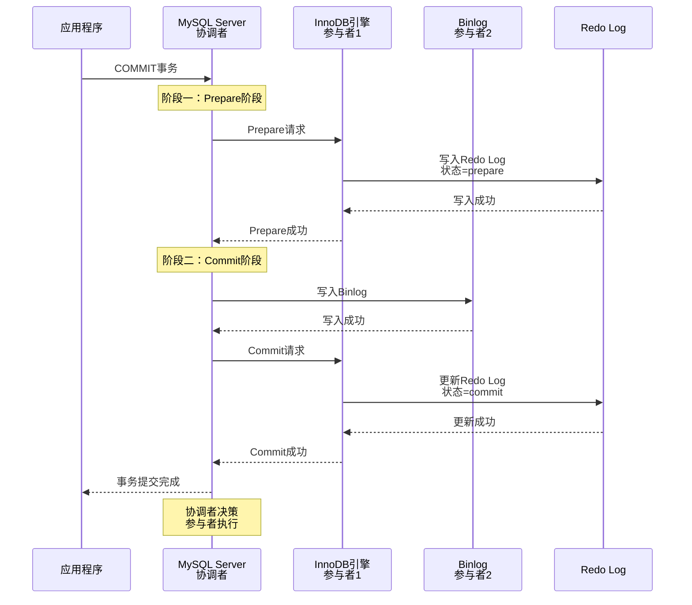
```mermaid
sequenceDiagram
    participant App as 应用程序
    participant TC as MySQL Server<br/>协调者
    participant InnoDB as InnoDB引擎<br/>参与者1
    participant Binlog as Binlog<br/>参与者2
    participant Redo as Redo Log
    
    App->>TC: COMMIT事务
    
    Note over TC: 阶段一：Prepare阶段
    TC->>InnoDB: Prepare请求
    InnoDB->>Redo: 写入Redo Log<br/>状态=prepare
    Redo-->>InnoDB: 写入成功
    InnoDB-->>TC: Prepare成功
    
    Note over TC: 阶段二：Commit阶段
    TC->>Binlog: 写入Binlog
    Binlog-->>TC: 写入成功
    
    TC->>InnoDB: Commit请求
    InnoDB->>Redo: 更新Redo Log<br/>状态=commit
    Redo-->>InnoDB: 更新成功
    InnoDB-->>TC: Commit成功
    
    TC-->>App: 事务提交完成
    
    Note over TC: 协调者决策<br/>参与者执行
```

**详细步骤说明：**

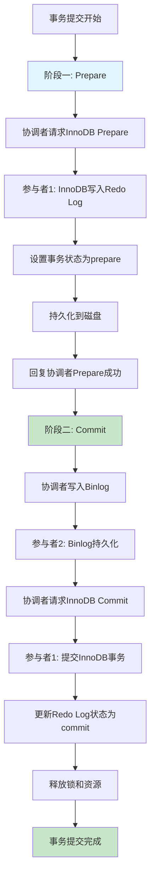
```mermaid
graph TD
    A[事务提交开始] --> B[阶段一: Prepare]
    
    B --> C[协调者请求InnoDB Prepare]
    C --> D[参与者1: InnoDB写入Redo Log]
    D --> E[设置事务状态为prepare]
    E --> F[持久化到磁盘]
    F --> G[回复协调者Prepare成功]
    
    G --> H[阶段二: Commit]
    H --> I[协调者写入Binlog]
    I --> J[参与者2: Binlog持久化]
    J --> K[协调者请求InnoDB Commit]
    
    K --> L[参与者1: 提交InnoDB事务]
    L --> M[更新Redo Log状态为commit]
    M --> N[释放锁和资源]
    
    N --> O[事务提交完成]
    
    style B fill:#e1f5fe
    style H fill:#c8e6c9
    style O fill:#c8e6c9
```

**关键点说明：**

1. **协调者（MySQL Server）**：
   - 负责协调整个事务提交流程
   - 决定何时进入Prepare阶段
   - 决定何时进入Commit阶段
   - 确保InnoDB和Binlog的一致性

2. **参与者1（InnoDB引擎）**：
   - 管理Redo Log，保证事务持久性
   - 在Prepare阶段写入Redo Log（状态=prepare）
   - 在Commit阶段更新Redo Log（状态=commit）
   - 负责崩溃恢复

3. **参与者2（Binlog日志系统）**：
   - 记录数据变更，用于主从复制
   - 在Commit阶段写入Binlog
   - 保证主从数据一致性

**为什么Binlog也是参与者？**

虽然Binlog在时序图中看起来只是被动写入，但它确实是参与者：

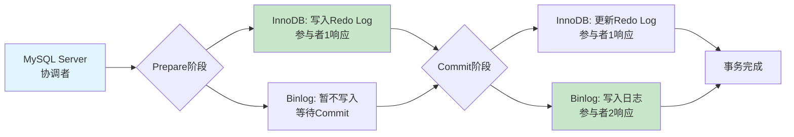
```mermaid
graph LR
    A[MySQL Server<br/>协调者] --> B{Prepare阶段}
    
    B --> C[InnoDB: 写入Redo Log<br/>参与者1响应]
    B --> D[Binlog: 暂不写入<br/>等待Commit]
    
    C --> E{Commit阶段}
    D --> E
    
    E --> F[InnoDB: 更新Redo Log<br/>参与者1响应]
    E --> G[Binlog: 写入日志<br/>参与者2响应]
    
    F --> H[事务完成]
    G --> H
    
    style A fill:#e1f5fe
    style C fill:#c8e6c9
    style G fill:#c8e6c9
```

**崩溃恢复机制：**

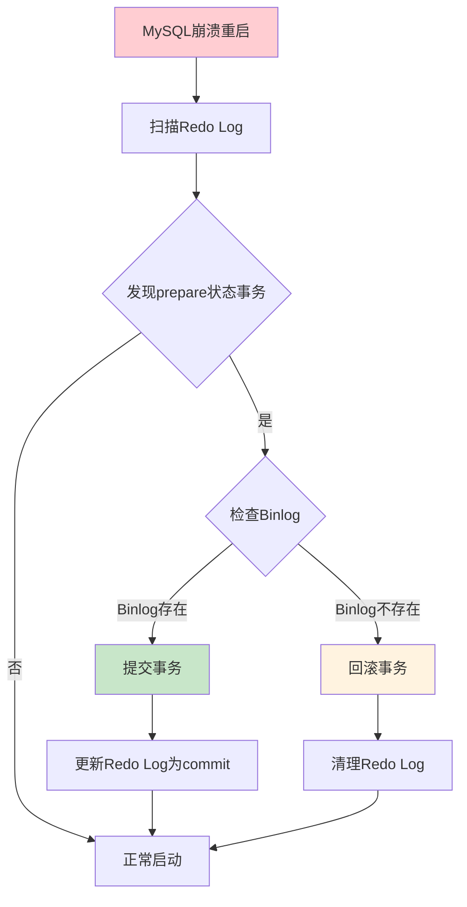
```mermaid
graph TD
    A[MySQL崩溃重启] --> B[扫描Redo Log]
    B --> C{发现prepare状态事务}
    
    C -->|是| D{检查Binlog}
    C -->|否| E[正常启动]
    
    D -->|Binlog存在| F[提交事务]
    D -->|Binlog不存在| G[回滚事务]
    
    F --> H[更新Redo Log为commit]
    G --> I[清理Redo Log]
    
    H --> E
    I --> E
    
    style A fill:#ffcdd2
    style F fill:#c8e6c9
    style G fill:#fff3e0
```

**具体示例：**

```sql
-- 执行一个更新事务
UPDATE accounts SET balance = balance - 100 WHERE id = 1;
UPDATE accounts SET balance = balance + 100 WHERE id = 2;

-- 提交时的内部流程：
-- 1. Prepare阶段：
--    - InnoDB写入Redo Log: "UPDATE accounts... (prepare)"
--    - 持久化Redo Log到磁盘
    
-- 2. Commit阶段：
--    - 写入Binlog: "UPDATE accounts..."
--    - 持久化Binlog到磁盘
--    - InnoDB提交事务，更新Redo Log状态为commit
```

**配置参数：**

```sql
-- 查看sync_binlog配置
SHOW VARIABLES LIKE 'sync_binlog';
-- sync_binlog=1: 每次事务提交都同步Binlog到磁盘（最安全但性能较低）
-- sync_binlog=0: 由操作系统决定何时同步（性能高但可能丢失数据）

-- 查看innodb_flush_log_at_trx_commit
SHOW VARIABLES LIKE 'innodb_flush_log_at_trx_commit';
-- =1: 每次事务提交都同步Redo Log到磁盘（推荐，保证ACID）
-- =0: 每秒同步一次（性能高但可能丢失1秒数据）
-- =2: 每次提交写入OS缓存，每秒同步到磁盘
```

**最佳实践配置：**

```ini
# my.cnf配置文件
[mysqld]
# 保证Binlog持久化
sync_binlog = 1

# 保证Redo Log持久化
innodb_flush_log_at_trx_commit = 1

# 开启Binlog
log_bin = mysql-bin

# 使用row格式（推荐）
binlog_format = ROW

# 保证Redo Log和Binlog一致性
innodb_support_xa = ON  # MySQL 5.7.10之前
# MySQL 5.7.10之后默认启用，无需配置
```

**两阶段提交的优势：**

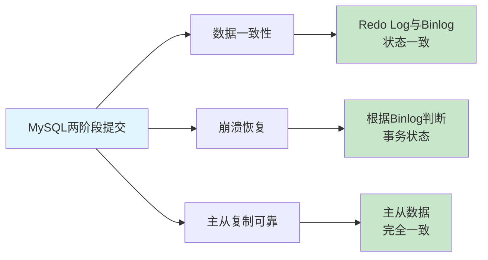
```mermaid
graph LR
    A[MySQL两阶段提交] --> B[数据一致性]
    A --> C[崩溃恢复]
    A --> D[主从复制可靠]
    
    B --> E[Redo Log与Binlog<br/>状态一致]
    C --> F[根据Binlog判断<br/>事务状态]
    D --> G[主从数据<br/>完全一致]
    
    style A fill:#e1f5fe
    style E fill:#c8e6c9
    style F fill:#c8e6c9
    style G fill:#c8e6c9
```

**可能的问题场景：**

| 崩溃时机 | Redo Log状态 | Binlog状态 | 恢复动作 | 结果 |
|---------|------------|-----------|---------|------|
| Prepare前 | 无 | 无 | 无需恢复 | 事务未开始 |
| Prepare后，Binlog前 | prepare | 无 | 回滚事务 | 数据一致 |
| Binlog后，Commit前 | prepare | 有 | 提交事务 | 数据一致 |
| Commit后 | commit | 有 | 无需恢复 | 事务已完成 |

**性能影响：**

```java
// 两阶段提交的性能开销
public class MySQL2PCPerformance {
    
    // 每次事务提交需要：
    // 1. Redo Log写入磁盘（fsync）
    // 2. Binlog写入磁盘（fsync）
    // 3. 两次fsync操作的延迟累积
    
    // 优化方案：
    // 1. 使用组提交（Group Commit）
    // 2. 批量fsync多个事务的日志
    // 3. 减少磁盘IO次数
    
    public void groupCommit() {
        // 多个事务同时提交时，合并fsync操作
        // 事务1: prepare -> 等待
        // 事务2: prepare -> 等待
        // 事务3: prepare -> 等待
        // 一次性fsync所有Redo Log
        // 一次性fsync所有Binlog
    }
}
```

**组提交优化：**

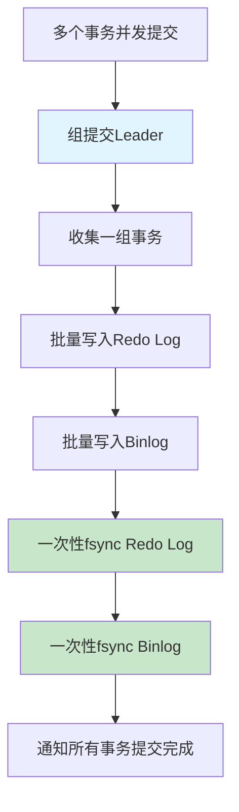
```mermaid
graph TD
    A[多个事务并发提交] --> B[组提交Leader]
    
    B --> C[收集一组事务]
    C --> D[批量写入Redo Log]
    D --> E[批量写入Binlog]
    
    E --> F[一次性fsync Redo Log]
    F --> G[一次性fsync Binlog]
    
    G --> H[通知所有事务提交完成]
    
    style B fill:#e1f5fe
    style F fill:#c8e6c9
    style G fill:#c8e6c9
```

这个机制保证了即使在系统崩溃的情况下，MySQL也能通过Redo Log和Binlog的状态来正确恢复数据，确保数据的一致性和完整性。

#### PostgreSQL两阶段提交

```sql
-- 准备阶段
PREPARE TRANSACTION 'tx123';

-- 提交阶段
COMMIT PREPARED 'tx123';

-- 回滚阶段
ROLLBACK PREPARED 'tx123';
```

### 2. 消息队列分布式事务

#### RocketMQ事务消息

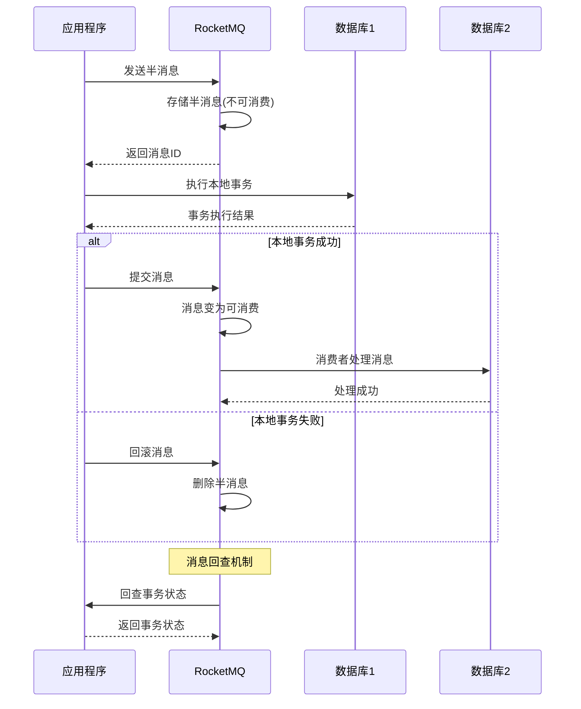
```mermaid
sequenceDiagram
    participant App as 应用程序
    participant MQ as RocketMQ
    participant DB1 as 数据库1
    participant DB2 as 数据库2
    
    App->>MQ: 发送半消息
    MQ->>MQ: 存储半消息(不可消费)
    MQ-->>App: 返回消息ID
    
    App->>DB1: 执行本地事务
    DB1-->>App: 事务执行结果
    
    alt 本地事务成功
        App->>MQ: 提交消息
        MQ->>MQ: 消息变为可消费
        MQ->>DB2: 消费者处理消息
        DB2-->>MQ: 处理成功
    else 本地事务失败
        App->>MQ: 回滚消息
        MQ->>MQ: 删除半消息
    end
    
    Note over MQ: 消息回查机制
    MQ->>App: 回查事务状态
    App-->>MQ: 返回事务状态
```

**代码示例：**

```java
public class TransactionProducer {
    public static void main(String[] args) {
        TransactionMQProducer producer = new TransactionMQProducer("transaction_group");
        
        producer.setTransactionListener(new TransactionListener() {
            @Override
            public LocalTransactionState executeLocalTransaction(Message msg, Object arg) {
                try {
                    updateDatabase();
                    return LocalTransactionState.COMMIT_MESSAGE;
                } catch (Exception e) {
                    return LocalTransactionState.ROLLBACK_MESSAGE;
                }
            }
            
            @Override
            public LocalTransactionState checkLocalTransaction(MessageExt msg) {
                boolean success = checkTransactionStatus(msg);
                return success ? LocalTransactionState.COMMIT_MESSAGE 
                               : LocalTransactionState.ROLLBACK_MESSAGE;
            }
        });
        
        producer.start();
        
        Message msg = new Message("topic", "tags", "keys", "body".getBytes());
        producer.sendMessageInTransaction(msg, null);
    }
}
```

### 3. 微服务分布式事务

#### Seata AT模式

```mermaid
graph TD
    A[业务服务] --> B[Seata TC<br/>事务协调器]
    B --> C[订单服务]
    B --> D[库存服务]
    B --> E[账户服务]
    
    C --> F[执行业务SQL]
    F --> G[解析SQL生成前后镜像]
    G --> H[生成Undo Log]
    H --> I[注册分支事务]
    
    D --> J[执行业务SQL]
    J --> K[生成Undo Log]
    K --> L[注册分支事务]
    
    E --> M[执行业务SQL]
    M --> N[生成Undo Log]
    N --> O[注册分支事务]
    
    I --> P[全局提交/回滚]
    L --> P
    O --> P
    
    style B fill:#e1f5fe
    style P fill:#c8e6c9
```

**Seata配置示例：**

```java
@GlobalTransactional
public void purchase(String userId, String commodityCode, int count) {
    String xid = RootContext.getXID();
    
    try {
        orderService.create(userId, commodityCode, count);
        storageService.deduct(commodityCode, count);
        accountService.debit(userId, count * 100);
    } catch (Exception e) {
        throw e;
    }
}
```

### 4. 跨数据库分布式事务

#### 应用场景：银行转账

```mermaid
graph LR
    A[用户A转账] --> B[银行A数据库]
    A --> C[银行B数据库]
    
    B --> D[扣减A账户余额]
    C --> E[增加B账户余额]
    
    D --> F{两阶段提交}
    E --> F
    
    F --> G[Prepare: 锁定账户]
    G --> H{双方都成功?}
    H -->|是| I[Commit: 确认转账]
    H -->|否| J[Rollback: 取消转账]
    
    style F fill:#e1f5fe
    style I fill:#c8e6c9
    style J fill:#ffcdd2
```

**实现代码：**

```java
public class BankTransferService {
    
    @Transactional
    public void transfer(String fromAccount, String toAccount, BigDecimal amount) {
        String xid = beginGlobalTransaction();
        
        try {
            deductFromAccount(fromAccount, amount, xid);
            addToAccount(toAccount, amount, xid);
            
            commitGlobalTransaction(xid);
        } catch (Exception e) {
            rollbackGlobalTransaction(xid);
            throw e;
        }
    }
    
    private void deductFromAccount(String account, BigDecimal amount, String xid) {
        Connection conn1 = getConnection("bank_a");
        conn1.setXid(xid);
        conn1.prepareStatement("UPDATE accounts SET balance = balance - ? WHERE id = ?")
              .setBigDecimal(1, amount)
              .setString(2, account)
              .executeUpdate();
        conn1.prepare(xid);
    }
    
    private void addToAccount(String account, BigDecimal amount, String xid) {
        Connection conn2 = getConnection("bank_b");
        conn2.setXid(xid);
        conn2.prepareStatement("UPDATE accounts SET balance = balance + ? WHERE id = ?")
              .setBigDecimal(1, amount)
              .setString(2, account)
              .executeUpdate();
        conn2.prepare(xid);
    }
}
```

## 七、优化方案

### 1. 三阶段提交（3PC）

```mermaid
sequenceDiagram
    participant C as 协调者
    participant P1 as 参与者1
    participant P2 as 参与者2
    
    Note over C: 阶段0：CanCommit
    C->>P1: CanCommit请求
    C->>P2: CanCommit请求
    P1->>C: Yes/No
    P2->>C: Yes/No
    
    Note over C: 阶段1：PreCommit
    C->>P1: PreCommit请求
    C->>P2: PreCommit请求
    P1->>P1: 执行事务(不提交)
    P2->>P2: 执行事务(不提交)
    P1->>C: Ack
    P2->>C: Ack
    
    Note over C: 阶段2：DoCommit
    C->>P1: DoCommit请求
    C->>P2: DoCommit请求
    P1->>P1: 提交事务
    P2->>P2: 提交事务
    P1->>C: 完成
    P2->>C: 完成
```

**改进点：**
- 增加CanCommit阶段，减少阻塞时间
- 引入超时机制，避免无限等待
- 参与者超时后可以自主决策

### 2. TCC（Try-Confirm-Cancel）

```mermaid
graph TD
    A[业务操作] --> B[Try阶段]
    B --> C[预留资源]
    C --> D{Try成功?}
    
    D -->|成功| E[Confirm阶段]
    E --> F[确认执行]
    F --> G[释放预留资源]
    
    D -->|失败| H[Cancel阶段]
    H --> I[取消执行]
    I --> J[释放预留资源]
    
    style B fill:#e1f5fe
    style E fill:#c8e6c9
    style H fill:#ffcdd2
```

**TCC示例：**

```java
public interface AccountService {
    @Try
    void tryDebit(String userId, BigDecimal amount);
    
    @Confirm
    void confirmDebit(String userId, BigDecimal amount);
    
    @Cancel
    void cancelDebit(String userId, BigDecimal amount);
}

public class AccountServiceImpl implements AccountService {
    
    @Override
    public void tryDebit(String userId, BigDecimal amount) {
        Account account = accountDao.findById(userId);
        if (account.getBalance().compareTo(amount) < 0) {
            throw new InsufficientBalanceException();
        }
        accountDao.freeze(userId, amount);
    }
    
    @Override
    public void confirmDebit(String userId, BigDecimal amount) {
        accountDao.debit(userId, amount);
        accountDao.unfreeze(userId, amount);
    }
    
    @Override
    public void cancelDebit(String userId, BigDecimal amount) {
        accountDao.unfreeze(userId, amount);
    }
}
```

### 3. Saga模式

```mermaid
graph LR
    A[T1: 创建订单] --> B[T2: 扣减库存]
    B --> C[T3: 扣减余额]
    C --> D[T4: 发送通知]
    
    D -->|失败| E[C3: 恢复余额]
    E --> F[C2: 恢复库存]
    F --> G[C1: 取消订单]
    
    style A fill:#e1f5fe
    style B fill:#e1f5fe
    style C fill:#e1f5fe
    style D fill:#ffcdd2
    style E fill:#fff3e0
    style F fill:#fff3e0
    style G fill:#fff3e0
```

**Saga实现：**

```java
public class OrderSaga {
    
    public void execute() {
        SagaDefinition saga = SagaDefinition.builder()
            .step("create-order")
                .invoke(this::createOrder)
                .compensate(this::cancelOrder)
            .step("deduct-inventory")
                .invoke(this::deductInventory)
                .compensate(this::restoreInventory)
            .step("debit-account")
                .invoke(this::debitAccount)
                .compensate(this::creditAccount)
            .build();
        
        sagaEngine.execute(saga);
    }
}
```

## 八、最佳实践

### 1. 选择合适的场景

```mermaid
graph TD
    A[分布式事务场景] --> B{事务特点}
    
    B -->|强一致性要求| C[2PC/3PC]
    B -->|最终一致性| D[Saga/TCC]
    B -->|高性能要求| E[本地消息表]
    
    C --> F[金融交易<br/>库存扣减]
    D --> G[订单处理<br/>异步流程]
    E --> H[高并发场景<br/>实时性要求低]
    
    style C fill:#e1f5fe
    style D fill:#c8e6c9
    style E fill:#fff3e0
```

### 2. 性能优化建议

#### 减少锁持有时间

```java
public class Optimized2PC {
    
    public void execute() {
        long startTime = System.currentTimeMillis();
        
        preparePhase();
        long prepareTime = System.currentTimeMillis() - startTime;
        
        if (allPrepared) {
            commitPhase();
            long commitTime = System.currentTimeMillis() - startTime - prepareTime;
            
            log.info("Prepare: {}ms, Commit: {}ms", prepareTime, commitTime);
        }
    }
    
    private void preparePhase() {
        CountDownLatch latch = new CountDownLatch(participants.size());
        
        for (Participant p : participants) {
            executor.submit(() -> {
                p.prepare();
                latch.countDown();
            });
        }
        
        latch.await(timeout, TimeUnit.MILLISECONDS);
    }
}
```

#### 超时机制

```java
public class Timeout2PC {
    
    private static final long PREPARE_TIMEOUT = 5000;
    private static final long COMMIT_TIMEOUT = 3000;
    
    public boolean executeWithTimeout() {
        Future<Boolean> future = executor.submit(this::execute2PC);
        
        try {
            return future.get(PREPARE_TIMEOUT + COMMIT_TIMEOUT, TimeUnit.MILLISECONDS);
        } catch (TimeoutException e) {
            future.cancel(true);
            rollback();
            return false;
        }
    }
}
```

### 3. 故障恢复机制

```mermaid
graph TD
    A[故障检测] --> B{故障类型}
    
    B -->|协调者故障| C[选举新协调者]
    B -->|参与者故障| D[等待恢复]
    B -->|网络分区| E[超时处理]
    
    C --> F[读取事务日志]
    F --> G[恢复事务状态]
    
    D --> H[重试机制]
    H --> I[超时后回滚]
    
    E --> J[多数派决策]
    J --> K[继续或回滚]
    
    style A fill:#ffcdd2
    style C fill:#c8e6c9
    style D fill:#fff3e0
```

### 4. 监控与告警

```java
public class TransactionMonitor {
    
    private MeterRegistry meterRegistry;
    
    public void recordTransaction(String transactionId, TransactionStatus status, long duration) {
        Timer.builder("transaction.duration")
            .tag("status", status.name())
            .tag("transaction_id", transactionId)
            .register(meterRegistry)
            .record(duration, TimeUnit.MILLISECONDS);
        
        if (status == TransactionStatus.FAILED) {
            Counter.builder("transaction.failures")
                .tag("transaction_id", transactionId)
                .register(meterRegistry)
                .increment();
        }
    }
    
    public void alertOnLongRunningTransaction(String transactionId, long duration) {
        if (duration > WARNING_THRESHOLD) {
            alertService.sendAlert(
                "Long running transaction detected",
                "Transaction " + transactionId + " has been running for " + duration + "ms"
            );
        }
    }
}
```

## 九、总结

两阶段提交是分布式系统中保证事务原子性的重要协议，虽然存在一些性能和可靠性问题，但在强一致性要求的场景下仍然是不可替代的解决方案。

### 适用场景

- **强一致性要求**：金融交易、库存管理等
- **数据量适中**：不适合超大规模数据
- **网络稳定**：对网络延迟和稳定性有一定要求

### 不适用场景

- **高性能要求**：高并发、低延迟场景
- **跨地域部署**：网络延迟大的场景
- **最终一致性可接受**：可以考虑Saga或TCC

### 发展趋势

- **云原生架构**：Service Mesh中的分布式事务支持
- **新协议**：如Paxos、Raft等一致性协议的应用
- **混合方案**：结合多种模式的混合事务管理

## 参考资料

- [Distributed Systems: Principles and Paradigms](https://www.distributed-systems.net/)
- [XA规范](https://publications.opengroup.org/c193)
- [Seata官方文档](https://seata.io/)
- [RocketMQ事务消息](https://rocketmq.apache.org/docs/transaction-example/)
- [分布式事务解决方案](https://martinfowler.com/articles/patterns-of-distributed-systems/)
