# 三阶段提交（3PC）详解：分布式事务的改进方案


## 一、什么是三阶段提交？

三阶段提交（Three-Phase Commit，简称3PC）是对两阶段提交（2PC）的改进版本，旨在解决2PC协议中存在的阻塞问题和单点故障问题。3PC通过引入超时机制和额外的准备阶段，提高了系统的可用性和容错能力。

### 核心改进点

相比2PC，3PC主要做了以下改进：

1. **引入超时机制**：参与者和协调者都有超时机制，避免无限等待
2. **增加预提交阶段**：将准备阶段拆分为CanCommit和PreCommit两个阶段
3. **减少阻塞时间**：参与者在等待期间可以自主决策，不完全依赖协调者

### 核心概念

- **协调者（Coordinator）**：负责协调整个事务的提交或回滚
- **参与者（Participant）**：参与分布式事务的各个节点
- **超时机制**：避免参与者无限期等待协调者的指令

## 二、三阶段提交的工作原理

三阶段提交将事务提交过程分为三个阶段：

### 阶段一：CanCommit阶段（询问阶段）

1. 协调者向所有参与者发送CanCommit请求
2. 参与者判断自己是否可以执行事务操作
3. 参与者回复"Yes"或"No"，但不执行任何实际操作
4. 如果参与者回复"Yes"，则进入预提交状态

### 阶段二：PreCommit阶段（预提交阶段）

**情况1：所有参与者都回复Yes**

1. 协调者向所有参与者发送PreCommit请求
2. 参与者执行事务操作，但不提交
3. 参与者将Undo和Redo信息写入日志
4. 参与者回复"Ack"确认

**情况2：有参与者回复No或超时**

1. 协调者向所有参与者发送Abort请求
2. 参与者中断事务准备
3. 事务终止

### 阶段三：DoCommit阶段（最终提交阶段）

**情况1：所有参与者都回复Ack**

1. 协调者向所有参与者发送DoCommit请求
2. 参与者正式提交事务
3. 参与者释放资源，回复完成

**情况2：有参与者回复超时或失败**

1. 协调者向所有参与者发送Abort请求
2. 参与者回滚事务
3. 参与者释放资源，回复完成

## 三、流程图解

### 完整的三阶段提交流程

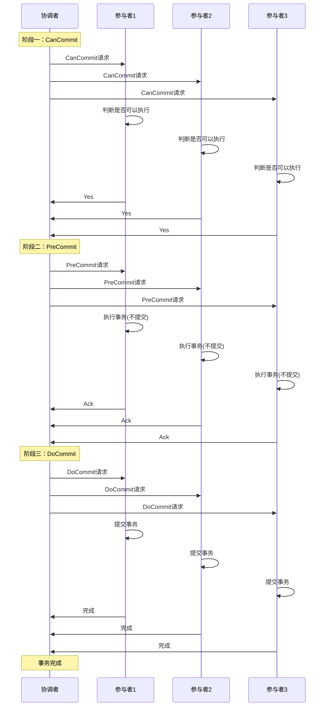
```mermaid
sequenceDiagram
    participant C as 协调者
    participant P1 as 参与者1
    participant P2 as 参与者2
    participant P3 as 参与者3
    
    Note over C: 阶段一：CanCommit
    C->>P1: CanCommit请求
    C->>P2: CanCommit请求
    C->>P3: CanCommit请求
    
    P1->>P1: 判断是否可以执行
    P2->>P2: 判断是否可以执行
    P3->>P3: 判断是否可以执行
    
    P1->>C: Yes
    P2->>C: Yes
    P3->>C: Yes
    
    Note over C: 阶段二：PreCommit
    C->>P1: PreCommit请求
    C->>P2: PreCommit请求
    C->>P3: PreCommit请求
    
    P1->>P1: 执行事务(不提交)
    P2->>P2: 执行事务(不提交)
    P3->>P3: 执行事务(不提交)
    
    P1->>C: Ack
    P2->>C: Ack
    P3->>C: Ack
    
    Note over C: 阶段三：DoCommit
    C->>P1: DoCommit请求
    C->>P2: DoCommit请求
    C->>P3: DoCommit请求
    
    P1->>P1: 提交事务
    P2->>P2: 提交事务
    P3->>P3: 提交事务
    
    P1->>C: 完成
    P2->>C: 完成
    P3->>C: 完成
    
    Note over C: 事务完成
```

### 异常中断流程

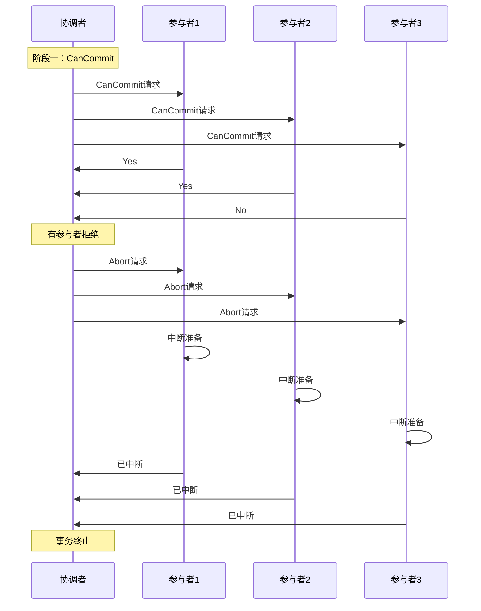
```mermaid
sequenceDiagram
    participant C as 协调者
    participant P1 as 参与者1
    participant P2 as 参与者2
    participant P3 as 参与者3
    
    Note over C: 阶段一：CanCommit
    C->>P1: CanCommit请求
    C->>P2: CanCommit请求
    C->>P3: CanCommit请求
    
    P1->>C: Yes
    P2->>C: Yes
    P3->>C: No
    
    Note over C: 有参与者拒绝
    C->>P1: Abort请求
    C->>P2: Abort请求
    C->>P3: Abort请求
    
    P1->>P1: 中断准备
    P2->>P2: 中断准备
    P3->>P3: 中断准备
    
    P1->>C: 已中断
    P2->>C: 已中断
    P3->>C: 已中断
    
    Note over C: 事务终止
```

### 超时处理流程

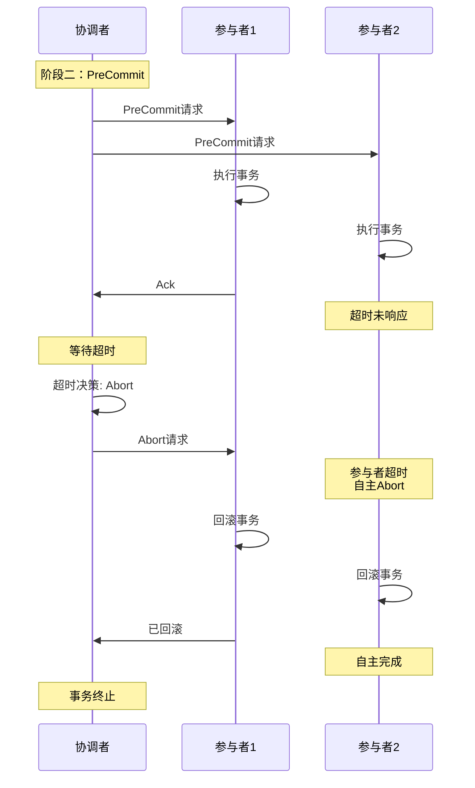
```mermaid
sequenceDiagram
    participant C as 协调者
    participant P1 as 参与者1
    participant P2 as 参与者2
    
    Note over C: 阶段二：PreCommit
    C->>P1: PreCommit请求
    C->>P2: PreCommit请求
    
    P1->>P1: 执行事务
    P2->>P2: 执行事务
    
    P1->>C: Ack
    Note over P2: 超时未响应
    
    Note over C: 等待超时
    C->>C: 超时决策: Abort
    
    C->>P1: Abort请求
    Note over P2: 参与者超时<br/>自主Abort
    
    P1->>P1: 回滚事务
    P2->>P2: 回滚事务
    
    P1->>C: 已回滚
    Note over P2: 自主完成
    
    Note over C: 事务终止
```

### 协调者故障时的参与者自主决策流程

这是3PC相比2PC的核心改进！当协调者故障时，参与者不再永久阻塞，而是可以根据自身状态自主决策。

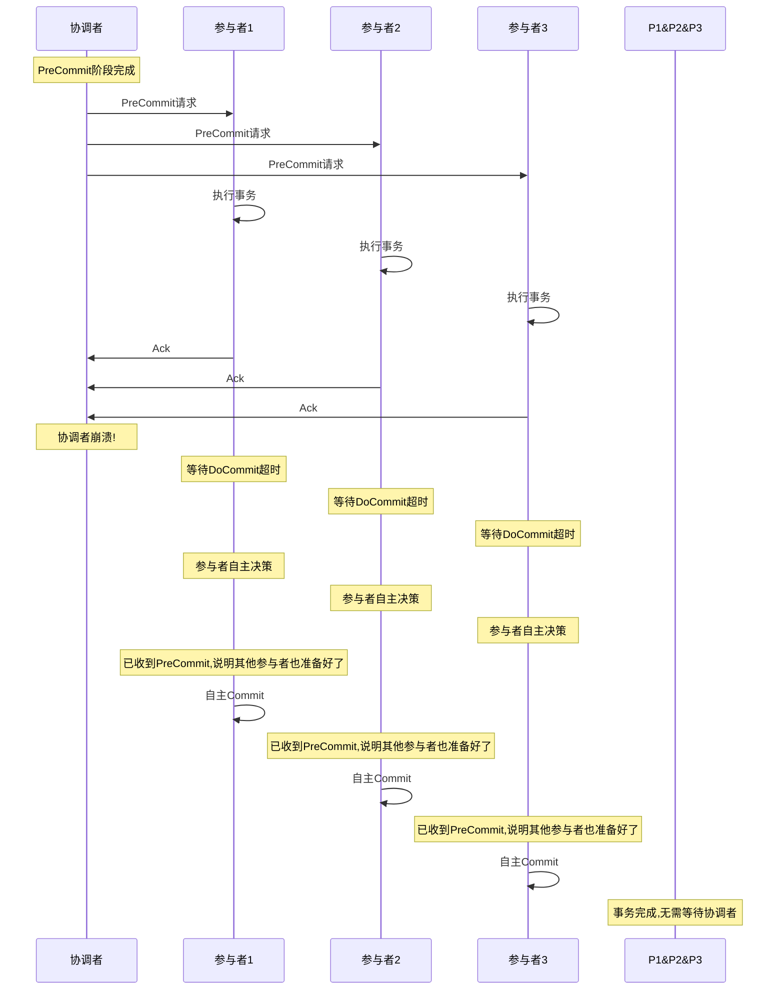
```mermaid
sequenceDiagram
    participant C as 协调者
    participant P1 as 参与者1
    participant P2 as 参与者2
    participant P3 as 参与者3
    
    Note over C: PreCommit阶段完成
    C->>P1: PreCommit请求
    C->>P2: PreCommit请求
    C->>P3: PreCommit请求
    
    P1->>P1: 执行事务
    P2->>P2: 执行事务
    P3->>P3: 执行事务
    
    P1->>C: Ack
    P2->>C: Ack
    P3->>C: Ack
    
    Note over C: 协调者崩溃!
    
    Note over P1: 等待DoCommit超时
    Note over P2: 等待DoCommit超时
    Note over P3: 等待DoCommit超时
    
    Note over P1: 参与者自主决策
    Note over P2: 参与者自主决策
    Note over P3: 参与者自主决策
    
    Note over P1: 已收到PreCommit,说明其他参与者也准备好了
    P1->>P1: 自主Commit
    
    Note over P2: 已收到PreCommit,说明其他参与者也准备好了
    P2->>P2: 自主Commit
    
    Note over P3: 已收到PreCommit,说明其他参与者也准备好了
    P3->>P3: 自主Commit
    
    Note over P1&P2&P3: 事务完成,无需等待协调者
```

**关键逻辑说明：**

1. **为什么可以自主决策？**
   - 如果参与者已经完成了PreCommit阶段，说明：
     - 协调者已经确认所有参与者都通过了CanCommit
     - 协调者已经向所有参与者发送了PreCommit
     - 所有参与者都回复了Ack
   - 这意味着"其他参与者也准备好了"是大概率事件

2. **不同阶段的自主决策策略：**

| 参与者当前阶段 | 协调者状态 | 自主决策 | 逻辑依据 |
|-------------|-----------|---------|---------|
| **CanCommit阶段** | 故障/无响应 | **Abort** | 还没执行实际操作，可以安全终止 |
| **PreCommit阶段** | 故障/无响应 | **Commit** | 已收到PreCommit，说明其他参与者也准备好了 |
| **DoCommit阶段** | 故障/无响应 | **Commit** | 已经到了最后阶段，应该完成提交 |

**与2PC的对比：**

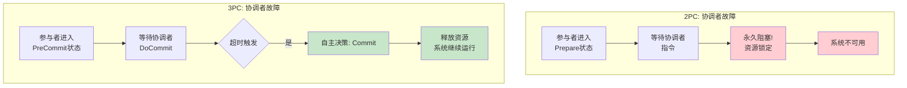
```mermaid
graph TD
    subgraph 2PC: 协调者故障
        A[参与者进入<br/>Prepare状态] --> B[等待协调者<br/>指令]
        B --> C[永久阻塞!<br/>资源锁定]
        C --> D[系统不可用]
        
        style C fill:#ffcdd2
        style D fill:#ffcdd2
    end
    
    subgraph 3PC: 协调者故障
        E[参与者进入<br/>PreCommit状态] --> F[等待协调者<br/>DoCommit]
        F --> G{超时触发}
        G -->|是| H[自主决策: Commit]
        H --> I[释放资源<br/>系统继续运行]
        
        style H fill:#c8e6c9
        style I fill:#c8e6c9
    end
```

### 状态转换图

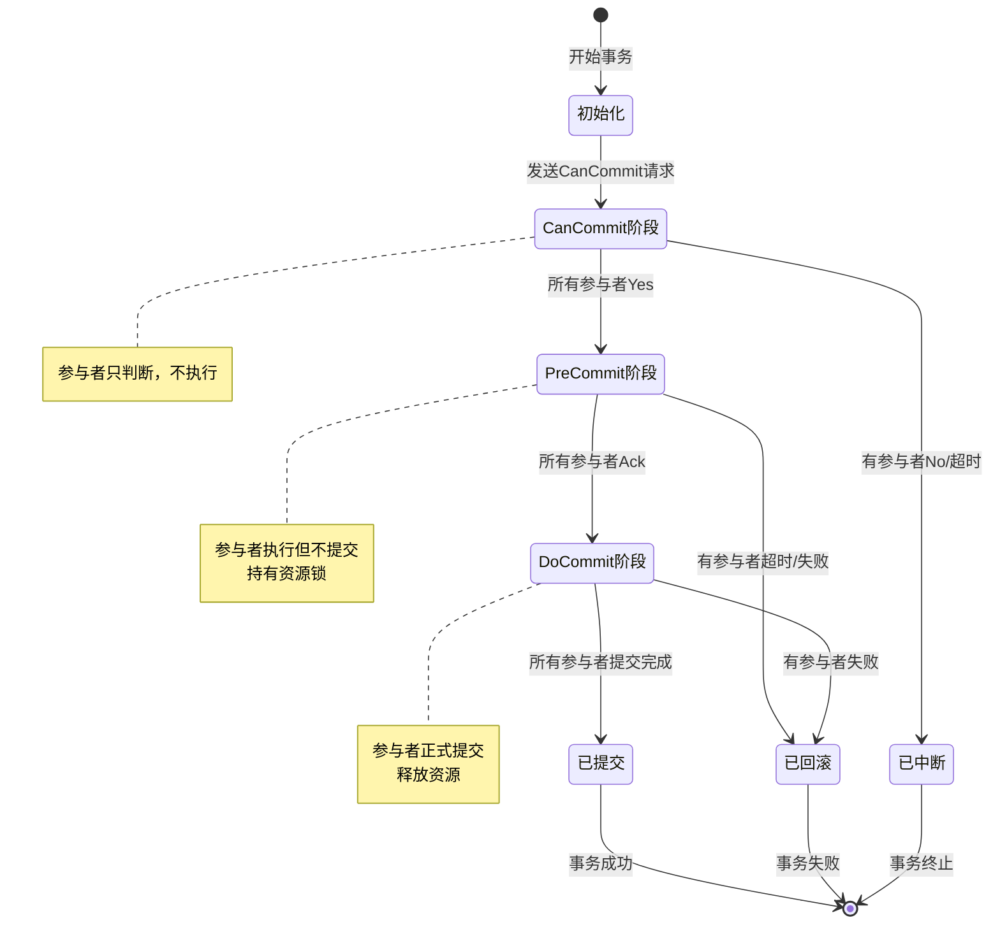
```mermaid
stateDiagram-v2
    [*] --> 初始化: 开始事务
    
    初始化 --> CanCommit阶段: 发送CanCommit请求
    
    CanCommit阶段 --> PreCommit阶段: 所有参与者Yes
    CanCommit阶段 --> 已中断: 有参与者No/超时
    
    PreCommit阶段 --> DoCommit阶段: 所有参与者Ack
    PreCommit阶段 --> 已回滚: 有参与者超时/失败
    
    DoCommit阶段 --> 已提交: 所有参与者提交完成
    DoCommit阶段 --> 已回滚: 有参与者失败
    
    已提交 --> [*]: 事务成功
    已回滚 --> [*]: 事务失败
    已中断 --> [*]: 事务终止
    
    note right of CanCommit阶段
        参与者只判断，不执行
    end note
    
    note right of PreCommit阶段
        参与者执行但不提交
        持有资源锁
    end note
    
    note right of DoCommit阶段
        参与者正式提交
        释放资源
    end note
```

## 四、详细流程说明

### 1. CanCommit阶段详解

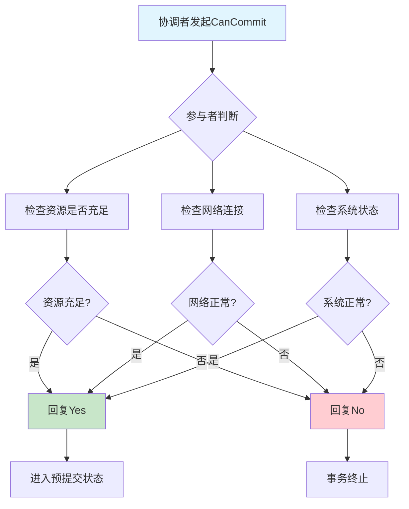
```mermaid
graph TD
    A[协调者发起CanCommit] --> B{参与者判断}
    
    B --> C[检查资源是否充足]
    B --> D[检查网络连接]
    B --> E[检查系统状态]
    
    C --> F{资源充足?}
    D --> G{网络正常?}
    E --> H{系统正常?}
    
    F -->|是| I[回复Yes]
    F -->|否| J[回复No]
    
    G -->|是| I
    G -->|否| J
    
    H -->|是| I
    H -->|否| J
    
    I --> K[进入预提交状态]
    J --> L[事务终止]
    
    style A fill:#e1f5fe
    style I fill:#c8e6c9
    style J fill:#ffcdd2
```

**关键点：**
- 参与者只做判断，不执行实际操作
- 不持有资源锁，避免长时间阻塞
- 快速响应，减少等待时间

### 2. PreCommit阶段详解

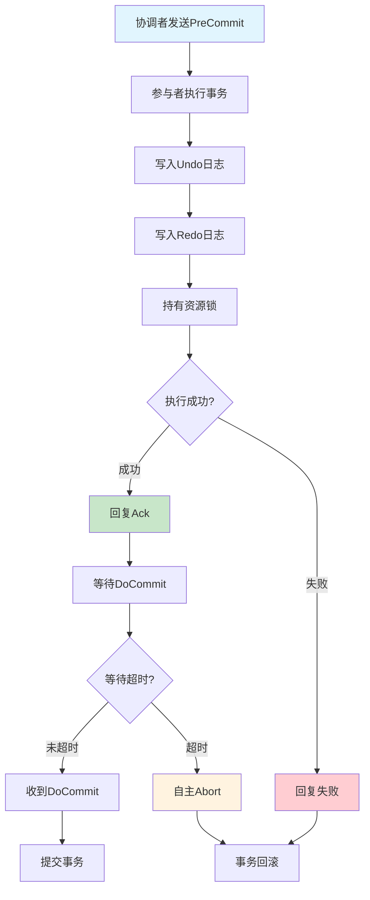
```mermaid
graph TD
    A[协调者发送PreCommit] --> B[参与者执行事务]
    
    B --> C[写入Undo日志]
    C --> D[写入Redo日志]
    D --> E[持有资源锁]
    
    E --> F{执行成功?}
    F -->|成功| G[回复Ack]
    F -->|失败| H[回复失败]
    
    G --> I[等待DoCommit]
    H --> J[事务回滚]
    
    I --> K{等待超时?}
    K -->|未超时| L[收到DoCommit]
    K -->|超时| M[自主Abort]
    
    L --> N[提交事务]
    M --> J
    
    style A fill:#e1f5fe
    style G fill:#c8e6c9
    style H fill:#ffcdd2
    style M fill:#fff3e0
```

**关键点：**
- 参与者执行事务但不提交
- 持有资源锁，但时间较短
- 引入超时机制，避免无限等待

### 3. DoCommit阶段详解

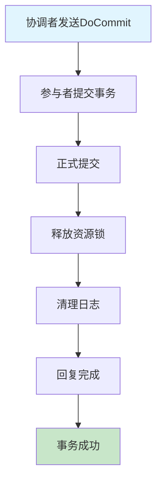
```mermaid
graph TD
    A[协调者发送DoCommit] --> B[参与者提交事务]
    
    B --> C[正式提交]
    C --> D[释放资源锁]
    D --> E[清理日志]
    
    E --> F[回复完成]
    F --> G[事务成功]
    
    style A fill:#e1f5fe
    style G fill:#c8e6c9
```

**关键点：**
- 参与者正式提交事务
- 释放所有资源锁
- 清理临时日志信息

## 五、2PC与3PC对比

### 流程对比图

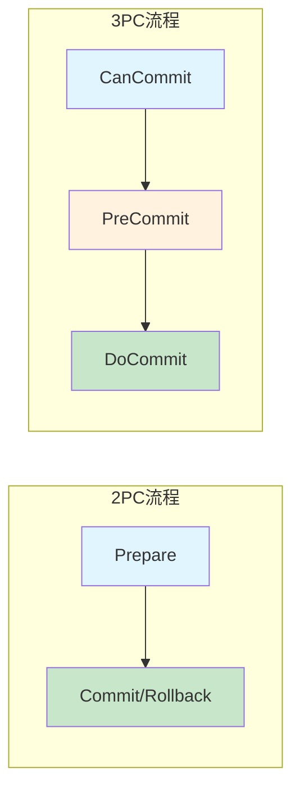
```mermaid
graph LR
    subgraph 2PC流程
        A1[Prepare] --> B1[Commit/Rollback]
    end
    
    subgraph 3PC流程
        A2[CanCommit] --> B2[PreCommit]
        B2 --> C2[DoCommit]
    end
    
    style A1 fill:#e1f5fe
    style B1 fill:#c8e6c9
    style A2 fill:#e1f5fe
    style B2 fill:#fff3e0
    style C2 fill:#c8e6c9
```

### 详细对比表

| 对比维度 | 2PC | 3PC |
|---------|-----|-----|
| **阶段数量** | 2个阶段 | 3个阶段 |
| **阻塞问题** | 参与者会长时间阻塞 | 引入超时，减少阻塞 |
| **单点故障** | 协调者故障导致阻塞 | 参与者可自主决策 |
| **数据一致性** | 强一致性 | 可能出现不一致 |
| **网络开销** | 较少（2次RPC） | 较多（3次RPC） |
| **实现复杂度** | 简单 | 复杂 |
| **超时机制** | 无 | 有 |
| **资源锁定时间** | 长 | 短 |
| **适用场景** | 强一致性要求 | 高可用性要求 |

### 阻塞时间对比


```mermaid
graph TD
    subgraph 2PC阻塞时间
        A1[Prepare开始] --> B1[持有锁]
        B1 --> C1[等待协调者]
        C1 --> D1[收到Commit/Rollback]
        D1 --> E1[释放锁]
        
        style B1 fill:#ffcdd2
        style C1 fill:#ffcdd2
    end
    
    subgraph 3PC阻塞时间
        A2[CanCommit] --> B2[不持有锁]
        B2 --> C2[PreCommit开始]
        C2 --> D2[持有锁]
        D2 --> E2[等待DoCommit]
        E2 --> F2[超时/收到指令]
        F2 --> G2[释放锁]
        
        style B2 fill:#c8e6c9
        style D2 fill:#fff3e0
        style E2 fill:#fff3e0
    end
```

## 六、优缺点分析

### 优点

#### 1. 减少阻塞时间

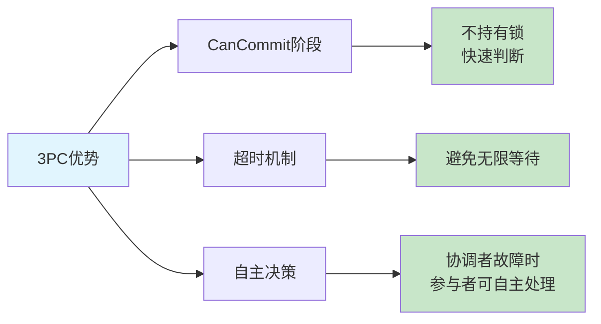
```mermaid
graph LR
    A[3PC优势] --> B[CanCommit阶段]
    A --> C[超时机制]
    A --> D[自主决策]
    
    B --> E[不持有锁<br/>快速判断]
    C --> F[避免无限等待]
    D --> G[协调者故障时<br/>参与者可自主处理]
    
    style A fill:#e1f5fe
    style E fill:#c8e6c9
    style F fill:#c8e6c9
    style G fill:#c8e6c9
```

**详细说明：**
- **CanCommit阶段不持有锁**：参与者只做判断，不执行实际操作
- **超时自动处理**：参与者超时后可以自主Abort，避免无限等待
- **减少资源占用时间**：资源锁定时间明显缩短

#### 2. 提高系统可用性

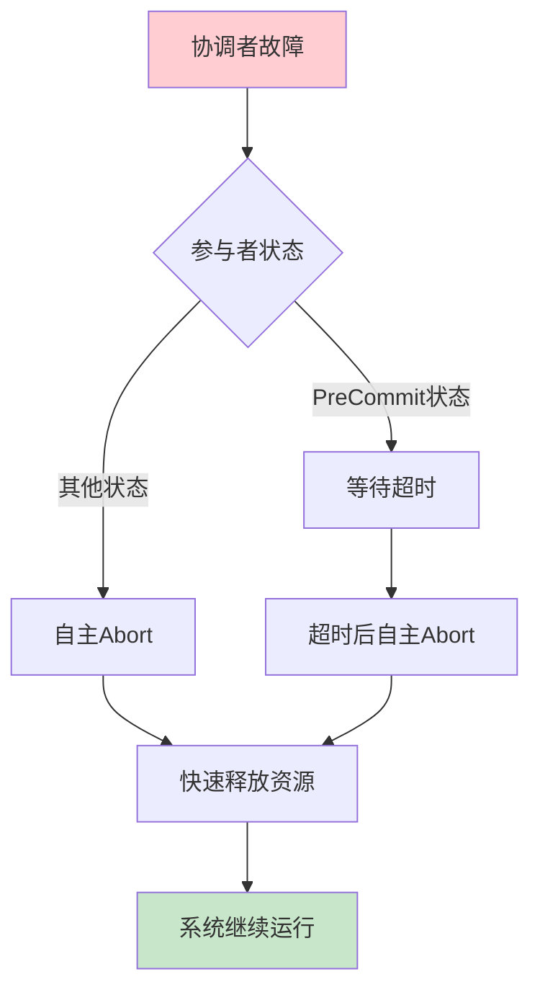
```mermaid
graph TD
    A[协调者故障] --> B{参与者状态}
    
    B -->|PreCommit状态| C[等待超时]
    B -->|其他状态| D[自主Abort]
    
    C --> E[超时后自主Abort]
    D --> F[快速释放资源]
    E --> F
    
    F --> G[系统继续运行]
    
    style A fill:#ffcdd2
    style G fill:#c8e6c9
```

**可用性提升：**
- 协调者故障不会导致参与者永久阻塞
- 参与者可以自主决策，提高系统容错能力
- 减少单点故障的影响范围

#### 3. 更好的容错能力

```java
public class Participant3PC {
    
    private ParticipantState state;
    private long timeout = 5000; // 5秒超时
    
    public void handleTimeout() {
        switch (state) {
            case CAN_COMMIT:
                // CanCommit阶段超时，直接Abort
                abort();
                break;
                
            case PRE_COMMIT:
                // PreCommit阶段超时，自主Abort
                abort();
                break;
                
            case DO_COMMIT:
                // DoCommit阶段超时，自主Commit
                // 因为已经PreCommit，说明其他参与者也准备好了
                commit();
                break;
        }
    }
    
    private void abort() {
        releaseResources();
        state = ParticipantState.ABORTED;
    }
    
    private void commit() {
        persistTransaction();
        releaseResources();
        state = ParticipantState.COMMITTED;
    }
}
```

### 缺点

#### 1. 数据不一致风险

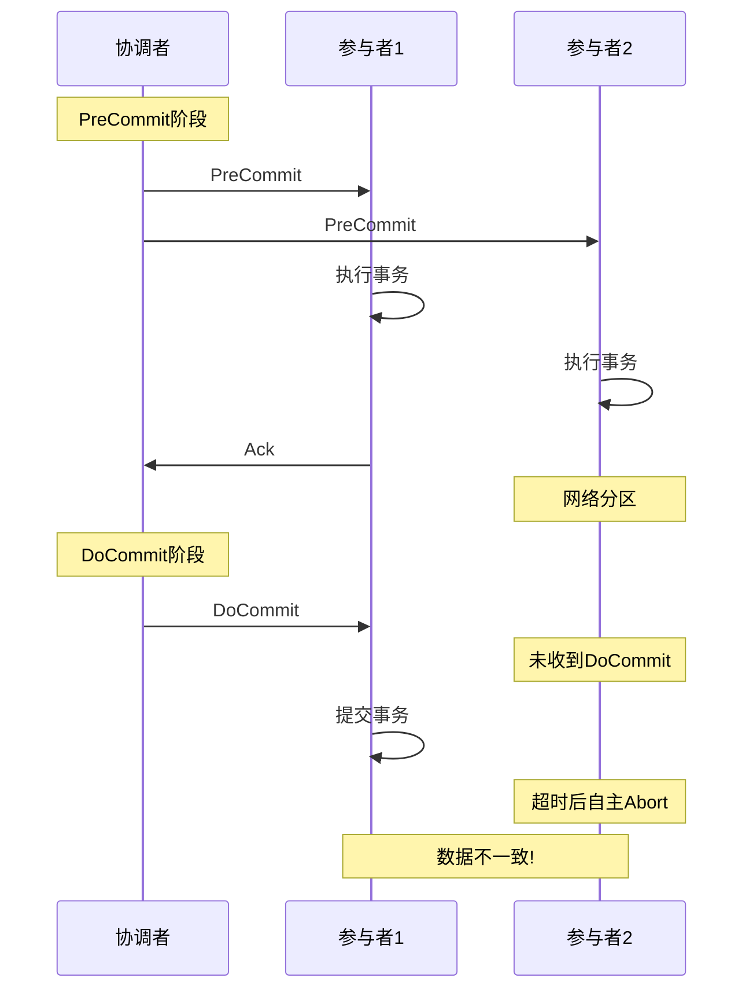
```mermaid
sequenceDiagram
    participant C as 协调者
    participant P1 as 参与者1
    participant P2 as 参与者2
    
    Note over C: PreCommit阶段
    C->>P1: PreCommit
    C->>P2: PreCommit
    
    P1->>P1: 执行事务
    P2->>P2: 执行事务
    
    P1->>C: Ack
    Note over P2: 网络分区
    
    Note over C: DoCommit阶段
    C->>P1: DoCommit
    Note over P2: 未收到DoCommit
    
    P1->>P1: 提交事务
    Note over P2: 超时后自主Abort
    
    Note over P1,P2: 数据不一致!
```

**不一致场景：**
- 网络分区导致部分参与者未收到DoCommit
- 参与者超时后自主Abort，而其他参与者已提交
- 无法保证所有参与者最终状态一致

#### 2. 网络开销增加

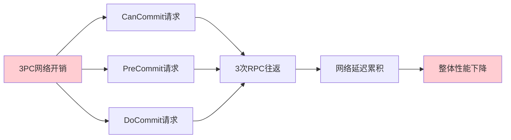
```mermaid
graph LR
    A[3PC网络开销] --> B[CanCommit请求]
    A --> C[PreCommit请求]
    A --> D[DoCommit请求]
    
    B --> E[3次RPC往返]
    C --> E
    D --> E
    
    E --> F[网络延迟累积]
    F --> G[整体性能下降]
    
    style A fill:#ffcdd2
    style G fill:#ffcdd2
```

**性能影响：**
- 需要三次RPC调用，网络延迟累积
- 每个阶段都需要等待所有参与者响应
- 整体事务处理时间延长

#### 3. 实现复杂度高

```java
public class Coordinator3PC {
    
    private Map<String, ParticipantState> participantStates;
    private ScheduledExecutorService scheduler;
    
    public void execute3PC() {
        // 阶段一：CanCommit
        if (!canCommitPhase()) {
            abort();
            return;
        }
        
        // 阶段二：PreCommit
        if (!preCommitPhase()) {
            abort();
            return;
        }
        
        // 阶段三：DoCommit
        doCommitPhase();
    }
    
    private boolean canCommitPhase() {
        CountDownLatch latch = new CountDownLatch(participants.size());
        
        for (String participant : participants) {
            scheduler.submit(() -> {
                try {
                    boolean canCommit = sendCanCommit(participant);
                    participantStates.put(participant, 
                        canCommit ? ParticipantState.READY : ParticipantState.ABORT);
                } catch (TimeoutException e) {
                    participantStates.put(participant, ParticipantState.TIMEOUT);
                } finally {
                    latch.countDown();
                }
            });
        }
        
        try {
            latch.await(timeout, TimeUnit.MILLISECONDS);
        } catch (InterruptedException e) {
            return false;
        }
        
        return participantStates.values().stream()
            .allMatch(state -> state == ParticipantState.READY);
    }
    
    private boolean preCommitPhase() {
        // 类似CanCommit的实现
        // 但需要处理更多状态
        return true;
    }
    
    private void doCommitPhase() {
        // 最终提交阶段
    }
}
```

**复杂度来源：**
- 需要管理更多的状态转换
- 超时机制需要精确控制
- 异常处理逻辑复杂

#### 4. 仍然存在单点故障

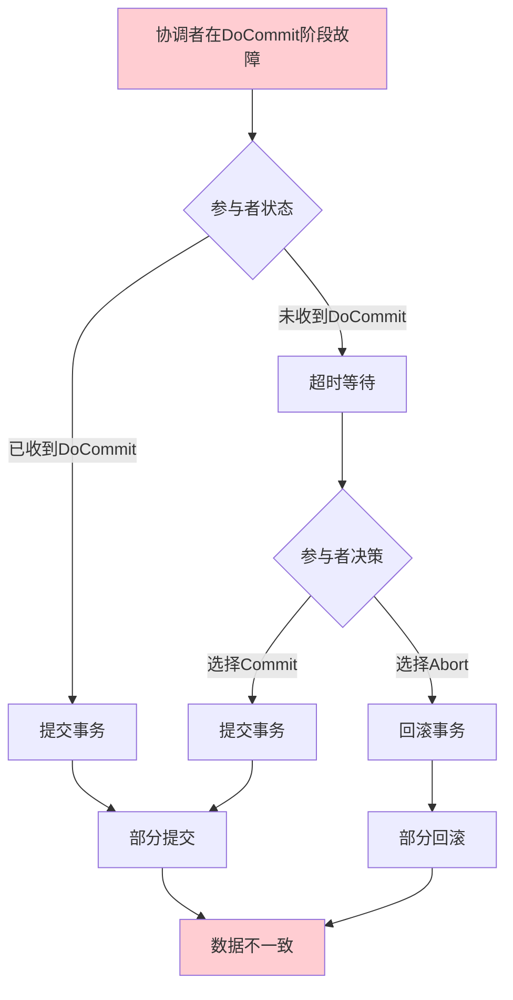
```mermaid
graph TD
    A[协调者在DoCommit阶段故障] --> B{参与者状态}
    
    B -->|已收到DoCommit| C[提交事务]
    B -->|未收到DoCommit| D[超时等待]
    
    D --> E{参与者决策}
    E -->|选择Commit| F[提交事务]
    E -->|选择Abort| G[回滚事务]
    
    C --> H[部分提交]
    F --> H
    G --> I[部分回滚]
    
    H --> J[数据不一致]
    I --> J
    
    style A fill:#ffcdd2
    style J fill:#ffcdd2
```

**单点故障问题：**
- 协调者在关键阶段故障仍会导致问题
- 参与者的自主决策可能导致不一致
- 无法完全消除单点故障风险

## 七、实际应用场景

### 1. 分布式数据库系统

#### 场景：跨数据中心事务

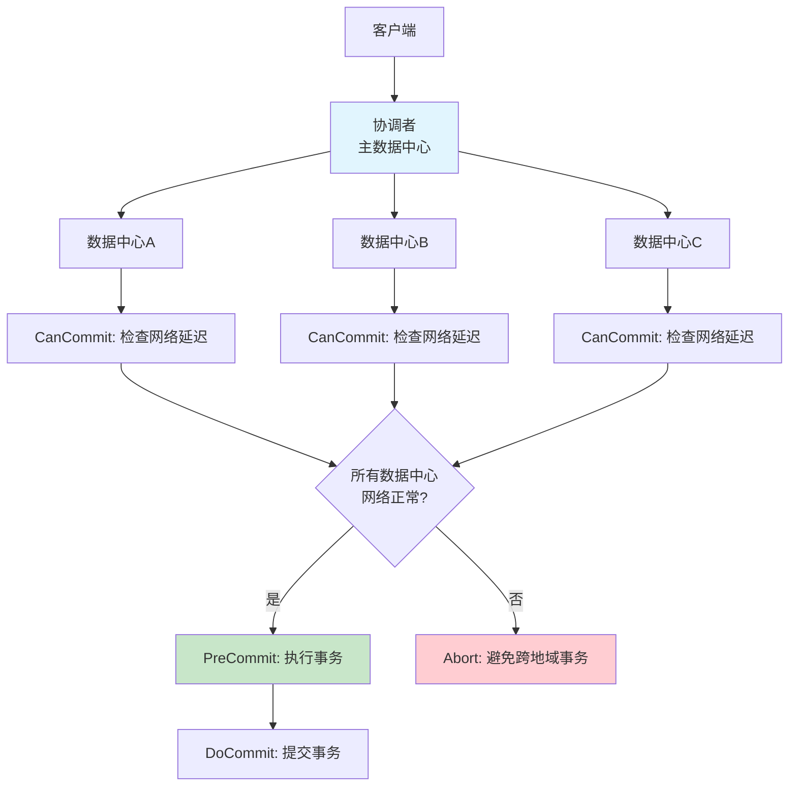
```mermaid
graph TD
    A[客户端] --> B[协调者<br/>主数据中心]
    
    B --> C[数据中心A]
    B --> D[数据中心B]
    B --> E[数据中心C]
    
    C --> F[CanCommit: 检查网络延迟]
    D --> G[CanCommit: 检查网络延迟]
    E --> H[CanCommit: 检查网络延迟]
    
    F --> I{所有数据中心<br/>网络正常?}
    G --> I
    H --> I
    
    I -->|是| J[PreCommit: 执行事务]
    I -->|否| K[Abort: 避免跨地域事务]
    
    J --> L[DoCommit: 提交事务]
    
    style B fill:#e1f5fe
    style J fill:#c8e6c9
    style K fill:#ffcdd2
```

**代码示例：**

```java
public class CrossDataCenterTransaction {
    
    public void executeTransaction(List<DataCenter> dataCenters) {
        Coordinator coordinator = new Coordinator();
        
        // 阶段一：CanCommit - 检查网络延迟
        Map<DataCenter, Boolean> canCommitResults = new HashMap<>();
        for (DataCenter dc : dataCenters) {
            boolean canCommit = checkNetworkLatency(dc) < MAX_LATENCY;
            canCommitResults.put(dc, canCommit);
        }
        
        // 如果有数据中心延迟过高，直接Abort
        if (canCommitResults.containsValue(false)) {
            abort(dataCenters);
            return;
        }
        
        // 阶段二：PreCommit - 执行事务
        boolean allPreCommitSuccess = preCommit(dataCenters);
        
        if (!allPreCommitSuccess) {
            abort(dataCenters);
            return;
        }
        
        // 阶段三：DoCommit - 提交事务
        doCommit(dataCenters);
    }
    
    private boolean checkNetworkLatency(DataCenter dc) {
        long start = System.currentTimeMillis();
        ping(dc);
        long end = System.currentTimeMillis();
        return end - start;
    }
}
```

### 2. 微服务架构

#### 场景：订单处理系统

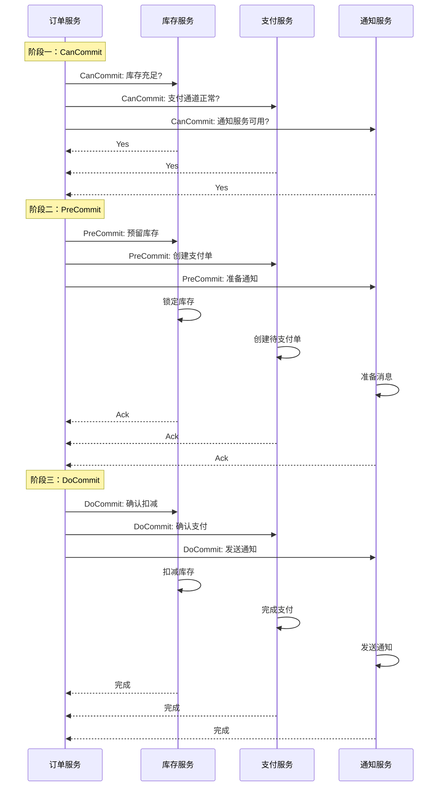
```mermaid
sequenceDiagram
    participant OMS as 订单服务
    participant IMS as 库存服务
    participant PMS as 支付服务
    participant NMS as 通知服务
    
    Note over OMS: 阶段一：CanCommit
    OMS->>IMS: CanCommit: 库存充足?
    OMS->>PMS: CanCommit: 支付通道正常?
    OMS->>NMS: CanCommit: 通知服务可用?
    
    IMS-->>OMS: Yes
    PMS-->>OMS: Yes
    NMS-->>OMS: Yes
    
    Note over OMS: 阶段二：PreCommit
    OMS->>IMS: PreCommit: 预留库存
    OMS->>PMS: PreCommit: 创建支付单
    OMS->>NMS: PreCommit: 准备通知
    
    IMS->>IMS: 锁定库存
    PMS->>PMS: 创建待支付单
    NMS->>NMS: 准备消息
    
    IMS-->>OMS: Ack
    PMS-->>OMS: Ack
    NMS-->>OMS: Ack
    
    Note over OMS: 阶段三：DoCommit
    OMS->>IMS: DoCommit: 确认扣减
    OMS->>PMS: DoCommit: 确认支付
    OMS->>NMS: DoCommit: 发送通知
    
    IMS->>IMS: 扣减库存
    PMS->>PMS: 完成支付
    NMS->>NMS: 发送通知
    
    IMS-->>OMS: 完成
    PMS-->>OMS: 完成
    NMS-->>OMS: 完成
```

**实现代码：**

```java
@Service
public class OrderService3PC {
    
    @Autowired
    private InventoryService inventoryService;
    
    @Autowired
    private PaymentService paymentService;
    
    @Autowired
    private NotificationService notificationService;
    
    public OrderResult placeOrder(OrderRequest request) {
        String transactionId = generateTransactionId();
        
        try {
            // 阶段一：CanCommit
            if (!canCommit(request)) {
                return OrderResult.failed("预检查失败");
            }
            
            // 阶段二：PreCommit
            if (!preCommit(request, transactionId)) {
                abort(transactionId);
                return OrderResult.failed("预提交失败");
            }
            
            // 阶段三：DoCommit
            doCommit(transactionId);
            return OrderResult.success();
            
        } catch (Exception e) {
            abort(transactionId);
            return OrderResult.failed(e.getMessage());
        }
    }
    
    private boolean canCommit(OrderRequest request) {
        // 检查库存是否充足
        boolean inventoryOK = inventoryService.checkStock(request.getProductId(), request.getQuantity());
        
        // 检查支付通道是否正常
        boolean paymentOK = paymentService.checkPaymentChannel(request.getUserId());
        
        // 检查通知服务是否可用
        boolean notificationOK = notificationService.checkAvailability();
        
        return inventoryOK && paymentOK && notificationOK;
    }
    
    private boolean preCommit(OrderRequest request, String transactionId) {
        try {
            // 预留库存
            inventoryService.reserveStock(transactionId, request.getProductId(), request.getQuantity());
            
            // 创建待支付单
            paymentService.createPendingPayment(transactionId, request.getUserId(), request.getAmount());
            
            // 准备通知消息
            notificationService.prepareNotification(transactionId, request.getUserId());
            
            return true;
        } catch (Exception e) {
            return false;
        }
    }
    
    private void doCommit(String transactionId) {
        // 确认扣减库存
        inventoryService.confirmDeduction(transactionId);
        
        // 确认支付
        paymentService.confirmPayment(transactionId);
        
        // 发送通知
        notificationService.sendNotification(transactionId);
    }
    
    private void abort(String transactionId) {
        // 释放预留库存
        inventoryService.releaseReservation(transactionId);
        
        // 取消待支付单
        paymentService.cancelPendingPayment(transactionId);
        
        // 清理通知消息
        notificationService.cleanupNotification(transactionId);
    }
}
```

### 3. 区块链跨链交易

#### 场景：跨链资产转移

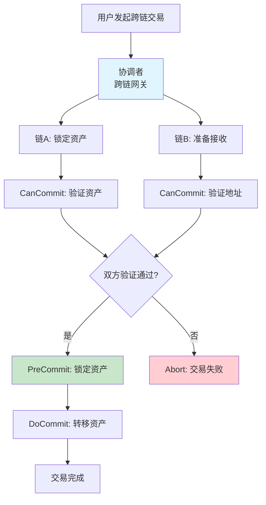
```mermaid
graph TD
    A[用户发起跨链交易] --> B[协调者<br/>跨链网关]
    
    B --> C[链A: 锁定资产]
    B --> D[链B: 准备接收]
    
    C --> E[CanCommit: 验证资产]
    D --> F[CanCommit: 验证地址]
    
    E --> G{双方验证通过?}
    F --> G
    
    G -->|是| H[PreCommit: 锁定资产]
    G -->|否| I[Abort: 交易失败]
    
    H --> J[DoCommit: 转移资产]
    J --> K[交易完成]
    
    style B fill:#e1f5fe
    style H fill:#c8e6c9
    style I fill:#ffcdd2
```

**实现代码：**

```java
public class CrossChainTransaction {
    
    private BlockchainClient chainA;
    private BlockchainClient chainB;
    
    public CrossChainResult transfer(String fromAddress, String toAddress, BigDecimal amount) {
        String txId = generateTxId();
        
        // 阶段一：CanCommit
        boolean chainAValid = chainA.validateBalance(fromAddress, amount);
        boolean chainBValid = chainB.validateAddress(toAddress);
        
        if (!chainAValid || !chainBValid) {
            return CrossChainResult.failed("验证失败");
        }
        
        // 阶段二：PreCommit
        try {
            // 在链A锁定资产
            String lockTxHash = chainA.lockAsset(txId, fromAddress, amount);
            
            // 在链B准备接收
            chainB.prepareReceive(txId, toAddress, amount);
            
            // 等待确认
            chainA.waitForConfirmation(lockTxHash);
            
        } catch (Exception e) {
            // 回滚锁定
            chainA.unlockAsset(txId);
            return CrossChainResult.failed("预提交失败");
        }
        
        // 阶段三：DoCommit
        try {
            // 链A转移资产
            chainA.transferAsset(txId, fromAddress, amount);
            
            // 链B接收资产
            chainB.receiveAsset(txId, toAddress, amount);
            
            return CrossChainResult.success(txId);
            
        } catch (Exception e) {
            // 异常处理
            handleFailure(txId, fromAddress, toAddress, amount);
            return CrossChainResult.failed("提交失败");
        }
    }
}
```

### 4. 分布式存储系统

#### 场景：多副本数据写入

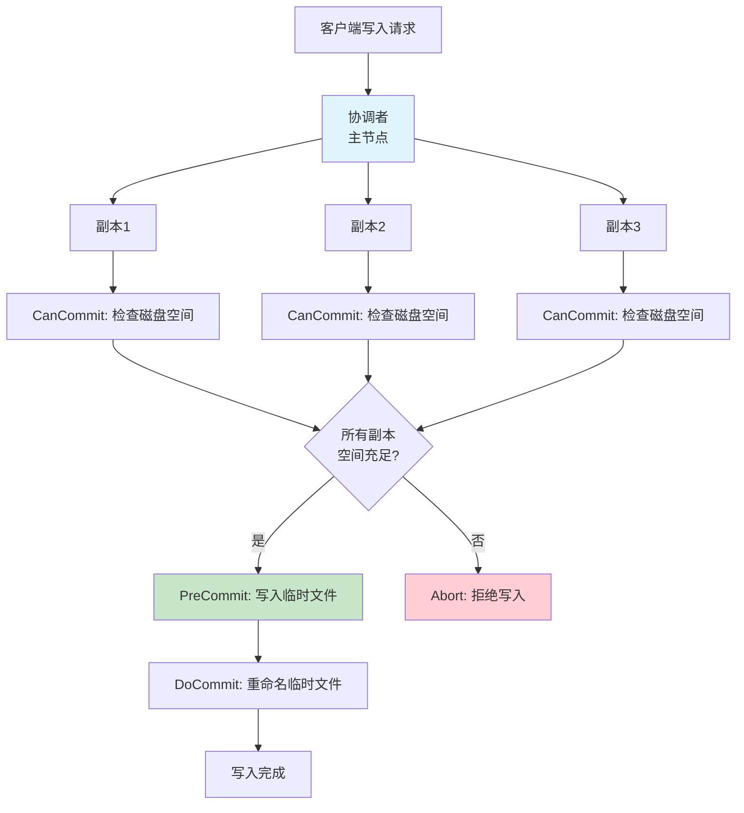
```mermaid
graph TD
    A[客户端写入请求] --> B[协调者<br/>主节点]
    
    B --> C[副本1]
    B --> D[副本2]
    B --> E[副本3]
    
    C --> F[CanCommit: 检查磁盘空间]
    D --> G[CanCommit: 检查磁盘空间]
    E --> H[CanCommit: 检查磁盘空间]
    
    F --> I{所有副本<br/>空间充足?}
    G --> I
    H --> I
    
    I -->|是| J[PreCommit: 写入临时文件]
    I -->|否| K[Abort: 拒绝写入]
    
    J --> L[DoCommit: 重命名临时文件]
    L --> M[写入完成]
    
    style B fill:#e1f5fe
    style J fill:#c8e6c9
    style K fill:#ffcdd2
```

**实现代码：**

```java
public class DistributedStorage {
    
    private List<StorageNode> nodes;
    
    public WriteResult write(String key, byte[] data) {
        String txId = generateTxId();
        
        // 阶段一：CanCommit - 检查磁盘空间
        Map<StorageNode, Boolean> canCommitResults = new HashMap<>();
        for (StorageNode node : nodes) {
            boolean hasSpace = node.checkDiskSpace(data.length);
            canCommitResults.put(node, hasSpace);
        }
        
        if (canCommitResults.containsValue(false)) {
            return WriteResult.failed("磁盘空间不足");
        }
        
        // 阶段二：PreCommit - 写入临时文件
        try {
            for (StorageNode node : nodes) {
                node.writeTempFile(txId, key, data);
            }
        } catch (Exception e) {
            // 清理临时文件
            for (StorageNode node : nodes) {
                node.deleteTempFile(txId);
            }
            return WriteResult.failed("预提交失败");
        }
        
        // 阶段三：DoCommit - 重命名临时文件
        try {
            for (StorageNode node : nodes) {
                node.commitTempFile(txId, key);
            }
            return WriteResult.success();
        } catch (Exception e) {
            // 部分提交失败，需要人工介入
            return WriteResult.partialSuccess();
        }
    }
}
```

## 八、超时机制详解

### 超时时间设置

```java
public class TimeoutConfig {
    
    // CanCommit阶段超时时间（较短，因为只做判断）
    public static final long CAN_COMMIT_TIMEOUT = 2000; // 2秒
    
    // PreCommit阶段超时时间（中等，需要执行事务）
    public static final long PRE_COMMIT_TIMEOUT = 5000; // 5秒
    
    // DoCommit阶段超时时间（较长，需要持久化）
    public static final long DO_COMMIT_TIMEOUT = 10000; // 10秒
    
    // 参与者等待协调者的超时时间
    public static final long PARTICIPANT_TIMEOUT = 8000; // 8秒
}
```

### 超时处理策略

```mermaid
graph TD
    A[参与者超时] --> B{当前阶段}
    
    B -->|CanCommit阶段| C[直接Abort]
    B -->|PreCommit阶段| D[自主Abort]
    B -->|DoCommit阶段| E[自主Commit]
    
    C --> F[释放资源]
    D --> F
    E --> G[提交事务]
    
    F --> H[事务终止]
    G --> I[事务完成]
    
    style A fill:#ffcdd2
    style C fill:#fff3e0
    style D fill:#fff3e0
    style E fill:#c8e6c9
```

### 超时处理实现

```java
public class ParticipantWithTimeout {
    
    private ScheduledExecutorService scheduler;
    private ParticipantState state;
    private ScheduledFuture<?> timeoutTask;
    
    public void handleCanCommit() {
        state = ParticipantState.CAN_COMMIT;
        startTimeout(TimeoutConfig.CAN_COMMIT_TIMEOUT, () -> {
            // CanCommit超时，直接Abort
            abort();
        });
    }
    
    public void handlePreCommit() {
        cancelTimeout();
        state = ParticipantState.PRE_COMMIT;
        startTimeout(TimeoutConfig.PRE_COMMIT_TIMEOUT, () -> {
            // PreCommit超时，自主Abort
            abort();
        });
    }
    
    public void handleDoCommit() {
        cancelTimeout();
        state = ParticipantState.DO_COMMIT;
        startTimeout(TimeoutConfig.DO_COMMIT_TIMEOUT, () -> {
            // DoCommit超时，自主Commit
            // 因为已经PreCommit，说明其他参与者也准备好了
            commit();
        });
    }
    
    private void startTimeout(long timeout, Runnable action) {
        timeoutTask = scheduler.schedule(action, timeout, TimeUnit.MILLISECONDS);
    }
    
    private void cancelTimeout() {
        if (timeoutTask != null) {
            timeoutTask.cancel(false);
        }
    }
}
```

## 九、最佳实践

### 1. 选择合适的场景

```mermaid
graph TD
    A[分布式事务场景] --> B{一致性要求}
    
    B -->|强一致性| C[使用2PC]
    B -->|最终一致性| D{可用性要求}
    
    D -->|高可用性| E[使用3PC]
    D -->|一般可用性| F[使用Saga/TCC]
    
    C --> G[金融交易<br/>库存管理]
    E --> H[跨地域部署<br/>高并发场景]
    F --> I[订单处理<br/>异步流程]
    
    style C fill:#e1f5fe
    style E fill:#c8e6c9
    style F fill:#fff3e0
```

### 2. 性能优化建议

#### 异步执行CanCommit

```java
public class Optimized3PC {
    
    public void execute() {
        // 异步并行执行CanCommit
        List<Future<Boolean>> futures = new ArrayList<>();
        for (Participant p : participants) {
            futures.add(executor.submit(() -> p.canCommit()));
        }
        
        // 等待所有结果
        boolean allCanCommit = true;
        for (Future<Boolean> future : futures) {
            try {
                if (!future.get(TimeoutConfig.CAN_COMMIT_TIMEOUT, TimeUnit.MILLISECONDS)) {
                    allCanCommit = false;
                    break;
                }
            } catch (TimeoutException e) {
                allCanCommit = false;
                break;
            }
        }
        
        if (allCanCommit) {
            preCommit();
        } else {
            abort();
        }
    }
}
```

#### 批量处理DoCommit

```java
public class BatchDoCommit {
    
    public void batchCommit(List<String> transactionIds) {
        // 收集所有需要提交的事务
        List<Participant> readyParticipants = participants.stream()
            .filter(p -> p.getState() == ParticipantState.PRE_COMMIT)
            .collect(Collectors.toList());
        
        // 批量发送DoCommit
        CountDownLatch latch = new CountDownLatch(readyParticipants.size());
        for (Participant p : readyParticipants) {
            executor.submit(() -> {
                p.doCommit();
                latch.countDown();
            });
        }
        
        // 等待所有提交完成
        latch.await(TimeoutConfig.DO_COMMIT_TIMEOUT, TimeUnit.MILLISECONDS);
    }
}
```

### 3. 监控与告警

```java
public class TransactionMonitor {
    
    private MeterRegistry meterRegistry;
    
    public void record3PCTransaction(String txId, TransactionResult result, long duration) {
        // 记录事务耗时
        Timer.builder("3pc.transaction.duration")
            .tag("result", result.name())
            .tag("tx_id", txId)
            .register(meterRegistry)
            .record(duration, TimeUnit.MILLISECONDS);
        
        // 记录各阶段耗时
        recordPhaseDuration(txId, "can_commit", result.getCanCommitDuration());
        recordPhaseDuration(txId, "pre_commit", result.getPreCommitDuration());
        recordPhaseDuration(txId, "do_commit", result.getDoCommitDuration());
        
        // 超时告警
        if (result.hasTimeout()) {
            Counter.builder("3pc.transaction.timeouts")
                .tag("phase", result.getTimeoutPhase())
                .register(meterRegistry)
                .increment();
        }
    }
    
    public void alertOnHighTimeoutRate() {
        double timeoutRate = getTimeoutRate();
        if (timeoutRate > 0.1) { // 超时率超过10%
            alertService.sendAlert("3PC超时率过高", 
                String.format("当前超时率: %.2f%%", timeoutRate * 100));
        }
    }
}
```

### 4. 故障恢复

```java
public class TransactionRecovery {
    
    public void recover() {
        // 扫描所有PreCommit状态的事务
        List<Transaction> preCommitTransactions = scanPreCommitTransactions();
        
        for (Transaction tx : preCommitTransactions) {
            // 检查是否超时
            if (isTimeout(tx)) {
                // 检查其他参与者状态
                if (allParticipantsReady(tx)) {
                    // 所有参与者都准备好，执行提交
                    doCommit(tx);
                } else {
                    // 有参与者未准备好，执行回滚
                    abort(tx);
                }
            }
        }
    }
    
    private boolean allParticipantsReady(Transaction tx) {
        return tx.getParticipants().stream()
            .allMatch(p -> p.getState() == ParticipantState.PRE_COMMIT);
    }
}
```

## 十、总结

三阶段提交是对两阶段提交的重要改进，通过引入超时机制和额外的准备阶段，有效减少了阻塞时间和单点故障的影响。然而，3PC仍然存在数据不一致的风险，且实现复杂度较高。

### 适用场景

- **高可用性要求**：系统需要快速响应，不能长时间阻塞
- **跨地域部署**：网络延迟较大，需要超时机制
- **最终一致性可接受**：短暂的数据不一致可以容忍

### 不适用场景

- **强一致性要求**：金融交易、库存管理等
- **网络稳定环境**：网络延迟小，2PC更简单高效
- **实现复杂度敏感**：团队经验不足，难以维护

### 发展趋势

- **混合方案**：结合2PC和3PC的优点
- **新协议**：如Paxos、Raft等一致性协议
- **云原生**：Service Mesh中的分布式事务支持

## 参考资料

- [Non-blocking Commit Protocols](https://dl.acm.org/doi/10.1145/322154.322157)
- [Distributed Systems: Principles and Paradigms](https://www.distributed-systems.net/)
- [Three-Phase Commit Protocol](https://en.wikipedia.org/wiki/Three-phase_commit_protocol)
- [分布式事务解决方案](https://martinfowler.com/articles/patterns-of-distributed-systems/)
- [Consensus Protocols: Three-Phase Commit](https://www.the-paper-trail.org/post/2008-11-27-consensus-protocols-three-phase-commit/)
