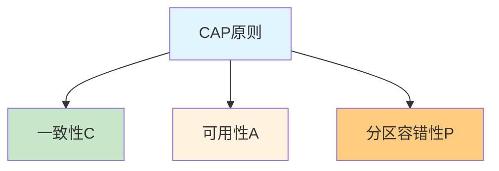

## 一、分布式系统概述

### 1. 什么是分布式系统？

**分布式系统**是由一组通过网络进行通信、为了完成共同任务而协调工作的计算机节点组成的系统。

**核心特点：**
- **多节点协同**：多个独立的计算机节点通过网络连接
- **资源共享**：节点之间共享资源和数据
- **透明性**：对用户来说，分布式系统看起来像一个单一的系统
- **可扩展性**：可以通过增加节点来扩展系统能力

**与单机系统的对比：**

| 特性 | 单机系统 | 分布式系统 |
|------|---------|------------|
| 部署方式 | 单台机器 | 多台机器 |
| 资源限制 | 受单台机器硬件限制 | 可通过增加节点扩展 |
| 可靠性 | 单点故障影响整个系统 | 部分节点故障不影响整体 |
| 复杂度 | 相对简单 | 网络通信、一致性等复杂问题 |

### 2. 微服务与分布式系统的关系

**微服务**是分布式系统的一种实现方式，它将一个大型应用拆分为多个小型、独立的服务。

**微服务的特点：**
- **服务拆分**：按照业务功能将应用拆分为独立的服务
- **独立部署**：每个服务可以独立开发、部署和扩展
- **技术多样性**：不同服务可以使用不同的技术栈
- **容错性**：单个服务故障不影响其他服务

**分布式系统的拆分模式：**

1. **水平切分**：将同一个服务部署到多台机器上，提高系统的处理能力和可用性
2. **垂直切分**：按照业务维度拆分，将不同业务功能独立出来
3. **混合切分**：结合水平切分和垂直切分的方法

**微服务架构**大多采用混合切分模式，既按业务垂直拆分，又对每个服务进行水平扩展。

## 二、分布式系统面临的挑战

### 1. 分布式计算的八大谬论

这些谬论是分布式系统设计中常见的错误假设：

1. **网络是可靠的**
2. **延迟为零**
3. **带宽是无限的**
4. **网络是安全的**
5. **拓扑是不变的**
6. **有管理员**
7. **传输成本为零**
8. **网络是同构的**

### 2. 核心挑战

1. **通信异常**：网络延迟、丢包、网络分区等
2. **网络分区**：网络故障导致系统被分割成多个独立的部分
3. **三态**：请求可能成功、失败或超时（不确定状态）
4. **节点故障**：服务器崩溃、硬件故障等
5. **数据一致性**：多节点数据同步和一致性保证
6. **并发控制**：分布式环境下的并发访问控制
7. **安全性**：分布式环境下的安全挑战

## 三、CAP原则详解

### 1. CAP原则的定义

**CAP原则**是由 Eric Brewer 在 2000 年提出的分布式系统设计原则，它指出在一个分布式系统中，以下三个特性最多只能同时满足两个：

- **一致性（Consistency）**：所有节点在同一时间具有相同的数据
- **可用性（Availability）**：系统在任何时刻都能响应客户端的请求
- **分区容错性（Partition tolerance）**：系统在网络分区的情况下仍然能够继续运行

### 2. 三个特性的详细解释

#### 2.1 一致性（Consistency）

**定义**：在分布式系统中，无论访问哪个节点，得到的数据都是最新的、一致的。

**实现机制**：
- 写操作完成后，所有节点都能看到最新的数据
- 读操作总是返回最新写入的数据
- 通常通过同步复制或共识算法实现

**强一致性 vs 弱一致性**：
- **强一致性**：任何时刻，所有节点的数据都是一致的
- **弱一致性**：系统不保证读取到最新数据，只保证最终会达到一致

#### 2.2 可用性（Availability）

**定义**：系统在任何时刻都能响应客户端的请求，不会出现服务不可用的情况。

**核心要求**：
- 系统能够及时响应客户端的请求
- 即使部分节点故障，系统仍然能够提供服务
- 响应时间在可接受的范围内

**衡量指标**：
- **可用性百分比**：如 99.9%（三个九）、99.99%（四个九）
- **MTTF（平均无故障时间）**
- **MTTR（平均修复时间）**

#### 2.3 分区容错性（Partition tolerance）

**定义**：当网络出现分区时，系统仍然能够继续运行。

**网络分区**：
- 由于网络故障，系统被分割成多个独立的部分
- 分区之间无法通信，但每个分区内部可以正常工作

**实现机制**：
- **数据复制**：在多个节点上存储数据副本
- **异步通信**：节点之间采用异步方式同步数据
- **故障检测**：通过心跳等机制检测节点状态
- **自动恢复**：网络恢复后自动同步数据

### 3. CAP的三选一困境

对于分布式系统来说，**分区容错性（P）是一个基本要求**，因为网络故障是不可避免的。因此，分布式系统只能在一致性（C）和可用性（A）之间做出选择。

#### 3.1 CP模式

**选择**：一致性 + 分区容错性

**特点**：
- 保证数据的强一致性
- 在网络分区时，可能会暂停服务以确保一致性
- 响应可能会延迟

**典型应用**：
- Zookeeper
- etcd
- 银行转账系统

**示例**：
当网络分区发生时，Zookeeper 会选举新的 leader，在选举期间服务可能暂时不可用，但一旦选举完成，所有节点的数据将保持一致。

#### 3.2 AP模式

**选择**：可用性 + 分区容错性

**特点**：
- 保证系统的高可用性
- 在网络分区时，系统继续提供服务
- 可能会出现数据不一致的情况

**典型应用**：
- Redis 集群
- Cassandra
- 大多数Web应用

**示例**：
Redis 集群在网络分区时，每个分区都可以独立提供服务，但不同分区的数据可能不一致，网络恢复后会通过复制机制最终达到一致。

#### 3.3 AC模式

**选择**：一致性 + 可用性

**特点**：
- 只适用于单机系统或网络完全可靠的环境
- 在分布式环境中无法实现，因为网络分区是不可避免的

**适用场景**：
- 单机数据库
- 本地缓存

### 4. 为什么CAP不能兼得？

#### 4.1 有CP不能有A

当网络分区发生时，为了保证一致性（C），系统必须停止服务，等待网络恢复和数据同步，这就牺牲了可用性（A）。

#### 4.2 有AP不能有C

当网络分区发生时，为了保证可用性（A），系统继续提供服务，但不同分区的数据可能不一致，这就牺牲了一致性（C）。

#### 4.3 有AC不能有P

如果要同时保证一致性（C）和可用性（A），系统就无法应对网络分区（P），因为网络分区会导致数据无法同步，从而破坏一致性。

## 四、BASE理论

### 1. BASE理论的定义

**BASE理论**是由 eBay 的架构师 Dan Pritchett 提出的，它是对 CAP 原则的补充，强调在分布式系统中采用最终一致性而非强一致性。

BASE 是以下三个概念的缩写：
- **Basically Available（基本可用）**：系统在面对故障时，仍然能够提供核心功能
- **Soft state（软状态）**：系统状态可以在一段时间内不一致
- **Eventually consistent（最终一致性）**：系统最终会达到一致状态

### 2. BASE理论的核心思想

BASE理论认为，在分布式系统中，强一致性是难以实现的，而最终一致性是更现实的选择。通过牺牲强一致性，换取系统的高可用性和分区容错性。

### 3. 最终一致性的类型

1. **因果一致性**：如果操作 A 导致操作 B，那么所有节点都必须看到 A 在 B 之前发生
2. **读己之所写一致性**：用户总是能看到自己最近写入的数据
3. **会话一致性**：在同一个会话中，用户能看到自己最近的操作结果
4. **单调读一致性**：如果一个用户先读取到值 V1，那么后续的读取不会得到比 V1 更旧的值
5. **单调写一致性**：用户的写操作按顺序执行

### 4. BASE与CAP的关系

- **CAP** 是分布式系统设计的约束条件，指出了三个特性之间的权衡
- **BASE** 是分布式系统设计的指导原则，提供了一种在CAP约束下的具体实现方法
- **BASE** 是对 CAP 中 AP 模式的扩展，通过最终一致性来平衡一致性和可用性

## 五、实际应用中的权衡

### 1. 根据业务场景选择合适的策略

| 业务场景 | 推荐策略 | 原因 | 典型应用 |
|---------|---------|------|----------|
| 金融交易 | CP | 要求数据强一致，宁可暂时不可用 | 银行转账、证券交易 |
| 电商系统 | AP + 最终一致性 | 保证系统高可用，数据最终一致即可 | 商品库存、订单状态 |
| 社交网络 | AP | 优先保证用户体验，数据一致性要求不高 | 消息推送、动态feed |
| 缓存系统 | AP | 追求高可用性和高性能 | Redis、Memcached |
| 配置中心 | CP | 配置数据需要强一致 | Zookeeper、etcd |

### 2. 混合策略的应用

在实际系统中，通常会根据不同的业务模块采用不同的策略：

- **核心业务**：采用 CP 模式，保证数据一致性
- **非核心业务**：采用 AP 模式，保证系统可用性
- **数据同步**：采用异步方式，实现最终一致性

### 3. 具体实现技术

#### 3.1 一致性实现技术

- **两阶段提交（2PC）**：保证强一致性，但性能较差
- **三阶段提交（3PC）**：改进的 2PC，减少阻塞时间
- **Paxos 算法**：分布式共识算法，保证一致性
- **Raft 算法**：简化的 Paxos，更易理解和实现

#### 3.2 可用性实现技术

- **负载均衡**：分发请求到多个节点
- **集群部署**：多节点冗余
- **故障转移**：自动检测并切换到健康节点
- **降级服务**：在故障时提供核心功能

#### 3.3 最终一致性实现技术

- **异步复制**：后台异步同步数据
- **消息队列**：保证消息的可靠传递
- **版本控制**：通过版本号解决冲突
- **冲突解决**：定义冲突解决策略

## 六、CAP原则的局限性

### 1. 理论与实践的差距

- **CAP 是理想模型**：实际系统中，三个特性并不是非黑即白的，而是有程度之分
- **网络分区的概率**：在实际环境中，网络分区的发生概率可能较低
- **一致性的粒度**：可以在不同层级实现不同程度的一致性

### 2. 扩展的CAP理论

#### 2.1 CAP+T

引入时间维度（Time），考虑系统在不同时间点的状态：
- **短期**：可能需要在 C 和 A 之间权衡
- **长期**：系统最终会达到一致状态

#### 2.2 PACELC理论

扩展的 CAP 理论，考虑了网络分区发生前后的情况：
- **P**：网络分区发生时，在 A 和 C 之间选择
- **E**：网络分区结束后，在 L（延迟）和 C（一致性）之间选择

## 七、案例分析

### 1. Zookeeper - CP模式的代表

**设计理念**：
- 采用 CP 模式，保证数据强一致性
- 使用 Zab 协议（基于 Paxos）实现共识
- 集群中只有一个 leader，负责处理写请求

**工作机制**：
- 写请求发送到 leader，leader 广播到所有 follower
- 当大多数节点确认后，写操作才会被提交
- 网络分区时，会重新选举 leader，期间服务暂时不可用

**适用场景**：
- 配置中心
- 服务发现
- 分布式锁

### 2. Redis Cluster - AP模式的代表

**设计理念**：
- 采用 AP 模式，保证高可用性
- 使用哈希槽（Hash Slot）进行数据分片
- 每个槽有多个副本，实现高可用

**工作机制**：
- 写请求发送到负责对应槽的主节点
- 主节点异步复制到从节点
- 网络分区时，从节点可以晋升为主节点，继续提供服务
- 网络恢复后，通过复制机制最终达到一致

**适用场景**：
- 缓存系统
- 会话存储
- 计数器

### 3. Cassandra - 最终一致性的代表

**设计理念**：
- 采用 AP 模式，强调高可用性和可扩展性
- 数据按行存储，支持多数据中心
- 使用 gossip 协议进行节点间通信

**工作机制**：
- 写操作可以发送到任何节点
- 节点之间通过 gossip 协议异步同步数据
- 读操作可以设置一致性级别，从弱到强

**适用场景**：
- 时间序列数据
- 日志存储
- 大规模数据存储

## 八、最佳实践

### 1. 系统设计建议

1. **明确业务需求**：根据业务对一致性和可用性的要求选择合适的策略
2. **分层设计**：不同层级采用不同的一致性策略
3. **数据分类**：根据数据的重要性采用不同的处理方式
4. **监控预警**：建立完善的监控体系，及时发现和处理问题
5. **灾备方案**：制定详细的灾难恢复计划

### 2. 技术选型建议

- **强一致性需求**：选择 Zookeeper、etcd 等 CP 系统
- **高可用性需求**：选择 Redis Cluster、Cassandra 等 AP 系统
- **混合需求**：采用多系统组合，如 Zookeeper + Redis

### 3. 性能优化建议

1. **减少网络开销**：优化网络通信，减少数据传输
2. **合理设置超时**：根据网络状况设置合适的超时时间
3. **批量操作**：合并多个操作，减少网络往返
4. **缓存策略**：合理使用缓存，减少对后端系统的压力
5. **异步处理**：将非关键操作异步化，提高系统响应速度

## 九、未来发展趋势

### 1. 混合一致性模型

未来的分布式系统可能会采用更加灵活的一致性模型，根据不同的业务场景自动调整一致性级别。

### 2. 边缘计算与CAP

边缘计算将计算能力下沉到网络边缘，这对 CAP 原则的应用提出了新的挑战：
- 边缘节点资源有限
- 网络条件更加不稳定
- 需要在边缘和云端之间平衡一致性和可用性

### 3. 区块链技术

区块链技术通过共识机制实现了分布式系统的一致性：
- **比特币**：采用工作量证明（PoW），保证最终一致性
- **以太坊**：支持智能合约，提供更复杂的一致性模型
- **联盟链**：采用更高效的共识算法，适合企业应用

### 4. AI与分布式系统

人工智能技术可能会为分布式系统的设计带来新的思路：
- **智能调度**：基于机器学习的资源调度
- **预测性故障检测**：提前发现潜在问题
- **自适应一致性**：根据系统状态自动调整一致性策略

## 十、总结

### 1. 核心要点

- **CAP原则**是分布式系统设计的基本约束，指出了一致性、可用性和分区容错性之间的权衡
- **分区容错性**是分布式系统的基本要求，因此系统只能在一致性和可用性之间选择
- **BASE理论**提供了一种在CAP约束下的实现方法，通过最终一致性来平衡一致性和可用性
- **实际应用**中，需要根据业务场景选择合适的策略，可能采用混合策略
- **技术选型**应基于业务需求，而不是盲目追求某一个特性

### 2. 实践启示

- **没有银弹**：不存在适用于所有场景的分布式系统设计方案
- **权衡是关键**：在设计系统时，需要根据业务需求在各个特性之间做出合理的权衡
- **渐进式改进**：系统设计应该是一个持续优化的过程，根据实际运行情况不断调整
- **监控与运维**：良好的监控和运维体系是保证分布式系统稳定运行的关键
- **团队协作**：分布式系统的设计需要不同角色的人员密切协作，包括业务、架构、开发和运维

### 3. 未来展望

随着技术的不断发展，分布式系统的设计也在不断演进。未来的分布式系统可能会更加智能、更加灵活，能够更好地适应各种复杂的业务场景。但无论技术如何发展，CAP原则的基本思想仍然是分布式系统设计的重要指导原则。

通过理解和应用CAP原则，我们可以设计出更加可靠、高效的分布式系统，为业务的发展提供有力的技术支持。

## 参考资料

- [CAP Theorem](https://en.wikipedia.org/wiki/CAP_theorem)
- [Brewer's Conjecture and the Feasibility of Consistent, Available, Partition-Tolerant Web Services](https://www.cs.berkeley.edu/~brewer/cs262b-2004/PODC-keynote.pdf)
- [BASE: An Acid Alternative](https://queue.acm.org/detail.cfm?id=1394128)
- [Distributed Systems: Principles and Paradigms](https://book.douban.com/subject/1949462/)
- [Designing Data-Intensive Applications](https://book.douban.com/subject/26197294/)
- [Zookeeper: Distributed Process Coordination](https://book.douban.com/subject/14773492/)
- [Redis Cluster Specification](https://redis.io/topics/cluster-spec)
- [Cassandra: The Definitive Guide](https://book.douban.com/subject/25876314/)
