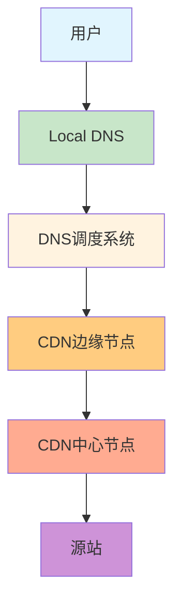
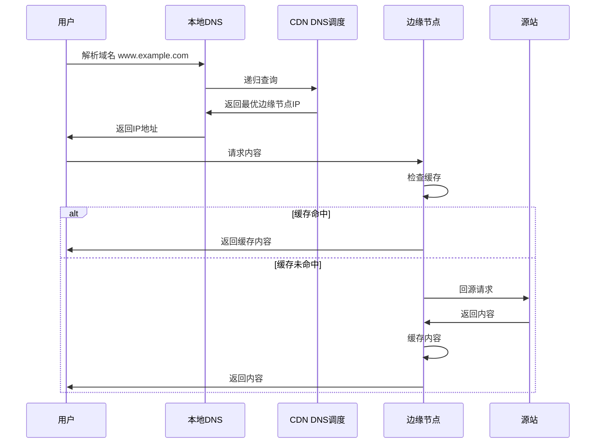

## 一、CDN概述

### 1. 什么是CDN？

**内容分发网络（Content Delivery Network，简称CDN）** 是一种分布式网络架构，通过在全球或区域范围内部署边缘节点，将内容缓存到离用户最近的节点，从而提高内容分发速度和服务可用性。

**核心价值：**
- **加速内容分发**：减少网络延迟，提高用户访问速度
- **减轻源站压力**：分流流量，降低源站负载
- **提高服务可用性**：多节点部署，避免单点故障
- **增强安全性**：抵御DDoS攻击，保护源站

### 2. CDN的发展历程

| 阶段 | 时间 | 特点 | 代表技术 |
|------|------|------|----------|
| 第一代 | 1990s | 静态内容加速 | 镜像服务器 |
| 第二代 | 2000s | 动态内容加速 | 智能缓存、负载均衡 |
| 第三代 | 2010s | 移动内容加速 | HTTP/2、HTTPS |
| 第四代 | 2020s | 边缘计算 | 边缘节点计算能力、AI优化 |

### 3. CDN的应用场景

- **静态资源加速**：图片、CSS、JavaScript、视频等静态文件
- **动态内容加速**：API请求、动态网页
- **直播加速**：视频直播、在线教育
- **点播加速**：视频点播、音乐 streaming
- **下载加速**：大文件下载、游戏更新
- **移动应用加速**：APP更新、移动API

## 二、CDN架构组成

### 1. 整体架构

### 2. 核心组件

#### 2.1 DNS调度系统

**功能**：负责将用户请求定向到最优的CDN边缘节点

**关键技术**：
- **智能DNS解析**：根据用户IP、网络状况选择最佳节点
- **负载均衡**：实时监控节点状态，合理分配流量
- **健康检查**：检测节点可用性，自动剔除故障节点

#### 2.2 边缘节点（Edge Node）

**功能**：位于网络边缘，直接为用户提供内容服务

**特点**：
- **地理位置分散**：部署在靠近用户的网络接入点
- **缓存能力**：存储热门内容的缓存
- **处理能力**：具备内容处理和分发能力

#### 2.3 中心节点（Origin Pull Node）

**功能**：连接边缘节点和源站，负责内容同步和管理

**职责**：
- **内容同步**：从源站拉取内容，分发到边缘节点
- **缓存管理**：制定缓存策略，管理边缘节点缓存
- **监控管理**：监控整个CDN网络的运行状态

#### 2.4 源站（Origin Server）

**功能**：内容的原始存储位置，CDN的内容来源

**类型**：
- **静态源站**：存储静态资源，如图片、视频
- **动态源站**：处理动态请求，如API服务
- **混合源站**：同时提供静态和动态内容

## 三、CDN工作原理

### 1. 基本工作流程

### 2. 详细工作机制

#### 2.1 域名解析阶段

1. **用户发起请求**：用户在浏览器中输入域名，发起HTTP请求
2. **本地DNS解析**：本地DNS服务器接收到解析请求
3. **CDN DNS调度**：本地DNS将请求转发到CDN的DNS调度系统
4. **智能调度**：DNS调度系统根据用户IP、网络状况、节点负载等因素，选择最优的边缘节点
5. **返回节点IP**：DNS调度系统将边缘节点的IP地址返回给本地DNS，最终传递给用户

#### 2.2 内容获取阶段

1. **请求边缘节点**：用户向边缘节点发起内容请求
2. **缓存检查**：边缘节点检查请求的内容是否在缓存中，以及缓存是否过期
3. **缓存命中**：如果缓存命中且未过期，直接返回缓存的内容
4. **回源请求**：如果缓存未命中或已过期，边缘节点向源站发起回源请求
5. **缓存更新**：边缘节点从源站获取内容后，更新本地缓存
6. **返回内容**：边缘节点将内容返回给用户

#### 2.3 缓存管理阶段

1. **缓存策略**：根据内容类型、热度等因素制定缓存策略
2. **缓存过期**：设置合理的缓存过期时间
3. **缓存清理**：定期清理过期或不常用的缓存
4. **缓存预热**：主动将热门内容预加载到边缘节点

## 四、CDN核心技术

### 1. 缓存技术

#### 1.1 缓存策略

- **时间缓存**：基于时间的缓存过期策略，如设置Cache-Control头部
- **内容缓存**：基于内容哈希的缓存策略，确保内容更新时缓存失效
- **动态缓存**：对动态内容进行缓存，如API响应
- **分段缓存**：对大文件进行分段缓存，提高传输效率

#### 1.2 缓存优化

- **缓存命中率**：通过智能缓存策略提高命中率
- **缓存预热**：主动将热门内容加载到缓存
- **缓存刷新**：手动或自动刷新缓存内容
- **缓存失效**：精确控制缓存失效，确保内容一致性

### 2. 负载均衡技术

#### 2.1 全局负载均衡（GSLB）

- **DNS负载均衡**：通过DNS解析将请求分配到不同节点
- **IP负载均衡**：基于IP地址的负载均衡
- **应用层负载均衡**：基于应用层协议的负载均衡

#### 2.2 本地负载均衡

- **轮询**：按顺序分配请求
- **加权轮询**：根据节点能力分配权重
- **最少连接**：将请求分配给当前连接数最少的节点
- **最快响应**：将请求分配给响应最快的节点

### 3. 内容分发技术

#### 3.1 拉取模式（Pull）

- **优点**：实现简单，无需额外配置
- **缺点**：首次请求延迟较高
- **适用场景**：内容访问频率较低的场景

#### 3.2 推送模式（Push）

- **优点**：首次请求响应快
- **缺点**：需要额外的推送机制
- **适用场景**：热门内容、重要内容

### 4. 网络优化技术

#### 4.1 HTTP优化

- **HTTP/2**：支持多路复用、头部压缩
- **HTTP/3**：基于QUIC协议，进一步降低延迟
- **HTTPS**：提供安全的传输通道

#### 4.2 传输优化

- **TCP优化**：调整TCP参数，提高传输效率
- **BBR拥塞控制**：Google的拥塞控制算法
- **压缩技术**：Gzip、Brotli等压缩算法
- **断点续传**：支持大文件的断点续传

### 5. 安全技术

#### 5.1 DDoS防护

- **流量清洗**：过滤恶意流量
- **速率限制**：限制单个IP的请求速率
- **黑洞路由**：当攻击流量过大时，临时屏蔽攻击源

#### 5.2 内容安全

- **HTTPS加密**：保护传输内容
- **防盗链**：防止内容被未授权网站引用
- **访问控制**：基于IP、Referer等的访问控制

## 五、CDN缓存策略

### 1. 缓存控制头部

| 头部字段 | 作用 | 示例 |
|---------|------|------|
| Cache-Control | 控制缓存行为 | max-age=3600 |
| Expires | 缓存过期时间 | Wed, 21 Oct 2026 07:28:00 GMT |
| Last-Modified | 资源最后修改时间 | Wed, 21 Oct 2026 07:28:00 GMT |
| ETag | 资源唯一标识符 | "686897696a7c876b7e" |

### 2. 缓存策略最佳实践

#### 2.1 静态资源

- **图片**：较长缓存时间（7-30天）
- **CSS/JS**：使用版本号或哈希值，设置较长缓存时间
- **字体**：较长缓存时间
- **视频**：分段缓存，较长缓存时间

#### 2.2 动态资源

- **API响应**：根据数据更新频率设置缓存时间
- **动态页面**：可考虑部分缓存，如页面框架
- **用户相关内容**：避免缓存或设置较短缓存时间

### 3. 缓存一致性保证

- **版本控制**：使用版本号或哈希值作为文件名
- **缓存刷新**：内容更新时主动刷新缓存
- **ETag验证**：使用ETag验证内容是否变化
- **Last-Modified验证**：使用最后修改时间验证内容是否变化

## 六、CDN性能优化

### 1. 性能指标

- **响应时间**：从请求到收到响应的时间
- **下载速度**：内容传输速度
- **缓存命中率**：缓存命中的请求比例
- **可用性**：服务可用的时间比例
- **错误率**：请求失败的比例

### 2. 优化策略

#### 2.1 内容优化

- **压缩**：对文本内容进行压缩
- **图片优化**：使用适当的图片格式和尺寸
- **代码优化**：最小化CSS/JS文件
- **资源合并**：减少HTTP请求数

#### 2.2 配置优化

- **合理设置缓存时间**：根据内容类型设置不同的缓存时间
- **启用HTTP/2**：提高并发性能
- **启用HTTPS**：虽然增加了加密开销，但提供了安全保障
- **使用预连接**：提前建立TCP连接

#### 2.3 架构优化

- **多区域部署**：在不同地区部署边缘节点
- **智能路由**：选择最优的网络路径
- **边缘计算**：在边缘节点处理部分业务逻辑
- **CDN与云存储结合**：将静态资源存储在云存储中，CDN负责分发

## 七、CDN安全考虑

### 1. 常见安全威胁

- **DDoS攻击**：通过大量请求淹没CDN节点
- **内容盗用**：未授权使用CDN加速的内容
- **缓存投毒**：向CDN缓存中注入恶意内容
- **源站暴露**：攻击者通过CDN找到源站IP
- **数据泄露**：敏感数据通过CDN传输时被窃取

### 2. 安全防护措施

#### 2.1 DDoS防护

- **流量清洗**：过滤异常流量
- **速率限制**：限制单个IP的请求频率
- **黑洞路由**：临时屏蔽攻击源
- **高防CDN**：专门针对DDoS攻击的CDN服务

#### 2.2 内容保护

- **防盗链**：设置Referer白名单
- **URL签名**：为资源URL添加签名，防止未授权访问
- **内容加密**：对敏感内容进行加密传输
- **水印技术**：为图片、视频添加水印

#### 2.3 源站保护

- **隐藏源站IP**：通过CDN隐藏源站真实IP
- **访问控制**：限制只有CDN节点可以访问源站
- **源站防火墙**：在源站部署防火墙
- **监控告警**：实时监控源站访问情况

## 八、CDN与其他技术的结合

### 1. CDN + 云存储

**优势**：
- **存储与分发分离**：云存储负责存储，CDN负责分发
- **弹性扩展**：云存储可根据需求弹性扩展
- **成本优化**：按需付费，降低存储成本

**典型应用**：
- 静态网站托管
- 图片、视频存储和分发
- 大文件下载

### 2. CDN + 边缘计算

**优势**：
- **低延迟**：在边缘节点处理业务逻辑
- **减轻源站压力**：边缘节点分担计算任务
- **个性化服务**：根据用户位置提供个性化内容

**典型应用**：
- 实时数据分析
- 个性化推荐
- IoT设备数据处理

### 3. CDN + 直播技术

**优势**：
- **低延迟**：减少直播延迟
- **高并发**：支持大量用户同时观看
- **流畅播放**：自适应码率，保证播放质量

**典型应用**：
- 在线教育直播
- 体育赛事直播
- 游戏直播

## 九、CDN技术发展趋势

### 1. 边缘计算

- **边缘节点智能化**：边缘节点具备更强的计算能力
- **边缘应用**：在边缘节点部署轻量级应用
- **边缘AI**：在边缘节点运行AI模型，实现智能内容分发

### 2. 5G与CDN

- **超低延迟**：5G网络的低延迟特性与CDN结合
- **边缘部署**：在5G基站部署CDN节点
- **移动优化**：针对移动设备的CDN优化

### 3. AI驱动的CDN

- **智能缓存**：基于AI预测内容访问模式，优化缓存策略
- **智能调度**：AI算法选择最优节点
- **智能压缩**：AI驱动的内容压缩算法
- **异常检测**：AI检测异常流量和攻击

### 4. 量子计算与CDN

- **量子安全**：量子加密技术保护CDN传输
- **量子算法**：量子算法优化CDN路由
- **量子-resistant CDN**：抵抗量子计算攻击的CDN

### 5. Web3.0与CDN

- **去中心化CDN**：基于区块链的去中心化CDN
- **内容所有权**：区块链技术保护内容创作者权益
- **激励机制**：用户贡献带宽获得奖励

## 十、CDN服务提供商对比

| 提供商 | 优势 | 特点 | 适用场景 |
|--------|------|------|----------|
| 阿里云CDN | 全球节点覆盖，稳定性高 | 支持HTTPS、HTTP/2，提供多种缓存策略 | 企业级应用，大规模网站 |
| 腾讯云CDN | 国内节点丰富，性价比高 | 与腾讯生态深度集成，支持直播加速 | 游戏、视频应用 |
| 百度云CDN | 搜索技术优势，智能调度 | 支持图片处理，适合静态资源加速 | 内容型网站 |
| Cloudflare | 全球覆盖，安全能力强 | 内置DDoS防护，支持HTTP/3 | 国际化业务 |
| Akamai | 全球领先，技术成熟 | 丰富的边缘计算能力 | 大型企业，金融行业 |
| Fastly | 边缘计算能力强，实时配置 | 支持实时缓存刷新，API丰富 | 开发者，API驱动应用 |

## 十一、最佳实践案例

### 1. 电商网站CDN优化

**挑战**：
- 大促期间流量激增
- 图片、视频等静态资源量大
- 动态内容需要实时更新

**解决方案**：
- **静态资源加速**：图片、CSS、JS等静态资源使用CDN加速
- **动态内容缓存**：对API响应进行合理缓存
- **预缓存**：大促前预热热门商品页面
- **多区域部署**：根据用户分布部署CDN节点

**效果**：
- 页面加载时间减少60%
- 源站带宽减少80%
- 系统稳定性显著提升

### 2. 视频直播平台CDN优化

**挑战**：
- 直播延迟要求高
- 并发观看人数多
- 网络波动影响体验

**解决方案**：
- **直播专用CDN**：选择支持低延迟直播的CDN服务
- **多码率适配**：根据用户网络状况自动调整码率
- **边缘节点缓存**：缓存直播流，减少回源
- **智能路由**：选择最优的网络路径

**效果**：
- 直播延迟降低50%
- 卡顿率减少70%
- 用户体验显著提升

### 3. 移动应用CDN优化

**挑战**：
- 移动网络不稳定
- 应用更新包大
- 全球用户访问

**解决方案**：
- **移动专用CDN**：针对移动网络优化的CDN服务
- **应用分包**：将应用拆分为多个小包
- **断点续传**：支持应用更新的断点续传
- **全球节点**：在用户分布地区部署节点

**效果**：
- 应用下载速度提升80%
- 更新成功率提高95%
- 全球用户体验一致

## 十二、总结

### 1. 核心要点

- **CDN的本质**：通过分布式节点架构，将内容缓存到离用户最近的位置，提高访问速度和服务可用性
- **核心技术**：缓存技术、负载均衡、内容分发、网络优化、安全防护
- **缓存策略**：根据内容类型和业务需求制定合理的缓存策略
- **性能优化**：从内容、配置、架构等多个维度优化CDN性能
- **安全防护**：采取多种措施应对DDoS攻击、内容盗用等安全威胁
- **技术趋势**：边缘计算、5G、AI、区块链等技术将推动CDN的发展

### 2. 实践建议

- **选择合适的CDN提供商**：根据业务需求、预算、服务质量等因素选择
- **合理配置缓存策略**：根据内容类型设置不同的缓存时间
- **优化内容**：压缩、合并、优化资源，减少传输大小
- **监控与分析**：实时监控CDN性能，分析访问数据，持续优化
- **安全防护**：启用HTTPS，配置防盗链，设置访问控制
- **边缘计算**：探索边缘计算在CDN中的应用，提升服务能力

### 3. 未来展望

CDN技术将继续朝着智能化、边缘化、安全化的方向发展。随着5G、边缘计算、AI等技术的不断成熟，CDN将不仅仅是内容分发的工具，更是边缘智能的重要载体。未来的CDN将能够提供更加个性化、实时化、安全化的内容分发服务，为数字经济的发展提供有力支撑。

通过合理利用CDN技术，企业可以显著提升用户体验，降低运营成本，增强竞争力。在数字化转型的大背景下，CDN已经成为现代互联网架构中不可或缺的组成部分。

## 参考资料

- [Content Delivery Network - Wikipedia](https://en.wikipedia.org/wiki/Content_delivery_network)
- [CDN Best Practices](https://developer.mozilla.org/en-US/docs/Web/Performance/CDN)
- [How CDNs Work](https://www.cloudflare.com/learning/cdn/what-is-a-cdn/)
- [HTTP Caching](https://developer.mozilla.org/en-US/docs/Web/HTTP/Caching)
- [Edge Computing and CDN](https://www.akamai.com/zh/blog/edge-computing/what-is-edge-computing)
- [CDN Performance Optimization](https://www.fastly.com/blog/cdn-performance-optimization)
- [DDoS Protection with CDN](https://www.cloudflare.com/learning/ddos/ddos-protection/)
- [HTTP/3 and CDN](https://www.akamai.com/zh/blog/performance/http3-the-future-of-web-performance)
