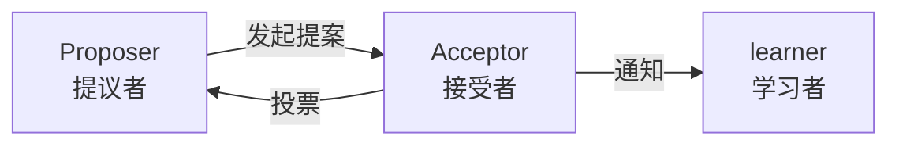
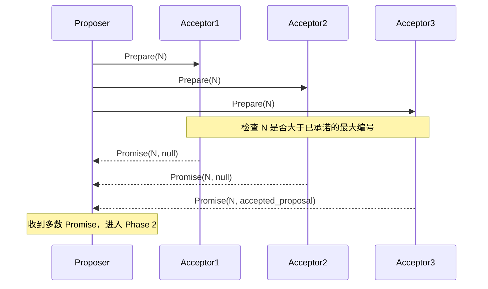
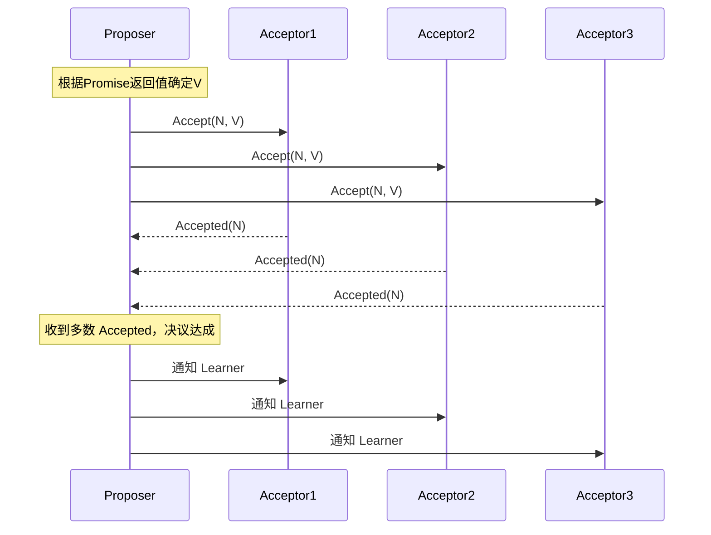
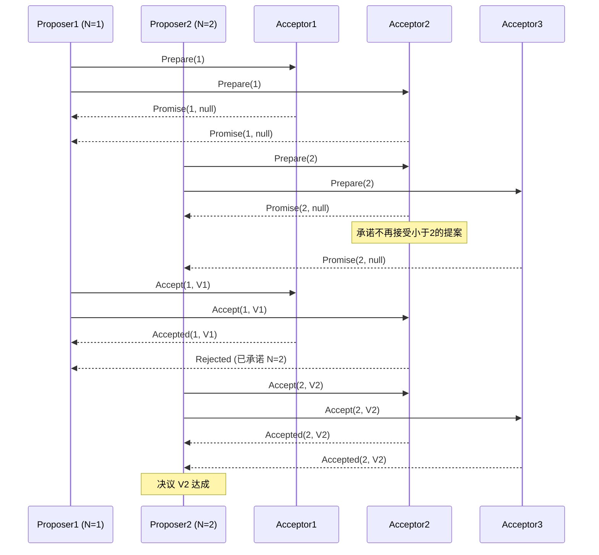
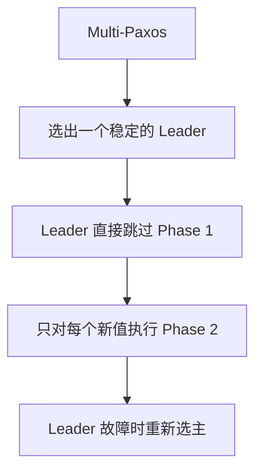
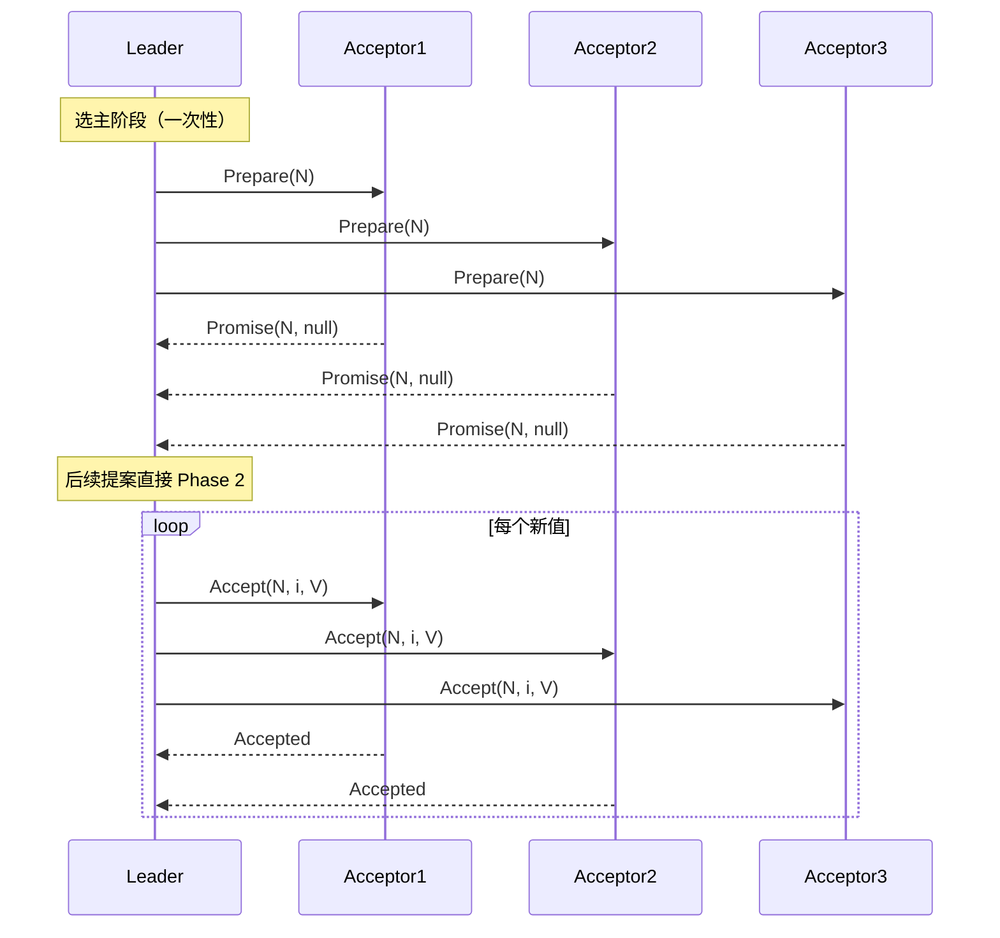
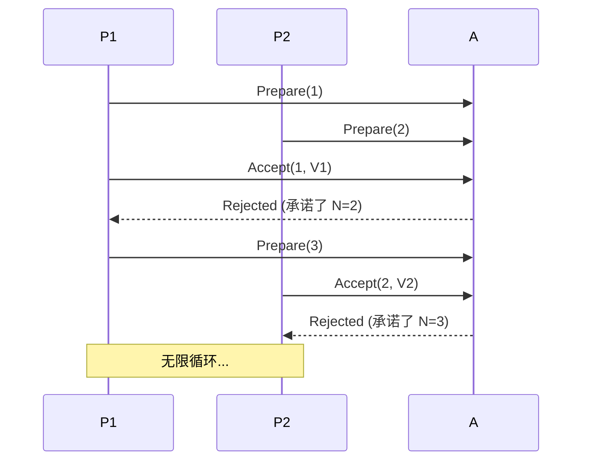
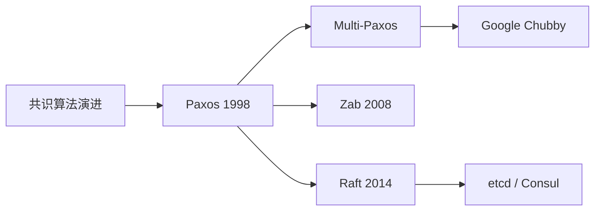

# Paxos 算法

> Paxos 是 Leslie Lamport 于 1998 年提出的共识算法，是现代分布式共识算法的鼻祖，Raft、Zab、Multi-Paxos 均源于其思想。本文系统讲解 Basic Paxos 与 Multi-Paxos 的原理、流程与工程实践。

## 目录

- [一、问题背景](#一问题背景)
- [二、核心概念](#二核心概念)
- [三、Basic Paxos 流程](#三basic-paxos-流程)
- [四、Multi-Paxos](#四multi-paxos)
- [五、活锁与优化](#五活锁与优化)
- [六、与 Raft 对比](#六与-raft-对比)
- [七、工程实践](#七工程实践)
- [八、相关资料](#八相关资料)

## 一、问题背景

分布式系统中，多个节点需要对某个值达成一致。面临的挑战：

- 节点可能宕机
- 网络可能丢包、延迟、分区
- 消息可能乱序

Paxos 算法在**允许少数节点故障**的前提下，保证：
1. **一致性（Safety）**：被选中的值只有一个，所有学习到的节点值相同
2. **可用性（Liveness）**：只要多数节点存活，最终能达成一致

## 二、核心概念

### 2.1 三种角色



| 角色 | 职责 |
|------|------|
| **Proposer** | 提出提案，协调共识过程 |
| **Acceptor** | 参与投票，决定提案是否被接受 |
| **Learner** | 接受最终决议，不参与投票 |

实际部署中，一个节点可同时担任三种角色。

### 2.2 提案（Proposal）

提案由 **提案编号** 和 **值** 组成：

```
Proposal = (N, V)
N: 提案编号，全局唯一且递增
V: 提议的值
```

### 2.3 多数派（Quorum）

任何决议都需要**多数派**（N/2 + 1）的 Acceptor 同意。任意两个多数派必有交集，这是一致性的基础。

```mermaid
flowchart LR
    subgraph 5节点
        A1[A1]
        A2[A2]
        A3[A3]
        A4[A4]
        A5[A5]
    end
    Q1[多数派1<br/>A1 A2 A3] -.-> A1
    Q1 -.-> A2
    Q1 -.-> A3
    Q2[多数派2<br/>A3 A4 A5] -.-> A3
    Q2 -.-> A4
    Q2 -.-> A5
    Q1 x--x Q2
    Note over Q1,Q2: 必有交集 A3
```

## 三、Basic Paxos 流程

### 3.1 两阶段

Paxos 通过两个阶段达成共识：

| 阶段 | 名称 | 目的 |
|------|------|------|
| Phase 1 | Prepare | 争取提议权，了解已接受的提案 |
| Phase 2 | Accept | 让 Acceptor 接受自己的提案 |

### 3.2 Phase 1：Prepare



**Proposer 行为**：
1. 选择比之前更大的编号 N
2. 向所有 Acceptor 发送 `Prepare(N)`

**Acceptor 行为**：
- 如果 N > 已承诺的最大编号：
  - 承诺不再接受编号小于 N 的提案
  - 返回 `Promise(N, 已接受的最高编号提案)`（若有）
- 否则拒绝

### 3.3 Phase 2：Accept



**Proposer 决定 V 的规则**：
1. 若收到的 Promise 中有已接受的提案，选择**编号最大**的那个值作为 V
2. 若都是 null，使用自己提议的值

**Acceptor 行为**：
- 如果未违背之前的承诺（N >= 已承诺编号），接受提案
- 否则拒绝

### 3.4 完整示例



## 四、Multi-Paxos

Basic Paxos 只能对**单个值**达成共识。实际系统需要连续对一系列值达成共识（如日志复制）。

### 4.1 朴素方案

对每个值运行一次 Basic Paxos，开销巨大（两次磁盘 fsync + 多次 RPC）。

### 4.2 优化思路：选主



**关键优化**：
- Leader 选出后，后续提案跳过 Prepare 阶段
- Leader 用更高的编号 N，所有 Acceptor 默认承诺
- 仅在 Leader 切换时才需要重新执行 Phase 1

### 4.3 流程



其中 `i` 是日志位置（slot）。

## 五、活锁与优化

### 5.1 活锁问题

两个 Proposer 交替提升编号，互相打断，导致永远无法达成一致：



### 5.2 解决方案

- **随机退避**：失败后随机等待一段时间再重试
- **选主**：选出一个 Leader，避免多个 Proposer 竞争（Multi-Paxos 推荐）

## 六、与 Raft 对比

| 维度 | Paxos | Raft |
|------|-------|------|
| **目标** | 理论正确性证明 | 工程易理解性 |
| **角色** | Proposer/Acceptor/Learner | Leader/Follower/Candidate |
| **日志** | 无明确日志模型 | 强Leader日志复制 |
| **成员变更** | 复杂 | 联合共识（简化版） |
| **可读性** | 极差（论文晦涩） | 好（论文清晰） |
| **工程实现** | 难（如 Chubby） | 易（如 etcd） |



## 七、工程实践

### 7.1 Google Chubby

- 分布式锁服务，基于 Paxos
- 客户端通过 Chubby 选主，避免多个客户端竞争
- GFS、BigTable 都依赖 Chubby

### 7.2 Phxpaxos（微信）

- C++ 实现的 Paxos 库
- 支持 Multi-Paxos
- 微信内部广泛使用

### 7.3 PaxosStore（微信）

- 基于 Paxos 的高可用 KV 存储
- 每个分片独立 Paxos 组

### 7.4 实现难点

1. **日志空洞处理**：Leader 故障后可能有空洞，需要补全
2. **成员变更**：动态调整成员列表复杂
3. **快照与日志压缩**：避免日志无限增长
4. **网络分区恢复**：分区恢复后状态合并

## 八、相关资料

- [The Part-Time Parliament - Leslie Lamport 1998](https://lamport.org/pubs/lamport-paxos.pdf)
- [Paxos Made Simple - Leslie Lamport](https://lamport.org/pubs/paxos-simple.pdf)
- [Paxos Made Live - Google](https://static.googleusercontent.com/media/research.google.com/zh-CN/archive/paxos_made_live.pdf)
- 《分布式系统：概念与设计》George Coulouris
- [Raft 论文中文翻译](https://github.com/maemual/raft-zh_cn)
