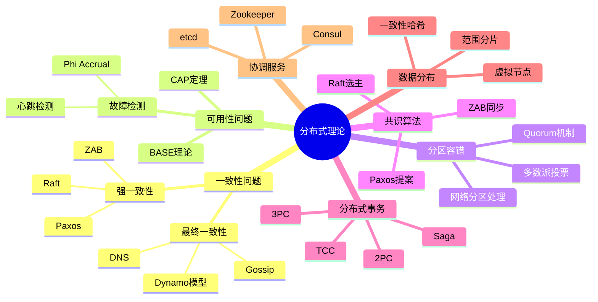
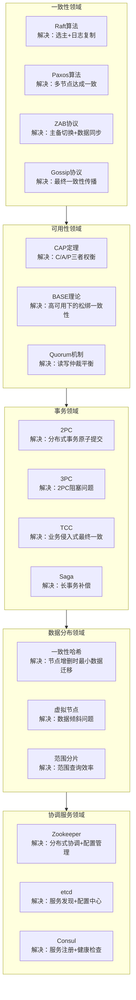
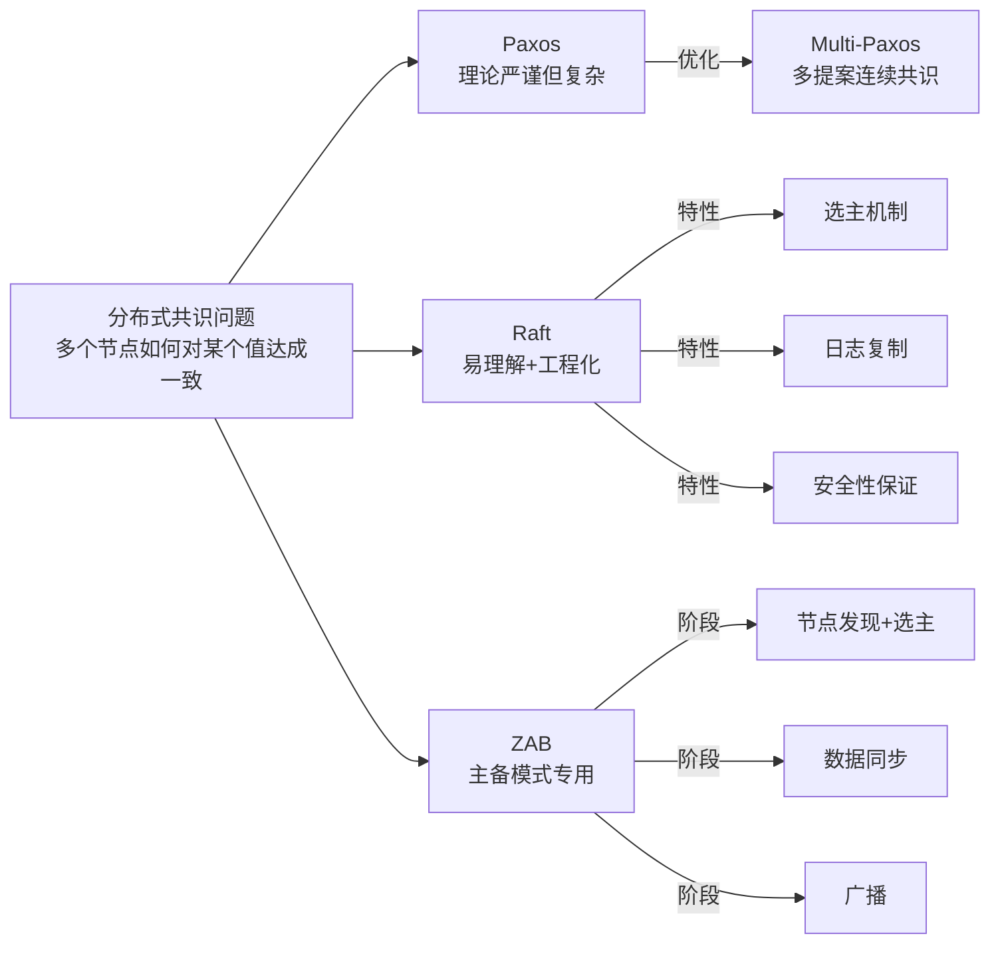
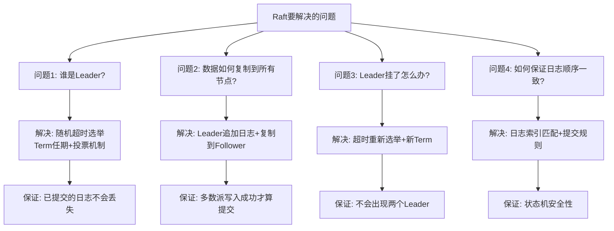
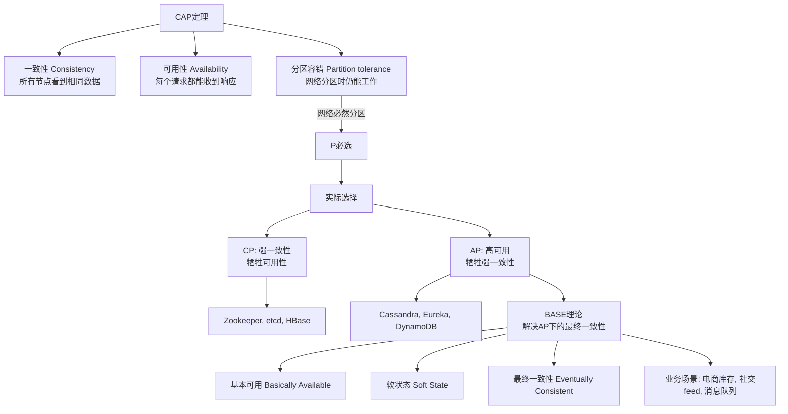
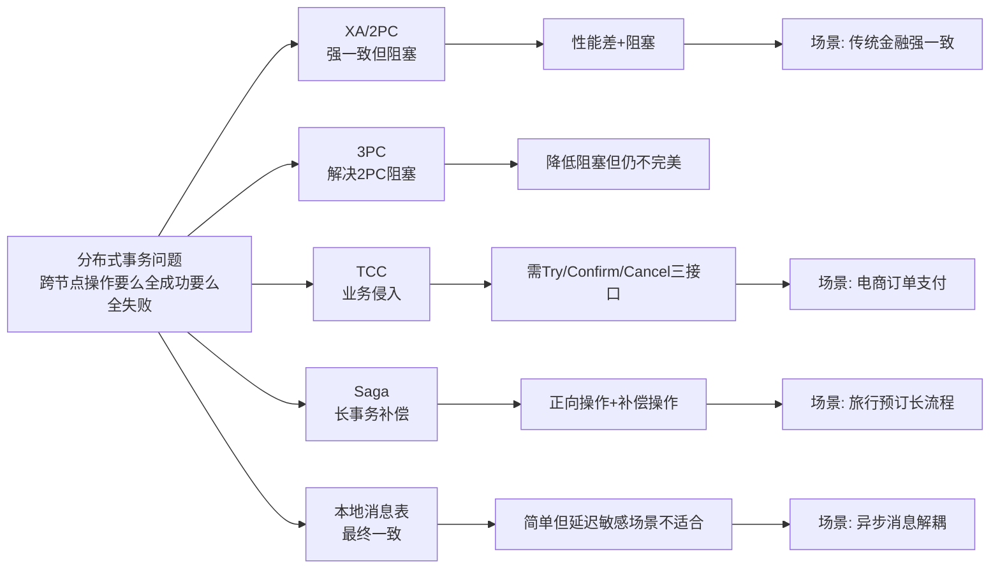
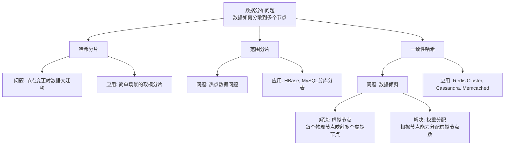
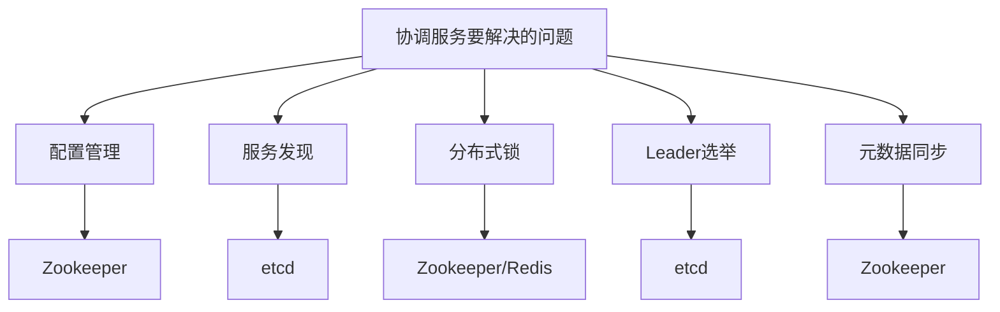
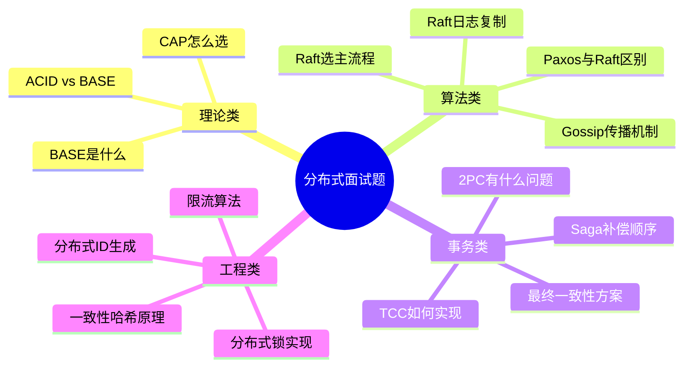

# 分布式理论思维导图

## 一、核心问题领域总览

## 二、各理论解决的问题

## 三、核心算法对比

### 3.1 共识算法对比

| 算法 | 解决问题 | 核心机制 | 典型应用 |
|------|----------|----------|----------|
| **Paxos** | 多节点如何对一个值达成一致 | 提案者/接受者/学习者 | 理论基础 |
| **Raft** | 选主 + 日志复制一致性 | Leader选举+日志复制+安全性 | etcd, Consul |
| **ZAB** | 主备数据同步 + 主备切换 | 发现+同步+广播三阶段 | Zookeeper |
| **Gossip** | 最终一致性传播 | 流言传播+反熵 | Cassandra, Redis Cluster |

### 3.2 Raft 解决的具体问题

## 四、CAP与BASE的关系

## 五、分布式事务演进

| 方案 | 解决问题 | 缺点 | 适用场景 |
|------|----------|------|----------|
| **2PC** | 强一致分布式事务 | 阻塞+单点故障 | 传统数据库 |
| **3PC** | 2PC阻塞问题 | 仍可能不一致 | 理论改进 |
| **TCC** | 业务层面最终一致 | 代码侵入大 | 电商支付 |
| **Saga** | 长事务的一致性 | 补偿逻辑复杂 | 业务流程长 |
| **本地消息表** | 跨服务最终一致 | 依赖消息系统 | 异步场景 |

## 六、数据分布策略

## 七、典型协调服务对比

| 服务 | 一致性算法 | 典型场景 | 语言 |
|------|-----------|----------|------|
| **Zookeeper** | ZAB | Hadoop/Kafka协调 | Java |
| **etcd** | Raft | K8s配置/服务发现 | Go |
| **Consul** | Raft | 服务注册+健康检查 | Go |
| **Nacos** | Raft/Distro | 配置中心+服务发现 | Java |

## 八、面试高频问题速查

## 九、参考资料

- [Raft论文中文版](https://github.com/maemual/raft-zh_cn)
- [Paxos Made Simple](https://lamport.orgpubs/paxos-simple.pdf)
- [CAP定理](https://zh.wikipedia.org/wiki/CAP定理)
- [分布式系统必读论文合集](https://github.com/papers-we-love/papers-we-love)
