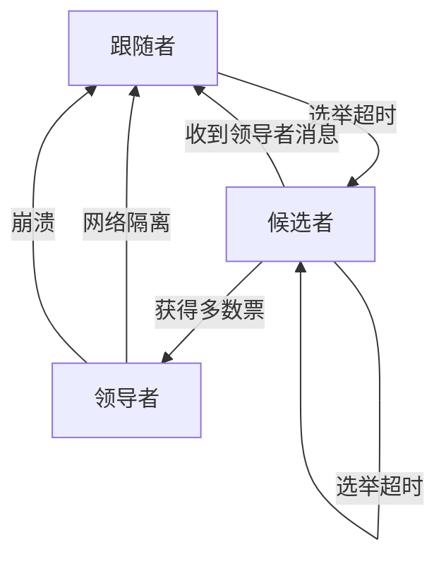
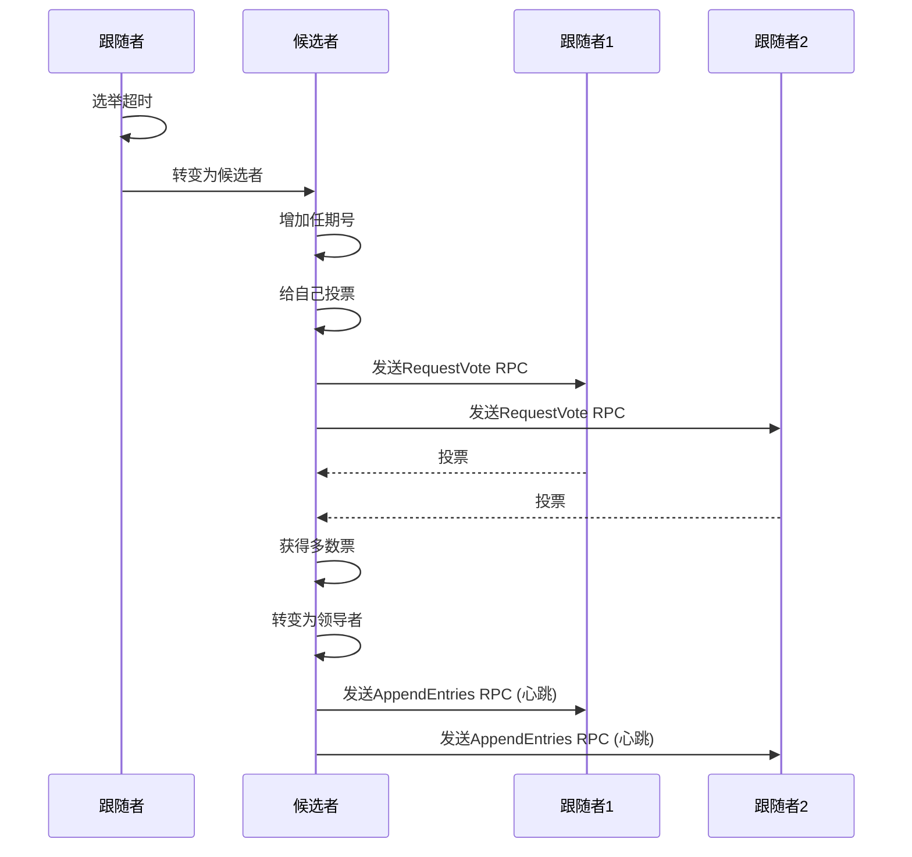
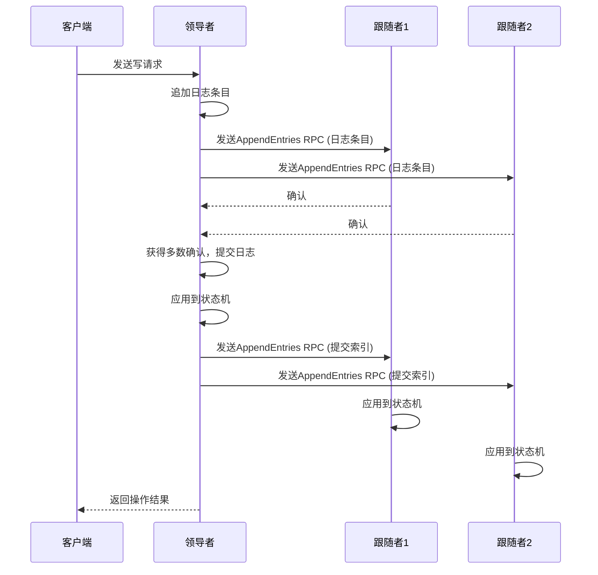
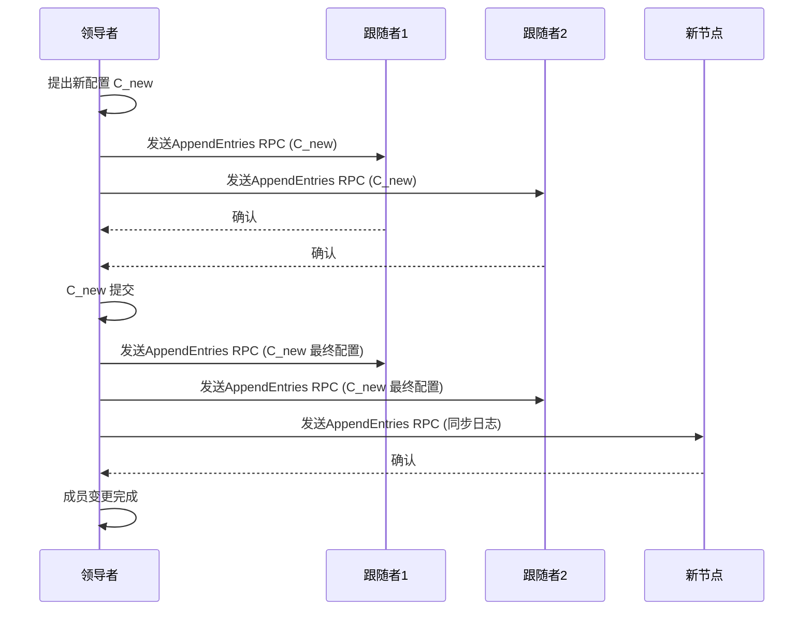

## 一、Raft算法概述

### 1.1 什么是Raft算法

**Raft**是一种分布式一致性算法，用于管理复制日志的一致性。它由 Diego Ongaro 和 John Ousterhout 在 2014 年提出，是对 Paxos 算法的一种简化和优化，目的是使分布式一致性算法更易于理解和实现。

**核心目标**：
- 确保集群中的所有节点最终达成一致的状态
- 在网络分区、节点故障等情况下保持系统可用性
- 提供强一致性保证

### 1.2 Raft算法的应用场景

- **分布式键值存储**：如 etcd、Consul
- **分布式数据库**：如 CockroachDB、TiDB
- **容器编排**：如 Kubernetes 使用 etcd 存储集群状态
- **任何需要强一致性保证的分布式系统**

## 二、核心概念与术语

### 2.1 基本概念

- **任期（Term）**：Raft 算法将时间划分为多个任期，每个任期从一次选举开始
- **日志（Log）**：客户端的请求以日志条目的形式存储，包含命令和任期号
- **状态机（State Machine）**：所有节点应用相同的日志序列，产生相同的状态
- **复制因子**：集群中节点的数量，通常为奇数（3、5、7等）

### 2.2 节点状态

Raft 集群中的节点有三种状态：

1. **Follower（跟随者）**：
   - 被动接收 Leader 的消息
   - 不主动发起任何请求
   - 如果在选举超时时间内没有收到 Leader 的心跳，会转变为 Candidate

2. **Candidate（候选者）**：
   - 当 Follower 超时未收到心跳时转变为此状态
   - 发起选举，向其他节点请求投票
   - 如果获得多数票，转变为 Leader；否则，可能重新发起选举或转变为 Follower

3. **Leader（领导者）**：
   - 处理客户端请求
   - 向 Follower 复制日志
   - 发送心跳维持领导地位

### 2.3 节点状态转换图



### 2.3 关键时间参数

- **选举超时时间（Election Timeout）**：跟随者等待领导者心跳的最大时间，通常为 150-300ms
- **心跳间隔（Heartbeat Interval）**：领导者发送心跳的时间间隔，通常为 50ms
- **RPC 超时时间**：节点间 RPC 调用的超时时间

## 三、领导者选举

### 3.1 选举触发条件

- **跟随者超时**：跟随者在选举超时时间内未收到领导者的心跳
- **领导者故障**：领导者节点崩溃或网络隔离
- **集群初始化**：集群启动时没有领导者

### 3.2 选举过程

1. **转变为候选者**：
   - 跟随者增加自己的任期号（Term）
   - 转变为候选者状态
   - 给自己投票
   - 向所有其他节点发送 `RequestVote` RPC

2. **收集投票**：
   - 候选者等待其他节点的投票响应
   - 每个节点最多为每个任期投一票
   - 投票规则：
     - 如果候选者的任期号小于自己的任期号，拒绝投票
     - 如果已经为当前任期投过票，拒绝投票
     - 如果候选者的日志至少与自己的一样新，投票给候选者

3. **选举结果**：
   - **成功**：获得超过半数节点的投票，转变为领导者
   - **失败**：收到其他节点的领导者消息，转变为跟随者
   - **平局**：选举超时，增加任期号重新发起选举

### 3.3 选举过程示意图



### 3.4 选举安全性

- **每个任期最多一个领导者**：通过投票机制确保
- **日志完整性**：只有日志至少与大多数节点一样新的候选者才能成为领导者
- **避免分裂投票**：通过随机选举超时时间减少分裂投票的概率

## 四、日志复制

### 4.1 日志结构

每个日志条目包含：
- **索引**：日志条目的唯一标识
- **任期号**：创建该条目的领导者的任期
- **命令**：客户端请求的操作

### 4.2 复制过程

1. **接收客户端请求**：领导者接收客户端的写请求
2. **追加日志**：领导者将请求作为新的日志条目追加到自己的日志中
3. **复制日志**：领导者向所有跟随者发送 `AppendEntries` RPC，包含新的日志条目
4. **等待确认**：领导者等待大多数跟随者的确认
5. **提交日志**：当大多数跟随者确认后，领导者提交该日志条目
6. **应用状态机**：领导者将提交的日志条目应用到自己的状态机
7. **通知跟随者**：领导者在后续的 `AppendEntries` RPC 中通知跟随者该日志条目已提交
8. **响应客户端**：领导者向客户端返回操作结果

### 4.3 日志复制示意图



### 4.4 日志一致性保证

- **日志匹配**：如果两个日志在相同索引位置有相同的任期号，则它们之前的所有日志条目也完全相同
- **领导者完整性**：领导者包含所有已提交的日志条目
- **提交规则**：只有领导者从当前任期创建的日志条目可以通过计数大多数来提交

### 4.5 日志同步

当跟随者的日志与领导者不一致时，领导者会：
1. 找到第一个不一致的日志索引
2. 从该索引开始，用自己的日志覆盖跟随者的日志
3. 确保所有跟随者最终与领导者的日志一致

## 五、安全性

### 5.1 选举安全性

- **每个任期最多一个领导者**：通过投票机制确保
- **领导者资格**：只有日志至少与大多数节点一样新的候选者才能成为领导者

### 5.2 日志安全性

- **已提交的日志不会被覆盖**：一旦日志条目被提交，它将出现在所有节点的最终日志中
- **领导者只追加日志**：领导者不会修改或删除自己的日志，只会追加新的日志

### 5.3 状态机安全性

- **状态机安全**：如果一个节点已经将某个日志条目应用到状态机，那么其他节点不会在同一个索引位置应用不同的日志条目

## 六、集群成员变更

### 6.1 成员变更的挑战

- **集群配置变更期间的一致性**：避免在变更过程中出现脑裂
- **新节点的数据同步**：确保新节点能追上集群的日志

### 6.2 Raft 的成员变更机制

Raft 使用两阶段方法进行成员变更：

1. **第一阶段**：Leader 提出包含新配置的日志条目（`C_new`）
2. **第二阶段**：当 `C_new` 被提交后，Leader 提出包含新配置的日志条目（`C_new` 作为最终配置）

这种方法确保了在任何时候，集群中只有一个有效的配置，避免了脑裂的风险。

### 6.3 成员变更示意图



## 七、Raft 算法的优化

### 7.1 日志压缩

- **快照（Snapshot）**：定期创建系统状态的快照，减少日志存储
- **日志清理**：删除快照之前的日志条目，节省存储空间

### 7.2 批量处理

- **批量 RPC**：将多个日志条目打包在一个 RPC 中发送，减少网络开销
- **流水线复制**：不等前一个 RPC 完成就发送下一个，提高复制速度

### 7.3 领导者转移

- **主动领导者转移**：在维护期间，优雅地将领导权转移给其他节点
- **减少选举开销**：避免不必要的选举过程

## 八、Raft 与其他一致性算法的比较

### 8.1 Raft vs Paxos

| 特性 | Raft | Paxos |
|------|------|-------|
| 可理解性 | 高，模块化设计 | 低，复杂难懂 |
| 领导者选举 | 明确的领导者概念 | 隐式的领导者 |
| 日志管理 | 简单的日志结构 | 复杂的日志结构 |
| 实现难度 | 相对简单 | 非常复杂 |
| 应用广泛度 | 广泛应用于实际系统 | 理论研究为主 |

### 8.2 Raft vs ZAB

| 特性 | Raft | ZAB |
|------|------|-----|
| 设计目标 | 通用一致性算法 | 专为 ZooKeeper 设计 |
| 领导者选举 | 基于随机超时 | 基于 epoch 和 logical clock |
| 日志复制 | 简单的追加模式 | 复杂的两阶段提交 |
| 适用场景 | 通用分布式系统 | ZooKeeper 及其生态 |

## 九、Raft 算法的实际应用

### 9.1 etcd

- **基于 Raft**：etcd 是 Raft 算法的典型实现
- **主要功能**：分布式键值存储，服务发现，配置管理
- **应用场景**：Kubernetes 集群状态存储，服务注册与发现

### 9.2 Consul

- **基于 Raft**：使用 Raft 算法保证一致性
- **主要功能**：服务发现，健康检查，KV 存储，DNS 服务
- **应用场景**：微服务架构中的服务管理

### 9.3 CockroachDB

- **基于 Raft**：使用 Raft 实现分布式一致性
- **主要功能**：分布式 SQL 数据库
- **应用场景**：需要水平扩展的 OLTP 工作负载

### 9.4 TiDB

- **基于 Raft**：使用 Raft 管理数据一致性
- **主要功能**：分布式 NewSQL 数据库
- **应用场景**：混合事务和分析处理

## 十、Raft 算法的代码实现

### 10.1 Go 语言实现示例

```go
package raft

import (
	"fmt"
	"math/rand"
	"time"
)

// 节点状态
const (
	Follower  = "follower"
	Candidate = "candidate"
	Leader    = "leader"
)

// Raft 节点
 type Node struct {
	ID            int
	State         string
	CurrentTerm   int
	VotedFor      int
	Log           []LogEntry
	CommitIndex   int
	LastApplied   int
	NextIndex     map[int]int
	MatchIndex    map[int]int
	ElectionTimeout time.Duration
	HeartbeatInterval time.Duration
	Peers         []*Node
}

// 日志条目
type LogEntry struct {
	Index   int
	Term    int
	Command interface{}
}

// 初始化节点
func NewNode(id int, peers []*Node) *Node {
	r := &Node{
		ID:               id,
		State:            Follower,
		CurrentTerm:      0,
		VotedFor:         -1,
		Log:              []LogEntry{},
		CommitIndex:      0,
		LastApplied:      0,
		NextIndex:        make(map[int]int),
		MatchIndex:       make(map[int]int),
		ElectionTimeout:  time.Duration(150+rand.Intn(150)) * time.Millisecond,
		HeartbeatInterval: 50 * time.Millisecond,
		Peers:            peers,
	}
	
	// 初始化 NextIndex 和 MatchIndex
	for _, peer := range peers {
		r.NextIndex[peer.ID] = len(r.Log)
		r.MatchIndex[peer.ID] = 0
	}
	
	return r
}

// 开始运行节点
func (n *Node) Start() {
	go n.run()
}

// 节点运行逻辑
func (n *Node) run() {
	for {
		switch n.State {
		case Follower:
			n.runFollower()
		case Candidate:
			n.runCandidate()
		case Leader:
			n.runLeader()
		}
	}
}

// Follower 逻辑
func (n *Node) runFollower() {
	timeout := time.After(n.ElectionTimeout)
	for n.State == Follower {
		select {
		case <-timeout:
			// 选举超时，成为 Candidate
			n.State = Candidate
			n.CurrentTerm++
			n.VotedFor = n.ID
			return
			// 这里应该处理来自 Leader 的 AppendEntries RPC
			// 和来自 Candidate 的 RequestVote RPC
		}
	}
}

// Candidate 逻辑
func (n *Node) runCandidate() {
	votes := 1 // 给自己投票
	electionTimeout := time.After(n.ElectionTimeout)
	
	// 向所有其他节点发送投票请求
	for _, peer := range n.Peers {
		if peer.ID != n.ID {
			// 这里应该发送 RequestVote RPC
			// 并处理响应
		}
	}
	
	for n.State == Candidate {
		select {
		case <-electionTimeout:
			// 选举超时，重新发起选举
			n.CurrentTerm++
			n.VotedFor = n.ID
			votes = 1
			electionTimeout = time.After(n.ElectionTimeout)
			// 重新发送投票请求
			for _, peer := range n.Peers {
				if peer.ID != n.ID {
					// 发送 RequestVote RPC
				}
			}
			// 这里应该处理投票响应
			// 如果获得多数票，成为 Leader
			if votes > (len(n.Peers)+1)/2 {
				n.State = Leader
				// 初始化 NextIndex
				for _, peer := range n.Peers {
					n.NextIndex[peer.ID] = len(n.Log)
					n.MatchIndex[peer.ID] = 0
				}
				return
			}
			// 这里应该处理来自 Leader 的 AppendEntries RPC
		}
	}
}

// Leader 逻辑
func (n *Node) runLeader() {
	heartbeatTicker := time.NewTicker(n.HeartbeatInterval)
	defer heartbeatTicker.Stop()
	
	for n.State == Leader {
		select {
		case <-heartbeatTicker.C:
			// 发送心跳
			for _, peer := range n.Peers {
				if peer.ID != n.ID {
					// 发送 AppendEntries RPC 作为心跳
				}
			}
			// 这里应该处理 AppendEntries RPC 的响应
			// 并更新 NextIndex 和 MatchIndex
			// 检查是否有可以提交的日志
		}
	}
}

// 处理客户端请求
func (n *Node) HandleClientRequest(command interface{}) {
	if n.State != Leader {
		// 重定向到 Leader
		fmt.Println("Not leader, redirecting...")
		return
	}
	
	// 追加日志
	entry := LogEntry{
		Index:   len(n.Log),
		Term:    n.CurrentTerm,
		Command: command,
	}
	n.Log = append(n.Log, entry)
	
	// 复制日志到 Follower
	// 这里应该实现日志复制逻辑
	
	// 等待大多数 Follower 确认
	// 这里应该实现确认逻辑
	
	// 提交日志
	n.CommitIndex = len(n.Log) - 1
	
	// 应用到状态机
	n.applyLog()
	
	// 响应客户端
	fmt.Println("Command applied successfully")
}

// 应用日志到状态机
func (n *Node) applyLog() {
	for n.LastApplied < n.CommitIndex {
		n.LastApplied++
		// 应用 n.Log[n.LastApplied] 到状态机
		fmt.Printf("Applying log entry %d: %v\n", n.LastApplied, n.Log[n.LastApplied].Command)
	}
}
```

### 10.2 关键 RPC 实现

**RequestVote RPC**：
- **发送方**：Candidate
- **接收方**：其他节点
- **参数**：
  - term：Candidate 的任期号
  - candidateId：Candidate 的 ID
  - lastLogIndex：Candidate 最后一条日志的索引
  - lastLogTerm：Candidate 最后一条日志的任期号
- **返回值**：
  - term：当前任期号，用于 Candidate 更新自己的任期
  - voteGranted：是否授予投票

**AppendEntries RPC**：
- **发送方**：Leader
- **接收方**：Follower
- **参数**：
  - term：Leader 的任期号
  - leaderId：Leader 的 ID
  - prevLogIndex：前一条日志的索引
  - prevLogTerm：前一条日志的任期号
  - entries：要复制的日志条目（空表示心跳）
  - leaderCommit：Leader 的提交索引
- **返回值**：
  - term：当前任期号，用于 Leader 更新自己的任期
  - success：是否成功复制日志

## 十一、常见问题与解答

### 11.1 选举相关问题

**Q1: Raft 选主必须获得选票 > N/2 才可以，那 3 个节点的宕机 1 个是不是永远无法选主了呢？**

A: 不是。3 个节点的集群，宕机 1 个后还剩 2 个节点。根据 Raft 的选举规则，只需要获得超过半数的选票（即至少 2 票）即可成为领导者。剩下的 2 个节点中，只要有一个成为候选者并获得另一个节点的投票，就可以成功选主。因此，3 节点集群可以容忍 1 个节点的故障。

**Q2: 为什么说 2 个节点的集群不可能是高可用集群？**

A: 在 2 个节点的集群中，超过半数的选票需要至少 2 票（因为 2/2 = 1，超过半数需要 >1）。如果其中一个节点宕机，剩下的一个节点无法获得足够的选票（只能给自己投票，共 1 票），因此无法选主。这意味着 2 节点集群无法容忍任何节点故障，因此不是高可用集群。高可用集群通常使用奇数个节点（如 3、5、7 个），以确保在部分节点故障时仍能选出领导者。

### 11.2 一致性相关问题

**Q3: Raft 如何保证日志的一致性？**

A: Raft 通过以下机制保证日志一致性：
1. **领导者唯一性**：每个任期只有一个领导者
2. **日志复制**：领导者将日志复制到所有跟随者
3. **日志匹配**：确保跟随者的日志与领导者一致
4. **提交规则**：只有获得大多数节点确认的日志才被提交
5. **选举规则**：只有日志至少与大多数节点一样新的候选者才能成为领导者

**Q4: 如果领导者崩溃，新选举的领导者如何处理未提交的日志？**

A: 新领导者会继续复制和提交之前领导者未完成的日志。由于新领导者的日志至少与大多数节点一样新，它会包含所有已提交的日志条目。对于未提交的日志，新领导者会尝试完成复制过程，直到获得大多数节点的确认后提交。

### 11.3 性能相关问题

**Q5: Raft 的性能瓶颈是什么？**

A: Raft 的主要性能瓶颈包括：
1. **网络延迟**：日志复制需要网络传输，网络延迟会影响性能
2. **磁盘 I/O**：日志需要持久化到磁盘，磁盘 I/O 可能成为瓶颈
3. **领导者瓶颈**：所有写操作都需要经过领导者，领导者可能成为瓶颈
4. **复制开销**：需要复制到大多数节点，增加了开销

**Q6: 如何提高 Raft 集群的性能？**

A: 提高 Raft 集群性能的方法包括：
1. **网络优化**：使用高速网络，减少网络延迟
2. **存储优化**：使用 SSD 等高速存储
3. **批量处理**：批量复制日志，减少 RPC 次数
4. **流水线复制**：并行发送日志，提高复制速度
5. **合适的集群大小**：根据实际需求选择合适的集群大小，避免过大或过小

### 11.4 实践相关问题

**Q7: k8s 如何基于 Etcd 实现选主用于控制平面组件(APIServer\ControllerManager\Scheduler)**

A: Kubernetes 使用 etcd 的租约（Lease）机制实现选主：
1. 每个控制平面组件（如 ControllerManager、Scheduler）尝试在 etcd 中创建一个带有租约的 key
2. 成功创建 key 的组件成为领导者
3. 领导者需要定期续约以保持领导地位
4. 其他组件监控这个 key，当租约过期时重新尝试创建 key 进行选主

**Q8: Go 的微服务启动 3 个 Pod 如何基于 Etcd 实现选主？**

A: 基于 Etcd 实现选主的步骤：
1. 每个 Pod 创建一个唯一的 ID
2. 每个 Pod 尝试在 etcd 中创建一个 key（如 `/leader`），并关联一个租约
3. 成功创建 key 的 Pod 成为领导者
4. 领导者定期续约以维持租约
5. 其他 Pod 监听这个 key，当租约过期时重新尝试创建 key

**Q9: Go 微服务使用租约选主，会不会出现两个同时成为领导者的情况？**

A: 不会。因为 etcd 是基于 Raft 算法的分布式键值存储，保证了操作的原子性。当多个 Pod 同时尝试创建同一个 key 时，etcd 只会允许其中一个成功，其他会失败。因此，同一时间只会有一个领导者。

## 十二、总结

Raft 算法是一种简单易懂且实用的分布式一致性算法，通过明确的领导者角色、简化的日志复制机制和清晰的选举过程，解决了分布式系统中的一致性问题。它的设计理念是"可理解性优先"，使得算法更容易被理解和实现。

**Raft 算法的核心优势**：
- **易于理解**：模块化设计，逻辑清晰
- **易于实现**：相比 Paxos 等算法，实现难度大大降低
- **安全性高**：提供强一致性保证
- **可用性好**：能够容忍部分节点故障
- **应用广泛**：被众多主流分布式系统采用

**实际应用建议**：
- **集群大小**：建议使用 3、5 或 7 个节点的集群
- **网络配置**：确保节点间网络通信稳定
- **存储配置**：使用高速存储，确保日志持久化性能
- **监控告警**：监控集群状态，及时发现问题
- **备份策略**：定期备份数据，确保数据安全

Raft 算法的出现大大降低了分布式一致性问题的实现难度，为构建可靠的分布式系统提供了有力的工具。随着云原生技术的发展，Raft 算法的应用场景将更加广泛，成为构建高可用、强一致性分布式系统的重要基础。

## 参考资料

- [In Search of an Understandable Consensus Algorithm (Extended Version)](https://raft.github.io/raft.pdf)
- [The Raft Consensus Algorithm](https://raft.github.io/)
- [etcd Documentation](https://etcd.io/docs/)
- [Consul Documentation](https://www.consul.io/docs)
- [CockroachDB Architecture](https://www.cockroachlabs.com/docs/stable/architecture/overview.html)
- [TiDB Architecture](https://docs.pingcap.com/tidb/stable/architecture)
- [Kubernetes Architecture](https://kubernetes.io/docs/concepts/overview/components/)