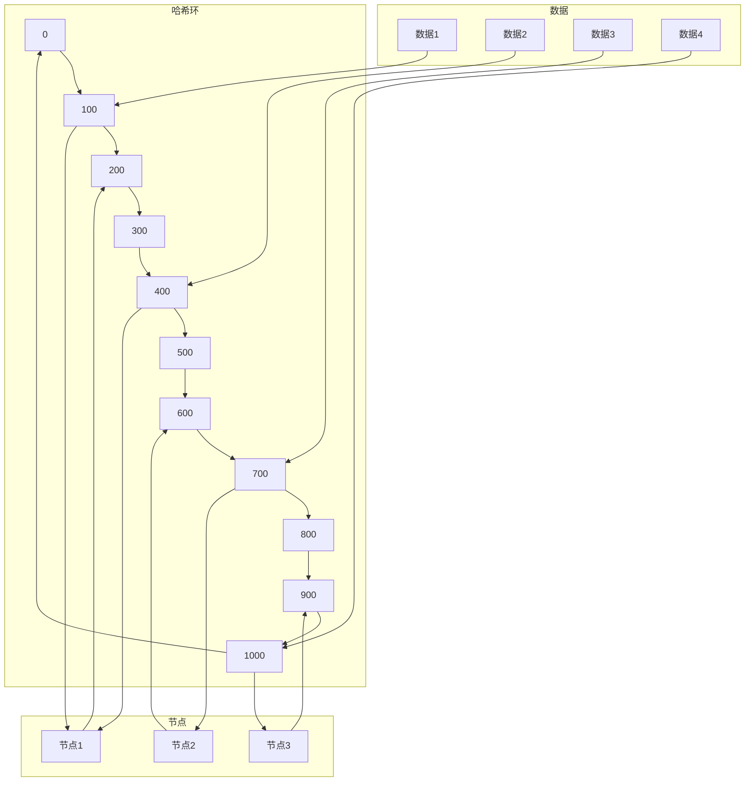

## 一、一致性哈希算法概述

### 1.1 什么是一致性哈希算法

**一致性哈希算法**是一种特殊的哈希算法，主要用于解决分布式系统中数据分布和负载均衡的问题。它能够在节点数量变化时，最小化数据迁移的数量，提高系统的稳定性和可用性。

### 1.2 一致性哈希算法的重要性

- **负载均衡**：将数据均匀分布到各个节点
- **节点扩容**：在添加新节点时，最小化数据迁移
- **节点故障**：在节点故障时，最小化数据重分配
- **高可用性**：提高系统的可用性和稳定性
- **性能优化**：减少数据迁移带来的性能开销

### 1.3 传统哈希算法的问题

传统的哈希算法（如取模运算）在节点数量变化时，几乎所有的数据都需要重新计算哈希值，导致大量的数据迁移。例如，当节点数量从N增加到N+1时，大约有N/(N+1)的数据需要迁移，这会给系统带来巨大的开销。

## 二、一致性哈希算法原理

### 2.1 基本原理



### 2.2 核心概念

- **哈希环**：一个虚拟的圆环，范围通常是0到2^32-1
- **节点**：将节点的IP或名称通过哈希函数映射到哈希环上
- **数据**：将数据的key通过同样的哈希函数映射到哈希环上
- **顺时针查找**：数据会被分配到哈希环上顺时针方向的第一个节点

### 2.3 一致性哈希的特点

- **单调性**：当节点数量变化时，数据的映射关系尽可能保持不变
- **分散性**：数据在节点上的分布尽可能均匀
- **负载均衡**：每个节点的负载尽可能均衡
- **容错性**：当节点故障时，只有少量数据需要重新分配
- **可扩展性**：当添加新节点时，只有少量数据需要迁移

## 三、一致性哈希算法实现

### 3.1 基本实现

**实现步骤**：
1. 构建哈希环
2. 将节点映射到哈希环上
3. 将数据映射到哈希环上
4. 查找数据对应的节点

**代码示例（Java实现）**：

```java
import java.util.SortedMap;
import java.util.TreeMap;

public class ConsistentHashing {
    // 哈希环，使用TreeMap实现
    private final SortedMap<Long, String> hashRing = new TreeMap<>();
    // 虚拟节点数量
    private final int virtualNodes;
    
    public ConsistentHashing(int virtualNodes) {
        this.virtualNodes = virtualNodes;
    }
    
    // 添加节点
    public void addNode(String node) {
        for (int i = 0; i < virtualNodes; i++) {
            // 为每个节点创建多个虚拟节点
            long hash = hash(node + "#" + i);
            hashRing.put(hash, node);
        }
    }
    
    // 移除节点
    public void removeNode(String node) {
        for (int i = 0; i < virtualNodes; i++) {
            long hash = hash(node + "#" + i);
            hashRing.remove(hash);
        }
    }
    
    // 查找数据对应的节点
    public String getNode(String key) {
        if (hashRing.isEmpty()) {
            return null;
        }
        
        long hash = hash(key);
        // 查找大于等于当前哈希值的第一个节点
        SortedMap<Long, String> tailMap = hashRing.tailMap(hash);
        
        if (tailMap.isEmpty()) {
            // 如果没有找到，使用哈希环的第一个节点
            return hashRing.get(hashRing.firstKey());
        } else {
            return tailMap.get(tailMap.firstKey());
        }
    }
    
    // 哈希函数
    private long hash(String key) {
        // 使用FNV1_32_HASH算法
        final int p = 16777619;
        int hash = (int) 2166136261L;
        for (int i = 0; i < key.length(); i++) {
            hash = (hash ^ key.charAt(i)) * p;
        }
        hash += hash << 13;
        hash ^= hash >> 7;
        hash += hash << 3;
        hash ^= hash >> 17;
        hash += hash << 5;
        
        // 确保返回正数
        return hash < 0 ? Math.abs(hash) : hash;
    }
}
```

### 3.2 带虚拟节点的一致性哈希

**实现原理**：
- 为每个物理节点创建多个虚拟节点
- 虚拟节点在哈希环上均匀分布
- 数据首先映射到虚拟节点，再映射到物理节点

**优点**：
- 提高数据分布的均匀性
- 减少节点负载不均衡的问题
- 增强系统的稳定性

**代码示例（Java实现）**：

```java
import java.util.ArrayList;
import java.util.List;
import java.util.SortedMap;
import java.util.TreeMap;

public class ConsistentHashingWithVirtualNodes {
    // 哈希环
    private final SortedMap<Long, String> hashRing = new TreeMap<>();
    // 虚拟节点数量
    private final int virtualNodesPerNode;
    // 物理节点列表
    private final List<String> physicalNodes = new ArrayList<>();
    
    public ConsistentHashingWithVirtualNodes(int virtualNodesPerNode) {
        this.virtualNodesPerNode = virtualNodesPerNode;
    }
    
    // 添加物理节点
    public void addNode(String physicalNode) {
        physicalNodes.add(physicalNode);
        // 为每个物理节点创建多个虚拟节点
        for (int i = 0; i < virtualNodesPerNode; i++) {
            String virtualNode = physicalNode + "#" + i;
            long hash = hash(virtualNode);
            hashRing.put(hash, physicalNode);
        }
    }
    
    // 移除物理节点
    public void removeNode(String physicalNode) {
        physicalNodes.remove(physicalNode);
        // 移除该物理节点对应的所有虚拟节点
        for (int i = 0; i < virtualNodesPerNode; i++) {
            String virtualNode = physicalNode + "#" + i;
            long hash = hash(virtualNode);
            hashRing.remove(hash);
        }
    }
    
    // 查找数据对应的物理节点
    public String getNode(String key) {
        if (hashRing.isEmpty()) {
            return null;
        }
        
        long hash = hash(key);
        SortedMap<Long, String> tailMap = hashRing.tailMap(hash);
        
        if (tailMap.isEmpty()) {
            return hashRing.get(hashRing.firstKey());
        } else {
            return tailMap.get(tailMap.firstKey());
        }
    }
    
    // 哈希函数
    private long hash(String key) {
        // 使用MurmurHash算法
        return MurmurHash.hash32(key.getBytes());
    }
    
    // 获取所有物理节点
    public List<String> getPhysicalNodes() {
        return new ArrayList<>(physicalNodes);
    }
}

// MurmurHash算法实现
class MurmurHash {
    public static int hash32(byte[] data) {
        int len = data.length;
        int seed = 0x9747b28c;
        final int m = 0x5bd1e995;
        final int r = 24;
        
        int h = seed ^ len;
        int i = 0;
        
        while (len >= 4) {
            int k = (data[i] & 0xff) | ((data[i + 1] & 0xff) << 8) |
                    ((data[i + 2] & 0xff) << 16) | ((data[i + 3] & 0xff) << 24);
            k *= m;
            k ^= k >>> r;
            k *= m;
            h *= m;
            h ^= k;
            
            i += 4;
            len -= 4;
        }
        
        switch (len) {
            case 3:
                h ^= (data[i + 2] & 0xff) << 16;
            case 2:
                h ^= (data[i + 1] & 0xff) << 8;
            case 1:
                h ^= data[i] & 0xff;
                h *= m;
        }
        
        h ^= h >>> 13;
        h *= m;
        h ^= h >>> 15;
        
        return h;
    }
}
```

### 3.3 一致性哈希的优化

**优化方向**：
- **哈希函数选择**：选择分布均匀的哈希函数，如MurmurHash、FNV等
- **虚拟节点数量**：根据节点数量和负载情况调整虚拟节点数量
- **节点权重**：支持节点权重，根据节点能力分配不同的负载
- **动态调整**：根据系统负载动态调整节点分布
- **健康检查**：定期检查节点健康状态，自动移除故障节点

**代码示例（带权重的一致性哈希）**：

```java
import java.util.ArrayList;
import java.util.List;
import java.util.SortedMap;
import java.util.TreeMap;

public class ConsistentHashingWithWeights {
    private final SortedMap<Long, String> hashRing = new TreeMap<>();
    private final List<Node> nodes = new ArrayList<>();
    private final int defaultVirtualNodes;
    
    public ConsistentHashingWithWeights(int defaultVirtualNodes) {
        this.defaultVirtualNodes = defaultVirtualNodes;
    }
    
    public void addNode(String id, int weight) {
        Node node = new Node(id, weight);
        nodes.add(node);
        
        // 根据权重计算虚拟节点数量
        int virtualNodeCount = defaultVirtualNodes * weight;
        for (int i = 0; i < virtualNodeCount; i++) {
            String virtualNode = id + "#" + i;
            long hash = hash(virtualNode);
            hashRing.put(hash, id);
        }
    }
    
    public void removeNode(String id) {
        Node nodeToRemove = null;
        for (Node node : nodes) {
            if (node.getId().equals(id)) {
                nodeToRemove = node;
                break;
            }
        }
        
        if (nodeToRemove != null) {
            nodes.remove(nodeToRemove);
            int virtualNodeCount = defaultVirtualNodes * nodeToRemove.getWeight();
            for (int i = 0; i < virtualNodeCount; i++) {
                String virtualNode = id + "#" + i;
                long hash = hash(virtualNode);
                hashRing.remove(hash);
            }
        }
    }
    
    public String getNode(String key) {
        if (hashRing.isEmpty()) {
            return null;
        }
        
        long hash = hash(key);
        SortedMap<Long, String> tailMap = hashRing.tailMap(hash);
        
        if (tailMap.isEmpty()) {
            return hashRing.get(hashRing.firstKey());
        } else {
            return tailMap.get(tailMap.firstKey());
        }
    }
    
    private long hash(String key) {
        return MurmurHash.hash32(key.getBytes());
    }
    
    private static class Node {
        private final String id;
        private final int weight;
        
        public Node(String id, int weight) {
            this.id = id;
            this.weight = weight;
        }
        
        public String getId() {
            return id;
        }
        
        public int getWeight() {
            return weight;
        }
    }
}
```

## 四、一致性哈希算法的应用

### 4.1 分布式缓存

**应用场景**：
- Redis集群的数据分布
- Memcached的一致性哈希实现
- 分布式缓存的负载均衡

**优势**：
- 减少缓存节点变更时的数据迁移
- 提高缓存的命中率
- 增强系统的可用性

**代码示例（Redis集群使用一致性哈希）**：

```java
public class RedisCluster {
    private final ConsistentHashing consistentHashing;
    private final Map<String, Jedis> jedisMap = new HashMap<>();
    
    public RedisCluster(List<String> nodes) {
        this.consistentHashing = new ConsistentHashing(100);
        for (String node : nodes) {
            consistentHashing.addNode(node);
            jedisMap.put(node, new Jedis(node));
        }
    }
    
    public void set(String key, String value) {
        String node = consistentHashing.getNode(key);
        Jedis jedis = jedisMap.get(node);
        jedis.set(key, value);
    }
    
    public String get(String key) {
        String node = consistentHashing.getNode(key);
        Jedis jedis = jedisMap.get(node);
        return jedis.get(key);
    }
    
    public void addNode(String node) {
        consistentHashing.addNode(node);
        jedisMap.put(node, new Jedis(node));
    }
    
    public void removeNode(String node) {
        consistentHashing.removeNode(node);
        Jedis jedis = jedisMap.remove(node);
        if (jedis != null) {
            jedis.close();
        }
    }
}
```

### 4.2 分布式数据库

**应用场景**：
- 分库分表的数据分布
- 分布式数据库的负载均衡
- 数据分片策略

**优势**：
- 均匀分布数据，避免热点数据
- 简化数据迁移和扩容
- 提高数据库的可用性和扩展性

### 4.3 负载均衡

**应用场景**：
- 服务集群的负载均衡
- 分布式系统的请求分发
- CDN节点的选择

**优势**：
- 均衡分配请求，避免单点过载
- 支持动态添加和移除节点
- 提高系统的可用性和可靠性

## 五、大厂落地案例

### 5.1 阿里巴巴

**方案**：基于一致性哈希的分布式缓存

**核心特点**：
- **自研哈希算法**：针对业务特点优化的哈希函数
- **动态扩缩容**：支持在线添加和移除节点
- **权重配置**：根据节点性能设置不同权重
- **监控告警**：实时监控节点状态和负载
- **自动故障转移**：当节点故障时自动调整数据分布

**应用场景**：
- 电商平台的商品缓存
- 支付系统的会话缓存
- 推荐系统的用户数据缓存
- 云计算服务的分布式缓存

### 5.2 腾讯

**方案**：基于一致性哈希的负载均衡

**核心特点**：
- **多层哈希**：使用多层哈希提高数据分布的均匀性
- **智能调度**：基于实时负载的动态调度
- **健康检查**：定期检查节点健康状态
- **容灾备份**：支持节点故障的自动切换
- **性能优化**：针对高并发场景的优化

**应用场景**：
- 游戏业务的服务器负载均衡
- 社交平台的请求分发
- 视频服务的CDN节点选择
- 金融业务的交易处理

### 5.3 字节跳动

**方案**：基于一致性哈希的分布式存储

**核心特点**：
- **海量数据**：支持PB级数据的分布式存储
- **高可用**：多副本设计，确保数据安全
- **弹性伸缩**：支持在线扩缩容
- **智能感知**：自动感知节点性能和网络状况
- **自适应调优**：根据负载自动调整哈希策略

**应用场景**：
- 内容平台的用户数据存储
- 推荐系统的模型参数存储
- 广告系统的素材存储
- 短视频服务的媒体存储

## 六、最佳实践

### 6.1 实施建议

- **选择合适的哈希函数**：选择分布均匀、计算速度快的哈希函数
- **合理设置虚拟节点数量**：根据节点数量和负载情况调整虚拟节点数量
- **考虑节点权重**：根据节点性能设置不同的权重
- **实现健康检查**：定期检查节点健康状态，自动移除故障节点
- **监控和告警**：建立完善的监控和告警机制

### 6.2 性能优化

- **缓存哈希环**：缓存哈希环的计算结果，减少重复计算
- **批量操作**：支持批量数据的哈希计算和分布
- **异步迁移**：数据迁移过程采用异步方式，减少对系统的影响
- **预计算**：预计算节点的哈希值，提高查找速度
- **并行处理**：使用并行处理提高哈希计算和数据分布的效率

### 6.3 安全性考虑

- **哈希碰撞**：处理哈希碰撞的情况，确保数据分布的正确性
- **节点篡改**：防止节点信息被篡改，确保系统安全
- **数据一致性**：确保数据在节点变更时的一致性
- **访问控制**：限制对哈希环的修改权限
- **审计日志**：记录节点变更和数据迁移的操作日志

### 6.4 常见问题及解决方案

| 问题 | 解决方案 |
|------|----------|
| 数据分布不均 | 增加虚拟节点数量，选择更好的哈希函数 |
| 节点负载不均 | 实现节点权重，根据性能调整负载 |
| 哈希碰撞 | 处理哈希碰撞，确保数据正确分布 |
| 扩容时数据迁移过多 | 合理设置虚拟节点数量，减少数据迁移 |
| 节点故障影响 | 实现健康检查和自动故障转移 |

## 七、总结

一致性哈希算法是解决分布式系统中数据分布和负载均衡问题的重要技术。通过构建哈希环和使用虚拟节点，它能够在节点数量变化时最小化数据迁移，提高系统的稳定性和可用性。

**核心要点**：
- 一致性哈希通过哈希环和顺时针查找实现数据分布
- 虚拟节点可以提高数据分布的均匀性
- 合理设置虚拟节点数量和选择合适的哈希函数是关键
- 一致性哈希广泛应用于分布式缓存、数据库和负载均衡等场景
- 实际应用中需要考虑节点权重、健康检查和监控等因素

通过合理应用一致性哈希算法，企业可以构建更加稳定、高效的分布式系统，提高系统的可用性和扩展性。在实际应用中，需要根据业务特点和技术栈选择最合适的实现方式，并持续优化和改进。