## 一、分布式事务概念

### 什么是分布式事务？

**分布式事务**是指事务的参与者、支持事务的服务器、资源服务器以及事务管理器分别位于不同的分布式系统的不同节点之上。

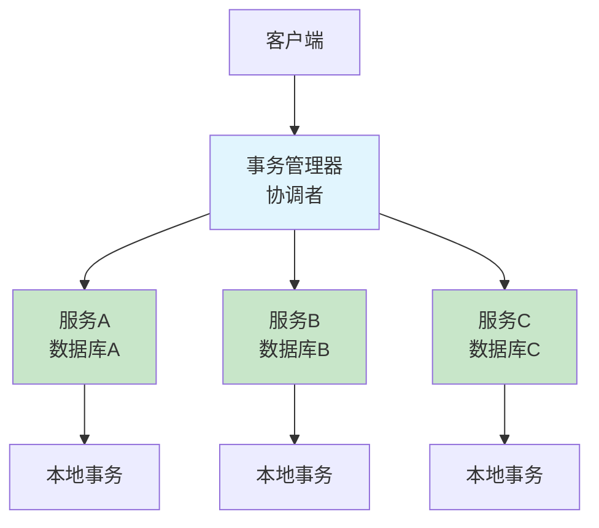

### 为什么需要分布式事务？

**单体应用时代：**
- 单一数据库，使用本地事务（ACID）
- 通过数据库的事务机制保证数据一致性

**微服务时代：**
- 业务拆分为多个服务
- 每个服务有自己的数据库
- 跨服务的业务操作需要保证数据一致性
- 本地事务无法解决跨数据库的一致性问题

### 分布式事务的挑战

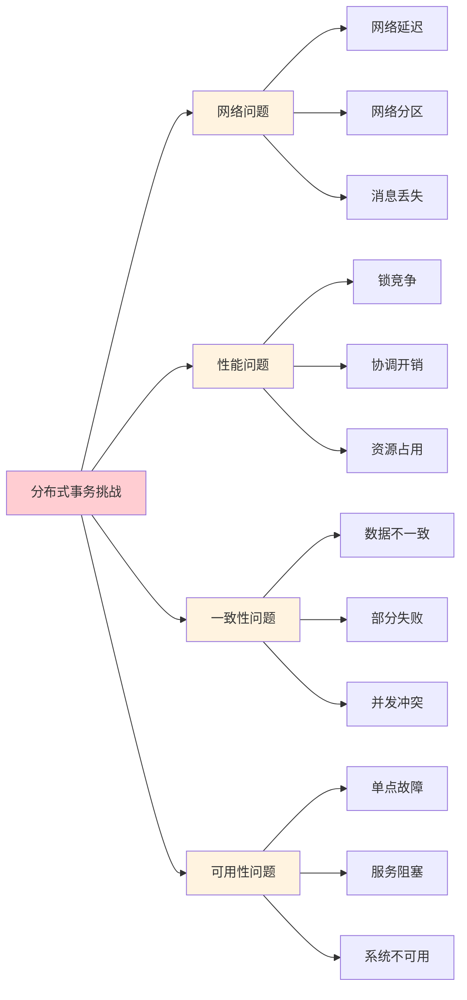

## 二、理论基础

### CAP 定理

> **一致性（Consistency）、可用性（Availability）、分区容忍性（Partition Tolerance）三个特性最多只能同时满足其中两个**

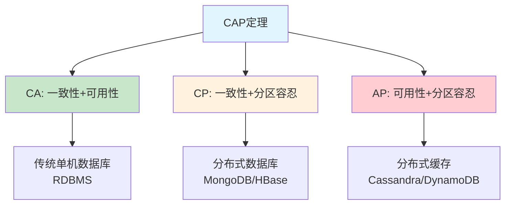

**详细说明：**

| 组合 | 说明 | 典型系统 | 应用场景 |
|------|------|---------|---------|
| **CA** | 放弃分区容忍性，单机系统 | MySQL、PostgreSQL | 传统单机应用 |
| **CP** | 放弃可用性，保证一致性 | HBase、MongoDB | 金融系统、配置中心 |
| **AP** | 放弃一致性，保证可用性 | Cassandra、DynamoDB | 社交网络、推荐系统 |

**CAP 权衡：**

1. **多节点为了数据一致性，数据同步阻塞服务，可用性就会变差**
2. **多节点为了高可用，但数据同步不及时，一致性变差**
3. **多节点因为部分节点连接中断，而无法正确提供服务，此为容忍性**

### BASE 理论

> **Basically Available（基本可用）、Soft State（软状态）、Eventually Consistent（最终一致性）**

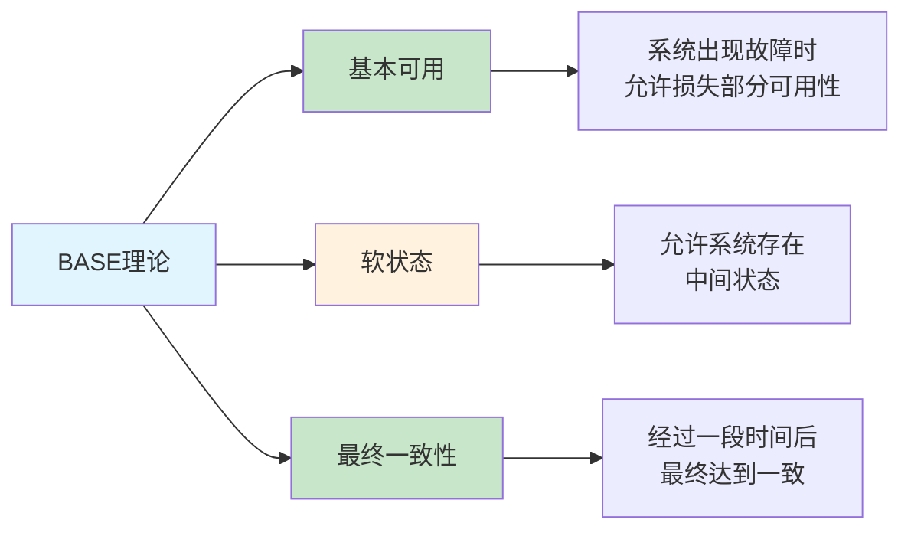

**BASE vs ACID：**

| 特性 | ACID | BASE |
|------|------|------|
| **一致性** | 强一致性 | 最终一致性 |
| **可用性** | 较低 | 较高 |
| **性能** | 较低 | 较高 |
| **复杂度** | 简单 | 复杂 |
| **适用场景** | 传统数据库 | 分布式系统 |

## 三、分布式事务解决方案

### 方案概览

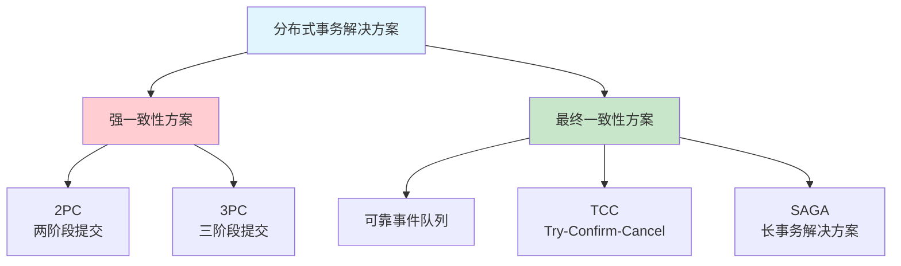

### 1. 两阶段提交（2PC）

**核心思想：** 通过协调者统一调度所有参与者的行为

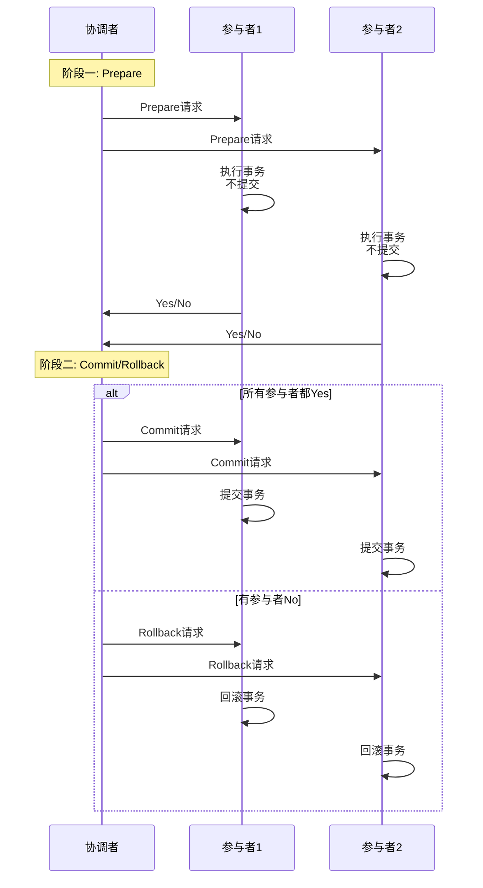

**优点：**
- 强一致性保证
- 实现相对简单
- 业界成熟方案

**缺点：**
- 同步阻塞问题
- 单点故障问题
- 数据不一致风险（协调者故障时）

**适用场景：**
- 对一致性要求极高的场景
- 数据库层面的分布式事务

### 2. 三阶段提交（3PC）

**核心思想：** 在2PC基础上增加CanCommit阶段，引入超时机制

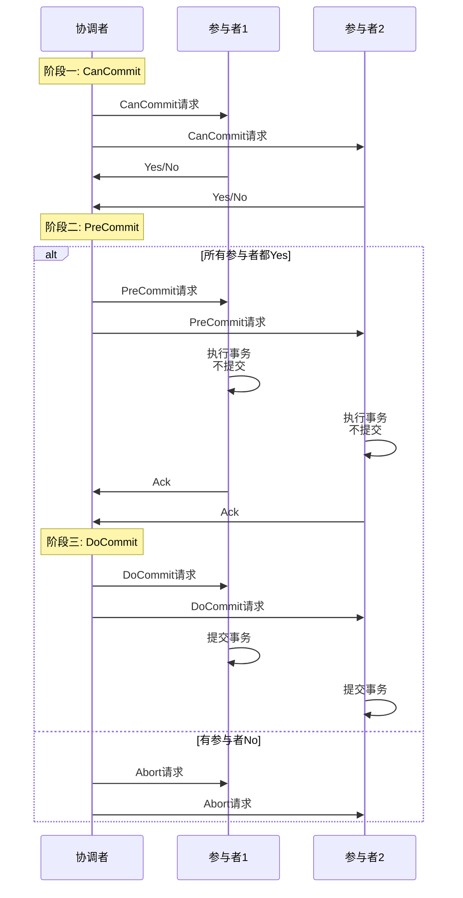

**优点：**
- 减少阻塞时间
- 引入超时机制
- 参与者可自主决策

**缺点：**
- 可能出现数据不一致
- 实现复杂
- 网络开销大

**适用场景：**
- 对可用性要求较高的场景
- 需要减少阻塞时间的场景

### 3. 可靠事件队列

**核心思想：** 通过消息队列实现最终一致性

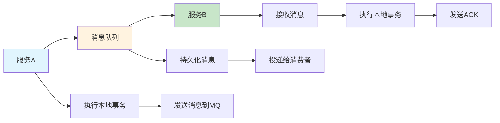

**实现方式：**

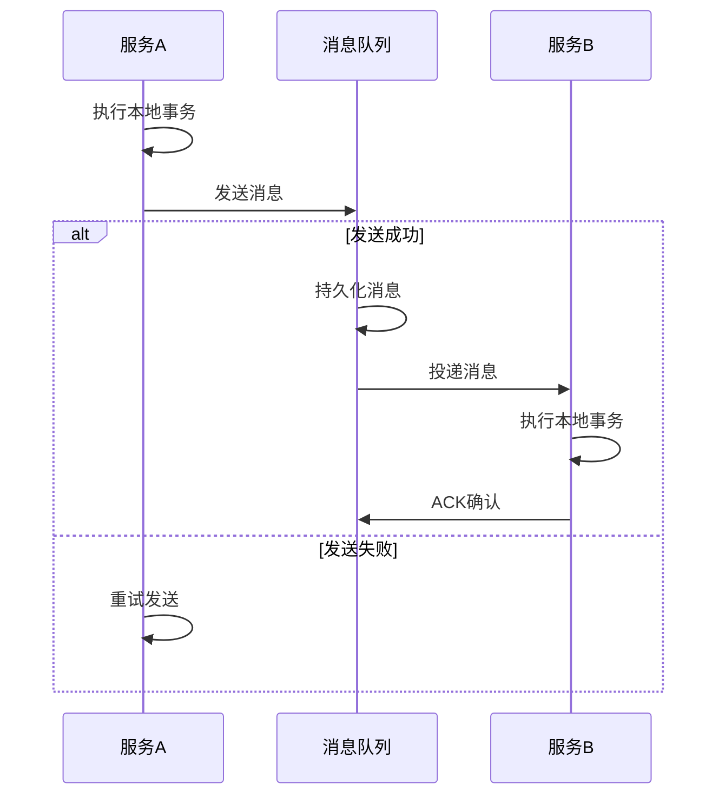

**优点：**
- 实现简单
- 解耦服务
- 异步执行，性能好
- 最终一致性保证

**缺点：**
- 只有最终一致性
- 消息重复消费问题
- 需要处理幂等性

**适用场景：**
- 对实时性要求不高的场景
- 允许最终一致性的业务
- 高并发场景

**最大努力交付（Best-Effort Delivery）：**

```
可靠事件队列只要第一步业务完成了，后续就没有失败回滚的概念，只许成功，不许失败
靠着持续重试来保证可靠性的解决方案
```

### 4. TCC 事务（Try-Confirm-Cancel）

**核心思想：** 将业务逻辑拆分为三个阶段

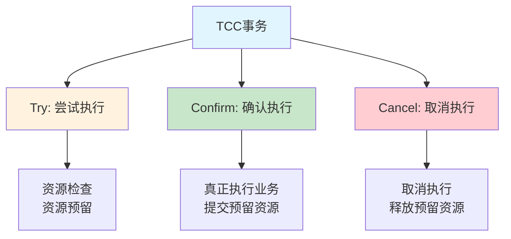

**详细流程：**

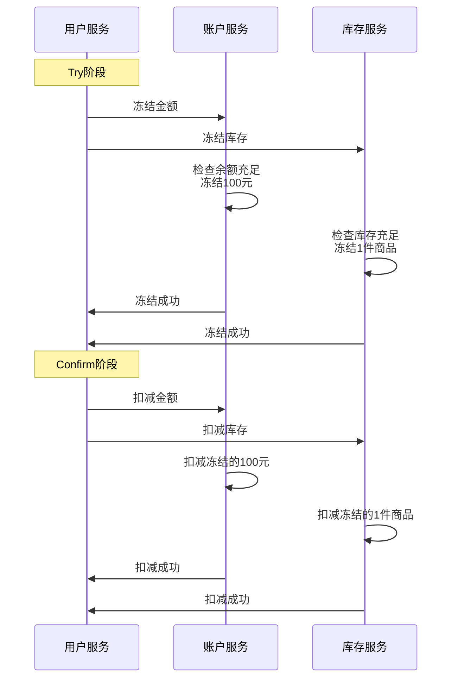

**示例代码：**

```java
public interface AccountService {
    
    // Try: 冻结金额
    boolean freezeAmount(String userId, BigDecimal amount);
    
    // Confirm: 扣减金额
    boolean deductAmount(String userId, BigDecimal amount);
    
    // Cancel: 解冻金额
    boolean unfreezeAmount(String userId, BigDecimal amount);
}

public class AccountServiceImpl implements AccountService {
    
    @Override
    public boolean freezeAmount(String userId, BigDecimal amount) {
        // 检查余额是否充足
        Account account = accountDao.findByUserId(userId);
        if (account.getBalance().compareTo(amount) < 0) {
            return false;
        }
        
        // 冻结金额
        account.setFrozenAmount(account.getFrozenAmount().add(amount));
        account.setBalance(account.getBalance().subtract(amount));
        accountDao.update(account);
        
        return true;
    }
    
    @Override
    public boolean deductAmount(String userId, BigDecimal amount) {
        Account account = accountDao.findByUserId(userId);
        // 扣减冻结金额
        account.setFrozenAmount(account.getFrozenAmount().subtract(amount));
        accountDao.update(account);
        return true;
    }
    
    @Override
    public boolean unfreezeAmount(String userId, BigDecimal amount) {
        Account account = accountDao.findByUserId(userId);
        // 解冻金额
        account.setFrozenAmount(account.getFrozenAmount().subtract(amount));
        account.setBalance(account.getBalance().add(amount));
        accountDao.update(account);
        return true;
    }
}
```

**优点：**
- 性能较好（资源锁定时间短）
- 最终一致性保证
- 灵活性高

**缺点：**
- 业务侵入性强
- 开发成本高
- 需要实现三个接口
- 需要处理幂等性

**适用场景：**
- 对性能要求较高的场景
- 业务逻辑复杂的场景
- 需要精细化控制资源的场景

**关键点：**
- 用户花钱了冻结金额，用户买书了就冻结书籍状态，讲究资源锁定
- 业务侵入性很强

### 5. SAGA 事务

**核心思想：** 将长事务拆分为多个本地事务，每个本地事务都有对应的补偿事务

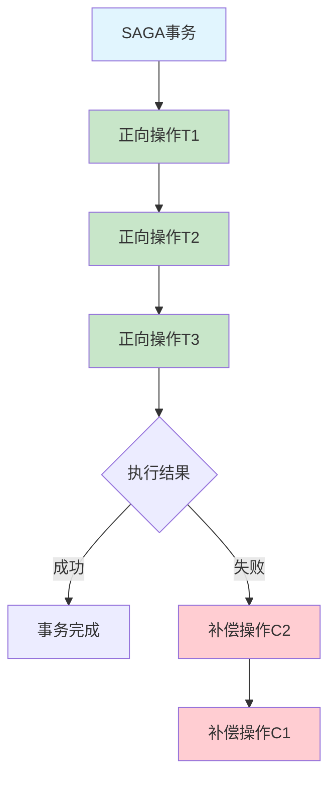

**两种恢复模式：**

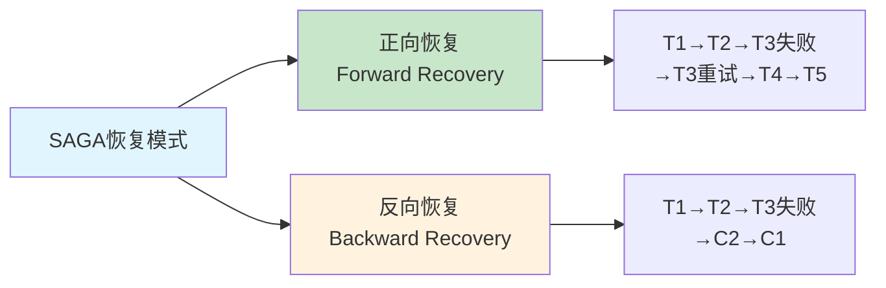

**详细流程：**

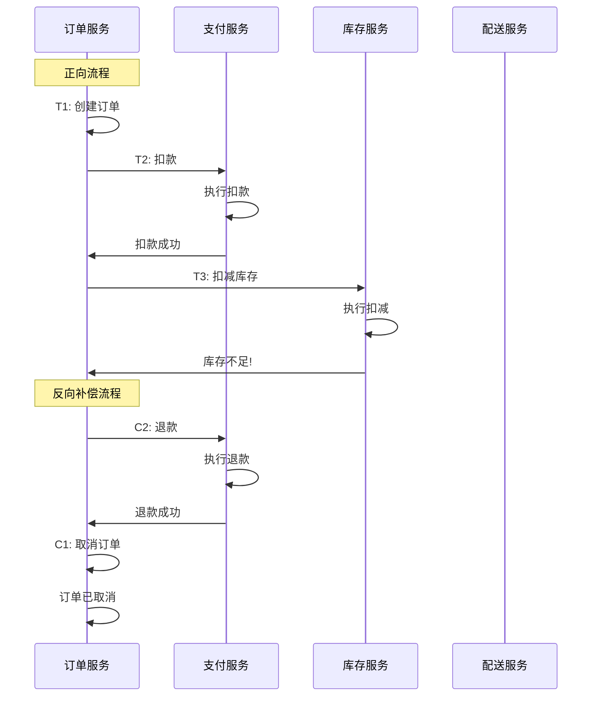

**设计约束：**

1. **子事务必须原子行为**
2. **Ti和Ci都具备幂等性**
3. **Ti与Ci满足交换律**
4. **Ci必须能成功提交**

**优点：**
- 适合长事务
- 最终一致性保证
- 性能较好

**缺点：**
- 没有隔离性
- 补偿逻辑复杂
- 可能出现脏读

**适用场景：**
- 长事务场景
- 跨多个服务的业务流程
- 对性能要求较高的场景

**两种恢复模式：**

1. **正向恢复（Forward Recovery）**
   - Ti事务提交失败，则一直对Ti进行重试，直至成功为止
   - 执行模式为：T1，T2，…，Ti（失败），Ti（重试）…，Ti+1，…，Tn

2. **反向恢复（Backward Recovery）**
   - Ti事务提交失败，则一直执行Ci对Ti进行补偿，直至成功为止
   - 执行模式：T1，T2，…，Ti（失败），Ci（补偿），…，C2，C1

## 四、方案对比

### 详细对比表

| 对比维度 | 2PC | 3PC | 可靠事件队列 | TCC | SAGA |
|---------|-----|-----|------------|-----|------|
| **一致性** | 强一致性 | 强一致性 | 最终一致性 | 最终一致性 | 最终一致性 |
| **性能** | 低 | 中 | 高 | 高 | 高 |
| **复杂度** | 中 | 高 | 低 | 高 | 高 |
| **业务侵入** | 无 | 无 | 低 | 高 | 中 |
| **隔离性** | 有 | 有 | 无 | 有 | 无 |
| **可用性** | 低 | 中 | 高 | 高 | 高 |
| **适用场景** | 数据库分布式事务 | 高可用场景 | 异步业务 | 高性能场景 | 长事务 |

### 性能对比

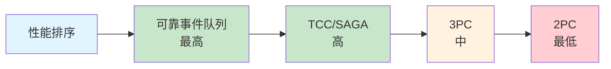

### 一致性对比


## 五、选型建议

### 场景选择流程

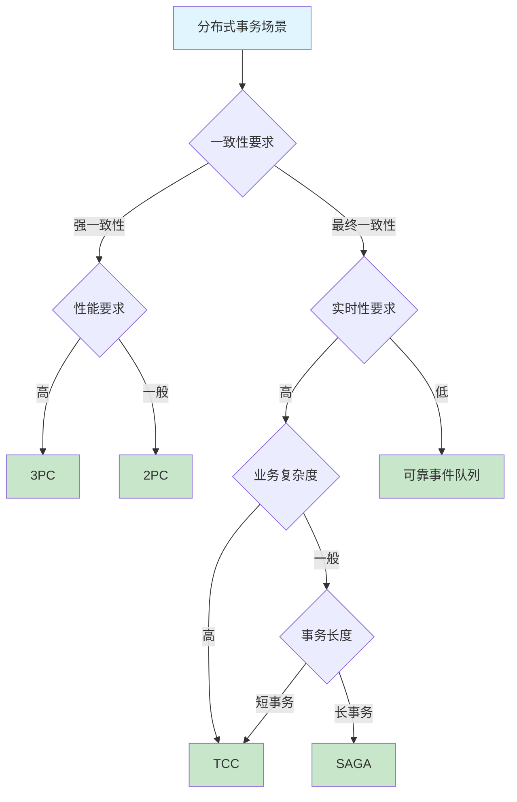

### 典型场景推荐

| 业务场景 | 推荐方案 | 理由 |
|---------|---------|------|
| **金融转账** | 2PC/TCC | 强一致性要求，资金安全第一 |
| **电商下单** | TCC/SAGA | 高并发，性能要求高 |
| **订单支付** | 可靠事件队列 | 异步处理，允许延迟 |
| **库存扣减** | TCC | 需要资源预留，防止超卖 |
| **跨行转账** | SAGA | 长事务，涉及多个系统 |
| **配置更新** | 3PC | 需要高可用性 |

## 六、最佳实践

### 1. 幂等性设计

所有分布式事务方案都需要考虑幂等性：

```java
public class IdempotentService {
    
    private Map<String, Boolean> processedRequests = new ConcurrentHashMap<>();
    
    public boolean process(String requestId, Runnable action) {
        // 检查是否已处理
        if (processedRequests.containsKey(requestId)) {
            return true;
        }
        
        // 执行业务逻辑
        action.run();
        
        // 标记为已处理
        processedRequests.put(requestId, true);
        return true;
    }
}
```

### 2. 超时设置

合理设置超时时间，避免长时间阻塞：

```java
public class TimeoutConfig {
    
    // 2PC超时配置
    public static final long TWO_PC_PREPARE_TIMEOUT = 5000;  // 5秒
    public static final long TWO_PC_COMMIT_TIMEOUT = 10000;  // 10秒
    
    // TCC超时配置
    public static final long TCC_TRY_TIMEOUT = 3000;         // 3秒
    public static final long TCC_CONFIRM_TIMEOUT = 5000;     // 5秒
    public static final long TCC_CANCEL_TIMEOUT = 5000;      // 5秒
    
    // 消息队列超时配置
    public static final long MQ_SEND_TIMEOUT = 2000;         // 2秒
    public static final long MQ_CONSUME_TIMEOUT = 30000;     // 30秒
}
```

### 3. 监控与告警

建立完善的监控体系：

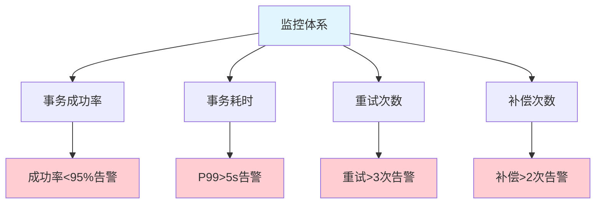

### 4. 日志记录

详细记录事务执行过程：

```java
public class TransactionLogger {
    
    public void logTransaction(String txId, String phase, String status) {
        TransactionLog log = new TransactionLog();
        log.setTransactionId(txId);
        log.setPhase(phase);
        log.setStatus(status);
        log.setTimestamp(System.currentTimeMillis());
        
        // 持久化到数据库
        transactionLogDao.save(log);
    }
}
```

## 七、总结

### 核心要点

1. **分布式事务是微服务架构的必然挑战**
2. **没有完美的解决方案，需要根据业务场景选择**
3. **强一致性方案性能低，最终一致性方案性能高**
4. **幂等性、超时、监控是所有方案的共同要求**

### 未来趋势

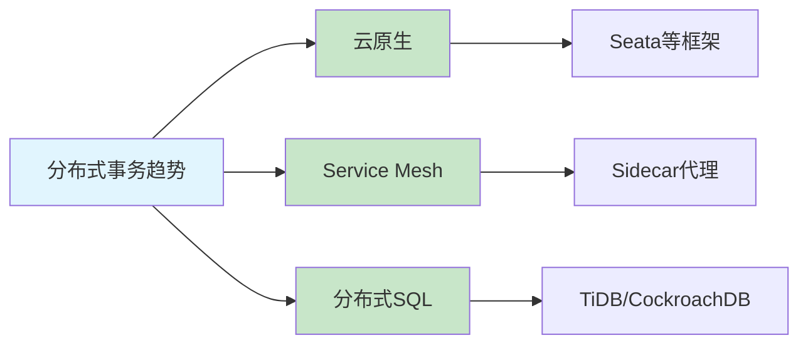

## 参考资料

- [凤凰架构-分布式事务](http://icyfenix.cn/architect-perspective/general-architecture/transaction/distributed.html)
- [Seata官方文档](https://seata.io/zh-cn/)
- [分布式事务原理与实践](https://mp.weixin.qq.com/s/4sY5a6x5QJ3J3J3J3J3J3J)
