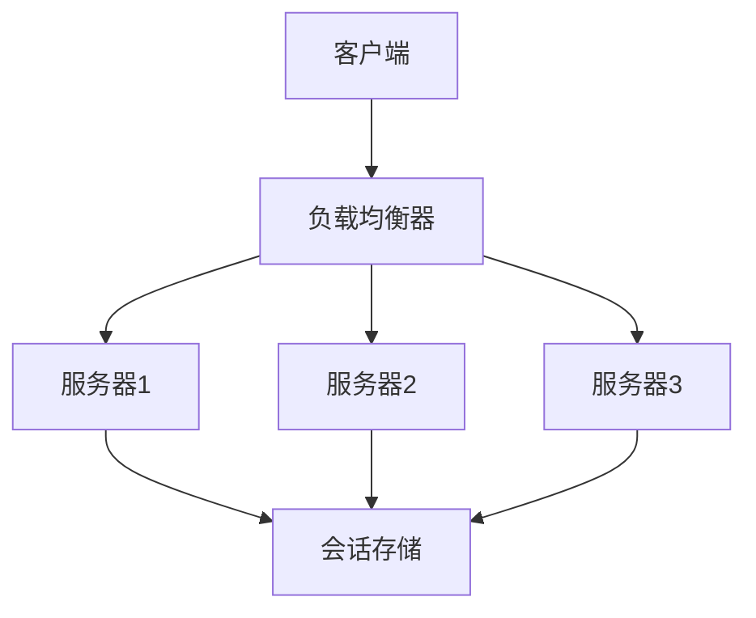

## 一、分布式会话概述

### 1.1 什么是分布式会话

**分布式会话**是指在分布式系统中，将用户会话信息存储在多个节点上，确保用户在访问不同服务时能够保持一致的会话状态。在传统的单体应用中，会话通常存储在服务器内存中，但在分布式系统中，由于服务部署在多个节点上，需要特殊的机制来管理会话。

### 1.2 分布式会话的重要性

- **用户体验**：确保用户在不同服务间切换时保持登录状态
- **系统可靠性**：避免单点故障导致会话丢失
- **水平扩展**：支持服务的水平扩展，不影响会话管理
- **安全性**：提供安全的会话管理机制

### 1.3 常见的分布式会话方案

| 方案 | 特点 | 适用场景 |
|------|------|----------|
| 会话复制 | 多节点复制会话数据 | 小规模集群 |
| 会话粘性 | 同一用户请求始终路由到同一节点 | 简单负载均衡场景 |
| 集中式存储 | 将会话存储在独立的存储系统 | 大规模分布式系统 |

## 二、分布式会话原理

### 2.1 会话管理原理



### 2.2 会话存储机制

#### 2.2.1 基于内存的存储

- **优点**：访问速度快
- **缺点**：内存有限，易丢失数据

#### 2.2.2 基于持久化存储

- **优点**：数据持久化，可靠性高
- **缺点**：访问速度相对较慢

### 2.3 会话ID管理

- **会话ID生成**：使用UUID等算法生成唯一标识
- **会话ID传递**：通过Cookie、URL重写等方式传递
- **会话ID验证**：确保会话ID的合法性和安全性

## 三、分布式会话方案

### 3.1 基于Redis的分布式会话方案

**架构组成**：
- **会话存储**：Redis集群
- **会话管理**：应用层会话管理逻辑
- **会话同步**：通过Redis的发布订阅机制

**实现步骤**：
1. 配置Redis集群作为会话存储
2. 实现会话管理逻辑，包括会话创建、读取、更新和删除
3. 配置会话过期策略
4. 实现会话同步机制

**优点**：
- 高性能：Redis的读写速度快
- 可靠性：Redis支持持久化
- 可扩展性：Redis集群支持水平扩展
- 功能丰富：支持多种数据结构和过期策略

**缺点**：
- 依赖外部存储：增加系统复杂性
- 网络开销：需要网络通信
- 单点故障：Redis集群需要高可用配置

**代码示例**：

```java
// Redis会话管理器
public class RedisSessionManager implements SessionManager {
    private RedisTemplate<String, Object> redisTemplate;
    private String sessionPrefix = "session:";
    private int sessionTimeout = 3600; // 1小时
    
    @Override
    public Session createSession() {
        String sessionId = UUID.randomUUID().toString();
        Session session = new RedisSession(sessionId, redisTemplate, sessionPrefix, sessionTimeout);
        return session;
    }
    
    @Override
    public Session getSession(String sessionId) {
        if (sessionId == null) {
            return null;
        }
        String key = sessionPrefix + sessionId;
        if (!redisTemplate.hasKey(key)) {
            return null;
        }
        return new RedisSession(sessionId, redisTemplate, sessionPrefix, sessionTimeout);
    }
    
    @Override
    public void invalidateSession(String sessionId) {
        if (sessionId != null) {
            String key = sessionPrefix + sessionId;
            redisTemplate.delete(key);
        }
    }
}
```

### 3.2 基于Token的无状态会话方案

**架构组成**：
- **Token生成**：服务端生成JWT等令牌
- **Token验证**：服务端验证令牌的合法性
- **用户信息**：令牌中包含用户信息

**实现步骤**：
1. 实现Token生成逻辑，使用JWT等标准
2. 实现Token验证逻辑
3. 配置Token过期策略
4. 实现Token刷新机制

**优点**：
- 无状态：服务端不需要存储会话状态
- 可扩展性：支持水平扩展
- 安全性：使用加密算法确保Token安全
- 跨域支持：便于跨域应用

**缺点**：
- Token管理复杂：需要处理过期和刷新
- 信息有限：Token大小有限制
- 撤销困难：已发布的Token难以立即撤销

**代码示例**：

```java
// JWT工具类
public class JwtUtil {
    private static final String SECRET_KEY = "your-secret-key";
    private static final long EXPIRATION_TIME = 3600000; // 1小时
    
    public static String generateToken(User user) {
        Map<String, Object> claims = new HashMap<>();
        claims.put("userId", user.getId());
        claims.put("username", user.getUsername());
        claims.put("roles", user.getRoles());
        
        Date now = new Date();
        Date expiration = new Date(now.getTime() + EXPIRATION_TIME);
        
        return Jwts.builder()
                .setClaims(claims)
                .setIssuedAt(now)
                .setExpiration(expiration)
                .signWith(SignatureAlgorithm.HS256, SECRET_KEY)
                .compact();
    }
    
    public static Claims validateToken(String token) {
        try {
            return Jwts.parser()
                    .setSigningKey(SECRET_KEY)
                    .parseClaimsJws(token)
                    .getBody();
        } catch (Exception e) {
            return null;
        }
    }
}
```

### 3.3 基于Spring Session的分布式会话方案

**架构组成**：
- **Spring Session**：Spring框架的会话管理模块
- **会话存储**：Redis、MongoDB等
- **集成方式**：通过过滤器拦截请求

**实现步骤**：
1. 添加Spring Session依赖
2. 配置会话存储（如Redis）
3. 配置会话属性（如超时时间）
4. 启动应用，Spring Session自动处理会话管理

**优点**：
- 简单易用：与Spring框架集成良好
- 功能丰富：支持多种存储后端
- 透明集成：对应用代码侵入性小
- 支持集群：天然支持分布式环境

**缺点**：
- 依赖Spring：仅适用于Spring应用
- 配置复杂：需要配置存储后端
- 性能开销：增加了额外的处理逻辑

**配置示例**：

```yaml
spring:
  session:
    store-type: redis
    redis:
      namespace: spring:session
      flush-mode: on_save
      save-mode: on_set_attribute
  redis:
    host: localhost
    port: 6379
    password:
    database: 0
```

## 四、大厂落地案例

### 4.1 阿里巴巴

**方案**：基于自研的TCC（Taobao Cluster Cache）实现分布式会话管理

**核心特点**：
- **高性能**：基于内存存储，访问速度快
- **高可用**：多节点复制，避免单点故障
- **可扩展**：支持水平扩展
- **安全可靠**：提供会话加密和验证机制

**应用场景**：
- 淘宝、天猫等电商平台的用户会话管理
- 支付宝等金融产品的会话管理
- 阿里巴巴内部系统的统一身份认证

### 4.2 腾讯

**方案**：基于Redis实现分布式会话管理

**核心特点**：
- **多活架构**：支持多地域部署
- **弹性伸缩**：根据流量自动调整资源
- **安全防护**：内置防攻击机制
- **监控告警**：完善的监控体系

**应用场景**：
- QQ、微信等社交产品的会话管理
- 腾讯云服务的统一身份认证
- 游戏业务的用户会话管理

### 4.3 字节跳动

**方案**：基于Token的无状态会话管理

**核心特点**：
- **无状态设计**：服务端不存储会话状态
- **高并发支持**：适合高并发场景
- **跨平台**：支持多端应用
- **易于扩展**：支持服务的水平扩展

**应用场景**：
- 抖音、今日头条等内容产品的用户会话管理
- 字节跳动内部系统的统一身份认证
- 广告平台的用户会话管理

## 五、最佳实践

### 5.1 实施建议

- **根据业务选择方案**：根据系统规模和性能要求选择合适的方案
- **合理设置过期时间**：根据业务特点设置会话过期时间
- **实现会话监控**：监控会话数量、过期率等指标
- **定期清理过期会话**：避免存储空间浪费
- **实现会话备份**：确保会话数据安全

### 5.2 性能优化

- **使用连接池**：减少Redis等存储的连接开销
- **批量操作**：减少网络往返次数
- **缓存热点数据**：提高访问速度
- **使用本地缓存**：减少远程存储访问
- **优化序列化**：选择高效的序列化方式

### 5.3 安全性考虑

- **会话加密**：对会话数据进行加密存储
- **防会话劫持**：实现会话验证机制
- **防CSRF攻击**：使用CSRF令牌
- **定期会话刷新**：定期更新会话ID
- **限制会话大小**：避免会话过大影响性能

### 5.4 常见问题及解决方案

| 问题 | 解决方案 |
|------|----------|
| 会话丢失 | 实现会话备份和恢复机制 |
| 性能瓶颈 | 使用本地缓存和连接池优化 |
| 安全性问题 | 实现会话加密和验证机制 |
| 跨域问题 | 使用CORS和Token方案 |
| 会话同步延迟 | 使用发布订阅机制实时同步 |

## 六、总结

分布式会话管理是分布式系统中的重要组成部分，直接影响用户体验和系统可靠性。选择合适的分布式会话方案需要考虑系统规模、性能要求、安全性等因素。随着微服务架构的普及，基于Token的无状态会话方案越来越受欢迎，它不仅简化了会话管理，还提高了系统的可扩展性。

**核心要点**：
- 选择适合业务场景的会话管理方案
- 合理配置会话存储和过期策略
- 确保会话数据的安全性和可靠性
- 优化会话管理的性能
- 建立完善的监控和告警机制

通过合理的分布式会话管理方案，企业可以为用户提供更优质的服务体验，同时提高系统的可靠性和可扩展性。在实际应用中，需要根据业务特点和技术栈选择最合适的方案，并持续优化和改进。