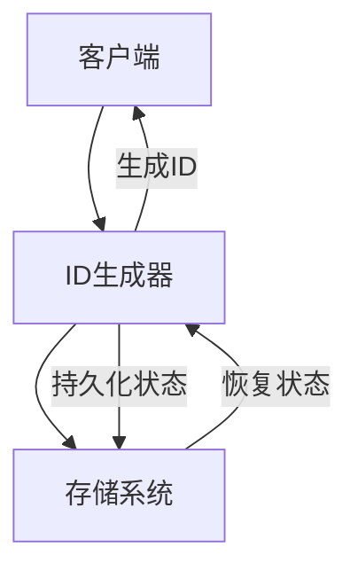

## 一、分布式唯一ID概述

### 1.1 什么是分布式唯一ID

**分布式唯一ID**是指在分布式系统中生成的全局唯一标识符，用于标识分布式环境中的各种资源，如用户、订单、商品等。在分布式系统中，由于存在多个节点同时生成ID的情况，需要特殊的机制来确保ID的全局唯一性。

### 1.2 分布式唯一ID的重要性

- **全局唯一性**：确保在整个分布式系统中ID不重复
- **有序性**：便于排序和索引
- **可扩展性**：支持系统的水平扩展
- **信息丰富**：可以包含时间戳、机器标识等信息
- **高性能**：生成ID的速度快，满足高并发需求

### 1.3 分布式唯一ID的基本要求

- **唯一性**：全局唯一，不重复
- **递增性**：趋势递增，便于排序
- **信息性**：包含必要的业务信息
- **高性能**：生成速度快，支持高并发
- **高可用**：服务可靠，不影响业务

## 二、分布式唯一ID原理

### 2.1 基本原理



### 2.2 生成策略

#### 2.2.1 基于时间的生成策略

- **原理**：利用时间戳作为ID的一部分
- **特点**：有序性好，包含时间信息
- **示例**：UUID v1、Snowflake算法

#### 2.2.2 基于随机的生成策略

- **原理**：使用随机数生成ID
- **特点**：实现简单，无冲突风险低
- **示例**：UUID v4

#### 2.2.3 基于序列号的生成策略

- **原理**：使用递增的序列号生成ID
- **特点**：有序性好，可预测
- **示例**：数据库自增ID、Redis自增

## 三、分布式唯一ID方案

### 3.1 基于Snowflake算法的方案

**实现原理**：
- 64位ID，包含时间戳、机器ID、序列号
- 时间戳：41位，精确到毫秒
- 机器ID：10位，支持1024个节点
- 序列号：12位，每毫秒最多生成4096个ID

**实现步骤**：
1. 获取当前时间戳
2. 生成机器ID（可以通过配置或自动分配）
3. 生成序列号（同一毫秒内递增）
4. 组合各部分生成最终ID

**优点**：
- 高性能：本地生成，无网络开销
- 有序性：按时间递增
- 信息丰富：包含时间和机器信息
- 可扩展性：支持水平扩展

**缺点**：
- 时钟依赖：依赖系统时钟的准确性
- 机器ID管理：需要确保机器ID唯一
- 时钟回拨：需要处理时钟回拨问题

**代码示例**：

```java
public class SnowflakeIdGenerator {
    private static final long START_TIMESTAMP = 1609459200000L; // 2021-01-01 00:00:00
    private static final long MACHINE_BIT = 10L;
    private static final long SEQUENCE_BIT = 12L;
    
    private static final long MAX_MACHINE_NUM = ~(-1L << MACHINE_BIT);
    private static final long MAX_SEQUENCE = ~(-1L << SEQUENCE_BIT);
    
    private static final long MACHINE_LEFT = SEQUENCE_BIT;
    private static final long TIMESTAMP_LEFT = MACHINE_BIT + SEQUENCE_BIT;
    
    private long machineId;
    private long sequence = 0L;
    private long lastTimestamp = -1L;
    
    public SnowflakeIdGenerator(long machineId) {
        if (machineId > MAX_MACHINE_NUM || machineId < 0) {
            throw new IllegalArgumentException("Machine ID out of range");
        }
        this.machineId = machineId;
    }
    
    public synchronized long nextId() {
        long currentTimestamp = System.currentTimeMillis();
        if (currentTimestamp < lastTimestamp) {
            throw new RuntimeException("Clock moved backwards");
        }
        
        if (currentTimestamp == lastTimestamp) {
            sequence = (sequence + 1) & MAX_SEQUENCE;
            if (sequence == 0) {
                currentTimestamp = getNextTimestamp(lastTimestamp);
            }
        } else {
            sequence = 0L;
        }
        
        lastTimestamp = currentTimestamp;
        return ((currentTimestamp - START_TIMESTAMP) << TIMESTAMP_LEFT) | 
               (machineId << MACHINE_LEFT) | 
               sequence;
    }
    
    private long getNextTimestamp(long lastTimestamp) {
        long timestamp = System.currentTimeMillis();
        while (timestamp <= lastTimestamp) {
            timestamp = System.currentTimeMillis();
        }
        return timestamp;
    }
}
```

### 3.2 基于数据库的方案

**实现原理**：
- 使用数据库的自增ID
- 可以使用多个数据库实例，设置不同的起始值和步长
- 或使用专门的ID生成表

**实现步骤**：
1. 创建ID生成表，包含自增ID字段
2. 每次需要ID时，插入一条记录并获取自增ID
3. 或使用多个数据库实例，设置不同的起始值和步长

**优点**：
- 实现简单：依赖数据库的自增机制
- 有序性：严格递增
- 可靠性：数据库事务保证

**缺点**：
- 性能瓶颈：数据库成为单点
- 可扩展性：水平扩展困难
- 网络开销：需要网络通信

**代码示例**：

```sql
-- 创建ID生成表
CREATE TABLE id_generator (
    id BIGINT UNSIGNED AUTO_INCREMENT PRIMARY KEY,
    stub CHAR(1) NOT NULL DEFAULT 'a'
) ENGINE=InnoDB DEFAULT CHARSET=utf8mb4;

-- 获取ID
INSERT INTO id_generator (stub) VALUES ('a');
SELECT LAST_INSERT_ID();

-- 多实例配置
-- 实例1: SET @@auto_increment_offset = 1; SET @@auto_increment_increment = 3;
-- 实例2: SET @@auto_increment_offset = 2; SET @@auto_increment_increment = 3;
-- 实例3: SET @@auto_increment_offset = 3; SET @@auto_increment_increment = 3;
```

### 3.3 基于Redis的方案

**实现原理**：
- 使用Redis的INCR命令生成递增ID
- 可以设置不同的键前缀，实现不同业务的ID生成
- 可以设置过期时间，避免键空间增长

**实现步骤**：
1. 使用Redis的INCR命令生成递增ID
2. 可以设置初始值和步长
3. 可以为不同业务设置不同的键

**优点**：
- 高性能：Redis的INCR命令是原子操作，性能高
- 可扩展性：支持水平扩展
- 灵活性：可以为不同业务设置不同的ID生成策略

**缺点**：
- 依赖Redis：增加系统复杂性
- 持久化：需要确保Redis数据的持久化
- 网络开销：需要网络通信

**代码示例**：

```java
public class RedisIdGenerator {
    private RedisTemplate<String, Long> redisTemplate;
    private String keyPrefix;
    private long initialValue;
    
    public RedisIdGenerator(RedisTemplate<String, Long> redisTemplate, String keyPrefix, long initialValue) {
        this.redisTemplate = redisTemplate;
        this.keyPrefix = keyPrefix;
        this.initialValue = initialValue;
        // 初始化键值
        if (!redisTemplate.hasKey(keyPrefix)) {
            redisTemplate.opsForValue().set(keyPrefix, initialValue - 1);
        }
    }
    
    public long nextId() {
        return redisTemplate.opsForValue().increment(keyPrefix);
    }
    
    public long nextId(String business) {
        String key = keyPrefix + ":" + business;
        if (!redisTemplate.hasKey(key)) {
            redisTemplate.opsForValue().set(key, initialValue - 1);
        }
        return redisTemplate.opsForValue().increment(key);
    }
}
```

### 3.4 基于UUID的方案

**实现原理**：
- 使用UUID（Universally Unique Identifier）生成唯一ID
- 标准UUID格式为36个字符，包含8-4-4-4-12的结构
- 可以使用不同版本的UUID，如v1（基于时间）、v4（基于随机）

**实现步骤**：
1. 使用UUID生成器生成UUID
2. 可以根据需要格式化UUID（如去除连字符）
3. 直接使用生成的UUID作为唯一ID

**优点**：
- 实现简单：使用标准库即可
- 全局唯一：理论上不会重复
- 无依赖：不依赖外部服务

**缺点**：
- 无序性：不利于排序和索引
- 长度较长：36个字符，存储和传输开销大
- 信息有限：不包含时间等业务信息

**代码示例**：

```java
public class UUIDGenerator {
    public static String generateUUID() {
        return UUID.randomUUID().toString();
    }
    
    public static String generateUUIDWithoutHyphen() {
        return UUID.randomUUID().toString().replace("-", "");
    }
    
    public static String generateTimeBasedUUID() {
        // 使用时间戳生成UUID
        return UUID.nameUUIDFromBytes(System.currentTimeMillis() + "" .getBytes()).toString();
    }
}
```

## 四、大厂落地案例

### 4.1 阿里巴巴

**方案**：基于自研的分布式ID生成服务

**核心特点**：
- **高性能**：本地生成，支持高并发
- **高可用**：多实例部署，负载均衡
- **可配置**：支持不同业务的ID生成策略
- **监控告警**：完善的监控和告警机制

**应用场景**：
- 电商平台的订单ID
- 支付系统的交易ID
- 物流系统的运单号
- 用户系统的用户ID

### 4.2 腾讯

**方案**：基于数据库和Redis的混合方案

**核心特点**：
- **双保险**：同时使用数据库和Redis，提高可靠性
- **性能优化**：热点业务使用Redis，普通业务使用数据库
- **自动切换**：当Redis不可用时，自动切换到数据库
- **监控体系**：完善的监控和故障自动恢复

**应用场景**：
- 游戏业务的玩家ID
- 社交平台的消息ID
- 云服务的资源ID
- 金融业务的交易ID

### 4.3 字节跳动

**方案**：基于Snowflake算法的优化实现

**核心特点**：
- **时钟同步**：使用NTP同步时钟，避免时钟回拨
- **机器ID管理**：自动分配和管理机器ID
- **高并发**：优化算法，支持更高的并发
- **可观测性**：完善的监控和日志

**应用场景**：
- 内容平台的内容ID
- 推荐系统的推荐ID
- 广告系统的广告ID
- 内部服务的请求ID

## 五、最佳实践

### 5.1 实施建议

- **根据业务选择方案**：根据业务特点选择合适的ID生成方案
- **考虑性能需求**：高并发场景选择本地生成方案
- **考虑有序性**：需要排序的场景选择有序ID
- **考虑存储开销**：存储空间有限的场景选择较短的ID
- **考虑可扩展性**：需要水平扩展的场景选择分布式方案

### 5.2 性能优化

- **本地缓存**：预生成ID并缓存，减少生成开销
- **批量生成**：一次生成多个ID，减少网络往返
- **异步生成**：非关键场景使用异步生成
- **优化算法**：根据业务特点优化生成算法
- **合理分片**：使用分片减少竞争

### 5.3 安全性考虑

- **防止ID泄露**：避免使用连续ID，防止业务信息泄露
- **防止ID预测**：使用随机因素，防止ID被预测
- **权限控制**：对ID生成服务进行权限控制
- **审计日志**：记录ID生成的操作日志

### 5.4 常见问题及解决方案

| 问题 | 解决方案 |
|------|----------|
| ID冲突 | 使用全局唯一的生成策略，如Snowflake、UUID |
| 性能瓶颈 | 优化生成算法，使用本地缓存，批量生成 |
| 时钟回拨 | 使用NTP同步时钟，实现时钟回拨检测和处理 |
| 机器ID管理 | 使用配置中心或自动分配机制管理机器ID |
| 存储开销 | 选择合适的ID长度，使用压缩存储 |

## 六、总结

分布式唯一ID是分布式系统中的重要组成部分，用于标识各种资源和实体。选择合适的分布式ID生成方案需要考虑业务特点、性能要求、可扩展性等因素。不同的方案各有优缺点，需要根据具体场景进行选择。

**核心要点**：
- 选择适合业务场景的ID生成方案
- 确保ID的全局唯一性和有序性
- 优化ID生成的性能和可靠性
- 考虑ID的存储和传输开销
- 建立完善的监控和管理机制

通过合理的分布式ID生成方案，企业可以确保系统中各种资源的唯一标识，支持业务的正常运行和系统的水平扩展。在实际应用中，需要根据业务特点和技术栈选择最合适的方案，并持续优化和改进。