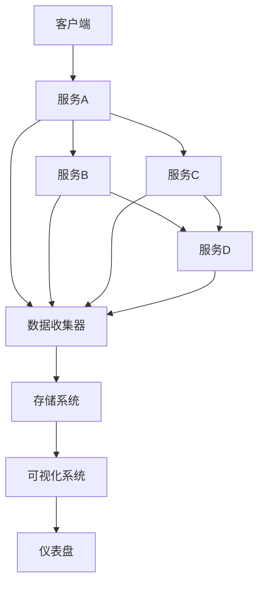
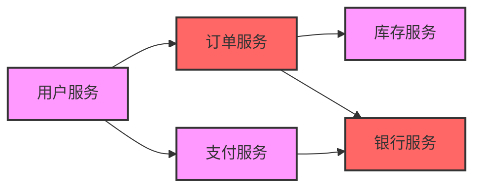
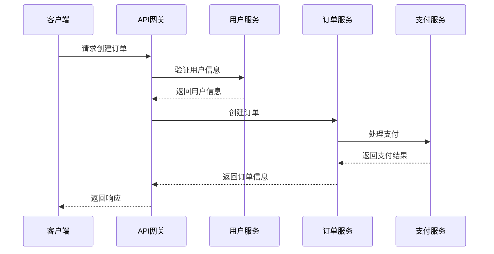

## 一、分布式服务可视化概述

### 1.1 什么是分布式服务可视化

**分布式服务可视化**是指通过图形化、直观的方式展示分布式系统中各个服务之间的关系、依赖、调用链路和运行状态，帮助开发者和运维人员理解系统架构、排查问题、优化性能。

### 1.2 分布式服务可视化的重要性

- **系统理解**：直观展示服务间的依赖关系和调用链路
- **问题排查**：快速定位性能瓶颈和故障点
- **性能优化**：识别服务调用的热点和异常
- **架构演进**：基于实际运行数据指导架构调整
- **运维监控**：实时监控服务健康状态

### 1.3 常见的分布式服务可视化工具

| 工具 | 特点 | 适用场景 |
|------|------|----------|
| Zipkin | 开源分布式追踪系统 | 微服务调用链追踪 |
| Jaeger | 开源分布式追踪系统，支持OpenTracing | 复杂微服务架构 |
| Prometheus + Grafana | 监控和可视化平台 | 系统指标监控 |
| Kiali | 服务网格可视化工具 | Istio服务网格 |
| SkyWalking | 开源APM系统 | 全链路追踪和监控 |

## 二、分布式服务可视化原理

### 2.1 核心架构

### 2.2 数据采集原理

#### 2.2.1 埋点采集

- **代码埋点**：在服务代码中插入追踪代码
- **代理埋点**：通过Sidecar代理自动采集数据
- **SDK埋点**：使用语言特定的SDK进行数据采集

#### 2.2.2 数据传输

- **同步传输**：实时发送追踪数据
- **异步传输**：批量发送，减少性能影响
- **采样机制**：根据策略采样，控制数据量

#### 2.2.3 数据存储

- **时序数据库**：存储时间序列数据
- **分布式存储**：支持大规模数据存储
- **索引优化**：加速查询和分析

### 2.3 可视化原理

#### 2.3.1 服务依赖图

#### 2.3.2 调用链追踪

## 三、分布式服务可视化方案

### 3.1 基于OpenTelemetry的方案

**架构组成**：
- **数据采集**：使用OpenTelemetry SDK
- **数据传输**：OpenTelemetry Collector
- **数据存储**：Prometheus + Jaeger
- **可视化**：Grafana

**实现步骤**：
1. 在各服务中集成OpenTelemetry SDK
2. 部署OpenTelemetry Collector
3. 配置数据存储和可视化组件
4. 定义监控指标和告警规则

**优点**：
- 标准化：遵循OpenTelemetry规范
- 灵活性：支持多种后端存储
- 可扩展性：易于添加新的服务

**缺点**：
- 部署复杂：需要多个组件协同工作
- 学习成本：需要了解OpenTelemetry生态

### 3.2 基于服务网格的方案

**架构组成**：
- **服务网格**：Istio
- **可视化工具**：Kiali
- **监控**：Prometheus + Grafana

**实现步骤**：
1. 部署Istio服务网格
2. 配置Kiali和监控组件
3. 将服务纳入服务网格管理
4. 通过Kiali查看服务拓扑和健康状态

**优点**：
- 零侵入：不需要修改服务代码
- 功能丰富：提供服务拓扑、流量管理等功能
- 易于集成：与Kubernetes无缝集成

**缺点**：
- 性能开销：Sidecar代理增加网络延迟
- 复杂性：服务网格本身配置复杂

### 3.3 基于APM系统的方案

**架构组成**：
- **APM系统**：SkyWalking
- **数据存储**：Elasticsearch
- **可视化**：SkyWalking UI

**实现步骤**：
1. 部署SkyWalking服务端
2. 在各服务中集成SkyWalking Agent
3. 配置数据存储和告警规则
4. 通过SkyWalking UI查看服务状态和调用链

**优点**：
- 全功能：提供追踪、监控、告警等功能
- 易于部署：单一系统集成多种功能
- 性能友好：低开销数据采集

**缺点**：
- 生态相对封闭：与其他系统集成度不如OpenTelemetry
- 定制性：自定义功能相对有限

## 四、大厂落地案例

### 4.1 阿里巴巴

**方案**：基于自研的鹰眼系统实现分布式服务可视化

**核心特点**：
- **全链路追踪**：从浏览器到后端服务的完整调用链
- **实时监控**：毫秒级数据采集和展示
- **智能分析**：自动识别异常和性能瓶颈
- **大规模处理**：支持每秒百万级的调用追踪

**应用场景**：
- 双11大促期间的系统监控和故障排查
- 日常系统性能优化和容量规划
- 新功能上线后的效果评估

### 4.2 腾讯

**方案**：基于腾讯云APM实现分布式服务可视化

**核心特点**：
- **多维度监控**：服务、接口、依赖等多个维度
- **智能告警**：基于机器学习的异常检测
- **可视化仪表盘**：自定义多维度数据展示
- **云原生集成**：与腾讯云容器服务无缝集成

**应用场景**：
- 游戏业务的服务监控和故障排查
- 金融业务的交易链路追踪
- 直播业务的实时性能监控

### 4.3 字节跳动

**方案**：基于自研的Cat系统实现分布式服务可视化

**核心特点**：
- **高吞吐**：支持海量服务的监控
- **低延迟**：实时数据处理和展示
- **丰富的插件**：支持多种中间件和框架
- **自定义分析**：灵活的查询和分析能力

**应用场景**：
- 抖音、今日头条等核心应用的服务监控
- 推荐系统的性能优化
- 广告系统的效果分析

## 五、最佳实践

### 5.1 实施建议

- **分阶段实施**：从核心服务开始，逐步扩展
- **合理采样**：根据业务特点设置采样率，平衡数据量和精度
- **统一标准**：制定统一的命名规范和标签体系
- **持续优化**：根据实际运行数据调整监控策略

### 5.2 性能优化

- **数据压缩**：减少传输和存储开销
- **批量处理**：降低网络往返次数
- **缓存机制**：加速数据查询和展示
- **水平扩展**：根据数据量扩展存储和计算资源

### 5.3 常见问题及解决方案

| 问题 | 解决方案 |
|------|----------|
| 数据量过大 | 增加采样率，设置数据保留策略 |
| 性能开销高 | 使用异步传输，优化采集逻辑 |
| 数据准确性 | 确保各服务时钟同步，使用唯一traceId |
| 集成复杂 | 采用标准化方案，使用自动化部署工具 |

## 六、总结

分布式服务可视化是现代微服务架构中的重要组成部分，通过直观的方式展示服务间的关系和运行状态，帮助开发者和运维人员更好地理解和管理系统。选择合适的可视化方案需要考虑系统规模、技术栈、性能要求等因素。

**核心要点**：
- 选择适合业务场景的可视化方案
- 合理配置数据采集和存储策略
- 建立完善的监控和告警机制
- 持续优化系统性能和可观测性

通过分布式服务可视化，企业可以提高系统的可靠性和可维护性，快速响应业务需求变化，为用户提供更优质的服务体验。