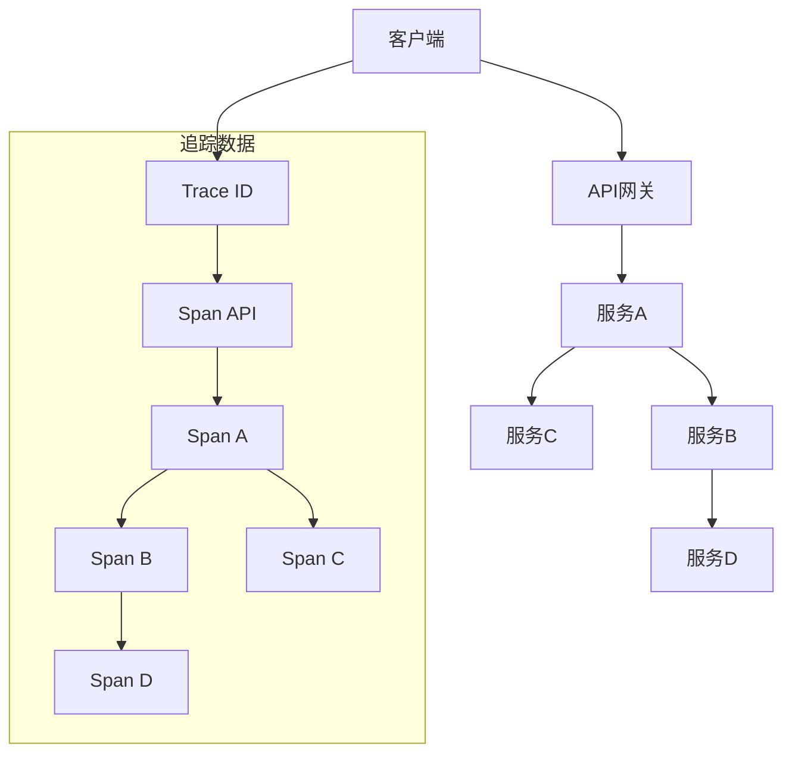
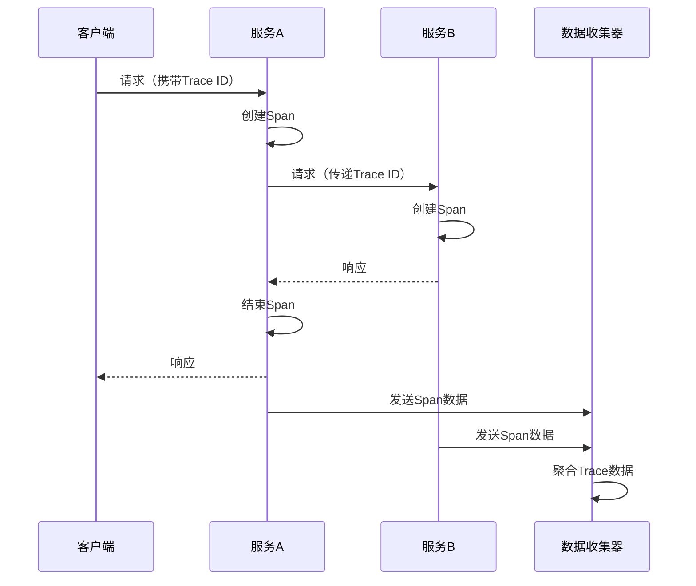

## 一、分布式服务联路追踪概述

### 1.1 什么是分布式服务联路追踪

**分布式服务联路追踪**是一种用于监控和追踪分布式系统中请求流程的技术，通过在请求经过的各个服务间传递唯一标识，记录请求的完整调用路径、耗时和状态，帮助开发者理解系统行为、排查问题和优化性能。

### 1.2 分布式服务联路追踪的重要性

- **问题定位**：快速定位分布式系统中的故障点
- **性能分析**：识别性能瓶颈和优化机会
- **系统理解**：可视化展示服务间的调用关系
- **容量规划**：基于实际调用数据进行容量评估
- **服务质量**：监控服务的可用性和响应时间

### 1.3 常见的分布式追踪系统

| 系统 | 特点 | 适用场景 |
|------|------|----------|
| Zipkin | 开源，轻量级，易于部署 | 中小规模系统 |
| Jaeger | 开源，支持OpenTracing，性能优秀 | 大规模微服务架构 |
| SkyWalking | 开源，全链路追踪，APM功能丰富 | 企业级应用 |
| OpenTelemetry | 标准化方案，支持多种后端 | 云原生环境 |
| Datadog APM | 商业产品，功能全面 | 企业级监控 |

## 二、分布式服务联路追踪原理

### 2.1 核心概念

- **Trace**：完整的请求调用链，包含多个Span
- **Span**：单个服务内的操作，包含开始时间、结束时间、标签等信息
- **Trace ID**：全局唯一标识，贯穿整个调用链
- **Span ID**：每个Span的唯一标识
- **Parent Span ID**：父Span的ID，用于构建调用层级关系
- **Tags**：键值对，用于添加元数据
- **Logs**：事件日志，记录关键事件

### 2.2 工作原理



### 2.3 数据采集流程



### 2.4 传播机制

- **HTTP头**：通过HTTP头传递追踪信息
- **RPC元数据**：在RPC调用中传递追踪信息
- **消息队列**：在消息中携带追踪信息
- **环境变量**：在进程间传递追踪信息

## 三、分布式服务联路追踪方案

### 3.1 基于OpenTelemetry的方案

**架构组成**：
- **数据采集**：OpenTelemetry SDK
- **数据传输**：OpenTelemetry Collector
- **数据存储**：Jaeger / Zipkin / Prometheus
- **可视化**：Grafana / Jaeger UI / Zipkin UI

**实现步骤**：
1. 在服务中集成OpenTelemetry SDK
2. 配置SDK，设置采样率和导出器
3. 部署OpenTelemetry Collector
4. 配置数据存储和可视化组件
5. 定义监控指标和告警规则

**优点**：
- 标准化：遵循OpenTelemetry规范
- 灵活性：支持多种后端存储
- 可扩展性：易于添加新的服务
- 生态丰富：与云原生工具集成良好

**缺点**：
- 部署复杂：需要多个组件协同工作
- 学习成本：需要了解OpenTelemetry生态
- 资源消耗：全量采集可能增加系统负载

### 3.2 基于SkyWalking的方案

**架构组成**：
- **数据采集**：SkyWalking Agent
- **数据传输**：gRPC / HTTP
- **数据存储**：Elasticsearch / H2 / MySQL
- **可视化**：SkyWalking UI

**实现步骤**：
1. 部署SkyWalking OAP服务器
2. 配置存储后端（如Elasticsearch）
3. 在服务中集成SkyWalking Agent
4. 配置Agent参数，如采样率和命名规则
5. 通过SkyWalking UI查看追踪数据

**优点**：
- 全功能：集成了APM、分布式追踪和服务网格监控
- 易于部署：单一系统集成多种功能
- 性能友好：低开销数据采集
- 丰富的插件：支持多种框架和中间件

**缺点**：
- 生态相对封闭：与其他系统集成度不如OpenTelemetry
- 定制性：自定义功能相对有限
- 存储依赖：对Elasticsearch等存储有一定要求

### 3.3 基于服务网格的方案

**架构组成**：
- **服务网格**：Istio
- **数据采集**：Envoy代理
- **数据存储**：Jaeger
- **可视化**：Kiali / Jaeger UI

**实现步骤**：
1. 部署Istio服务网格
2. 配置Jaeger作为追踪后端
3. 将服务纳入服务网格管理
4. 通过Kiali或Jaeger UI查看追踪数据

**优点**：
- 零侵入：不需要修改服务代码
- 自动采集：由Envoy代理自动处理追踪
- 功能丰富：与服务网格的其他功能集成
- 云原生：与Kubernetes无缝集成

**缺点**：
- 性能开销：Sidecar代理增加网络延迟
- 复杂性：服务网格本身配置复杂
- 资源消耗：每个服务都需要运行Sidecar代理

### 3.4 基于Jaeger的方案

**底层标准**：
- **OpenTracing**：Jaeger最初基于OpenTracing标准
- **OpenTelemetry**：现在支持OpenTelemetry标准，与OpenTracing兼容
- **OpenCensus**：支持与OpenCensus集成

**架构组成**：
- **数据采集**：Jaeger客户端库
- **数据传输**：UDP / gRPC
- **数据存储**：
  - **内存存储**：适用于开发和测试
  - **Cassandra**：适用于大规模生产环境
  - **Elasticsearch**：适用于需要强大搜索能力的场景
  - **Kafka**：适用于需要高吞吐量的场景
- **可视化**：Jaeger UI

**优点**：
- **性能优秀**：针对大规模微服务架构优化
- **易于部署**：支持多种部署方式（二进制、Docker、Kubernetes）
- **功能丰富**：支持分布式上下文传播、采样、 baggage 等特性
- **可视化强大**：提供丰富的UI界面，支持多种查询方式
- **云原生友好**：与Kubernetes和云服务集成良好

**缺点**：
- **存储依赖**：生产环境需要外部存储（如Elasticsearch）
- **配置复杂**：高级功能配置较为复杂
- **资源消耗**：在高流量场景下需要合理配置存储和采样

**Golang Gin服务集成示例**：

```go
package main

import (
	"context"
	"fmt"
	"log"
	"net/http"
	"os"
	"time"

	"github.com/gin-gonic/gin"
	"github.com/jaegertracing/jaeger-client-go/config"
	"github.com/opentracing/opentracing-go"
	"github.com/opentracing/opentracing-go/ext"
)

func main() {
	// 初始化Jaeger tracer
	tracer, closer, err := initJaeger("gin-service")
	if err != nil {
		log.Fatalf("初始化Jaeger失败: %v", err)
	}
	defer closer.Close()
	opentracing.SetGlobalTracer(tracer)

	// 创建Gin引擎
	r := gin.Default()

	// 添加Jaeger中间件
	r.Use(jaegerMiddleware(tracer))

	// 定义路由
	r.GET("/hello", func(c *gin.Context) {
		// 从上下文获取span
		span, ctx := opentracing.StartSpanFromContext(c.Request.Context(), "hello-handler")
		defer span.Finish()

		// 模拟业务处理
		time.Sleep(100 * time.Millisecond)

		// 调用下游服务
		callDownstreamService(ctx)

		c.JSON(http.StatusOK, gin.H{
			"message": "Hello, World!",
		})
	})

	// 启动服务
	serverAddr := os.Getenv("SERVER_ADDR")
	if serverAddr == "" {
		serverAddr = ":8080"
	}
	log.Printf("服务启动在 %s", serverAddr)
	if err := r.Run(serverAddr); err != nil {
		log.Fatalf("服务启动失败: %v", err)
	}
}

// 初始化Jaeger
func initJaeger(serviceName string) (opentracing.Tracer, io.Closer, error) {
	cfg := config.Configuration{
		Sampler: &config.SamplerConfig{
			Type:  "const",
			Param: 1, // 100%采样
		},
		Reporter: &config.ReporterConfig{
			LogSpans:            true,
			LocalAgentHostPort:  "localhost:6831", // Jaeger Agent地址
		},
	}
	return cfg.New(serviceName, config.Logger(log.Default()))
}

// Jaeger中间件
func jaegerMiddleware(tracer opentracing.Tracer) gin.HandlerFunc {
	return func(c *gin.Context) {
		// 从HTTP头中提取追踪信息
		spanCtx, _ := tracer.Extract(opentracing.HTTPHeaders, opentracing.HTTPHeadersCarrier(c.Request.Header))
		// 创建新的span
		span := tracer.StartSpan(c.Request.URL.Path, ext.RPCServerOption(spanCtx))
		defer span.Finish()

		// 设置span标签
		ext.HTTPMethod.Set(span, c.Request.Method)
		ext.HTTPUrl.Set(span, c.Request.URL.String())

		// 将span添加到上下文
		c.Request = c.Request.WithContext(opentracing.ContextWithSpan(c.Request.Context(), span))

		// 处理请求
		c.Next()

		// 设置响应状态码
		ext.HTTPStatusCode.Set(span, uint16(c.Writer.Status()))
	}
}

// 调用下游服务
func callDownstreamService(ctx context.Context) {
	tracer := opentracing.GlobalTracer()
	span, _ := opentracing.StartSpanFromContext(ctx, "call-downstream")
	defer span.Finish()

	// 创建HTTP请求
	req, err := http.NewRequest("GET", "http://localhost:8081/downstream", nil)
	if err != nil {
		log.Printf("创建请求失败: %v", err)
		return
	}

	// 注入追踪信息到HTTP头
	tracer.Inject(span.Context(), opentracing.HTTPHeaders, opentracing.HTTPHeadersCarrier(req.Header))

	// 发送请求
	client := &http.Client{Timeout: 5 * time.Second}
	resp, err := client.Do(req)
	if err != nil {
		log.Printf("调用下游服务失败: %v", err)
		return
	}
	defer resp.Body.Close()

	log.Printf("下游服务响应状态: %d", resp.StatusCode)
}
```

**gRPC微服务集成示例**：

```go
package main

import (
	"context"
	"log"
	"net"
	"os"
	"time"

	"github.com/jaegertracing/jaeger-client-go/config"
	"github.com/opentracing/opentracing-go"
	"github.com/opentracing/opentracing-go/ext"
	"google.golang.org/grpc"
	"google.golang.org/grpc/metadata"

	pb "path/to/your/proto/package"
)

// 服务器实现
type server struct {
	pb.UnimplementedGreeterServer
}

func (s *server) SayHello(ctx context.Context, in *pb.HelloRequest) (*pb.HelloReply, error) {
	// 从gRPC元数据中提取追踪信息
	md, ok := metadata.FromIncomingContext(ctx)
	if !ok {
		md = metadata.New(nil)
	}

	// 初始化tracer
	tracer, closer, err := initJaeger("grpc-server")
	if err != nil {
		log.Fatalf("初始化Jaeger失败: %v", err)
	}
	defer closer.Close()

	// 从元数据中提取span上下文
	spanContext, err := tracer.Extract(
		opentracing.TextMap, 
		metadataTextMapCarrier(md),
	)

	// 创建span
	span := tracer.StartSpan(
		"SayHello",
		ext.RPCServerOption(spanContext),
	)
	defer span.Finish()

	// 模拟业务处理
	time.Sleep(50 * time.Millisecond)

	// 调用下游服务
	callDownstreamGrpcService(tracer, span.Context())

	return &pb.HelloReply{Message: "Hello " + in.Name}, nil
}

// 元数据载体
 type metadataTextMapCarrier metadata.MD

func (m metadataTextMapCarrier) Set(key, value string) {
	(m)[key] = append((m)[key], value)
}

func (m metadataTextMapCarrier) ForeachKey(handler func(key, value string) error) error {
	for k, vs := range m {
		for _, v := range vs {
			if err := handler(k, v); err != nil {
				return err
			}
		}
	}
	return nil
}

// 初始化Jaeger
func initJaeger(serviceName string) (opentracing.Tracer, io.Closer, error) {
	cfg := config.Configuration{
		Sampler: &config.SamplerConfig{
			Type:  "const",
			Param: 1, // 100%采样
		},
		Reporter: &config.ReporterConfig{
			LogSpans:            true,
			LocalAgentHostPort:  "localhost:6831", // Jaeger Agent地址
		},
	}
	return cfg.New(serviceName, config.Logger(log.Default()))
}

// 调用下游gRPC服务
func callDownstreamGrpcService(tracer opentracing.Tracer, parentCtx opentracing.SpanContext) {
	// 创建span
	span := tracer.StartSpan("call-downstream-grpc", opentracing.ChildOf(parentCtx))
	defer span.Finish()

	// 连接下游服务
	conn, err := grpc.Dial("localhost:50052", grpc.WithInsecure())
	if err != nil {
		log.Printf("连接下游服务失败: %v", err)
		return
	}
	defer conn.Close()

	// 创建客户端
	client := pb.NewGreeterClient(conn)

	// 创建上下文并注入追踪信息
	ctx := context.Background()
	md := metadata.New(nil)

	// 注入追踪信息到元数据
	err = tracer.Inject(
		span.Context(),
		opentracing.TextMap,
		metadataTextMapCarrier(md),
	)
	if err != nil {
		log.Printf("注入追踪信息失败: %v", err)
	}

	// 创建带元数据的上下文
	ctx = metadata.NewOutgoingContext(ctx, md)

	// 调用下游服务
	_, err = client.SayHello(ctx, &pb.HelloRequest{Name: "Downstream"})
	if err != nil {
		log.Printf("调用下游服务失败: %v", err)
	}
}

func main() {
	// 监听端口
	port := os.Getenv("PORT")
	if port == "" {
		port = "50051"
	}
	lis, err := net.Listen("tcp", ":"+port)
	if err != nil {
		log.Fatalf("监听失败: %v", err)
	}

	// 创建gRPC服务器
	s := grpc.NewServer()
	pb.RegisterGreeterServer(s, &server{})

	log.Printf("gRPC服务启动在 :%s", port)
	if err := s.Serve(lis); err != nil {
		log.Fatalf("服务启动失败: %v", err)
	}
}
```

**Jaeger部署和配置**：

1. **使用Docker部署Jaeger**：
   ```bash
   docker run -d --name jaeger \
     -e COLLECTOR_ZIPKIN_HOST_PORT=:9411 \
     -p 5775:5775/udp \
     -p 6831:6831/udp \
     -p 6832:6832/udp \
     -p 5778:5778 \
     -p 16686:16686 \
     -p 14268:14268 \
     -p 9411:9411 \
     jaegertracing/all-in-one:1.26
   ```

2. **访问Jaeger UI**：
   打开浏览器访问 `http://localhost:16686` 查看追踪数据

3. **配置存储**：
   - **使用Elasticsearch**：
     ```bash
     docker run -d --name jaeger \
       -e COLLECTOR_ZIPKIN_HOST_PORT=:9411 \
       -e SPAN_STORAGE_TYPE=elasticsearch \
       -e ES_SERVER_URLS=http://elasticsearch:9200 \
       -p 16686:16686 \
       -p 14268:14268 \
       jaegertracing/all-in-one:1.26
     ```

   - **使用Cassandra**：
     ```bash
     docker run -d --name jaeger \
       -e COLLECTOR_ZIPKIN_HOST_PORT=:9411 \
       -e SPAN_STORAGE_TYPE=cassandra \
       -e CASSANDRA_CONTACT_POINTS=cassandra:9042 \
       -p 16686:16686 \
       -p 14268:14268 \
       jaegertracing/all-in-one:1.26
     ```

## 四、大厂落地案例

### 4.1 阿里巴巴

**方案**：基于自研的鹰眼系统实现分布式服务联路追踪

**核心特点**：
- **全链路追踪**：从浏览器到后端服务的完整调用链
- **实时监控**：毫秒级数据采集和展示
- **智能分析**：自动识别异常和性能瓶颈
- **大规模处理**：支持每秒百万级的调用追踪
- **多语言支持**：覆盖Java、C++、Go等多种语言

**应用场景**：
- 双11大促期间的系统监控和故障排查
- 日常系统性能优化和容量规划
- 新功能上线后的效果评估
- 跨部门服务调用的监控和管理

### 4.2 腾讯

**方案**：基于腾讯云APM实现分布式服务联路追踪

**核心特点**：
- **多维度监控**：服务、接口、依赖等多个维度
- **智能告警**：基于机器学习的异常检测
- **分布式追踪**：完整的调用链分析
- **云原生集成**：与腾讯云容器服务无缝集成
- **自定义仪表盘**：灵活的数据可视化

**应用场景**：
- 游戏业务的服务监控和故障排查
- 金融业务的交易链路追踪
- 直播业务的实时性能监控
- 微服务架构的可观测性管理

### 4.3 字节跳动

**方案**：基于自研的Cat系统实现分布式服务联路追踪

**核心特点**：
- **高吞吐**：支持海量服务的监控
- **低延迟**：实时数据处理和展示
- **丰富的插件**：支持多种中间件和框架
- **自定义分析**：灵活的查询和分析能力
- **多环境支持**：覆盖开发、测试、生产环境

**应用场景**：
- 抖音、今日头条等核心应用的服务监控
- 推荐系统的性能优化
- 广告系统的效果分析
- 跨地域服务调用的监控

## 五、最佳实践

### 5.1 实施建议

- **分阶段实施**：从核心服务开始，逐步扩展
- **合理采样**：根据业务特点设置采样率，平衡数据量和精度
- **统一标准**：制定统一的命名规范和标签体系
- **上下文传递**：确保追踪信息在服务间正确传递
- **与监控集成**：将追踪数据与监控指标关联

### 5.2 性能优化

- **采样策略**：根据业务重要性调整采样率
- **异步传输**：使用异步方式发送追踪数据
- **批量处理**：批量发送Span数据，减少网络开销
- **数据压缩**：压缩传输数据，降低带宽消耗
- **存储优化**：合理设置数据保留策略，定期清理旧数据

### 5.3 常见问题及解决方案

| 问题 | 解决方案 |
|------|----------|
| 追踪信息丢失 | 确保正确实现上下文传递，检查网络配置 |
| 数据量过大 | 调整采样率，设置数据保留策略 |
| 性能开销高 | 使用异步传输，优化采集逻辑 |
| 跨语言追踪 | 使用标准化的追踪协议，如OpenTelemetry |
| 追踪数据不准确 | 确保服务时钟同步，检查Span边界定义 |

### 5.4 与其他可观测性工具集成

- **与监控系统集成**：将追踪数据与Prometheus等监控系统关联
- **与日志系统集成**：将Trace ID添加到日志中，实现日志与追踪的关联
- **与告警系统集成**：基于追踪数据设置告警规则
- **与CI/CD集成**：在部署过程中自动配置追踪系统

## 六、总结

分布式服务联路追踪是现代微服务架构中不可或缺的可观测性工具，通过追踪请求在分布式系统中的完整路径，帮助开发者和运维人员快速定位问题、优化性能、理解系统行为。选择合适的追踪方案需要考虑系统规模、技术栈、性能要求等因素。

**核心要点**：
- 选择适合业务场景的追踪方案
- 合理配置采样率和数据存储策略
- 确保追踪信息在服务间正确传递
- 与其他可观测性工具集成，构建完整的监控体系
- 持续优化追踪系统的性能和可靠性

通过分布式服务联路追踪，企业可以提高系统的可靠性和可维护性，快速响应业务需求变化，为用户提供更优质的服务体验。随着云原生技术的发展，分布式服务联路追踪将在微服务架构中发挥越来越重要的作用。