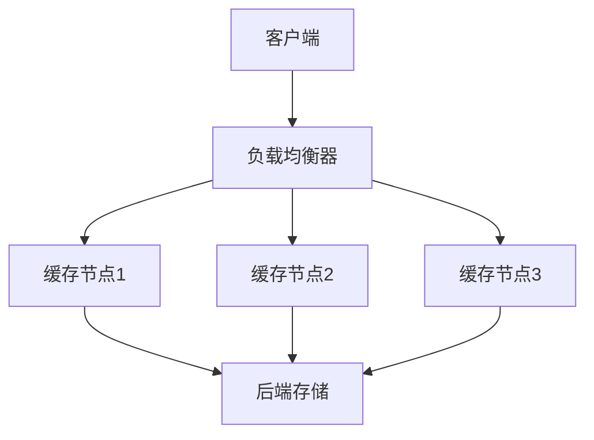
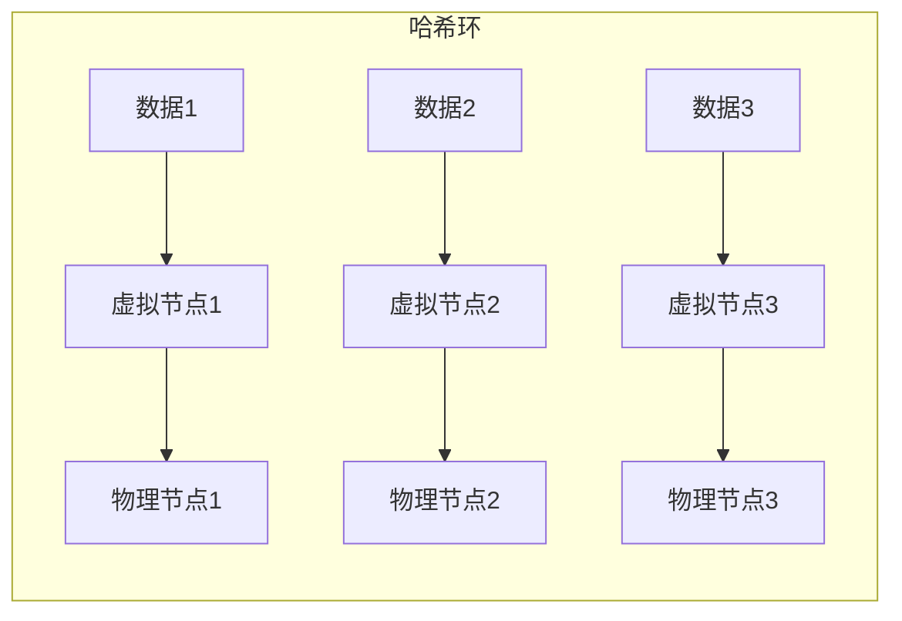
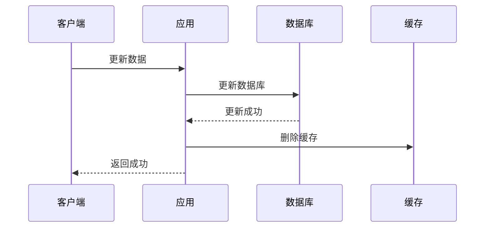
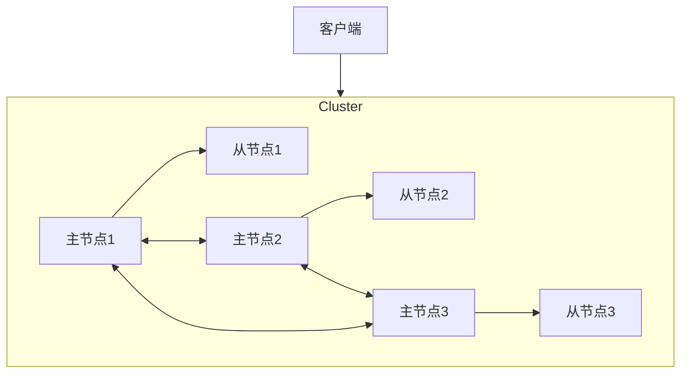

## 一、分布式缓存概述

### 1.1 什么是分布式缓存

**分布式缓存**是一种将数据存储在多个节点上的缓存系统，通过网络协同工作，提供高可用、高并发的数据访问能力。它不仅解决了单点缓存的容量限制问题，还提高了系统的可靠性和可用性。

### 1.2 分布式缓存的重要性

- **提高系统性能**：缓存热点数据，减少数据库访问压力
- **增强系统可用性**：多节点部署，避免单点故障
- **水平扩展能力**：支持动态添加节点，应对业务增长
- **降低系统延迟**：将数据缓存到离用户更近的位置

### 1.3 常见的分布式缓存系统

| 缓存系统 | 特点 | 适用场景 |
|---------|------|---------|
| Redis Cluster | 支持丰富的数据结构，高可用性，持久化 | 复杂业务场景，需要多种数据类型 |
| Memcached | 简单高效，内存管理优秀 | 简单键值缓存，高并发场景 |
| Hazelcast | 分布式数据网格，支持多种数据结构 | Java 生态系统，需要分布式计算 |
| Ehcache | 轻量级，易于集成 | 应用内嵌缓存，小型系统 |
| Couchbase | 内存优先，支持持久化 | 需要持久化的缓存场景 |

## 二、分布式缓存架构设计

### 2.1 基本架构组件



### 2.2 数据分片策略

#### 2.2.1 哈希分片

- **一致性哈希**：将缓存节点和数据都映射到哈希环上，通过顺时针查找找到对应的节点
- **虚拟节点**：为每个物理节点创建多个虚拟节点，减少节点增减时的数据迁移
- **优势**：节点增减时，只影响少量数据，避免全量数据迁移



#### 2.2.2 范围分片

- **原理**：将数据按照某个范围划分到不同节点
- **优势**：范围查询效率高
- **劣势**：数据分布可能不均匀

#### 2.2.3 列表分片

- **原理**：维护一个数据到节点的映射列表
- **优势**：灵活性高，可手动调整
- **劣势**：需要额外的映射管理开销

### 2.3 高可用设计

#### 2.3.1 主从复制

- **原理**：主节点处理写请求，从节点同步数据并处理读请求
- **优势**：提高读性能，实现故障转移
- **劣势**：主节点故障时需要选举新主

#### 2.3.2 多活架构

- **原理**：多个数据中心部署缓存集群，均可处理读写请求
- **优势**：地域容灾，提高用户体验
- **劣势**：数据一致性管理复杂

## 三、缓存一致性策略

### 3.1 缓存更新策略

#### 3.1.1 先更新数据库，再删除缓存



- **优势**：简单可靠，避免脏数据
- **劣势**：短暂的缓存缺失期

#### 3.1.2 先删除缓存，再更新数据库

- **优势**：避免缓存和数据库不一致
- **劣势**：可能导致缓存穿透

#### 3.1.3 双写策略

- **原理**：同时更新数据库和缓存
- **优势**：缓存实时性高
- **劣势**：事务处理复杂，可能出现一致性问题

### 3.2 最终一致性方案

- **异步更新**：通过消息队列异步更新缓存
- **版本控制**：为缓存数据添加版本号，避免旧数据覆盖新数据
- **TTL机制**：为缓存设置过期时间，确保最终一致

## 四、缓存失效处理

### 4.1 缓存穿透

**问题**：查询不存在的数据，导致请求直接打到数据库

**解决方案**：
- **布隆过滤器**：快速判断数据是否存在
- **缓存空值**：对不存在的数据也缓存，设置较短的过期时间
- **限流保护**：对异常请求进行限流

### 4.2 缓存击穿

**问题**：热点数据过期，大量请求同时打到数据库

**解决方案**：
- **互斥锁**：只允许一个线程去数据库加载数据
- **热点数据永不过期**：定期更新热点数据
- **预热缓存**：系统启动时预加载热点数据

### 4.3 缓存雪崩

**问题**：大量缓存同时过期，导致数据库压力骤增

**解决方案**：
- **随机过期时间**：避免缓存同时过期
- **分层缓存**：不同层级缓存设置不同过期时间
- **熔断降级**：当缓存失效时，使用降级策略

## 五、分布式缓存实践

### 5.1 Redis Cluster 部署方案

#### 5.1.1 集群架构



#### 5.1.2 部署步骤

1. **准备节点**：部署 6 个 Redis 实例（3 主 3 从）
2. **创建集群**：使用 `redis-cli --cluster create` 命令
3. **验证集群**：使用 `redis-cli --cluster check` 命令
4. **配置监控**：部署 Redis Exporter 和 Prometheus

#### 5.1.3 最佳实践

- **内存配置**：根据实际业务需求设置内存限制
- **持久化策略**：开启 RDB 和 AOF 混合持久化
- **密码设置**：启用密码认证，防止未授权访问
- **网络隔离**：部署在专用网络，限制访问

### 5.2 缓存与数据库一致性实践

#### 5.2.1 读写分离架构

```mermaid
graph TD
    Client[客户端] --> API[API服务]
    API --> Cache[缓存层]
    API --> DB[数据库]
    Cache --> DB
    
    subgraph 读操作
        Client --> API: 读取数据
        API --> Cache: 查询缓存
        Cache -- 命中 --> API: 返回数据
        Cache -- 未命中 --> DB: 查询数据库
        DB --> Cache: 更新缓存
        DB --> API: 返回数据
    end
    
    subgraph 写操作
        Client --> API: 写入数据
        API --> DB: 更新数据库
        DB --> Cache: 删除缓存
        API --> Client: 返回成功
    end
```

#### 5.2.2 数据同步方案

- **基于 Canal**：监听 MySQL binlog，实时更新缓存
- **基于消息队列**：通过 MQ 异步更新缓存
- **基于定时器**：定期同步数据到缓存

## 六、性能优化

### 6.1 缓存性能优化

- **连接池**：使用连接池减少连接开销
- **批量操作**：使用 pipelining 减少网络往返
- **序列化优化**：选择高效的序列化方式
- **内存优化**：合理设置内存策略，避免内存碎片

### 6.2 架构优化

- **多级缓存**：本地缓存 + 分布式缓存
- **边缘缓存**：将缓存部署到离用户更近的位置
- **智能预热**：根据访问模式预热缓存
- **缓存分片**：合理分片，避免热点数据集中

## 七、监控与运维

### 7.1 监控指标

- **命中率**：缓存命中比例
- **吞吐量**：每秒处理的请求数
- **延迟**：缓存响应时间
- **内存使用率**：内存使用情况
- **节点状态**：集群健康状态

### 7.2 告警策略

- **内存告警**：内存使用率超过阈值
- **命中率告警**：命中率低于阈值
- **延迟告警**：响应时间超过阈值
- **节点故障**：集群节点状态异常

### 7.3 运维工具

- **Redis CLI**：命令行工具
- **Redis Insight**：可视化管理工具
- **Prometheus + Grafana**：监控和可视化
- **ELK**：日志分析

## 八、案例分析

### 8.1 电商系统缓存方案

**需求**：
- 高并发商品查询
- 实时库存更新
- 促销活动流量峰值

**方案**：
- **商品详情缓存**：Redis 哈希结构存储商品信息
- **库存缓存**：Redis 原子操作更新库存
- **热点商品**：单独缓存，设置永不过期
- **降级策略**：缓存失效时使用静态页面

### 8.2 社交系统缓存方案

**需求**：
- 用户会话管理
- 消息推送
- 好友关系存储

**方案**：
- **会话缓存**：Redis 存储用户会话
- **消息队列**：Redis 列表实现消息队列
- **好友关系**：Redis 集合存储好友列表
- **时间线**：Redis 有序集合存储动态

## 九、总结

分布式缓存是现代高并发系统的重要组成部分，通过合理的架构设计和策略选择，可以显著提高系统性能和可用性。在实际应用中，需要根据业务特点选择合适的缓存系统和策略，同时关注缓存一致性、失效处理和性能优化等关键问题。

**核心要点**：
- 选择合适的缓存系统和分片策略
- 设计可靠的缓存一致性方案
- 预防和处理缓存失效问题
- 建立完善的监控和运维体系
- 持续优化缓存性能和架构

通过不断的实践和调优，分布式缓存可以为系统提供强大的性能支撑，帮助业务应对高并发挑战，提升用户体验。