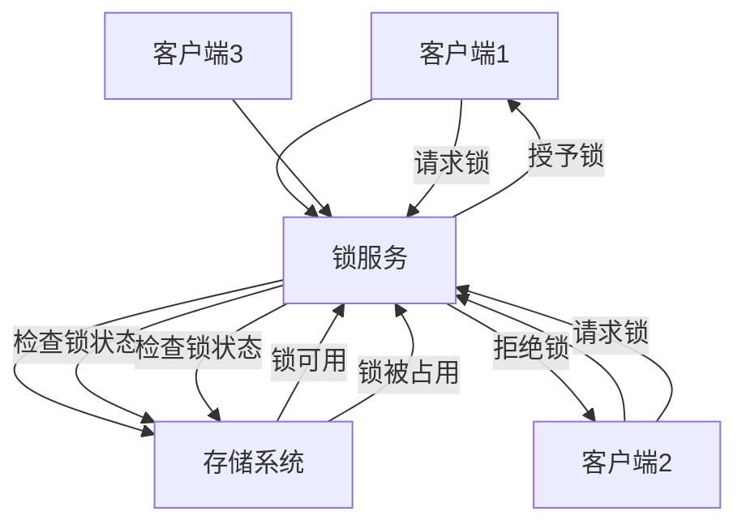

## 一、分布式锁概述

### 1.1 什么是分布式锁

**分布式锁**是一种在分布式系统中用于协调多个节点对共享资源访问的机制，确保在同一时间只有一个节点能够访问特定资源，避免并发冲突。在分布式环境中，由于节点之间的独立性，传统的进程内锁（如synchronized、ReentrantLock）无法跨节点工作，因此需要专门的分布式锁机制。

### 1.2 分布式锁的重要性

- **数据一致性**：确保多个节点对共享数据的操作保持一致
- **资源保护**：防止多个节点同时修改同一资源导致的数据损坏
- **并发控制**：协调分布式系统中的并发操作
- **系统可靠性**：避免因并发操作导致的系统异常

### 1.3 分布式锁的基本要求

- **互斥性**：在任何时刻，只有一个客户端能够持有锁
- **安全性**：锁只能被持有它的客户端释放
- **活性**：锁最终会被释放，不会导致死锁
- **容错性**：部分节点故障不影响锁的正常工作
- **性能**：获取和释放锁的操作应该高效

## 二、分布式锁原理

### 2.1 基本原理



### 2.2 锁的实现机制

#### 2.2.1 基于共享存储的实现

- **原理**：利用共享存储系统的原子操作实现锁
- **特点**：简单直接，依赖存储系统的原子性
- **示例**：基于Redis的SETNX命令

#### 2.2.2 基于共识算法的实现

- **原理**：通过分布式共识算法（如Raft、ZAB）实现锁
- **特点**：可靠性高，不依赖单点
- **示例**：基于etcd的分布式锁

#### 2.2.3 基于消息队列的实现

- **原理**：利用消息队列的顺序性实现锁
- **特点**：易于实现，适合特定场景
- **示例**：基于Kafka的分布式锁

## 三、分布式锁方案

### 3.1 基于Redis的分布式锁方案

**实现原理**：
- 使用Redis的SET命令的NX（仅在键不存在时设置）和EX（设置过期时间）选项实现互斥和自动释放
- 使用唯一的requestId确保只有锁的持有者才能释放锁
- 使用Lua脚本保证释放锁操作的原子性

**底层命令**：
- **获取锁**：`SET lock_key request_id NX EX expire_time`
  - `NX`：仅当键不存在时才设置
  - `EX`：设置键的过期时间，单位为秒
  - 这是一个原子操作，确保了获取锁和设置过期时间的原子性

- **释放锁**：使用Lua脚本
  ```lua
  if redis.call('get', KEYS[1]) == ARGV[1] then 
    return redis.call('del', KEYS[1]) 
  else 
    return 0 
  end
  ```
  - 确保只有锁的持有者才能释放锁
  - 避免误释放其他客户端的锁

**实现步骤**：
1. 生成唯一的requestId（如UUID）
2. 客户端尝试使用SET命令获取锁，设置过期时间
3. 如果设置成功，获取锁并执行业务逻辑
4. 完成后使用Lua脚本释放锁
5. 如果获取锁失败，可选择重试或放弃

**优点**：
- **高性能**：Redis的读写速度快，单实例QPS可达10万+
- **实现简单**：API简洁易用，学习成本低
- **可靠性**：支持过期时间，避免死锁
- **可扩展性**：Redis集群支持水平扩展
- **轻量级**：相比etcd和ZooKeeper，资源消耗低

**缺点**：
- **依赖Redis**：增加系统复杂性，需要确保Redis的高可用
- **网络开销**：需要网络通信，存在网络延迟
- **主从延迟**：在Redis主从架构中，可能存在锁丢失的风险
- **过期时间设置**：需要根据业务处理时间合理设置过期时间
- **锁竞争**：高并发场景下可能导致锁竞争激烈

**优化方案**：
1. **使用RedLock算法**：在多个独立的Redis节点上获取锁，提高可靠性
2. **锁续期**：对于长时间运行的任务，实现自动续期机制
3. **分段锁**：将大锁拆分为多个小锁，减少锁竞争
4. **重试机制**：实现带退避策略的重试机制，避免活锁
5. **监控告警**：监控锁的使用情况，及时发现异常
6. **使用Redis Cluster**：提高Redis的可用性和可靠性
7. **合理设置过期时间**：根据业务处理时间设置合理的过期时间，避免过早释放或过晚释放

**代码示例**：

```java
public class RedisDistributedLock {
    private RedisTemplate<String, String> redisTemplate;
    private String lockKey;
    private String requestId;
    private int expireTime = 30; // 默认30秒
    
    public RedisDistributedLock(RedisTemplate<String, String> redisTemplate, String lockKey, String requestId) {
        this.redisTemplate = redisTemplate;
        this.lockKey = lockKey;
        this.requestId = requestId;
    }
    
    public boolean acquire() {
        // 使用SET命令获取锁，并设置过期时间
        Boolean result = redisTemplate.execute((RedisCallback<Boolean>) connection -> {
            byte[] key = lockKey.getBytes();
            byte[] value = requestId.getBytes();
            // SET key value NX EX seconds
            return connection.set(key, value, Expiration.seconds(expireTime), RedisStringCommands.SetOption.SET_IF_ABSENT);
        });
        return result != null && result;
    }
    
    public boolean release() {
        // 使用Lua脚本释放锁，确保原子性
        String script = "if redis.call('get', KEYS[1]) == ARGV[1] then return redis.call('del', KEYS[1]) else return 0 end";
        Object result = redisTemplate.execute(new DefaultRedisScript<>(script, Long.class), 
                Collections.singletonList(lockKey), requestId);
        return result != null && Long.valueOf(1).equals(result);
    }
    
    // 锁续期方法
    public boolean renew() {
        String script = "if redis.call('get', KEYS[1]) == ARGV[1] then return redis.call('expire', KEYS[1], ARGV[2]) else return 0 end";
        Object result = redisTemplate.execute(new DefaultRedisScript<>(script, Long.class), 
                Collections.singletonList(lockKey), requestId, String.valueOf(expireTime));
        return result != null && Long.valueOf(1).equals(result);
    }
}
```

### 3.2 基于etcd的分布式锁方案

**实现原理**：
- 利用etcd的键值存储和分布式共识机制
- 通过创建唯一的键实现互斥
- 使用租约（Lease）机制自动释放锁
- 利用etcd的Watch机制实现锁释放的通知

**底层实现**：
- **租约机制**：etcd的租约是一种时间限制机制，当租约过期时，所有与该租约关联的键都会被自动删除
- **会话管理**：每个客户端创建一个会话，会话与一个租约关联
- **互斥锁**：基于etcd的事务和比较-and-交换（CAS）操作实现
- **监听机制**：使用etcd的Watch API监听锁的释放

**实现步骤**：
1. 客户端创建一个带有TTL的会话（Session）
2. 基于会话创建互斥锁（Mutex）
3. 尝试获取锁：在etcd中创建一个唯一的锁键
4. 如果创建成功，获取锁并执行业务逻辑
5. 定期续约以保持锁（会话会自动续约）
6. 完成后删除锁键释放锁
7. 如果获取锁失败，监听锁的释放并在锁释放后重试

**优点**：
- **可靠性高**：基于Raft算法，确保数据一致性
- **自动释放**：租约过期自动释放锁，避免死锁
- **监听机制**：支持锁释放的通知，减少轮询开销
- **安全性**：支持权限控制和认证
- **强一致性**：etcd保证数据的强一致性

**缺点**：
- **性能**：相比Redis，性能稍低，单实例QPS约为1万+
- **复杂性**：实现相对复杂，学习成本较高
- **依赖etcd**：增加系统复杂性，需要确保etcd的高可用
- **资源消耗**：相比Redis，资源消耗较高

**优化方案**：
1. **批量操作**：合并多个操作，减少网络请求
2. **合理设置TTL**：根据业务处理时间设置合理的TTL
3. **使用连接池**：复用etcd连接，减少连接建立的开销
4. **优化重试策略**：实现带退避策略的重试机制
5. **监控告警**：监控etcd的健康状态和锁的使用情况
6. **使用etcd集群**：提高etcd的可用性和可靠性
7. **合理设计锁粒度**：避免锁粒度过大导致性能问题

**代码示例**：

```go
import (
    "context"
    "time"
    "go.etcd.io/etcd/client/v3"
    "go.etcd.io/etcd/client/v3/concurrency"
)

func acquireLock(client *clientv3.Client, lockName string, ttl int) (*concurrency.Mutex, error) {
    // 创建会话，设置TTL
    session, err := concurrency.NewSession(client, concurrency.WithTTL(ttl))
    if err != nil {
        return nil, err
    }
    
    // 创建互斥锁
    mutex := concurrency.NewMutex(session, lockName)
    
    // 获取锁，设置超时时间
    ctx, cancel := context.WithTimeout(context.Background(), time.Duration(ttl)*time.Second)
    defer cancel()
    
    if err := mutex.Lock(ctx); err != nil {
        session.Close()
        return nil, err
    }
    
    return mutex, nil
}

func releaseLock(mutex *concurrency.Mutex) error {
    // 释放锁
    if err := mutex.Unlock(context.Background()); err != nil {
        return err
    }
    // 关闭会话
    return mutex.Session().Close()
}

// 带重试的获取锁方法
func acquireLockWithRetry(client *clientv3.Client, lockName string, ttl int, maxRetries int) (*concurrency.Mutex, error) {
    var lastErr error
    for i := 0; i < maxRetries; i++ {
        mutex, err := acquireLock(client, lockName, ttl)
        if err == nil {
            return mutex, nil
        }
        lastErr = err
        // 指数退避重试
        time.Sleep(time.Duration(1<<uint(i)) * time.Millisecond * 100)
    }
    return nil, lastErr
}
```

### 3.3 基于ZooKeeper的分布式锁方案

**实现原理**：
- 利用ZooKeeper的顺序临时节点
- 通过创建顺序节点实现公平锁
- 监听前一个节点的删除事件，实现锁的有序获取
- 利用ZooKeeper的会话机制实现锁的自动释放

**底层实现**：
- **顺序节点**：ZooKeeper的顺序节点会自动为节点名称添加递增的序号
- **临时节点**：当客户端会话过期时，临时节点会被自动删除
- **监听机制**：ZooKeeper的Watch机制可以监听节点的变化
- **ZAB协议**：ZooKeeper基于ZAB协议保证数据的一致性

**实现步骤**：
1. 客户端在指定路径下创建顺序临时节点
2. 获取所有子节点，按顺序排序
3. 判断自己创建的节点是否为最小节点
4. 如果是最小节点，获取锁并执行业务逻辑
5. 否则，找到前一个节点并监听其删除事件
6. 当监听的节点被删除时，重新检查自己是否为最小节点
7. 完成后删除自己的节点释放锁

**优点**：
- **公平性**：按顺序获取锁，避免锁饥饿
- **可靠性**：基于ZAB协议，确保数据一致性
- **自动释放**：会话过期自动删除节点，避免死锁
- **监听机制**：支持锁释放的通知，减少轮询开销
- **强一致性**：ZooKeeper保证数据的强一致性

**缺点**：
- **性能**：相比Redis，性能较低，单实例QPS约为1千+
- **复杂性**：实现相对复杂，学习成本较高
- **依赖ZooKeeper**：增加系统复杂性，需要确保ZooKeeper的高可用
- **网络开销**：需要多次网络通信，延迟较高
- **会话管理**：需要处理会话过期和重连

**优化方案**：
1. **会话管理**：实现会话的自动重连机制
2. **连接池**：使用连接池管理ZooKeeper连接
3. **缓存子节点**：缓存子节点列表，减少重复获取
4. **批量操作**：合并多个操作，减少网络请求
5. **合理设置会话超时**：根据业务处理时间设置合理的会话超时时间
6. **监控告警**：监控ZooKeeper的健康状态和锁的使用情况
7. **使用ZooKeeper集群**：提高ZooKeeper的可用性和可靠性

**代码示例**：

```java
public class ZKDistributedLock {
    private ZooKeeper zk;
    private String lockPath;
    private String lockName;
    private String currentPath;
    private CountDownLatch latch;
    private Watcher watcher;
    
    public ZKDistributedLock(ZooKeeper zk, String lockPath, String lockName) {
        this.zk = zk;
        this.lockPath = lockPath;
        this.lockName = lockName;
        // 初始化watcher
        this.watcher = new Watcher() {
            @Override
            public void process(WatchedEvent event) {
                if (event.getType() == Event.EventType.NodeDeleted) {
                    if (latch != null) {
                        latch.countDown();
                    }
                }
            }
        };
    }
    
    public boolean acquire() throws Exception {
        // 确保锁路径存在
        ensureLockPathExists();
        
        // 创建顺序临时节点
        currentPath = zk.create(lockPath + "/" + lockName + "-", new byte[0], 
                ZooDefs.Ids.OPEN_ACL_UNSAFE, CreateMode.EPHEMERAL_SEQUENTIAL);
        
        // 尝试获取锁
        return tryAcquireLock();
    }
    
    private boolean tryAcquireLock() throws Exception {
        // 获取所有子节点
        List<String> children = zk.getChildren(lockPath, false);
        Collections.sort(children);
        
        // 获取当前节点的名称
        String currentNodeName = currentPath.substring(lockPath.length() + 1);
        
        // 判断是否为最小节点
        if (currentNodeName.equals(children.get(0))) {
            return true;
        }
        
        // 找到前一个节点
        String previousNode = null;
        for (int i = 0; i < children.size(); i++) {
            if (children.get(i).equals(currentNodeName)) {
                previousNode = children.get(i-1);
                break;
            }
        }
        
        // 监听前一个节点
        if (previousNode != null) {
            latch = new CountDownLatch(1);
            zk.exists(lockPath + "/" + previousNode, watcher);
            latch.await();
            // 再次尝试获取锁
            return tryAcquireLock();
        }
        
        return false;
    }
    
    private void ensureLockPathExists() throws Exception {
        try {
            zk.create(lockPath, new byte[0], ZooDefs.Ids.OPEN_ACL_UNSAFE, CreateMode.PERSISTENT);
        } catch (KeeperException.NodeExistsException e) {
            // 节点已存在，忽略
        }
    }
    
    public void release() throws Exception {
        if (currentPath != null) {
            try {
                zk.delete(currentPath, -1);
            } catch (KeeperException.NoNodeException e) {
                // 节点不存在，忽略
            }
        }
    }
}
```

## 三、分布式锁方案对比

| 特性 | 基于Redis的分布式锁 | 基于etcd的分布式锁 | 基于ZooKeeper的分布式锁 |
|------|-------------------|-------------------|------------------------|
| **性能** | 高（单实例QPS可达10万+） | 中（单实例QPS约为1万+） | 低（单实例QPS约为1千+） |
| **可靠性** | 中（可能存在主从延迟问题） | 高（基于Raft算法） | 高（基于ZAB协议） |
| **实现复杂度** | 低（API简洁易用） | 中（需要理解租约机制） | 高（需要理解顺序节点和监听机制） |
| **自动释放** | 支持（通过过期时间） | 支持（通过租约机制） | 支持（通过临时节点） |
| **公平性** | 不保证（先到先得） | 不保证（先到先得） | 保证（按顺序获取） |
| **监听机制** | 不支持（需要轮询） | 支持（Watch API） | 支持（Watch机制） |
| **资源消耗** | 低 | 中 | 高 |
| **适用场景** | 高并发、对性能要求高的场景 | 对可靠性要求高的关键业务 | 对公平性要求高的场景 |
| **典型应用** | 秒杀活动、库存管理 | 分布式协调、配置管理 | 分布式协调、命名服务 |

## 四、大厂落地案例

### 4.1 阿里巴巴

**方案**：基于自研的分布式锁服务实现

**核心特点**：
- **高性能**：基于自研的分布式锁服务，支持高并发
- **可靠性**：多副本部署，确保服务可用
- **灵活性**：支持多种锁类型和粒度
- **监控告警**：完善的监控和告警机制

**应用场景**：
- 电商平台的库存管理
- 支付系统的交易处理
- 秒杀活动的并发控制
- 分布式任务调度

### 4.2 腾讯

**方案**：基于Redis和etcd的混合方案

**核心特点**：
- **双保险**：同时使用Redis和etcd，提高可靠性
- **性能优化**：热点场景使用Redis，关键场景使用etcd
- **自动切换**：当Redis不可用时，自动切换到etcd
- **监控体系**：完善的监控和故障自动恢复

**应用场景**：
- 游戏业务的资源管理
- 社交平台的并发操作
- 云服务的资源调度
- 金融业务的交易处理

### 4.3 字节跳动

**方案**：基于etcd的分布式锁服务

**核心特点**：
- **高可用**：多地域部署，确保服务可用
- **性能优化**：针对etcd进行性能优化
- **易用性**：提供统一的锁服务接口
- **可观测性**：完善的监控和日志

**应用场景**：
- 内容平台的并发编辑
- 推荐系统的资源调度
- 广告系统的库存管理
- 内部服务的并发控制

## 五、最佳实践

### 5.1 实施建议

- **选择合适的实现**：根据业务特点选择合适的分布式锁实现
- **合理设计锁粒度**：避免锁粒度过大导致性能问题，过小导致竞态条件
- **设置合理的过期时间**：根据业务处理时间设置合适的过期时间
- **实现锁的重入**：支持同一客户端多次获取同一把锁
- **处理锁竞争**：实现合理的重试机制，避免活锁

### 5.2 性能优化

- **减少锁持有时间**：尽量缩短持有锁的时间
- **使用异步操作**：非关键操作使用异步处理
- **批量操作**：合并多个操作，减少锁的获取次数
- **本地缓存**：对于频繁访问的数据使用本地缓存
- **读写分离**：区分读写操作，使用不同的锁策略

### 5.3 安全性考虑

- **防止死锁**：设置合理的过期时间
- **防止锁饥饿**：实现公平的锁获取机制
- **防止锁泄露**：确保在异常情况下也能释放锁
- **防止锁误释放**：使用唯一标识确保只有锁的持有者才能释放锁
- **权限控制**：对锁操作进行权限控制

### 5.4 常见问题及解决方案

| 问题 | 解决方案 |
|------|----------|
| 死锁 | 设置合理的过期时间，实现锁的自动释放 |
| 锁竞争激烈 | 优化锁粒度，使用分段锁，实现背压机制 |
| 锁丢失 | 使用可靠的存储系统，实现锁的备份机制 |
| 性能瓶颈 | 优化锁操作，减少锁持有时间，使用本地缓存 |
| 网络延迟 | 实现合理的重试机制，设置适当的超时时间 |

## 六、总结

分布式锁是分布式系统中确保数据一致性和并发控制的重要机制。选择合适的分布式锁方案需要考虑系统规模、性能要求、可靠性等因素。不同的实现方案各有优缺点，需要根据具体的业务场景进行选择。

**核心要点**：
- 选择适合业务场景的分布式锁实现
- 合理设计锁的粒度和过期时间
- 确保锁的安全性和可靠性
- 优化锁操作的性能
- 建立完善的监控和告警机制

通过合理的分布式锁方案，企业可以确保分布式系统中共享资源的安全访问，避免并发冲突导致的数据不一致问题，提高系统的可靠性和稳定性。在实际应用中，需要根据业务特点和技术栈选择最合适的方案，并持续优化和改进。