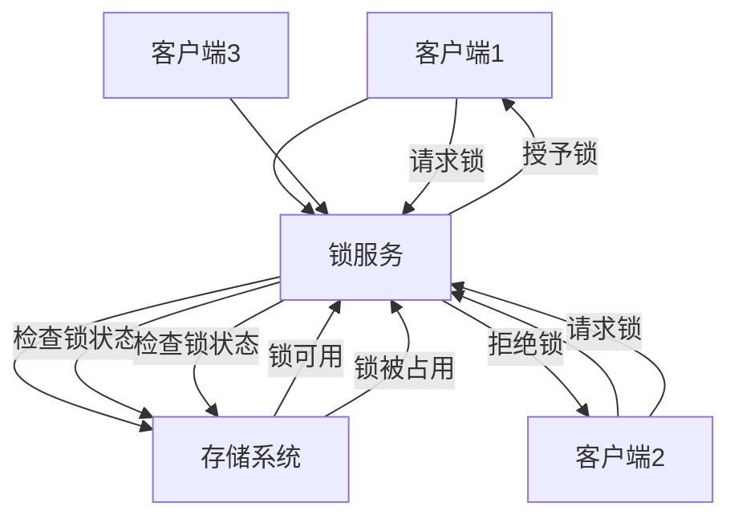

## 一、分布式锁概述

### 1.1 什么是分布式锁

**分布式锁**是一种在分布式系统中用于协调多个节点对共享资源访问的机制，确保在同一时间只有一个节点能够访问特定资源，避免并发冲突。在分布式环境中，由于节点之间的独立性，传统的进程内锁（如synchronized、ReentrantLock）无法跨节点工作，因此需要专门的分布式锁机制。

### 1.2 分布式锁的重要性

- **数据一致性**：确保多个节点对共享数据的操作保持一致
- **资源保护**：防止多个节点同时修改同一资源导致的数据损坏
- **并发控制**：协调分布式系统中的并发操作
- **系统可靠性**：避免因并发操作导致的系统异常

### 1.3 分布式锁的基本要求

- **互斥性**：在任何时刻，只有一个客户端能够持有锁
- **安全性**：锁只能被持有它的客户端释放
- **活性**：锁最终会被释放，不会导致死锁
- **容错性**：部分节点故障不影响锁的正常工作
- **性能**：获取和释放锁的操作应该高效

## 二、分布式锁原理

### 2.1 基本原理



### 2.2 锁的实现机制

#### 2.2.1 基于共享存储的实现

- **原理**：利用共享存储系统的原子操作实现锁
- **特点**：简单直接，依赖存储系统的原子性
- **示例**：基于Redis的SETNX命令

#### 2.2.2 基于共识算法的实现

- **原理**：通过分布式共识算法（如Raft、ZAB）实现锁
- **特点**：可靠性高，不依赖单点
- **示例**：基于etcd的分布式锁

#### 2.2.3 基于消息队列的实现

- **原理**：利用消息队列的顺序性实现锁
- **特点**：易于实现，适合特定场景
- **示例**：基于Kafka的分布式锁

## 三、分布式锁方案

### 3.1 基于Redis的分布式锁方案

**实现原理**：
- 使用Redis的SETNX命令实现互斥
- 使用EXPIRE命令设置锁的过期时间，避免死锁
- 使用Lua脚本保证操作的原子性

**实现步骤**：
1. 客户端尝试使用SETNX命令设置锁
2. 如果设置成功，获取锁并设置过期时间
3. 执行业务逻辑
4. 完成后释放锁（使用DEL命令）

**优点**：
- 高性能：Redis的读写速度快
- 实现简单：API简洁易用
- 可靠性：支持过期时间，避免死锁
- 可扩展性：Redis集群支持水平扩展

**缺点**：
- 依赖Redis：增加系统复杂性
- 网络开销：需要网络通信
- 锁粒度：需要合理设计锁的粒度
- 主从延迟：可能存在锁丢失的风险

**代码示例**：

```java
public class RedisDistributedLock {
    private RedisTemplate<String, String> redisTemplate;
    private String lockKey;
    private String requestId;
    private int expireTime = 30; // 默认30秒
    
    public RedisDistributedLock(RedisTemplate<String, String> redisTemplate, String lockKey, String requestId) {
        this.redisTemplate = redisTemplate;
        this.lockKey = lockKey;
        this.requestId = requestId;
    }
    
    public boolean acquire() {
        // 使用SETNX命令获取锁，并设置过期时间
        Boolean result = redisTemplate.execute((RedisCallback<Boolean>) connection -> {
            byte[] key = lockKey.getBytes();
            byte[] value = requestId.getBytes();
            // SET key value NX EX seconds
            return connection.set(key, value, Expiration.seconds(expireTime), RedisStringCommands.SetOption.SET_IF_ABSENT);
        });
        return result != null && result;
    }
    
    public boolean release() {
        // 使用Lua脚本释放锁，确保原子性
        String script = "if redis.call('get', KEYS[1]) == ARGV[1] then return redis.call('del', KEYS[1]) else return 0 end";
        Object result = redisTemplate.execute(new DefaultRedisScript<>(script, Long.class), 
                Collections.singletonList(lockKey), requestId);
        return result != null && Long.valueOf(1).equals(result);
    }
}
```

### 3.2 基于etcd的分布式锁方案

**实现原理**：
- 利用etcd的键值存储和监听机制
- 通过创建唯一的键实现互斥
- 使用租约（Lease）机制自动释放锁

**实现步骤**：
1. 客户端在etcd中创建带有租约的键
2. 如果创建成功，获取锁
3. 定期续约以保持锁
4. 完成后删除键释放锁

**优点**：
- 可靠性高：基于Raft算法，确保一致性
- 自动释放：租约过期自动释放锁
- 监听机制：支持锁释放的通知
- 安全性：支持权限控制

**缺点**：
- 性能：相比Redis，性能稍低
- 复杂性：实现相对复杂
- 依赖etcd：增加系统复杂性

**代码示例**：

```go
import (
    "context"
    "time"
    "go.etcd.io/etcd/client/v3"
    "go.etcd.io/etcd/client/v3/concurrency"
)

func acquireLock(client *clientv3.Client, lockName string, ttl int) (*concurrency.Mutex, error) {
    // 创建会话
    session, err := concurrency.NewSession(client, concurrency.WithTTL(ttl))
    if err != nil {
        return nil, err
    }
    
    // 创建互斥锁
    mutex := concurrency.NewMutex(session, lockName)
    
    // 获取锁
    ctx, cancel := context.WithTimeout(context.Background(), time.Duration(ttl)*time.Second)
    defer cancel()
    
    if err := mutex.Lock(ctx); err != nil {
        session.Close()
        return nil, err
    }
    
    return mutex, nil
}

func releaseLock(mutex *concurrency.Mutex) error {
    if err := mutex.Unlock(context.Background()); err != nil {
        return err
    }
    return mutex.Session().Close()
}
```

### 3.3 基于ZooKeeper的分布式锁方案

**实现原理**：
- 利用ZooKeeper的顺序临时节点
- 通过创建顺序节点实现公平锁
- 监听前一个节点的删除事件

**实现步骤**：
1. 客户端在指定路径下创建顺序临时节点
2. 获取所有子节点，判断自己是否为最小节点
3. 如果是最小节点，获取锁
4. 否则，监听前一个节点的删除事件
5. 完成后删除自己的节点释放锁

**优点**：
- 公平性：按顺序获取锁
- 可靠性：基于ZAB协议，确保一致性
- 自动释放：会话过期自动删除节点
- 监听机制：支持锁释放的通知

**缺点**：
- 性能：相比Redis，性能较低
- 复杂性：实现相对复杂
- 依赖ZooKeeper：增加系统复杂性
- 网络开销：需要多次网络通信

**代码示例**：

```java
public class ZKDistributedLock {
    private ZooKeeper zk;
    private String lockPath;
    private String lockName;
    private String currentPath;
    private CountDownLatch latch;
    
    public ZKDistributedLock(ZooKeeper zk, String lockPath, String lockName) {
        this.zk = zk;
        this.lockPath = lockPath;
        this.lockName = lockName;
    }
    
    public boolean acquire() throws Exception {
        // 创建顺序临时节点
        currentPath = zk.create(lockPath + "/" + lockName + "-", new byte[0], 
                ZooDefs.Ids.OPEN_ACL_UNSAFE, CreateMode.EPHEMERAL_SEQUENTIAL);
        
        // 获取所有子节点
        List<String> children = zk.getChildren(lockPath, false);
        Collections.sort(children);
        
        // 判断是否为最小节点
        if (currentPath.equals(lockPath + "/" + children.get(0))) {
            return true;
        }
        
        // 找到前一个节点
        String previousNode = null;
        for (int i = 0; i < children.size(); i++) {
            if (lockPath + "/" + children.get(i).equals(currentPath)) {
                previousNode = children.get(i-1);
                break;
            }
        }
        
        // 监听前一个节点
        if (previousNode != null) {
            latch = new CountDownLatch(1);
            zk.exists(lockPath + "/" + previousNode, new Watcher() {
                @Override
                public void process(WatchedEvent event) {
                    if (event.getType() == Event.EventType.NodeDeleted) {
                        latch.countDown();
                    }
                }
            });
            latch.await();
        }
        
        return true;
    }
    
    public void release() throws Exception {
        zk.delete(currentPath, -1);
    }
}
```

## 四、大厂落地案例

### 4.1 阿里巴巴

**方案**：基于自研的分布式锁服务实现

**核心特点**：
- **高性能**：基于自研的分布式锁服务，支持高并发
- **可靠性**：多副本部署，确保服务可用
- **灵活性**：支持多种锁类型和粒度
- **监控告警**：完善的监控和告警机制

**应用场景**：
- 电商平台的库存管理
- 支付系统的交易处理
- 秒杀活动的并发控制
- 分布式任务调度

### 4.2 腾讯

**方案**：基于Redis和etcd的混合方案

**核心特点**：
- **双保险**：同时使用Redis和etcd，提高可靠性
- **性能优化**：热点场景使用Redis，关键场景使用etcd
- **自动切换**：当Redis不可用时，自动切换到etcd
- **监控体系**：完善的监控和故障自动恢复

**应用场景**：
- 游戏业务的资源管理
- 社交平台的并发操作
- 云服务的资源调度
- 金融业务的交易处理

### 4.3 字节跳动

**方案**：基于etcd的分布式锁服务

**核心特点**：
- **高可用**：多地域部署，确保服务可用
- **性能优化**：针对etcd进行性能优化
- **易用性**：提供统一的锁服务接口
- **可观测性**：完善的监控和日志

**应用场景**：
- 内容平台的并发编辑
- 推荐系统的资源调度
- 广告系统的库存管理
- 内部服务的并发控制

## 五、最佳实践

### 5.1 实施建议

- **选择合适的实现**：根据业务特点选择合适的分布式锁实现
- **合理设计锁粒度**：避免锁粒度过大导致性能问题，过小导致竞态条件
- **设置合理的过期时间**：根据业务处理时间设置合适的过期时间
- **实现锁的重入**：支持同一客户端多次获取同一把锁
- **处理锁竞争**：实现合理的重试机制，避免活锁

### 5.2 性能优化

- **减少锁持有时间**：尽量缩短持有锁的时间
- **使用异步操作**：非关键操作使用异步处理
- **批量操作**：合并多个操作，减少锁的获取次数
- **本地缓存**：对于频繁访问的数据使用本地缓存
- **读写分离**：区分读写操作，使用不同的锁策略

### 5.3 安全性考虑

- **防止死锁**：设置合理的过期时间
- **防止锁饥饿**：实现公平的锁获取机制
- **防止锁泄露**：确保在异常情况下也能释放锁
- **防止锁误释放**：使用唯一标识确保只有锁的持有者才能释放锁
- **权限控制**：对锁操作进行权限控制

### 5.4 常见问题及解决方案

| 问题 | 解决方案 |
|------|----------|
| 死锁 | 设置合理的过期时间，实现锁的自动释放 |
| 锁竞争激烈 | 优化锁粒度，使用分段锁，实现背压机制 |
| 锁丢失 | 使用可靠的存储系统，实现锁的备份机制 |
| 性能瓶颈 | 优化锁操作，减少锁持有时间，使用本地缓存 |
| 网络延迟 | 实现合理的重试机制，设置适当的超时时间 |

## 六、总结

分布式锁是分布式系统中确保数据一致性和并发控制的重要机制。选择合适的分布式锁方案需要考虑系统规模、性能要求、可靠性等因素。不同的实现方案各有优缺点，需要根据具体的业务场景进行选择。

**核心要点**：
- 选择适合业务场景的分布式锁实现
- 合理设计锁的粒度和过期时间
- 确保锁的安全性和可靠性
- 优化锁操作的性能
- 建立完善的监控和告警机制

通过合理的分布式锁方案，企业可以确保分布式系统中共享资源的安全访问，避免并发冲突导致的数据不一致问题，提高系统的可靠性和稳定性。在实际应用中，需要根据业务特点和技术栈选择最合适的方案，并持续优化和改进。