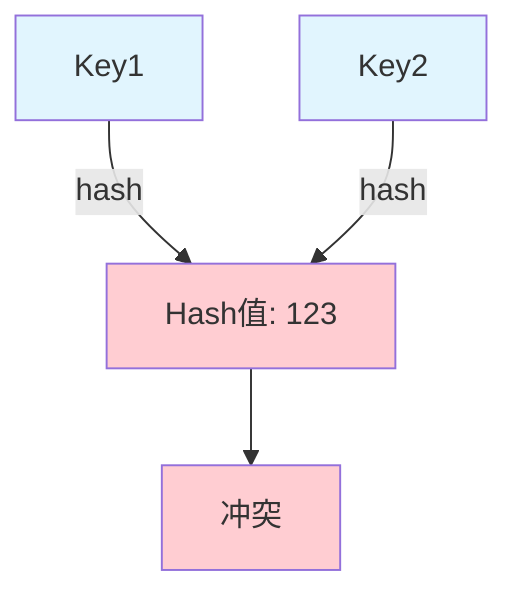
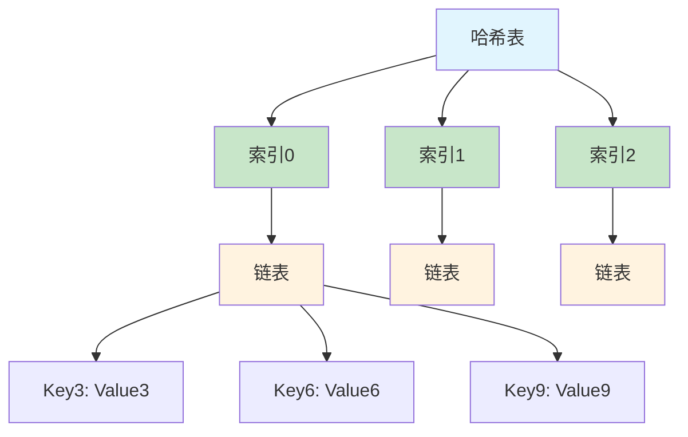
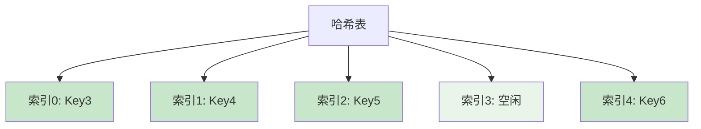
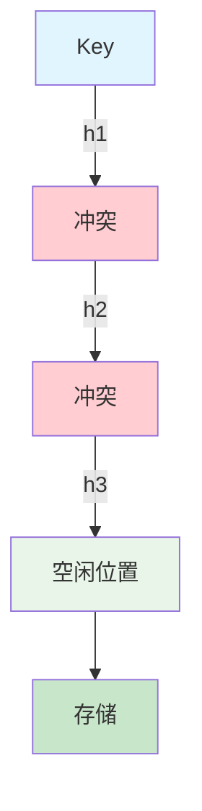

## 一、哈希冲突概念

### 什么是哈希冲突？

**哈希冲突**是指不同的键（Key）通过相同的哈希函数计算出相同的哈希值（Hash Result）的情况。



### 为什么会发生哈希冲突？

1. **哈希函数的压缩性**：哈希函数将任意长度的输入映射到固定长度的输出
2. **鸽巢原理**：当输入空间大于输出空间时，必然存在不同输入映射到同一输出
3. **哈希函数设计**：不同的哈希函数产生冲突的概率不同

### 哈希冲突的影响

- **查找性能下降**：需要额外的比较操作
- **存储效率降低**：可能需要额外的空间来处理冲突
- **数据结构复杂度增加**：需要实现冲突解决策略

## 二、哈希冲突解决方法

### 1. 链地址法（Separate Chaining）

**核心思想：** 将哈希值相同的键值对存储在同一个链表中。

#### 工作原理



#### 详细步骤

1. **计算哈希值**：对输入的Key计算哈希值
2. **确定桶位置**：通过哈希值确定存储桶的位置
3. **存储数据**：将键值对存储在对应桶的链表中
4. **查找数据**：
   - 计算Key的哈希值找到对应桶
   - 遍历链表，比较Key找到对应值

#### 示例说明

**哈希函数**：`hash(k) = k % 3`

| Key | 哈希值 | 存储位置 |
|-----|--------|----------|
| 3   | 0      | 桶0的链表 |
| 6   | 0      | 桶0的链表 |
| 9   | 0      | 桶0的链表 |
| 4   | 1      | 桶1的链表 |
| 7   | 1      | 桶1的链表 |
| 5   | 2      | 桶2的链表 |

#### 代码实现

```java
public class SeparateChainingHashTable<K, V> {
    
    private static class Node<K, V> {
        K key;
        V value;
        Node<K, V> next;
        
        Node(K key, V value) {
            this.key = key;
            this.value = value;
        }
    }
    
    private Node<K, V>[] table;
    private int size;
    private int capacity;
    
    public SeparateChainingHashTable(int capacity) {
        this.capacity = capacity;
        this.table = new Node[capacity];
        this.size = 0;
    }
    
    private int hash(K key) {
        return Math.abs(key.hashCode()) % capacity;
    }
    
    public void put(K key, V value) {
        int index = hash(key);
        Node<K, V> node = table[index];
        
        // 检查是否已存在
        while (node != null) {
            if (node.key.equals(key)) {
                node.value = value;
                return;
            }
            node = node.next;
        }
        
        // 不存在，添加到链表头部
        Node<K, V> newNode = new Node<>(key, value);
        newNode.next = table[index];
        table[index] = newNode;
        size++;
        
        // 扩容
        if (size > capacity * 0.75) {
            resize();
        }
    }
    
    public V get(K key) {
        int index = hash(key);
        Node<K, V> node = table[index];
        
        while (node != null) {
            if (node.key.equals(key)) {
                return node.value;
            }
            node = node.next;
        }
        
        return null;
    }
    
    private void resize() {
        // 实现扩容逻辑
    }
}
```

#### 优缺点分析

| 优点 | 缺点 |
|------|------|
| 实现简单 | 链表过长时查找效率下降 |
| 空间利用率高 | 需要额外的链表节点空间 |
| 插入删除方便 | 缓存局部性差 |
| 支持任意数量的元素 | 链表操作开销 |

#### 实际应用

- **Java的HashMap**：使用链表+红黑树（当链表长度超过8时）
- **Golang的map**：使用桶（bmap）存储多个键值对
- **Redis的字典**：使用链地址法解决冲突

### 2. 开放定址法（Open Addressing）

**核心思想：** 当发生冲突时，在哈希表中寻找下一个空闲位置。

#### 2.1 线性探测法（Linear Probing）

**工作原理：** 当冲突发生时，依次检查下一个位置，直到找到空闲位置。



**探测序列：** `h(k), h(k)+1, h(k)+2, ..., mod m`

**示例：**
- 哈希函数：`hash(k) = k % 5`
- 插入顺序：3, 4, 5, 6
- Key 3: 位置0
- Key 4: 位置4
- Key 5: 位置0（冲突）→ 位置1
- Key 6: 位置1（冲突）→ 位置2

**代码实现：**

```java
public class LinearProbingHashTable<K, V> {
    
    private K[] keys;
    private V[] values;
    private int size;
    private int capacity;
    private static final Object DELETED = new Object();
    
    public LinearProbingHashTable(int capacity) {
        this.capacity = capacity;
        this.keys = (K[]) new Object[capacity];
        this.values = (V[]) new Object[capacity];
        this.size = 0;
    }
    
    private int hash(K key) {
        return Math.abs(key.hashCode()) % capacity;
    }
    
    public void put(K key, V value) {
        int index = hash(key);
        
        // 线性探测
        while (keys[index] != null && !keys[index].equals(key)) {
            index = (index + 1) % capacity;
        }
        
        if (keys[index] == null || keys[index] == DELETED) {
            size++;
        }
        
        keys[index] = key;
        values[index] = value;
        
        // 扩容
        if (size > capacity * 0.5) {
            resize();
        }
    }
    
    public V get(K key) {
        int index = hash(key);
        
        while (keys[index] != null) {
            if (keys[index].equals(key)) {
                return values[index];
            }
            index = (index + 1) % capacity;
        }
        
        return null;
    }
    
    private void resize() {
        // 实现扩容逻辑
    }
}
```

#### 2.2 二次探测法（Quadratic Probing）

**工作原理：** 当冲突发生时，使用二次函数计算下一个位置。

**探测序列：** `h(k), h(k)+1², h(k)+2², h(k)+3², ..., mod m`

**优点：** 减少了线性探测的聚集现象
**缺点：** 可能无法找到空闲位置（当表大小为质数时更好）

#### 2.3 双重哈希法（Double Hashing）

**工作原理：** 使用两个哈希函数，第二个哈希函数用于计算探测步长。

**探测序列：** `h1(k), (h1(k)+h2(k))%m, (h1(k)+2*h2(k))%m, ...`

**优点：** 探测分布更均匀，减少聚集
**缺点：** 实现复杂，需要选择合适的第二个哈希函数

#### 开放定址法优缺点

| 优点 | 缺点 |
|------|------|
| 内存利用率高 | 插入删除复杂 |
| 缓存局部性好 | 容易产生聚集现象 |
| 查找速度快（无链表） | 表满时性能急剧下降 |
| 无额外链表开销 | 需要处理删除标记 |

### 3. 再哈希法（Re-Hashing）

**核心思想：** 当发生冲突时，使用不同的哈希函数重新计算哈希地址。

#### 工作原理



#### 详细步骤

1. **初始哈希**：使用第一个哈希函数计算位置
2. **冲突处理**：如果冲突，使用第二个哈希函数
3. **重复**：直到找到空闲位置或所有哈希函数都尝试过
4. **查找**：按相同的顺序使用哈希函数查找

#### 代码实现

```java
public class ReHashingHashTable<K, V> {
    
    private K[] keys;
    private V[] values;
    private int size;
    private int capacity;
    private HashFunction[] hashFunctions;
    
    public ReHashingHashTable(int capacity) {
        this.capacity = capacity;
        this.keys = (K[]) new Object[capacity];
        this.values = (V[]) new Object[capacity];
        this.size = 0;
        this.hashFunctions = new HashFunction[3];
        initHashFunctions();
    }
    
    private void initHashFunctions() {
        hashFunctions[0] = k -> Math.abs(k.hashCode()) % capacity;
        hashFunctions[1] = k -> (Math.abs(k.hashCode()) * 31) % capacity;
        hashFunctions[2] = k -> (Math.abs(k.hashCode()) * 17 + 3) % capacity;
    }
    
    public void put(K key, V value) {
        for (int i = 0; i < hashFunctions.length; i++) {
            int index = hashFunctions[i].hash(key);
            if (keys[index] == null) {
                keys[index] = key;
                values[index] = value;
                size++;
                return;
            } else if (keys[index].equals(key)) {
                values[index] = value;
                return;
            }
        }
        
        // 所有哈希函数都冲突，需要扩容
        resize();
        put(key, value);
    }
    
    public V get(K key) {
        for (int i = 0; i < hashFunctions.length; i++) {
            int index = hashFunctions[i].hash(key);
            if (keys[index] != null && keys[index].equals(key)) {
                return values[index];
            }
        }
        return null;
    }
    
    private void resize() {
        // 实现扩容逻辑
    }
    
    @FunctionalInterface
    private interface HashFunction {
        int hash(K key);
    }
}
```

#### 优缺点分析

| 优点 | 缺点 |
|------|------|
| 分布均匀 | 实现复杂 |
| 无聚集现象 | 查找时间不稳定 |
| 内存利用率高 | 需要多个哈希函数 |
| 无额外空间开销 | 哈希函数设计困难 |

## 三、性能对比

### 时间复杂度对比

| 解决方法 | 平均查找 | 最坏查找 | 插入 | 删除 |
|---------|----------|----------|------|------|
| **链地址法** | O(1 + α) | O(n) | O(1) | O(1) |
| **线性探测** | O(1/(1-α)) | O(n) | O(1) | O(1) |
| **二次探测** | O(1/(1-α)) | O(n) | O(1) | O(1) |
| **双重哈希** | O(1/(1-α)) | O(n) | O(1) | O(1) |
| **再哈希法** | O(k) | O(k) | O(k) | O(k) |

**注：** α为负载因子（元素数/表大小），k为哈希函数数量

### 空间复杂度对比

| 解决方法 | 空间复杂度 | 额外空间 |
|---------|------------|----------|
| **链地址法** | O(n) | O(n)（链表节点） |
| **开放定址法** | O(m) | O(1)（m为表大小） |
| **再哈希法** | O(m) | O(1) |

### 适用场景对比

| 解决方法 | 适用场景 | 不适用场景 |
|---------|----------|------------|
| **链地址法** | 元素数量不确定 | 内存受限 |
| **线性探测** | 查找频繁 | 插入删除频繁 |
| **二次探测** | 均匀分布数据 | 大规模数据 |
| **双重哈希** | 高性能要求 | 实现复杂度敏感 |
| **再哈希法** | 小规模数据 | 高并发场景 |

## 四、哈希冲突的预防

### 1. 选择合适的哈希函数

**好的哈希函数应具备：**
- **雪崩效应**：输入微小变化导致输出显著变化
- **均匀分布**：哈希值在输出空间均匀分布
- **计算高效**：哈希计算速度快

**常见哈希函数：**
- **MD5**：128位哈希值，安全性高
- **SHA-1**：160位哈希值，安全性更高
- **MurmurHash**：高速哈希函数，适合哈希表
- **FNV**：简单高效，适合小数据

### 2. 合理设置负载因子

**负载因子** = 元素数量 / 表大小

| 负载因子 | 性能影响 | 适用算法 |
|---------|----------|----------|
| < 0.5 | 性能最佳 | 开放定址法 |
| 0.5-0.7 | 平衡状态 | 所有算法 |
| > 0.7 | 性能下降 | 链地址法 |
| > 0.9 | 严重退化 | 不推荐 |

### 3. 动态扩容

**扩容策略：**
- 当负载因子超过阈值时（通常0.75）
- 新表大小通常为原大小的2倍
- 需要重新计算所有元素的哈希值

**扩容步骤：**
1. 创建新的更大的哈希表
2. 遍历原表所有元素
3. 重新计算哈希值并插入新表
4. 释放原表内存

### 4. 其他预防措施

- **使用质数作为表大小**：减少冲突概率
- **位运算优化**：使用位掩码代替取模运算
- **缓存友好设计**：提高内存局部性

## 五、实际应用案例

### 1. Java HashMap

**冲突解决：** 链地址法（链表+红黑树）

**特点：**
- 当链表长度超过8时，自动转换为红黑树
- 负载因子阈值0.75
- 初始容量16，每次扩容为2倍

**源码分析：**

```java
// Java HashMap的put方法核心逻辑
public V put(K key, V value) {
    return putVal(hash(key), key, value, false, true);
}

final V putVal(int hash, K key, V value, boolean onlyIfAbsent, boolean evict) {
    Node<K,V>[] tab; Node<K,V> p; int n, i;
    if ((tab = table) == null || (n = tab.length) == 0)
        n = (tab = resize()).length;
    if ((p = tab[i = (n - 1) & hash]) == null)
        tab[i] = newNode(hash, key, value, null);
    else {
        Node<K,V> e; K k;
        if (p.hash == hash && ((k = p.key) == key || (key != null && key.equals(k))))
            e = p;
        else if (p instanceof TreeNode)
            e = ((TreeNode<K,V>)p).putTreeVal(this, tab, hash, key, value);
        else {
            for (int binCount = 0; ; ++binCount) {
                if ((e = p.next) == null) {
                    p.next = newNode(hash, key, value, null);
                    if (binCount >= TREEIFY_THRESHOLD - 1) // -1 for 1st
                        treeifyBin(tab, hash);
                    break;
                }
                if (e.hash == hash && ((k = e.key) == key || (key != null && key.equals(k))))
                    break;
                p = e;
            }
        }
        if (e != null) { // existing mapping for key
            V oldValue = e.value;
            if (!onlyIfAbsent || oldValue == null)
                e.value = value;
            afterNodeAccess(e);
            return oldValue;
        }
    }
    ++modCount;
    if (++size > threshold)
        resize();
    afterNodeInsertion(evict);
    return null;
}
```

### 2. Golang Map

**冲突解决：** 链地址法（桶结构）

**特点：**
- 使用桶（bmap）存储多个键值对
- 每个桶最多存储8个键值对
- 超过8个时，使用溢出桶
- 负载因子阈值6.5

**核心结构：**

```go
type hmap struct {
    count     int            // 元素数量
    flags     uint8          // 状态标志
    B         uint8          // 桶数量的对数（2^B）
    noverflow uint16         // 溢出桶数量
    hash0     uint32         // 哈希种子
    buckets   unsafe.Pointer // 桶数组
    oldbuckets unsafe.Pointer // 扩容时的旧桶
    nevacuate uintptr        // 扩容进度
    extra     *mapextra      // 额外信息
}

type bmap struct {
    tophash [bucketCnt]uint8 // 哈希值的高8位
    // 后续是键值对存储区
}
```

### 3. Redis 字典

**冲突解决：** 链地址法

**特点：**
- 渐进式rehash，避免阻塞
- 两个哈希表同时存在
- 逐步迁移数据

**rehash过程：**
1. 创建新的哈希表（大小为2的幂）
2. 同时使用新旧哈希表
3. 逐步将旧表数据迁移到新表
4. 迁移完成后删除旧表

## 六、性能优化技巧

### 1. 哈希函数优化

**快速哈希函数：**
- **MurmurHash3**：专为哈希表设计，速度快
- **CityHash**：Google开发，适合大键
- **xxHash**：高性能哈希函数

**代码示例（MurmurHash3）：**

```java
public static int murmur32(byte[] data) {
    int h = 0xdeadbeef;
    final int c1 = 0xcc9e2d51;
    final int c2 = 0x1b873593;
    
    int len = data.length;
    int i = 0;
    
    while (i + 4 <= len) {
        int k = ((data[i] & 0xff) << 24) |
                ((data[i+1] & 0xff) << 16) |
                ((data[i+2] & 0xff) << 8) |
                (data[i+3] & 0xff);
        
        k *= c1;
        k = (k << 15) | (k >>> 17);
        k *= c2;
        
        h ^= k;
        h = (h << 13) | (h >>> 19);
        h = h * 5 + 0xe6546b64;
        
        i += 4;
    }
    
    // 处理剩余字节
    int k = 0;
    switch (len % 4) {
        case 3: k ^= (data[i+2] & 0xff) << 16;
        case 2: k ^= (data[i+1] & 0xff) << 8;
        case 1: k ^= (data[i] & 0xff);
                k *= c1;
                k = (k << 15) | (k >>> 17);
                k *= c2;
                h ^= k;
    }
    
    h ^= len;
    h ^= h >>> 16;
    h *= 0x85ebca6b;
    h ^= h >>> 13;
    h *= 0xc2b2ae35;
    h ^= h >>> 16;
    
    return h;
}
```

### 2. 内存优化

**减少内存碎片：**
- 使用对象池复用链表节点
- 预分配合适的容量
- 定期清理无效数据

**内存布局优化：**
- 紧凑的键值对存储
- 减少指针开销
- 利用内存对齐

### 3. 并发优化

**线程安全的哈希表：**
- 使用分段锁（ConcurrentHashMap）
- 读写锁分离
- CAS操作优化

**无锁哈希表：**
- 使用原子操作
- 乐观并发控制
- 无锁链表

### 4. 查询优化

**缓存友好：**
- 桶大小对齐到缓存行
- 顺序访问模式
- 预取技术

**索引优化：**
- 局部性原理
- 哈希值缓存
- 快速路径优化

## 七、常见问题与解决方案

### 1. 哈希表性能退化

**问题：** 哈希冲突严重导致性能下降

**解决方案：**
- 重新设计哈希函数
- 增加表大小
- 采用更高效的冲突解决策略

### 2. 内存占用过高

**问题：** 哈希表占用过多内存

**解决方案：**
- 调整负载因子
- 使用更紧凑的数据结构
- 定期清理过期数据

### 3. 并发安全问题

**问题：** 多线程操作哈希表导致数据不一致

**解决方案：**
- 使用线程安全的哈希表
- 加锁保护
- 无锁设计

### 4. 哈希函数碰撞攻击

**问题：** 恶意构造键值导致大量冲突

**解决方案：**
- 使用加盐哈希
- 随机化哈希种子
- 监控异常访问模式

## 八、未来发展趋势

### 1. 智能哈希函数

- 基于机器学习的哈希函数设计
- 自适应哈希函数
- 针对特定数据分布的优化

### 2. 硬件加速

- GPU加速哈希计算
- 专用哈希硬件
- 内存层级优化

### 3. 新的数据结构

- 布隆过滤器与哈希表结合
- 跳表与哈希表混合
- 分布式哈希表（DHT）

### 4. 云原生优化

- 容器化环境下的哈希表优化
- 分布式环境的一致性哈希
- 边缘计算场景的轻量级哈希

## 九、总结

### 核心要点

1. **哈希冲突是不可避免的**：由于鸽巢原理，哈希冲突必然存在
2. **选择合适的解决方法**：根据具体场景选择链地址法、开放定址法或再哈希法
3. **性能与空间的平衡**：不同解决方法在时间复杂度和空间复杂度上有不同的权衡
4. **优化是关键**：通过合理的哈希函数、负载因子和扩容策略提高性能
5. **实际应用多样化**：不同编程语言和系统采用不同的冲突解决策略

### 最佳实践

- **链地址法**：首选方案，实现简单，性能稳定
- **开放定址法**：内存受限场景，缓存友好
- **再哈希法**：小规模数据，要求均匀分布
- **动态扩容**：根据负载因子自动调整大小
- **监控与调优**：定期分析哈希表性能，优化参数

哈希冲突是哈希表设计中的核心问题，理解和掌握不同的冲突解决策略对于构建高性能、可靠的系统至关重要。通过合理的设计和优化，可以将哈希冲突的影响降到最低，充分发挥哈希表的性能优势。

## 参考资料

- [哈希表维基百科](https://en.wikipedia.org/wiki/Hash_table)
- [Java HashMap源码分析](https://github.com/openjdk/jdk/blob/master/src/java.base/share/classes/java/util/HashMap.java)
- [Golang Map实现](https://github.com/golang/go/blob/master/src/runtime/map.go)
- [Redis字典实现](https://github.com/redis/redis/blob/unstable/src/dict.c)
- [MurmurHash算法](https://github.com/aappleby/smhasher)
- [哈希冲突攻击防御](https://owasp.org/www-community/attacks/Hash_Collision_Attack)
