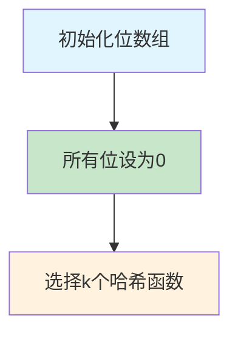
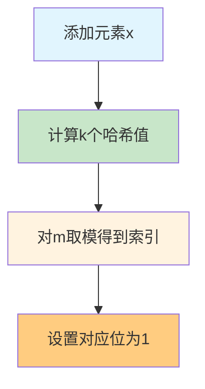
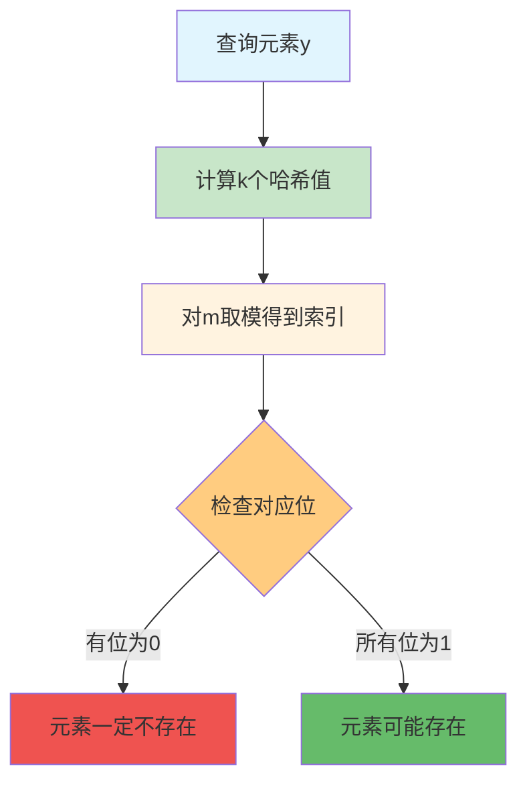

## 一、布隆过滤器概述

### 什么是布隆过滤器？

**布隆过滤器（Bloom Filter）** 是一种空间效率极高的概率型数据结构，用于快速判断一个元素是否在一个集合中。它由 Burton Howard Bloom 于 1970 年提出，主要用于解决大规模数据集合的 membership 查询问题。

### 核心特点

- **空间效率高**：相比传统数据结构（如哈希表、平衡树），布隆过滤器使用位数组存储数据，空间占用极小
- **查询速度快**：时间复杂度为 O(k)，其中 k 是哈希函数的数量
- **概率性判断**：可能会出现误判（False Positive），但不会出现漏判（False Negative）
- **不支持删除**：一旦元素被添加，无法从布隆过滤器中删除

### 应用场景

- **缓存穿透防护**：快速判断请求的键是否存在于数据库中，避免对不存在的键进行数据库查询
- **爬虫 URL 去重**：避免重复爬取相同的网页
- **垃圾邮件过滤**：判断邮件地址是否在黑名单中
- **分布式系统中的成员查询**：如判断一个用户是否是某个集群的成员
- **CDN 缓存失效判断**：判断资源是否需要从源站获取

## 二、布隆过滤器原理

### 基本组成

布隆过滤器由两部分组成：

1. **位数组（Bit Array）**：长度为 m 的数组，每个元素只能是 0 或 1
2. **k 个哈希函数**：用于将输入元素映射到位数组的不同位置

### 工作流程

#### 1. 初始化

- 创建一个长度为 m 的位数组，所有位初始化为 0
- 选择 k 个不同的哈希函数



#### 2. 添加元素

1. 对于要添加的元素 x，使用 k 个哈希函数分别计算哈希值
2. 将每个哈希值对位数组长度 m 取模，得到 k 个索引位置
3. 将位数组中对应位置的位设置为 1



#### 3. 查询元素

1. 对于要查询的元素 y，使用 k 个哈希函数分别计算哈希值
2. 将每个哈希值对位数组长度 m 取模，得到 k 个索引位置
3. 检查位数组中对应位置的位：
   - 如果有任何一个位为 0，则元素**一定不存在**于集合中
   - 如果所有位都为 1，则元素**可能存在**于集合中（存在误判的可能）



### 数学原理

#### 误判率计算

布隆过滤器的误判率 P 可以通过以下公式计算：

$$ P \approx \left(1 - e^{-\frac{kn}{m}}\right)^k $$

其中：
- n：集合中的元素数量
- m：位数组长度
- k：哈希函数数量

#### 最优哈希函数数量

当给定 n 和 m 时，最优的哈希函数数量 k 为：

$$ k = \frac{m}{n} \ln 2 $$

#### 所需位数组长度

当给定 n 和期望的误判率 P 时，所需的位数组长度 m 为：

$$ m = -\frac{n \ln P}{(\ln 2)^2} $$

## 三、布隆过滤器实现

### 基本实现

#### Go 语言实现

```go
package bloom

import (
	"crypto/md5"
	"encoding/binary"
	"math"
)

type BloomFilter struct {
	bits  []bool
	size  int     // 位数组大小
	hashs int     // 哈希函数数量
	n     int     // 元素数量
}

// NewBloomFilter 创建一个新的布隆过滤器
// n: 预期元素数量
// p: 期望的误判率
func NewBloomFilter(n int, p float64) *BloomFilter {
	// 计算所需位数组大小
	m := int(-float64(n) * math.Log(p) / (math.Ln2 * math.Ln2))
	// 计算最优哈希函数数量
	k := int(float64(m) / float64(n) * math.Ln2)
	
	return &BloomFilter{
		bits:  make([]bool, m),
		size:  m,
		hashs: k,
		n:     0,
	}
}

// hash 计算元素的哈希值
func (bf *BloomFilter) hash(data []byte, seed int) int {
	h := md5.New()
	h.Write(data)
	h.Write([]byte(string(seed)))
	hash := h.Sum(nil)
	return int(binary.BigEndian.Uint32(hash)) % bf.size
}

// Add 添加元素到布隆过滤器
func (bf *BloomFilter) Add(data []byte) {
	for i := 0; i < bf.hashs; i++ {
		index := bf.hash(data, i)
		bf.bits[index] = true
	}
	bf.n++
}

// Contains 检查元素是否可能存在于布隆过滤器中
func (bf *BloomFilter) Contains(data []byte) bool {
	for i := 0; i < bf.hashs; i++ {
		index := bf.hash(data, i)
		if !bf.bits[index] {
			return false
		}
	}
	return true
}

// EstimatedFalsePositiveRate 估计当前误判率
func (bf *BloomFilter) EstimatedFalsePositiveRate() float64 {
	k := float64(bf.hashs)
	n := float64(bf.n)
	m := float64(bf.size)
	return math.Pow(1-math.Exp(-k*n/m), k)
}
```

#### Python 实现

```python
import math
import hashlib

class BloomFilter:
    def __init__(self, n, p):
        """
        初始化布隆过滤器
        n: 预期元素数量
        p: 期望的误判率
        """
        # 计算所需位数组大小
        self.m = int(-n * math.log(p) / (math.log(2) ** 2))
        # 计算最优哈希函数数量
        self.k = int(self.m / n * math.log(2))
        # 初始化位数组
        self.bits = [False] * self.m
        self.n = 0  # 实际元素数量
    
    def _hash(self, data, seed):
        """计算哈希值"""
        h = hashlib.md5()
        h.update(data)
        h.update(str(seed).encode())
        return int(h.hexdigest(), 16) % self.m
    
    def add(self, data):
        """添加元素"""
        if isinstance(data, str):
            data = data.encode()
        for i in range(self.k):
            index = self._hash(data, i)
            self.bits[index] = True
        self.n += 1
    
    def contains(self, data):
        """检查元素是否可能存在"""
        if isinstance(data, str):
            data = data.encode()
        for i in range(self.k):
            index = self._hash(data, i)
            if not self.bits[index]:
                return False
        return True
    
    def estimated_false_positive_rate(self):
        """估计当前误判率"""
        k = self.k
        n = self.n
        m = self.m
        return (1 - math.exp(-k * n / m)) ** k
```

### 优化实现

#### 1. 布谷鸟过滤器（Cuckoo Filter）

布谷鸟过滤器是布隆过滤器的改进版本，支持删除操作，同时保持了较低的空间复杂度。

#### 2. 计数布隆过滤器（Counting Bloom Filter）

计数布隆过滤器使用计数器数组代替位数组，支持删除操作，但空间复杂度更高。

#### 3. 分层布隆过滤器（Layered Bloom Filter）

分层布隆过滤器通过多个层级的布隆过滤器，进一步降低误判率。

## 四、布隆过滤器的优缺点

### 优点

1. **空间效率高**：使用位数组存储，空间占用极小
2. **查询速度快**：时间复杂度为 O(k)，常数时间查询
3. **插入速度快**：同样是 O(k) 的时间复杂度
4. **支持海量数据**：可以处理大规模数据集
5. **隐私保护**：不需要存储原始数据，只存储哈希值

### 缺点

1. **误判率**：存在一定的误判概率，无法完全避免
2. **不支持删除**：传统布隆过滤器无法删除元素
3. **需要预先估计元素数量**：需要提前设置位数组大小和哈希函数数量
4. **哈希函数选择**：哈希函数的质量直接影响性能和误判率
5. **内存访问局部性差**：查询时需要访问多个分散的内存位置

## 五、布隆过滤器与其他数据结构的比较

| 数据结构 | 空间复杂度 | 时间复杂度（查询） | 时间复杂度（插入） | 误判率 | 支持删除 | 适用场景 |
|---------|-----------|------------------|------------------|--------|---------|----------|
| 布隆过滤器 | O(m) | O(k) | O(k) | 低（可调节） | 不支持 | 大规模数据的快速查询 |
| 哈希表 | O(n) | O(1) | O(1) | 无 | 支持 | 精确查询，需要存储原始数据 |
| 平衡树 | O(n) | O(log n) | O(log n) | 无 | 支持 | 需要有序遍历 |
| 位图 | O(m) | O(1) | O(1) | 无 | 支持 | 元素范围有限的情况 |
| 布谷鸟过滤器 | O(n) | O(1) | O(1) | 低 | 支持 | 需要删除操作的场景 |

## 六、布隆过滤器的实际应用

### 1. 缓存穿透防护

**问题**：恶意用户频繁请求不存在的数据，导致请求直接穿透到数据库，造成数据库压力过大。

**解决方案**：使用布隆过滤器缓存已存在的键，对于不存在的键直接返回，避免数据库查询。

**实现示例**：

```go
// 初始化布隆过滤器
bloomFilter := bloom.NewBloomFilter(1000000, 0.01) // 100万元素，1%误判率

// 加载已存在的键到布隆过滤器
for _, key := range existingKeys {
    bloomFilter.Add([]byte(key))
}

// 处理请求
func handleRequest(key string) {
    // 先检查布隆过滤器
    if !bloomFilter.Contains([]byte(key)) {
        // 键一定不存在，直接返回
        return
    }
    
    // 键可能存在，查询缓存
    value := cache.Get(key)
    if value != nil {
        return value
    }
    
    // 缓存未命中，查询数据库
    value = db.Get(key)
    if value != nil {
        // 存在，更新缓存
        cache.Set(key, value)
    }
    
    return value
}
```

### 2. 爬虫 URL 去重

**问题**：爬虫需要避免重复爬取相同的网页，否则会浪费带宽和时间。

**解决方案**：使用布隆过滤器记录已爬取的 URL，新 URL 先检查是否已存在。

**实现示例**：

```python
# 初始化布隆过滤器
bf = BloomFilter(10000000, 0.001)  # 1000万URL，0.1%误判率

# 爬取函数
def crawl(url):
    # 检查URL是否已爬取
    if bf.contains(url):
        print(f"URL {url} 已爬取，跳过")
        return
    
    # 标记为已爬取
    bf.add(url)
    
    # 爬取网页内容
    content = fetch(url)
    
    # 提取新URL
    new_urls = extract_urls(content)
    for new_url in new_urls:
        crawl(new_url)
```

### 3. 垃圾邮件过滤

**问题**：需要快速判断邮件地址是否在黑名单中。

**解决方案**：使用布隆过滤器存储黑名单邮件地址，快速判断邮件是否为垃圾邮件。

### 4. 分布式系统中的成员查询

**问题**：在分布式系统中，需要快速判断一个节点是否是集群的成员。

**解决方案**：使用布隆过滤器存储集群成员信息，节点加入或离开时更新过滤器。

## 七、布隆过滤器的优化技巧

### 1. 合理设置参数

- **位数组大小 m**：根据预期元素数量 n 和期望误判率 p 计算
- **哈希函数数量 k**：使用最优值 k = (m/n) * ln2
- **哈希函数选择**：使用多个独立的哈希函数，或使用一个哈希函数通过不同的种子生成多个哈希值

### 2. 内存优化

- **使用位操作**：直接操作位而不是字节，减少内存占用
- **压缩存储**：对于大规模布隆过滤器，可以考虑使用压缩算法
- **分片存储**：将布隆过滤器分片存储，减少单个内存块的大小

### 3. 性能优化

- **并行计算**：使用多线程或协程并行计算哈希值
- **预计算哈希值**：对于频繁查询的元素，预计算并缓存哈希值
- **批量操作**：支持批量添加和批量查询，减少函数调用开销

### 4. 误判率控制

- **动态调整**：根据实际元素数量动态调整布隆过滤器大小
- **多层布隆过滤器**：使用多个布隆过滤器，只有通过所有层级的检查才认为元素存在
- **定期重建**：当误判率超过阈值时，重建布隆过滤器

## 八、布隆过滤器的数学分析

### 误判率分析

布隆过滤器的误判率主要受以下因素影响：

1. **位数组大小 m**：m 越大，误判率越低
2. **哈希函数数量 k**：存在最优值，过大或过小都会增加误判率
3. **元素数量 n**：n 越大，误判率越高

### 空间效率分析

布隆过滤器的空间效率可以用每个元素所需的位数来衡量：

$$ \text{每个元素位数} = \frac{m}{n} = -\frac{\ln P}{(\ln 2)^2} $$

当误判率 P=0.01 时，每个元素需要约 9.6 位；当 P=0.001 时，每个元素需要约 14.4 位。

### 时间效率分析

布隆过滤器的时间复杂度为 O(k)，其中 k 是哈希函数数量。在实际应用中，k 通常在 3-10 之间，因此查询和插入操作都非常快。

## 九、布隆过滤器的变种

### 1. 计数布隆过滤器（Counting Bloom Filter）

- **原理**：使用计数器数组代替位数组，每个位置存储计数值而不是布尔值
- **特点**：支持删除操作，但空间复杂度更高
- **应用**：需要频繁删除元素的场景

### 2. 布谷鸟过滤器（Cuckoo Filter）

- **原理**：使用多个哈希表和"布谷鸟哈希"算法
- **特点**：支持删除操作，空间效率接近布隆过滤器
- **应用**：需要删除操作且空间受限的场景

### 3. 分层布隆过滤器（Layered Bloom Filter）

- **原理**：使用多个层级的布隆过滤器，每层处理不同范围的元素
- **特点**：进一步降低误判率
- **应用**：对误判率要求极高的场景

### 4. 压缩布隆过滤器（Compressed Bloom Filter）

- **原理**：对布隆过滤器进行压缩存储
- **特点**：减少网络传输和存储开销
- **应用**：分布式系统中需要传输布隆过滤器的场景

## 十、布隆过滤器的未来发展

### 1. 硬件加速

- **GPU 加速**：利用 GPU 的并行计算能力加速哈希计算
- **FPGA 实现**：使用 FPGA 硬件实现布隆过滤器，进一步提高性能
- **专用芯片**：开发专门的布隆过滤器芯片，用于高性能场景

### 2. 机器学习结合

- **自适应布隆过滤器**：使用机器学习算法自动调整布隆过滤器参数
- **智能哈希函数选择**：根据数据特征选择最优的哈希函数
- **预测性布隆过滤器**：预测可能的查询模式，提前优化布隆过滤器

### 3. 区块链应用

- **轻量级节点验证**：使用布隆过滤器验证交易和区块
- **隐私保护**：在不泄露具体信息的情况下验证数据存在性
- **扩容解决方案**：减少区块链节点的存储和计算开销

### 4. 边缘计算

- **资源受限环境**：在内存和计算资源有限的边缘设备上使用布隆过滤器
- **实时处理**：快速处理边缘设备产生的数据流
- **网络流量优化**：减少边缘设备与云端之间的数据传输

## 十一、总结

布隆过滤器是一种非常高效的概率型数据结构，通过牺牲一定的准确性来换取空间和时间效率。它在大规模数据处理、缓存优化、去重等场景中发挥着重要作用。

### 核心要点

1. **原理简单**：基于位数组和多个哈希函数
2. **空间效率高**：每个元素只需要几位存储空间
3. **查询速度快**：常数时间复杂度
4. **误判可控**：通过调整参数可以控制误判率
5. **应用广泛**：在各种需要快速 membership 查询的场景中都有应用

### 实践建议

- **合理设置参数**：根据实际需求计算最优的位数组大小和哈希函数数量
- **选择合适的哈希函数**：使用独立、均匀分布的哈希函数
- **考虑使用变种**：根据具体场景选择合适的布隆过滤器变种
- **结合其他数据结构**：在需要精确查询时，与其他数据结构结合使用
- **定期维护**：对于动态数据集，定期重建布隆过滤器以保持低误判率

布隆过滤器虽然简单，但它的设计思想和应用价值非常深远。在处理大规模数据时，布隆过滤器往往是解决问题的关键技术之一。通过理解和掌握布隆过滤器，我们可以在面对海量数据时做出更明智的技术选择。

## 参考资料

- [Bloom Filter: A Survey](https://www.cs.princeton.edu/courses/archive/spr05/cos598E/bib/bloom.pdf)
- [Bloom Filters by Example](https://llimllib.github.io/bloomfilter-tutorial/)
- [The Mathematics of Bloom Filters](https://brilliant.org/wiki/bloom-filter/)
- [Cuckoo Filter: Practically Better Than Bloom](https://www.cs.cmu.edu/~dga/papers/cuckoo-conext2014.pdf)
- [Bloom Filter Calculator](https://hur.st/bloomfilter/)
- [Python Bloom Filter Implementation](https://github.com/jhgg/pybloomfiltermmap)
- [Go Bloom Filter Implementation](https://github.com/tylertreat/BoomFilters)
