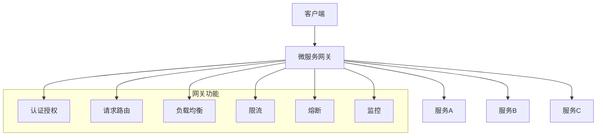

## 一、微服务网关概述

### 1.1 什么是微服务网关

**微服务网关**是微服务架构中的一个关键组件，作为所有服务的统一入口，负责请求路由、负载均衡、认证授权、限流熔断等功能。它将外部请求与内部微服务隔离开来，提供了统一的服务访问管理。

### 1.2 微服务网关的重要性

- **统一入口**：为所有微服务提供统一的访问入口，简化客户端调用
- **请求路由**：根据请求路径将请求路由到相应的微服务
- **负载均衡**：在多个服务实例之间分配请求，提高系统可用性
- **认证授权**：集中处理认证和授权，确保系统安全
- **限流熔断**：保护后端服务，防止过载
- **监控日志**：集中收集监控数据和日志，便于系统管理
- **协议转换**：支持不同协议之间的转换，如HTTP/HTTPS、WebSocket等

### 1.3 微服务网关的基本要求

- **高性能**：处理请求的延迟低，吞吐量高
- **高可用**：具备高可用性，避免单点故障
- **可扩展**：支持水平扩展，应对业务增长
- **安全性**：提供安全的服务访问控制
- **灵活性**：支持动态配置和规则调整
- **可观测性**：提供完善的监控和日志功能

## 二、微服务网关原理

### 2.1 基本原理



### 2.2 核心功能

- **请求路由**：根据请求路径、参数等将请求路由到相应的微服务
- **负载均衡**：在多个服务实例之间分配请求，提高系统可用性
- **认证授权**：验证用户身份，授权访问权限
- **限流**：限制请求速率，防止服务过载
- **熔断**：当后端服务故障时，暂时停止对该服务的请求，避免级联故障
- **监控**：收集请求 metrics，便于系统监控和分析
- **日志**：记录请求日志，便于问题排查
- **协议转换**：支持不同协议之间的转换

### 2.3 网关架构模式

- **集中式网关**：所有请求都通过一个中心化的网关，适用于中小规模系统
- **分布式网关**：多个网关实例，通过负载均衡器分配请求，适用于大规模系统
- **API 网关**：专注于 API 管理，提供 API 版本控制、文档等功能
- **服务网格**：将网关功能下沉到 sidecar，实现更细粒度的流量管理

## 三、微服务网关方案

### 3.1 基于Spring Cloud Gateway的方案

**实现原理**：
- Spring Cloud Gateway是Spring官方推出的微服务网关，基于Spring 5、Spring Boot 2和Project Reactor
- 采用非阻塞式API，性能优异
- 支持动态路由、过滤器、限流等功能
- 与Spring Cloud生态集成良好

**实现步骤**：
1. 添加Spring Cloud Gateway依赖
2. 配置路由规则
3. 实现过滤器（认证、限流等）
4. 配置服务发现

**优点**：
- 性能优异：基于非阻塞式API，支持高并发
- 功能丰富：支持动态路由、过滤器、限流等
- 与Spring Cloud集成：与Eureka、Consul等服务发现组件集成
- 易于扩展：支持自定义过滤器和断言
- 活跃维护：Spring官方维护，持续更新

**缺点**：
- 学习曲线：需要了解Spring Cloud生态
- 配置复杂：路由规则和过滤器配置较多
- 依赖Spring生态：主要适用于Spring Boot应用

**代码示例**：

```java
@SpringBootApplication
public class GatewayApplication {
    public static void main(String[] args) {
        SpringApplication.run(GatewayApplication.class, args);
    }
}

@Configuration
public class GatewayConfig {
    @Bean
    public RouteLocator customRouteLocator(RouteLocatorBuilder builder) {
        return builder.routes()
            .route("service-a", r -> r.path("/api/service-a/**")
                .filters(f -> f.stripPrefix(2)
                    .addRequestHeader("X-Request-Source", "gateway"))
                .uri("lb://service-a"))
            .route("service-b", r -> r.path("/api/service-b/**")
                .filters(f -> f.stripPrefix(2)
                    .addRequestHeader("X-Request-Source", "gateway"))
                .uri("lb://service-b"))
            .build();
    }
}

@Configuration
public class SecurityConfig {
    @Bean
    public SecurityWebFilterChain springSecurityFilterChain(ServerHttpSecurity http) {
        http
            .authorizeExchange()
            .pathMatchers("/api/public/**").permitAll()
            .anyExchange().authenticated()
            .and()
            .oauth2Login();
        return http.build();
    }
}
```

### 3.2 基于Netflix Zuul的方案

**实现原理**：
- Netflix Zuul是Netflix开源的微服务网关，基于Servlet API
- 支持动态路由、过滤器、负载均衡等功能
- 与Spring Cloud生态集成良好
- 分为Zuul 1.0（基于Servlet）和Zuul 2.0（基于Netty）

**实现步骤**：
1. 添加Zuul依赖
2. 配置路由规则
3. 实现过滤器（认证、限流等）
4. 配置服务发现

**优点**：
- 功能丰富：支持动态路由、过滤器、负载均衡等
- 与Spring Cloud集成：与Eureka、Ribbon等组件集成
- 成熟稳定：经过Netflix大规模生产验证
- 易于使用：配置简单，学习成本低

**缺点**：
- 性能相对较低：Zuul 1.0基于Servlet，采用阻塞式API
- 维护模式：Zuul 1.0已进入维护模式
- 灵活性不足：扩展能力有限

**代码示例**：

```java
@SpringBootApplication
@EnableZuulProxy
public class ZuulApplication {
    public static void main(String[] args) {
        SpringApplication.run(ZuulApplication.class, args);
    }
}

# application.yml
zuul:
  routes:
    service-a:
      path: /api/service-a/**
      serviceId: service-a
    service-b:
      path: /api/service-b/**
      serviceId: service-b
  prefix: /api
  stripPrefix: true

# 自定义过滤器
@Component
public class AuthFilter extends ZuulFilter {
    @Override
    public String filterType() {
        return "pre";
    }
    
    @Override
    public int filterOrder() {
        return 0;
    }
    
    @Override
    public boolean shouldFilter() {
        return true;
    }
    
    @Override
    public Object run() {
        RequestContext ctx = RequestContext.getCurrentContext();
        HttpServletRequest request = ctx.getRequest();
        String token = request.getHeader("Authorization");
        
        if (token == null || !validateToken(token)) {
            ctx.setSendZuulResponse(false);
            ctx.setResponseStatusCode(HttpStatus.UNAUTHORIZED.value());
        }
        
        return null;
    }
    
    private boolean validateToken(String token) {
        // 验证token逻辑
        return true;
    }
}
```

### 3.3 基于Kong的方案

**实现原理**：
- Kong是一个基于Nginx和OpenResty的API网关
- 采用插件架构，支持丰富的功能扩展
- 支持服务发现、负载均衡、认证授权、限流等功能
- 提供管理API和UI界面

**实现步骤**：
1. 安装Kong
2. 配置服务和路由
3. 启用插件（认证、限流等）
4. 配置服务发现

**优点**：
- 性能优异：基于Nginx，性能出色
- 插件丰富：支持多种插件，功能扩展方便
- 管理界面：提供直观的管理界面
- 高可用：支持集群部署
- 与多种服务发现集成：支持Consul、etcd等

**缺点**：
- 配置复杂：需要了解Kong的配置体系
- 学习曲线：需要学习Kong的概念和API
- 依赖Nginx：需要熟悉Nginx配置
- 资源消耗：相对于其他方案，资源消耗较大

**配置示例**：

```bash
# 添加服务
curl -X POST http://localhost:8001/services \
  --data "name=service-a" \
  --data "url=http://service-a:8080"

# 添加路由
curl -X POST http://localhost:8001/services/service-a/routes \
  --data "paths[]=/api/service-a" \
  --data "methods[]=GET" \
  --data "methods[]=POST"

# 启用认证插件
curl -X POST http://localhost:8001/services/service-a/plugins \
  --data "name=key-auth"

# 启用限流插件
curl -X POST http://localhost:8001/services/service-a/plugins \
  --data "name=rate-limiting" \
  --data "config.minute=100" \
  --data "config.hour=1000"
```

### 3.4 基于Istio的服务网格方案

**实现原理**：
- Istio是一个开源的服务网格平台，提供了更细粒度的流量管理
- 采用sidecar模式，将网关功能下沉到每个服务实例
- 支持流量路由、负载均衡、认证授权、限流熔断等功能
- 与Kubernetes集成良好

**实现步骤**：
1. 安装Istio
2. 配置Gateway和VirtualService
3. 配置服务网格规则
4. 监控和管理

**优点**：
- 细粒度控制：支持更细粒度的流量管理
- 自动注入：sidecar自动注入，无需修改应用代码
- 与Kubernetes集成：无缝融入Kubernetes生态
- 功能丰富：支持流量路由、负载均衡、认证授权等
- 可观测性：提供丰富的监控和追踪功能

**缺点**：
- 复杂度高：需要了解Istio的概念和配置
- 资源消耗：sidecar模式增加了资源消耗
- 学习曲线：需要学习Istio的生态和工具
- 依赖Kubernetes：主要适用于Kubernetes环境

**配置示例**：

```yaml
apiVersion: networking.istio.io/v1alpha3
kind: Gateway
metadata:
  name: api-gateway
spec:
  selector:
    istio: ingressgateway
  servers:
  - port:
      number: 80
      name: http
      protocol: HTTP
    hosts:
    - "*"
---
apiVersion: networking.istio.io/v1alpha3
kind: VirtualService
metadata:
  name: service-a
  namespace: default
spec:
  hosts:
  - "*"
  gateways:
  - api-gateway
  http:
  - match:
    - uri:
        prefix: /api/service-a
    route:
    - destination:
        host: service-a
        port:
          number: 8080
    rewrite:
      uri: /
---
apiVersion: networking.istio.io/v1alpha3
kind: VirtualService
metadata:
  name: service-b
  namespace: default
spec:
  hosts:
  - "*"
  gateways:
  - api-gateway
  http:
  - match:
    - uri:
        prefix: /api/service-b
    route:
    - destination:
        host: service-b
        port:
          number: 8080
    rewrite:
      uri: /
```

## 四、大厂落地案例

### 4.1 阿里巴巴

**方案**：基于自研的微服务网关

**核心特点**：
- **高性能**：基于自研的高性能网关框架，支持高并发
- **智能路由**：基于服务发现和动态路由，支持灰度发布
- **安全防护**：内置WAF、DDoS防护等安全功能
- **可观测性**：完善的监控、日志和追踪
- **与生态集成**：与Dubbo、Spring Cloud等框架集成

**应用场景**：
- 电商平台的API管理
- 支付系统的安全防护
- 云计算服务的API网关
- 微服务架构的统一入口

### 4.2 腾讯

**方案**：基于Tencent API Gateway

**核心特点**：
- **全托管**：托管服务，无需维护底层基础设施
- **弹性伸缩**：根据流量自动调整容量
- **安全可靠**：内置多种安全防护功能
- **丰富的插件**：支持认证、限流、监控等多种插件
- **与云服务集成**：与腾讯云其他服务无缝集成

**应用场景**：
- 移动应用的API管理
- 游戏业务的网关服务
- 企业应用的API集成
- 微服务架构的统一入口

### 4.3 字节跳动

**方案**：基于自研的服务网格方案

**核心特点**：
- **服务网格**：采用服务网格架构，提供细粒度的流量管理
- **智能调度**：基于实时数据的智能路由和负载均衡
- **高可用**：多地域部署，确保服务可靠
- **可观测性**：完善的监控、日志和追踪
- **自动化**：自动化的服务发现和配置

**应用场景**：
- 内容平台的API管理
- 推荐系统的流量管理
- 广告系统的API网关
- 微服务架构的统一入口

## 五、最佳实践

### 5.1 实施建议

- **选择合适的网关**：根据业务特点和技术栈选择合适的网关方案
- **合理设计路由规则**：设计清晰的路由规则，避免路由冲突
- **实现统一的认证授权**：集中处理认证和授权，确保系统安全
- **配置合理的限流策略**：根据服务能力设置合理的限流阈值
- **建立完善的监控体系**：实时监控网关的运行状态和性能

### 5.2 性能优化

- **使用缓存**：缓存频繁访问的数据，减少后端服务负载
- **优化路由规则**：减少路由规则的复杂度，提高路由效率
- **使用连接池**：复用连接，减少连接建立的开销
- **压缩数据**：启用Gzip压缩，减少传输数据量
- **合理配置线程池**：根据系统资源和负载情况配置线程池

### 5.3 安全性考虑

- **启用HTTPS**：保护数据传输安全
- **实现认证授权**：确保只有授权用户能够访问服务
- **防止SQL注入**：对输入参数进行验证和过滤
- **防止XSS攻击**：对输出数据进行转义
- **限制访问频率**：防止暴力攻击和DoS攻击

### 5.4 常见问题及解决方案

| 问题 | 解决方案 |
|------|----------|
| 性能瓶颈 | 优化路由规则，使用缓存，增加网关实例 |
| 单点故障 | 部署多个网关实例，使用负载均衡 |
| 配置管理复杂 | 使用配置中心，实现动态配置 |
| 服务发现失败 | 配置多个服务发现源，实现故障转移 |
| 监控不及时 | 建立完善的监控和告警机制 |

## 六、总结

微服务网关是微服务架构中的重要组件，通过统一的入口管理服务访问，提供了请求路由、负载均衡、认证授权、限流熔断等功能。选择合适的微服务网关方案需要考虑业务特点、性能要求、技术栈等因素。

**核心要点**：
- 选择适合业务场景的微服务网关方案
- 合理设计路由规则和过滤器
- 实现统一的认证授权机制
- 配置合理的限流和熔断策略
- 建立完善的监控和告警体系

通过实施有效的微服务网关方案，企业可以简化服务访问管理，提高系统的安全性和可用性，为微服务架构的稳定运行提供保障。在实际应用中，需要根据业务特点和技术栈选择最合适的方案，并持续优化和改进。