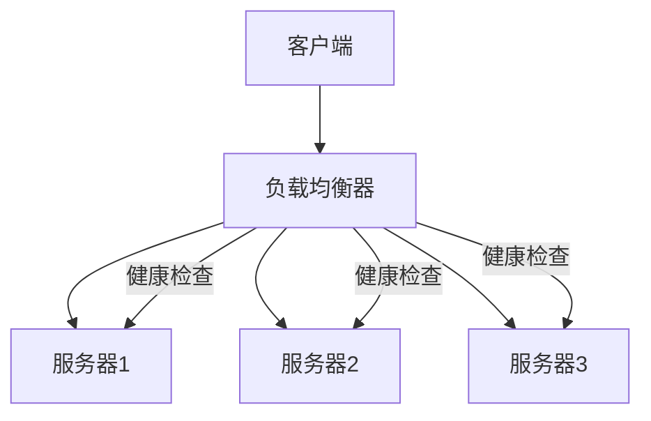

## 一、负载均衡概述

### 1.1 什么是负载均衡

**负载均衡**是一种将网络流量或计算任务均匀分配到多个服务器或资源上的技术，以提高系统的可用性、可靠性和性能。在分布式系统中，负载均衡是确保系统稳定运行和高效处理请求的关键组成部分。

### 1.2 负载均衡的重要性

- **提高系统可用性**：避免单点故障，确保服务持续可用
- **提升系统性能**：充分利用系统资源，提高处理能力
- **增强系统可扩展性**：支持水平扩展，应对业务增长
- **优化资源利用**：合理分配资源，避免资源浪费
- **提供故障转移**：当节点故障时自动将流量转移到其他节点

### 1.3 负载均衡的基本要求

- **高可用性**：负载均衡器本身应具备高可用性
- **高性能**：处理请求的延迟低，吞吐量高
- **可扩展性**：支持动态添加或移除后端服务器
- **灵活性**：支持多种负载均衡策略
- **可靠性**：确保请求正确分发，避免请求丢失

## 二、负载均衡原理

### 2.1 基本原理



### 2.2 负载均衡算法

#### 2.2.1 轮询（Round Robin）

- **原理**：依次将请求分配给后端服务器
- **特点**：实现简单，适用于服务器性能相近的场景
- **优点**：公平分配，实现简单
- **缺点**：不考虑服务器的实际负载情况

#### 2.2.2 加权轮询（Weighted Round Robin）

- **原理**：根据服务器的权重分配请求
- **特点**：可以根据服务器性能调整权重
- **优点**：更合理地分配负载
- **缺点**：权重需要手动配置，难以动态调整

#### 2.2.3 最少连接（Least Connection）

- **原理**：将请求分配给当前连接数最少的服务器
- **特点**：考虑服务器的实际负载情况
- **优点**：动态反映服务器的负载状态
- **缺点**：需要维护连接状态，增加复杂性

#### 2.2.4 源IP哈希（Source IP Hash）

- **原理**：根据客户端IP的哈希值选择服务器
- **特点**：确保同一客户端的请求总是分配到同一服务器
- **优点**：实现会话粘性
- **缺点**：可能导致负载不均

#### 2.2.5 最少响应时间（Least Response Time）

- **原理**：将请求分配给响应时间最短的服务器
- **特点**：考虑服务器的响应速度
- **优点**：提供更好的用户体验
- **缺点**：需要额外的监控和计算

## 三、负载均衡方案

### 3.1 基于硬件的负载均衡方案

**实现原理**：
- 使用专门的硬件设备（如F5 BIG-IP、Citrix NetScaler）实现负载均衡
- 这些设备通常具有专用的芯片和操作系统，性能优异
- 提供丰富的功能，如SSL终止、会话保持、健康检查等

**优点**：
- 高性能：专门的硬件和优化的算法
- 功能丰富：支持多种负载均衡策略和高级功能
- 可靠性高：通常具有冗余设计
- 易于管理：提供直观的管理界面

**缺点**：
- 成本高：硬件设备价格昂贵
- 扩展性有限：硬件资源有限，难以应对突发流量
- 维护复杂：需要专业人员维护
- 灵活性不足：难以快速适应业务变化

**适用场景**：
- 企业级应用
- 对性能和可靠性要求高的场景
- 传统数据中心

### 3.2 基于软件的负载均衡方案

**实现原理**：
- 使用软件实现负载均衡功能，如Nginx、HAProxy、Apache HTTP Server
- 部署在通用服务器上，通过配置实现负载均衡
- 支持多种负载均衡算法和功能

**优点**：
- 成本低：使用通用服务器，无需专用硬件
- 灵活性高：易于配置和扩展
- 功能丰富：支持多种负载均衡策略和高级功能
- 易于集成：与其他系统集成方便

**缺点**：
- 性能相对较低：受服务器硬件限制
- 可靠性依赖于服务器：需要额外的高可用配置
- 管理复杂度：需要专业知识配置和维护

**适用场景**：
- 中小规模应用
- 云环境
- 开发和测试环境

**代码示例（Nginx配置）**：

```nginx
http {
    upstream backend {
        # 轮询
        server backend1.example.com weight=5;
        server backend2.example.com weight=3;
        server backend3.example.com weight=2;
        
        # 健康检查
        check interval=3000 rise=2 fall=3 timeout=1000 type=http;
        check_http_send "HEAD / HTTP/1.0\r\nHost: localhost\r\nConnection: close\r\n\r\n";
        check_http_expect_alive http_2xx http_3xx;
    }
    
    server {
        listen 80;
        server_name example.com;
        
        location / {
            proxy_pass http://backend;
            proxy_set_header Host $host;
            proxy_set_header X-Real-IP $remote_addr;
            proxy_set_header X-Forwarded-For $proxy_add_x_forwarded_for;
        }
    }
}
```

### 3.3 基于云服务的负载均衡方案

**实现原理**：
- 使用云服务提供商提供的负载均衡服务，如AWS ELB、阿里云SLB、腾讯云CLB
- 这些服务通常是托管的，无需维护底层基础设施
- 提供自动扩展、健康检查、SSL终止等功能

**优点**：
- 托管服务：无需维护底层基础设施
- 弹性伸缩：根据流量自动调整容量
- 高可用性：多可用区部署，确保服务可用
- 集成性好：与云服务生态系统集成
- 按需付费：根据实际使用量付费

**缺点**：
- 依赖云服务提供商：迁移成本高
- 成本：大规模使用时成本可能较高
- 定制性有限：功能受云服务提供商限制
- 网络延迟：可能增加网络延迟

**适用场景**：
- 云原生应用
- 弹性需求场景
- 快速部署场景

### 3.4 基于Kubernetes的负载均衡方案

**实现原理**：
- 使用Kubernetes的Service资源实现负载均衡
- 支持ClusterIP、NodePort、LoadBalancer和ExternalName四种类型
- 对于LoadBalancer类型，会自动创建云服务提供商的负载均衡器
- 对于内部服务，可以使用Ingress实现更复杂的路由规则

**优点**：
- 与Kubernetes集成：无缝融入Kubernetes生态
- 自动化：自动管理后端Pod的发现和健康检查
- 灵活的路由规则：通过Ingress实现复杂的路由
- 可扩展性：与Kubernetes的自动伸缩集成

**缺点**：
- 复杂性：需要了解Kubernetes的网络模型
- 依赖Kubernetes：仅适用于Kubernetes环境
- 性能：可能不如专用负载均衡器

**适用场景**：
- Kubernetes集群中的服务
- 微服务架构
- 容器化应用

**代码示例（Kubernetes Service配置）**：

```yaml
apiVersion: v1
kind: Service
metadata:
  name: backend-service
  labels:
    app: backend
spec:
  type: LoadBalancer
  ports:
  - port: 80
    targetPort: 8080
  selector:
    app: backend
---
apiVersion: networking.k8s.io/v1
kind: Ingress
metadata:
  name: backend-ingress
  annotations:
    nginx.ingress.kubernetes.io/rewrite-target: /
spec:
  rules:
  - host: example.com
    http:
      paths:
      - path: /api
        pathType: Prefix
        backend:
          service:
            name: backend-service
            port:
              number: 80
```

## 四、大厂落地案例

### 4.1 阿里巴巴

**方案**：基于自研的负载均衡系统

**核心特点**：
- **高性能**：自研的负载均衡算法和硬件加速
- **高可用**：多地域、多可用区部署
- **智能调度**：基于实时负载和网络状况的智能调度
- **安全防护**：内置DDoS防护和WAF功能
- **监控告警**：完善的监控和告警机制

**应用场景**：
- 电商平台的流量分发
- 支付系统的负载均衡
- 云计算服务的流量管理
- 全球业务的智能路由

### 4.2 腾讯

**方案**：基于Tencent Cloud Load Balancer和自研系统

**核心特点**：
- **多维度调度**：基于地域、可用区、网络质量等多维度调度
- **智能路由**：根据用户位置和网络状况选择最优路径
- **弹性伸缩**：根据流量自动调整容量
- **安全防护**：集成DDoS防护和Web应用防火墙
- **可视化管理**：直观的管理界面和监控面板

**应用场景**：
- 游戏业务的流量分发
- 社交平台的负载均衡
- 视频服务的内容分发
- 金融业务的安全防护

### 4.3 字节跳动

**方案**：基于自研的负载均衡系统

**核心特点**：
- **高性能**：优化的算法和架构，支持高并发
- **弹性伸缩**：根据流量自动调整资源
- **智能调度**：基于实时数据的智能调度策略
- **多协议支持**：支持HTTP、HTTPS、TCP、UDP等多种协议
- **可观测性**：完善的监控、日志和追踪

**应用场景**：
- 内容平台的流量分发
- 推荐系统的负载均衡
- 广告系统的请求路由
- 全球业务的智能调度

## 五、最佳实践

### 5.1 实施建议

- **选择合适的方案**：根据业务特点和需求选择合适的负载均衡方案
- **合理配置健康检查**：确保及时发现和剔除故障节点
- **优化负载均衡算法**：根据业务特点选择合适的负载均衡算法
- **实现高可用**：部署多个负载均衡器，避免单点故障
- **监控和告警**：建立完善的监控和告警机制

### 5.2 性能优化

- **使用连接池**：减少连接建立的开销
- **启用缓存**：缓存静态内容，减少后端服务器负载
- **优化SSL/TLS**：使用Session Resumption和OCSP Stapling
- **压缩数据**：启用Gzip压缩，减少传输数据量
- **合理设置超时**：避免请求长时间占用连接

### 5.3 安全性考虑

- **防止DDoS攻击**：启用DDoS防护
- **防止SSL/TLS漏洞**：使用最新的SSL/TLS版本和密码套件
- **防止HTTP攻击**：启用Web应用防火墙
- **访问控制**：限制访问来源，使用白名单
- **加密传输**：启用HTTPS，保护数据传输安全

### 5.4 常见问题及解决方案

| 问题 | 解决方案 |
|------|----------|
| 负载不均 | 选择合适的负载均衡算法，如最少连接或加权轮询 |
| 单点故障 | 部署多个负载均衡器，实现高可用 |
| 性能瓶颈 | 优化负载均衡器配置，增加资源，使用硬件加速 |
| 会话丢失 | 使用会话粘性，如源IP哈希或会话共享 |
| 健康检查失败 | 优化健康检查配置，确保检查准确性 |

## 六、总结

负载均衡是分布式系统中的重要组成部分，通过合理分配流量，提高系统的可用性、可靠性和性能。选择合适的负载均衡方案需要考虑业务特点、性能要求、成本预算等因素。不同的负载均衡方案各有优缺点，需要根据具体场景进行选择。

**核心要点**：
- 选择适合业务场景的负载均衡方案
- 合理配置负载均衡算法和健康检查
- 实现负载均衡器的高可用
- 优化负载均衡器的性能和安全性
- 建立完善的监控和告警机制

通过合理的负载均衡方案，企业可以确保系统的稳定运行，提高用户体验，应对业务增长的挑战。在实际应用中，需要根据业务特点和技术栈选择最合适的方案，并持续优化和改进。