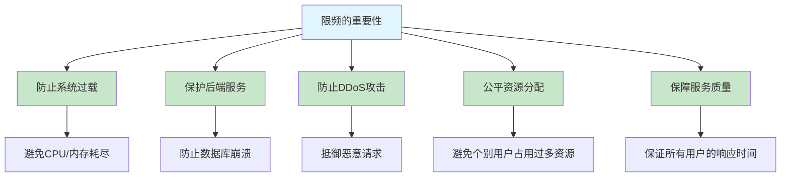
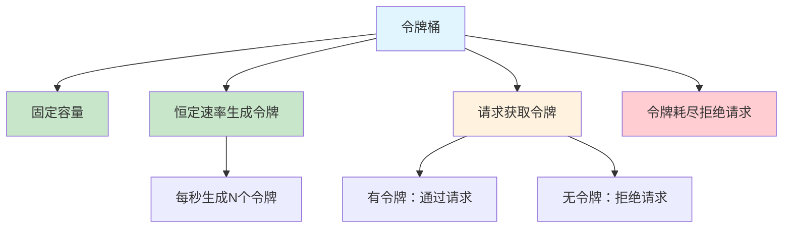
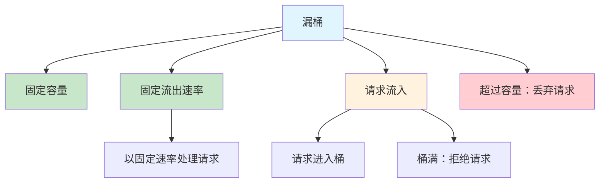
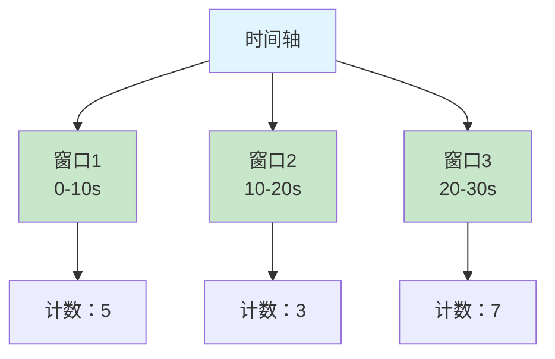
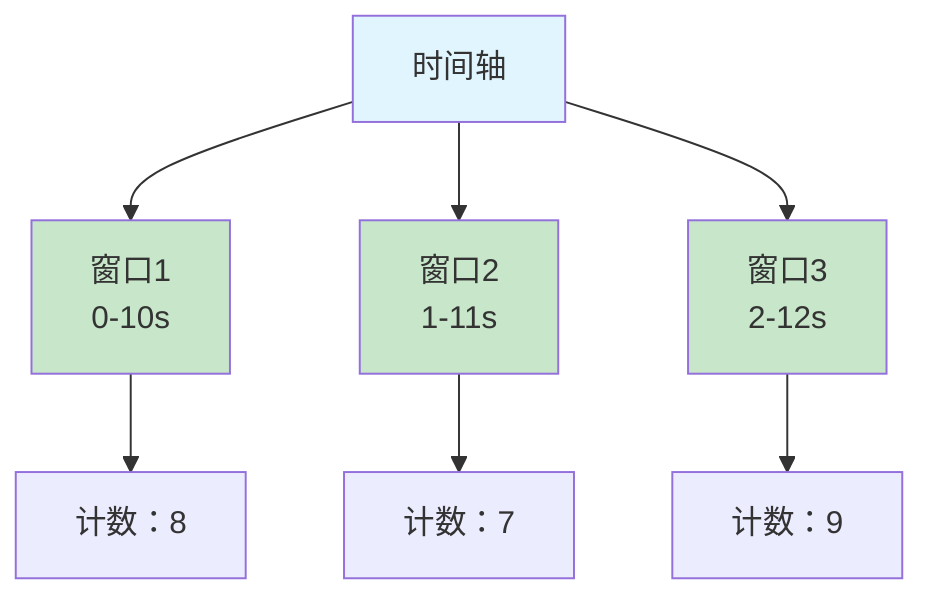
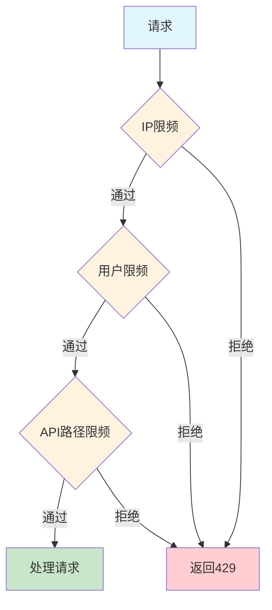
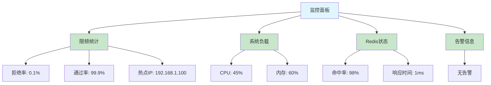

## 一、限频概述

### 什么是限频？

**限频（Rate Limiting）** 是一种流量控制技术，用于限制单位时间内的请求数量，防止系统过载，保护服务稳定性。

### 为什么需要限频？



### 限频的应用场景

| 场景 | 限频策略 | 说明 |
|------|---------|------|
| **API接口** | IP级、用户级限频 | 防止API滥用 |
| **登录接口** | 时间窗口限频 | 防止暴力破解 |
| **短信验证码** | 严格时间限制 | 防止短信轰炸 |
| **秒杀活动** | 全局限频 | 保护系统不被冲垮 |
| **后台管理** | 操作频率限制 | 防止误操作 |

## 二、限频算法

### 1. 令牌桶算法（Token Bucket Algorithm）

**核心思想：** 系统以固定的速率向桶中放入令牌，请求需要获取令牌才能通过。



**工作原理：**
- 令牌桶有固定容量，最多存放 `burst` 个令牌
- 系统以固定速率（`rate` 个/秒）向桶中添加令牌
- 当桶满时，新生成的令牌会被丢弃
- 请求到达时，需要从桶中获取一个令牌
  - 有令牌：获取令牌并通过请求
  - 无令牌：拒绝请求或等待

**特点：**
- **优点**：允许突发流量，灵活性高
- **缺点**：实现相对复杂
- **适用场景**：需要处理突发流量的场景

**示例代码：**

```java
public class TokenBucket {
    
    private final int capacity;        // 桶容量
    private final double rate;         // 令牌生成速率（个/秒）
    private double tokens;             // 当前令牌数
    private long lastRefillTime;       // 上次填充时间
    
    public TokenBucket(int capacity, double rate) {
        this.capacity = capacity;
        this.rate = rate;
        this.tokens = capacity;        // 初始时桶满
        this.lastRefillTime = System.currentTimeMillis();
    }
    
    public synchronized boolean tryAcquire() {
        // 填充令牌
        refillTokens();
        
        // 尝试获取令牌
        if (tokens >= 1) {
            tokens--;
            return true;
        }
        return false;
    }
    
    private void refillTokens() {
        long now = System.currentTimeMillis();
        double elapsed = (now - lastRefillTime) / 1000.0;  // 秒
        
        // 计算新生成的令牌数
        double newTokens = elapsed * rate;
        if (newTokens > 0) {
            tokens = Math.min(capacity, tokens + newTokens);
            lastRefillTime = now;
        }
    }
}
```

### 2. 漏桶算法（Leaky Bucket Algorithm）

**核心思想：** 请求像水一样流入漏桶，漏桶以固定速率流出，超过容量的请求被丢弃。



**工作原理：**
- 漏桶有固定容量
- 请求以任意速率流入漏桶
- 漏桶以固定速率（`rate` 个/秒）处理请求
- 当桶满时，新的请求被丢弃

**特点：**
- **优点**：输出速率稳定，平滑流量
- **缺点**：不允许突发流量
- **适用场景**：需要稳定输出速率的场景

**示例代码：**

```java
public class LeakyBucket {
    
    private final int capacity;        // 桶容量
    private final double rate;         // 流出速率（个/秒）
    private int currentSize;           // 当前水量
    private long lastLeakTime;         // 上次漏水时间
    
    public LeakyBucket(int capacity, double rate) {
        this.capacity = capacity;
        this.rate = rate;
        this.currentSize = 0;
        this.lastLeakTime = System.currentTimeMillis();
    }
    
    public synchronized boolean tryAcquire() {
        // 先漏水
        leak();
        
        // 尝试加水
        if (currentSize < capacity) {
            currentSize++;
            return true;
        }
        return false;
    }
    
    private void leak() {
        long now = System.currentTimeMillis();
        double elapsed = (now - lastLeakTime) / 1000.0;  // 秒
        
        // 计算漏出的水量
        int leaked = (int) (elapsed * rate);
        if (leaked > 0) {
            currentSize = Math.max(0, currentSize - leaked);
            lastLeakTime = now;
        }
    }
}
```

### 3. 固定窗口算法（Fixed Window）

**核心思想：** 将时间划分为固定长度的窗口，统计每个窗口内的请求数。



**工作原理：**
- 将时间划分为固定长度的窗口（如10秒）
- 每个窗口开始时计数器重置为0
- 请求到达时，检查当前窗口的计数
  - 计数 < 阈值：允许请求，计数加1
  - 计数 >= 阈值：拒绝请求

**特点：**
- **优点**：实现简单
- **缺点**：边界效应明显，可能导致突发流量
- **适用场景**：对精度要求不高的场景

**边界效应示例：**
- 窗口大小：10秒，阈值：100
- 第9秒：99个请求
- 第11秒：100个请求
- 2秒内实际处理了199个请求，超过了阈值

### 4. 滑动窗口算法（Sliding Window）

**核心思想：** 窗口可以在时间轴上连续滑动，统计窗口内的请求数。



**工作原理：**
- 窗口大小固定（如10秒）
- 窗口随时间连续滑动
- 请求到达时，统计当前窗口内的请求数
  - 计数 < 阈值：允许请求，记录请求时间
  - 计数 >= 阈值：拒绝请求

**特点：**
- **优点**：平滑处理请求，无边界效应
- **缺点**：实现复杂，需要存储请求时间
- **适用场景**：对精度要求较高的场景

## 三、限频实现方式

### 1. 基于内存的限频

**适用场景：** 单机应用，轻量级限频

**优点：** 性能高，无外部依赖
**缺点：** 不支持分布式环境，服务重启后状态丢失

**示例代码：**

```java
public class InMemoryRateLimiter {
    
    private final ConcurrentHashMap<String, TokenBucket> limiters = new ConcurrentHashMap<>();
    private final int capacity;
    private final double rate;
    
    public InMemoryRateLimiter(int capacity, double rate) {
        this.capacity = capacity;
        this.rate = rate;
    }
    
    public boolean allowRequest(String key) {
        TokenBucket limiter = limiters.computeIfAbsent(key, k -> new TokenBucket(capacity, rate));
        return limiter.tryAcquire();
    }
}
```

### 2. 基于Redis的限频

**适用场景：** 分布式系统，需要全局统一限频

**优点：** 支持分布式环境，状态持久化
**缺点：** 依赖Redis，有网络开销

#### 2.1 基于Redis的滑动窗口实现

```bash
# 1. 用户请求进来时
# score是毫秒时间戳
# member是唯一请求标识
$ ZADD $key $timestamp $request_id

# 2. 移除窗口外的请求
$ ZREMRANGEBYSCORE $key 0 $window_start

# 3. 统计窗口内的请求数
$ ZCOUNT $key $window_start $window_end

# 4. 检查是否超过阈值
if count > $threshold: 拒绝请求
else: 允许请求
```

**Lua脚本优化：**

```lua
-- redis_rate_limit.lua
local key = KEYS[1]
local window_size = tonumber(ARGV[1])
local threshold = tonumber(ARGV[2])
local timestamp = tonumber(ARGV[3])
local request_id = ARGV[4]

-- 计算窗口开始时间
local window_start = timestamp - window_size

-- 移除窗口外的请求
redis.call('ZREMRANGEBYSCORE', key, 0, window_start)

-- 统计当前窗口内的请求数
local count = redis.call('ZCOUNT', key, window_start, timestamp)

if count >= threshold then
    -- 超过阈值，拒绝请求
    return 0
else
    -- 未超过阈值，添加当前请求并返回成功
    redis.call('ZADD', key, timestamp, request_id)
    -- 设置键过期时间，避免内存泄漏
    redis.call('EXPIRE', key, window_size / 1000 + 1)
    return 1
end
```

**使用方式：**

```java
public class RedisRateLimiter {
    
    private final RedisTemplate<String, String> redisTemplate;
    private final String scriptSha;
    
    public RedisRateLimiter(RedisTemplate<String, String> redisTemplate) {
        this.redisTemplate = redisTemplate;
        this.scriptSha = loadScript();
    }
    
    public boolean allowRequest(String key, long windowSizeMs, int threshold) {
        String requestId = UUID.randomUUID().toString();
        long timestamp = System.currentTimeMillis();
        
        Object result = redisTemplate.execute(new DefaultRedisScript<>(scriptSha, Long.class),
                Collections.singletonList(key),
                String.valueOf(windowSizeMs),
                String.valueOf(threshold),
                String.valueOf(timestamp),
                requestId);
        
        return result != null && (Long) result == 1;
    }
    
    private String loadScript() {
        String script = "local key = KEYS[1]...";
        return redisTemplate.getConnectionFactory().getConnection()
                .scriptLoad(script.getBytes());
    }
}
```

#### 2.2 基于Redis的令牌桶实现

**使用Redis的Hash结构存储令牌桶状态：**
- `tokens`: 当前令牌数
- `last_refill_time`: 上次填充时间

**Lua脚本：**

```lua
-- redis_token_bucket.lua
local key = KEYS[1]
local capacity = tonumber(ARGV[1])
local rate = tonumber(ARGV[2])
local now = tonumber(ARGV[3])

-- 获取当前状态
local current = redis.call('HGETALL', key)
local tokens = capacity
local lastRefillTime = now

if #current > 0 then
    tokens = tonumber(current[2]) or capacity
    lastRefillTime = tonumber(current[4]) or now
end

-- 计算经过的时间
local elapsed = now - lastRefillTime
-- 计算新生成的令牌数
local newTokens = elapsed * rate / 1000
-- 更新令牌数
if newTokens > 0 then
    tokens = math.min(capacity, tokens + newTokens)
    lastRefillTime = now
end

-- 尝试获取令牌
local allowed = 0
if tokens >= 1 then
    tokens = tokens - 1
    allowed = 1
end

-- 保存状态
redis.call('HMSET', key, 'tokens', tokens, 'last_refill_time', lastRefillTime)
-- 设置过期时间
redis.call('EXPIRE', key, math.ceil(capacity / rate) + 1)

return allowed
```

### 3. 基于Nginx的限频

**适用场景：** API网关，边缘服务

**配置示例：**

```nginx
http {
    # 定义限频区域
    limit_req_zone $binary_remote_addr zone=ip_limit:10m rate=10r/s;
    
    server {
        listen 80;
        server_name api.example.com;
        
        location / {
            # 应用限频，burst=20表示允许20个突发请求
            limit_req zone=ip_limit burst=20 nodelay;
            proxy_pass http://backend;
        }
    }
}
```

**参数说明：**
- `zone=ip_limit:10m`: 存储IP地址的区域，大小10MB
- `rate=10r/s`: 限制速率为每秒10个请求
- `burst=20`: 允许20个突发请求
- `nodelay`: 不延迟处理突发请求

### 4. 基于服务网格的限频

**适用场景：** 微服务架构，Service Mesh

**Istio配置示例：**

```yaml
apiVersion: networking.istio.io/v1alpha3
kind: VirtualService
metadata:
  name: rate-limiting
  namespace: default
spec:
  hosts:
  - service-a
  http:
  - route:
    - destination:
        host: service-a
    rateLimits:
    - actions:
      - sourceIP: {}
      config:
        unit: second
        requestsPerUnit: 10
```

## 四、限频策略

### 1. 基于不同维度的限频

| 维度 | 实现方式 | 适用场景 |
|------|---------|---------|
| **IP地址** | `limit_req_zone $binary_remote_addr` | 防止单个IP滥用 |
| **用户ID** | 基于用户ID的Redis键 | 限制单个用户的请求频率 |
| **API路径** | 基于路径的限频规则 | 对不同接口设置不同限制 |
| **设备ID** | 基于设备ID的限频 | 防止设备级滥用 |
| **地理位置** | 基于IP归属地 | 针对特定地区的限制 |

### 2. 多级限频策略



**示例：**
- IP限频：100次/分钟
- 用户限频：30次/分钟
- API路径限频：10次/分钟

### 3. 动态限频策略

**基于系统负载的动态限频：**
- 低负载时：放松限制
- 高负载时：收紧限制

**实现方式：**

```java
public class DynamicRateLimiter {
    
    private final TokenBucket limiter;
    private final double minRate;
    private final double maxRate;
    
    public DynamicRateLimiter(int capacity, double minRate, double maxRate) {
        this.limiter = new TokenBucket(capacity, minRate);
        this.minRate = minRate;
        this.maxRate = maxRate;
    }
    
    public boolean allowRequest() {
        // 根据系统负载调整速率
        double currentRate = calculateDynamicRate();
        limiter.setRate(currentRate);
        
        return limiter.tryAcquire();
    }
    
    private double calculateDynamicRate() {
        // 获取系统负载
        double load = getSystemLoad();
        
        // 根据负载计算速率
        if (load < 0.3) {
            return maxRate; // 低负载，使用最大速率
        } else if (load < 0.7) {
            // 中等负载，线性调整
            return minRate + (maxRate - minRate) * (1 - (load - 0.3) / 0.4);
        } else {
            return minRate; // 高负载，使用最小速率
        }
    }
    
    private double getSystemLoad() {
        // 获取系统CPU负载
        return ManagementFactory.getOperatingSystemMXBean().getSystemLoadAverage();
    }
}
```

## 五、性能优化

### 1. 减少Redis操作

**使用Lua脚本：** 把多个Redis操作合并为一个原子操作，减少网络往返时间。

**批量处理：** 对于批量请求，统一进行限频检查。

### 2. 缓存优化

**本地缓存：** 对于高频请求，使用本地缓存减少Redis访问。

```java
public class CachedRateLimiter {
    
    private final RedisRateLimiter redisLimiter;
    private final LoadingCache<String, Boolean> localCache;
    
    public CachedRateLimiter(RedisRateLimiter redisLimiter) {
        this.redisLimiter = redisLimiter;
        this.localCache = CacheBuilder.newBuilder()
                .expireAfterWrite(100, TimeUnit.MILLISECONDS)
                .maximumSize(10000)
                .build(new CacheLoader<String, Boolean>() {
                    @Override
                    public Boolean load(String key) {
                        return redisLimiter.allowRequest(key, 60000, 100);
                    }
                });
    }
    
    public boolean allowRequest(String key) {
        try {
            return localCache.get(key);
        } catch (ExecutionException e) {
            return false;
        }
    }
}
```

### 3. 分布式优化

**一致性哈希：** 将请求均匀分布到不同的Redis节点。

**本地预计算：** 预先计算令牌桶状态，减少实时计算开销。

### 4. 算法优化

**令牌桶优化：** 使用时间戳计算，避免频繁更新。

**滑动窗口优化：** 使用分层窗口，减少计算复杂度。

## 六、限频的最佳实践

### 1. 合理设置阈值

| 服务类型 | 推荐阈值 | 说明 |
|---------|---------|------|
| **API接口** | 100-1000次/分钟 | 根据接口复杂度调整 |
| **登录接口** | 5-10次/分钟 | 防止暴力破解 |
| **短信接口** | 3-5次/小时 | 防止短信轰炸 |
| **后台操作** | 100-500次/分钟 | 防止误操作 |

### 2. 优雅的错误处理

**返回适当的HTTP状态码：**
- `429 Too Many Requests`：请求过于频繁
- `503 Service Unavailable`：服务暂时不可用

**响应头信息：**
- `X-RateLimit-Limit`：时间窗口内的最大请求数
- `X-RateLimit-Remaining`：剩余可用请求数
- `X-RateLimit-Reset`：限制重置时间

**示例响应：**

```http
HTTP/1.1 429 Too Many Requests
Content-Type: application/json
X-RateLimit-Limit: 100
X-RateLimit-Remaining: 0
X-RateLimit-Reset: 1620000000

{
  "error": "Too Many Requests",
  "message": "Rate limit exceeded. Please try again later.",
  "retryAfter": 60
}
```

### 3. 监控与告警

**关键指标监控：**
- 请求通过率
- 限频拒绝率
- 令牌桶使用率
- Redis性能

**告警策略：**
- 拒绝率突增
- Redis响应时间异常
- 系统负载过高

**监控面板示例：**



### 4. 测试与验证

**压力测试：**
- 模拟突发流量
- 测试限频阈值
- 验证系统稳定性

**边界测试：**
- 窗口边界测试
- 阈值临界测试
- 并发测试

**混沌测试：**
- Redis故障模拟
- 网络延迟测试
- 系统重启测试

## 七、常见问题与解决方案

### 1. 突发流量处理

**问题：** 系统需要处理短时间的突发流量。

**解决方案：**
- 使用令牌桶算法，设置适当的burst值
- 动态调整限频阈值
- 实现请求队列，平滑处理突发流量

### 2. 分布式一致性

**问题：** 分布式环境下，限频计数不一致。

**解决方案：**
- 使用Redis的Lua脚本保证原子性
- 实现分布式锁
- 定期同步限频状态

### 3. 性能瓶颈

**问题：** 限频检查成为性能瓶颈。

**解决方案：**
- 本地缓存热点数据
- 批量处理限频检查
- 优化Redis操作

### 4. 误杀正常请求

**问题：** 正常用户的请求被误判为滥用。

**解决方案：**
- 基于用户行为分析
- 设置合理的阈值
- 实现白名单机制

### 5. 绕过限频

**问题：** 攻击者通过多种方式绕过限频。

**解决方案：**
- 多维度限频（IP、用户、设备）
- 验证码机制
- 行为分析与异常检测

## 八、限频技术的未来趋势

### 1. 智能限频

- 基于机器学习的流量预测
- 自适应限频策略
- 个性化限频规则

### 2. 边缘计算

- 边缘节点的本地限频
- 就近处理请求
- 减少延迟

### 3. 服务网格集成

- 透明的限频策略
- 统一的配置管理
- 服务间的协作限频

### 4. 云原生方案

- 容器化限频服务
- Kubernetes原生集成
- 弹性伸缩与限频协同

## 九、总结

### 核心要点

1. **限频是系统稳定性的重要保障**
2. **选择合适的限频算法**：令牌桶适合突发流量，漏桶适合稳定流量
3. **分布式环境使用Redis**：保证一致性和可靠性
4. **多级限频策略**：从多个维度进行限制
5. **性能优化**：减少Redis操作，使用缓存
6. **监控与告警**：及时发现和处理异常
7. **合理的错误处理**：提供清晰的错误信息

### 最佳实践总结

- **令牌桶算法**：最灵活的限频算法
- **Redis实现**：支持分布式环境
- **Lua脚本**：保证原子性操作
- **多级限频**：多维度保护系统
- **动态调整**：根据系统负载调整限频策略
- **监控告警**：及时发现问题
- **优雅降级**：保证系统可用性

限频技术是构建高可用、高性能系统的重要组成部分，需要根据具体业务场景选择合适的方案，并不断优化和调整。

## 参考资料

- [Redis官方文档](https://redis.io/documentation)
- [Nginx限频配置](https://nginx.org/en/docs/http/ngx_http_limit_req_module.html)
- [Istio流量管理](https://istio.io/docs/concepts/traffic-management/)
- [Rate Limiting Patterns](https://konghq.com/blog/rate-limiting-patterns/)
- [令牌桶算法详解](https://en.wikipedia.org/wiki/Token_bucket)
