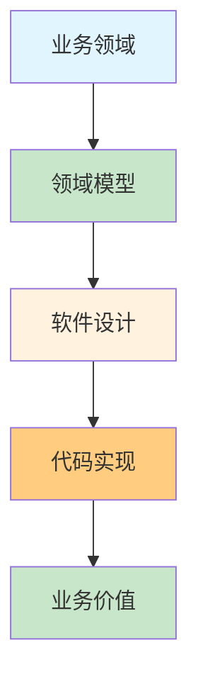
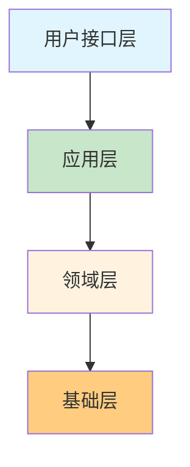
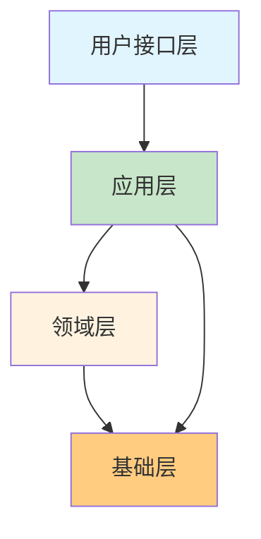

## 一、领域驱动设计概述

### 什么是领域驱动设计？

**领域驱动设计（Domain-Driven Design，DDD）** 是一种软件设计方法论，它强调将业务领域的核心知识和业务规则作为软件设计的中心，通过建立领域模型来指导软件的设计和开发。



### 为什么需要领域驱动设计？

1. **业务复杂性增加**：现代软件系统越来越复杂，传统的设计方法难以应对
2. **业务价值凸显**：软件系统需要更好地体现业务价值和核心竞争力
3. **团队协作**：大型项目需要多团队协作，需要统一的语言和模型
4. **可维护性**：良好的领域模型可以提高系统的可维护性和可扩展性

### DDD的核心价值

- **业务与技术对齐**：确保技术实现真正反映业务需求
- **统一语言**：建立业务团队和技术团队的共同语言
- **模块化设计**：通过限界上下文实现模块化
- **演进式设计**：随着业务理解的深入不断完善领域模型

## 二、核心概念

### 1. 领域（Domain）

**领域**是指特定业务的知识范围，包含业务规则、流程和概念。

**示例：** 电商领域、金融领域、医疗领域等

### 2. 领域模型（Domain Model）

**领域模型**是对领域知识的抽象表示，包含领域中的概念、关系和规则。

**特点：**
- 反映业务本质
- 包含业务规则
- 随着业务理解的深入而演进

### 3. 实体（Entity）

**实体**是具有唯一标识符的领域对象，其身份在生命周期中保持不变。

**特点：**
- 有唯一标识符
- 可变状态
- 生命周期管理

**示例：**
- 电商系统：用户、商品、订单
- 金融系统：账户、交易、客户

### 4. 值对象（Value Object）

**值对象**是描述领域中某方面特征的对象，通过其属性值来定义，没有唯一标识符。

**特点：**
- 无唯一标识符
- 不可变
- 相等性基于属性值

**示例：**
- 地址、价格、日期范围、货币

### 5. 领域服务（Domain Service）

**领域服务**是实现领域业务逻辑的服务，处理跨实体的业务操作。

**特点：**
- 封装业务规则
- 处理跨实体操作
- 无状态

**示例：**
- 订单价格计算服务
- 库存管理服务
- 支付处理服务

### 6. 聚合（Aggregate）

**聚合**是一组相关对象的组合，作为一个数据修改的单元。

**特点：**
- 有一个聚合根
- 内部对象之间有强关联
- 作为整体进行事务管理

**示例：**
- 订单聚合：订单（聚合根）、订单项、收货地址
- 产品聚合：产品（聚合根）、SKU、属性

### 7. 聚合根（Aggregate Root）

**聚合根**是聚合的核心和入口点，负责维护聚合的一致性。

**职责：**
- 维护聚合内的业务规则
- 控制对聚合内对象的访问
- 作为聚合与外部的唯一交互点

### 8. 仓储（Repository）

**仓储**是负责持久化和检索领域对象的服务。

**特点：**
- 封装数据访问细节
- 提供领域对象的集合视图
- 支持领域对象的持久化和加载

**示例：**
- 用户仓储：UserRepository
- 订单仓储：OrderRepository

### 9. 限界上下文（Bounded Context）

**限界上下文**是领域内的一个边界，在边界内，领域模型有明确的含义和一致的用法。

**特点：**
- 有明确的边界
- 内部模型一致
- 与其他上下文通过上下文映射交互

**示例：**
- 电商系统：订单上下文、库存上下文、支付上下文
- 金融系统：账户上下文、交易上下文、风控上下文

### 10. 领域事件（Domain Event）

**领域事件**是领域中发生的重要事件，用于通知其他部分。

**特点：**
- 表示领域中发生的事实
- 用于领域内和跨上下文的通信
- 支持最终一致性

**示例：**
- 订单创建事件
- 支付成功事件
- 库存更新事件

### 11. 防腐层（Anti-Corruption Layer，ACL）

**防腐层**是隔离不同领域或系统之间差异的层，防止外部系统对本领域模型的影响。

**作用：**
- 转换外部模型到内部模型
- 隔离外部系统的变化
- 保持领域模型的纯净

### 12. 上下文映射（Context Map）

**上下文映射**是描述不同限界上下文之间关系的图。

**映射关系类型：**
- 合作关系（Partnership）
- 共享内核（Shared Kernel）
- 客户-供应商（Customer-Supplier）
- 遵奉者（Conformist）
- 防腐层（Anticorruption Layer）
- 开放主机服务（Open Host Service）
- 发布-订阅（Published Language）

## 三、架构设计

### 1. 传统四层架构



#### 1.1 用户接口层（User Interface Layer）

**职责：**
- 接收用户请求
- 数据格式验证
- 调用应用层服务
- 返回响应结果

**实现形式：**
- HTTP接口（RESTful API）
- RPC接口（gRPC、Thrift）
- 消息队列消费者

**示例：**
- `UserController`：处理用户相关的HTTP请求
- `OrderServiceRPC`：处理订单相关的RPC请求

#### 1.2 应用层（Application Layer）

**职责：**
- 协调领域对象完成业务用例
- 处理事务管理
- 发布领域事件
- 调用领域服务和仓储

**特点：**
- 无业务规则
- 协调者角色
- 面向用例

**示例：**
- `OrderApplicationService`：处理订单创建、支付等用例
- `UserApplicationService`：处理用户注册、登录等用例

#### 1.3 领域层（Domain Layer）

**职责：**
- 封装业务规则和领域知识
- 实现核心业务逻辑
- 维护领域对象的状态和行为

**核心组件：**
- 实体（Entity）
- 值对象（Value Object）
- 领域服务（Domain Service）
- 聚合（Aggregate）
- 领域事件（Domain Event）

**示例：**
- `Order`：订单实体
- `Product`：产品实体
- `PriceCalculator`：价格计算领域服务

#### 1.4 基础层（Infrastructure Layer）

**职责：**
- 提供技术支持
- 实现仓储接口
- 集成外部系统
- 提供通用技术服务

**组件：**
- 数据库访问
- 消息队列
- 缓存
- 外部服务调用
- 日志、监控

**示例：**
- `UserRepositoryImpl`：用户仓储的数据库实现
- `PaymentAdapter`：支付系统的适配器

### 2. 领域驱动下的项目结构

```bash
├── cmd/                   # 应用入口
│   └── main.go           # 主程序
├── config/                # 配置
│   └── config.go
├── application/           # 应用层
│   ├── service/           # 应用服务
│   │   ├── user_service.go
│   │   └── order_service.go
│   ├── dto/               # 数据传输对象
│   │   ├── user_dto.go
│   │   └── order_dto.go
│   ├── event/             # 事件处理
│   │   └── event_handler.go
│   └── api/               # 接口层
│       ├── http/          # HTTP接口
│       └── rpc/           # RPC接口
├── domain/                # 领域层
│   ├── user/              # 用户子域
│   │   ├── entity/        # 实体
│   │   │   └── user.go
│   │   ├── value/         # 值对象
│   │   │   └── address.go
│   │   ├── service/       # 领域服务
│   │   │   └── user_service.go
│   │   ├── repository/    # 仓储接口
│   │   │   └── user_repository.go
│   │   └── event/         # 领域事件
│   │       └── user_event.go
│   └── order/             # 订单子域
│       ├── entity/
│       ├── value/
│       ├── service/
│       ├── repository/
│       └── event/
├── infrastructure/        # 基础层
│   ├── repository/        # 仓储实现
│   │   ├── user_repository_impl.go
│   │   └── order_repository_impl.go
│   ├── adapter/           # 适配器
│   │   └── payment_adapter.go
│   └── util/              # 工具类
└── pkg/                   # 通用包
    ├── common/            # 通用代码
    └── errors/            # 错误定义
```

### 3. 依赖关系



**依赖规则：**
- 上层依赖下层
- 领域层不依赖其他层
- 应用层依赖领域层和基础层
- 用户接口层只依赖应用层

## 四、实践指南

### 1. 领域建模步骤

#### 1.1 领域分析

1. **识别核心域**：确定业务的核心价值
2. **划分子域**：将领域划分为核心域、支撑域和通用域
3. **识别限界上下文**：确定领域的边界

#### 1.2 模型设计

1. **识别实体和值对象**：分析领域中的概念
2. **确定聚合和聚合根**：划分聚合边界
3. **设计领域服务**：识别跨实体的业务逻辑
4. **定义仓储接口**：确定数据持久化需求
5. **识别领域事件**：捕获领域中的重要事件

#### 1.3 实现与验证

1. **实现领域模型**：编写代码实现
2. **验证模型**：通过测试和业务反馈验证
3. **迭代改进**：根据业务变化调整模型

### 2. 领域事件实现

**示例：** 订单创建事件

```go
// domain/order/event/order_created.go
package event

import "time"

type OrderCreatedEvent struct {
    OrderID     string    `json:"order_id"`
    UserID      string    `json:"user_id"`
    TotalAmount float64   `json:"total_amount"`
    CreatedAt   time.Time `json:"created_at"`
}

func NewOrderCreatedEvent(orderID, userID string, totalAmount float64) *OrderCreatedEvent {
    return &OrderCreatedEvent{
        OrderID:     orderID,
        UserID:      userID,
        TotalAmount: totalAmount,
        CreatedAt:   time.Now(),
    }
}
```

**事件发布：**

```go
// application/service/order_service.go
func (s *OrderApplicationService) CreateOrder(req *dto.CreateOrderRequest) (*dto.OrderResponse, error) {
    // 创建订单
    order := domain.NewOrder(req.UserID, req.Items)
    
    // 保存订单
    err := s.orderRepo.Save(order)
    if err != nil {
        return nil, err
    }
    
    // 发布事件
    event := event.NewOrderCreatedEvent(order.ID, order.UserID, order.TotalAmount)
    s.eventPublisher.Publish(event)
    
    return &dto.OrderResponse{
        ID:          order.ID,
        UserID:      order.UserID,
        TotalAmount: order.TotalAmount,
        Status:      order.Status,
    }, nil
}
```

### 3. 仓储实现

**仓储接口：**

```go
// domain/user/repository/user_repository.go
package repository

import "github.com/example/domain/user/entity"

type UserRepository interface {
    Save(user *entity.User) error
    FindByID(id string) (*entity.User, error)
    FindByEmail(email string) (*entity.User, error)
    Update(user *entity.User) error
    Delete(id string) error
}
```

**仓储实现：**

```go
// infrastructure/repository/user_repository_impl.go
package repository

import (
    "github.com/example/domain/user/entity"
    "github.com/example/domain/user/repository"
    "gorm.io/gorm"
)

type userRepositoryImpl struct {
    db *gorm.DB
}

func NewUserRepository(db *gorm.DB) repository.UserRepository {
    return &userRepositoryImpl{db: db}
}

func (r *userRepositoryImpl) Save(user *entity.User) error {
    return r.db.Create(user).Error
}

func (r *userRepositoryImpl) FindByID(id string) (*entity.User, error) {
    var user entity.User
    err := r.db.Where("id = ?", id).First(&user).Error
    if err != nil {
        return nil, err
    }
    return &user, nil
}

// 其他方法实现...
```

### 4. 防腐层实现

**示例：支付系统适配器**

```go
// infrastructure/adapter/payment_adapter.go
package adapter

import (
    "github.com/example/domain/order/entity"
    "github.com/example/infrastructure/external/payment"
)

type PaymentAdapter struct {
    client *payment.Client
}

func NewPaymentAdapter(client *payment.Client) *PaymentAdapter {
    return &PaymentAdapter{client: client}
}

func (a *PaymentAdapter) ProcessPayment(order *entity.Order) error {
    // 转换领域模型到外部系统模型
    paymentRequest := &payment.PaymentRequest{
        OrderID:     order.ID,
        Amount:      order.TotalAmount,
        Currency:    "CNY",
        CustomerID:  order.UserID,
        Description: "Order payment",
    }
    
    // 调用外部支付系统
    response, err := a.client.CreatePayment(paymentRequest)
    if err != nil {
        return err
    }
    
    // 处理响应
    if response.Status == "success" {
        order.MarkAsPaid()
    } else {
        order.MarkAsPaymentFailed()
    }
    
    return nil
}
```

## 五、最佳实践

### 1. 领域建模最佳实践

- **使用统一语言**：建立业务团队和技术团队的共同语言
- **关注核心域**：优先建模核心业务流程
- **保持模型简洁**：避免过度设计
- **持续迭代**：随着业务理解的深入不断完善模型
- **验证模型**：通过测试和业务反馈验证模型的正确性

### 2. 架构设计最佳实践

- **严格分层**：遵循依赖规则，保持层与层之间的清晰边界
- **接口隔离**：使用接口隔离实现，便于测试和替换
- **领域优先**：优先实现领域层，再实现其他层
- **模块化**：通过限界上下文实现模块化设计
- **事件驱动**：使用领域事件实现松耦合

### 3. 代码实现最佳实践

- **实体设计**：实体应该包含业务行为，不仅仅是数据
- **值对象**：使用不可变的值对象
- **领域服务**：封装跨实体的业务逻辑
- **仓储**：只负责数据持久化，不包含业务逻辑
- **应用服务**：协调领域对象，不包含业务规则

### 4. 测试最佳实践

- **领域模型测试**：测试领域对象的业务规则
- **集成测试**：测试各层之间的协作
- **端到端测试**：测试完整的业务流程
- **模拟外部系统**：使用模拟对象测试与外部系统的交互

## 六、案例分析

### 1. 电商系统DDD实践

#### 领域划分

- **核心域**：订单管理、库存管理
- **支撑域**：用户管理、支付管理
- **通用域**：日志、监控、安全

#### 限界上下文

- **订单上下文**：处理订单的创建、修改、状态变更
- **库存上下文**：管理商品库存
- **支付上下文**：处理支付流程
- **用户上下文**：管理用户信息

#### 关键聚合

- **订单聚合**：订单（聚合根）、订单项、收货地址
- **产品聚合**：产品（聚合根）、SKU、属性
- **用户聚合**：用户（聚合根）、地址、偏好设置

### 2. 金融系统DDD实践

#### 领域划分

- **核心域**：账户管理、交易处理、风控
- **支撑域**：客户管理、账务处理
- **通用域**：日志、监控、安全

#### 限界上下文

- **账户上下文**：管理账户信息和余额
- **交易上下文**：处理交易流程
- **风控上下文**：风险评估和控制
- **客户上下文**：管理客户信息

#### 关键聚合

- **账户聚合**：账户（聚合根）、交易记录、余额
- **交易聚合**：交易（聚合根）、交易明细、状态
- **客户聚合**：客户（聚合根）、身份信息、联系方式

## 七、常见问题与解决方案

### 1. 领域模型与数据模型的关系

**问题：** 如何平衡领域模型和数据模型？

**解决方案：**
- 领域模型优先，数据模型为领域模型服务
- 使用仓储模式隔离数据访问细节
- 可以使用ORM工具，但保持领域模型的纯净

### 2. 限界上下文的边界划分

**问题：** 如何确定限界上下文的边界？

**解决方案：**
- 基于业务语义划分
- 考虑团队结构和责任边界
- 评估上下文之间的依赖关系
- 从粗到细，逐步调整

### 3. 领域事件的设计

**问题：** 如何设计有效的领域事件？

**解决方案：**
- 事件应该反映领域中发生的重要事实
- 事件应该包含足够的信息，便于消费者处理
- 使用统一的事件格式和命名规范
- 考虑事件的版本控制

### 4. 性能优化

**问题：** DDD可能导致性能问题，如何优化？

**解决方案：**
- 合理设计聚合大小，避免过大的聚合
- 使用缓存减少数据库访问
- 采用CQRS模式分离读写
- 优化仓储实现，使用批量操作

### 5. 团队协作

**问题：** 如何在团队中推广DDD？

**解决方案：**
- 培训团队成员，建立统一语言
- 从小规模项目开始实践
- 定期进行领域建模 workshops
- 建立代码审查机制，确保模型的一致性

## 八、工具与框架

### 1. 建模工具

- **EventStorming**：用于领域事件建模
- **Domain Storytelling**：通过故事讲述理解领域
- **UML工具**：用于绘制领域模型图
- **Draw.io**：绘制架构图和流程图

### 2. 开发框架

- **Spring Boot**：Java生态的DDD实现
- **Laravel**：PHP生态的DDD实现
- **.NET Core**：.NET生态的DDD实现
- **Gin/Echo**：Go生态的Web框架，可用于DDD实现

### 3. 辅助工具

- **Docker**：容器化部署
- **Kubernetes**：容器编排
- **Prometheus**：监控
- **ELK**：日志管理
- **Jaeger**：分布式追踪

## 九、未来发展趋势

### 1. 微服务与DDD

- DDD的限界上下文天然适合微服务架构
- 微服务的独立部署和扩展能力与DDD的模块化设计相得益彰
- 服务网格技术为微服务之间的通信提供更好的支持

### 2. 事件驱动架构

- 领域事件与事件驱动架构的结合
- 事件溯源（Event Sourcing）的应用
- CQRS模式的普及

### 3. 领域特定语言（DSL）

- 使用DSL表达业务规则
- 业务规则的可视化和自动化
- 降低业务与技术之间的鸿沟

### 4. AI与DDD

- AI辅助领域建模
- 智能推荐领域模型设计
- 自动生成代码框架

### 5. 低代码平台

- DDD理念在低代码平台中的应用
- 可视化领域建模工具
- 快速构建符合DDD原则的应用

## 十、总结

### 核心要点

1. **领域驱动设计是一种方法论**：强调以业务领域为中心的设计方法
2. **核心概念是基础**：实体、值对象、聚合、领域服务等是DDD的基本构建块
3. **限界上下文是关键**：通过限界上下文实现模块化设计
4. **架构分层是保障**：清晰的分层架构确保系统的可维护性和可扩展性
5. **实践是检验真理的标准**：通过实际项目实践不断完善领域模型

### 价值与意义

- **业务价值**：更好地理解和实现业务需求
- **技术价值**：提高系统的可维护性和可扩展性
- **团队价值**：建立业务和技术团队的共同语言
- **长期价值**：为系统的演进和扩展奠定基础

### 实践建议

- **从小处着手**：选择一个核心业务流程开始实践
- **持续学习**：不断深入理解DDD的精髓
- **团队协作**：建立跨职能团队，共同参与领域建模
- **迭代改进**：根据业务反馈不断优化模型
- **保持简洁**：避免过度设计，关注核心业务逻辑

领域驱动设计不是银弹，但它为复杂系统的设计和开发提供了一套有效的方法论。通过深入理解业务领域，建立清晰的领域模型，我们可以构建更加健壮、灵活和有价值的软件系统。

## 参考资料

- [《领域驱动设计》](https://book.douban.com/subject/26819666/) - Eric Evans
- [《实现领域驱动设计》](https://book.douban.com/subject/25844633/) - Vaughn Vernon
- [《领域驱动设计精粹》](https://book.douban.com/subject/26919453/) - Vaughn Vernon
- [美团DDD实践](https://tech.meituan.com/2017/12/22/ddd-in-practice.html)
- [阿里DDD实践](https://developer.aliyun.com/article/763711)
- [Martin Fowler的DDD文章](https://martinfowler.com/tags/domain%20driven%20design.html)
- [EventStorming官方网站](https://www.eventstorming.com/)
