# Elasticsearch 全面指南

## 目录

- [第一章：入门基础](#第一章入门基础)
- [第二章：核心概念](#第二章核心概念)
- [第三章：索引与管理](#第三章索引与管理)
- [第四章：查询详解](#第四章查询详解)
- [第五章：聚合分析](#第五章聚合分析)
- [第六章：性能优化](#第六章性能优化)
- [第七章：集群架构](#第七章集群架构)
- [第八章：底层原理](#第八章底层原理)
- [第九章：高级特性](#第九章高级特性)
- [第十章：实战问题](#第十章实战问题)

---

# 第一章：入门基础

## 1.1 快速开始

### Docker启动Elasticsearch

```bash
$ docker run -d --name elasticsearch \
    -p 9200:9200 \
    -p 9300:9300 \
    -e "discovery.type=single-node" \
    -e ES_JAVA_OPTS="-Xms64m -Xmx128m" \
    docker.elastic.co/elasticsearch/elasticsearch:7.17.3
```

访问地址：[http://127.0.0.1:9200](http://127.0.0.1:9200)

### 基本操作

```bash
# 创建索引
$ curl -X PUT "http://localhost:9200/products"

# 查看索引列表
$ curl "http://localhost:9200/_cat/indices?format=json"

# 插入文档
$ curl -X POST "http://localhost:9200/products/_doc" \
    -H 'Content-Type: application/json' \
    -d '{"name": "iPhone 14", "price": 7999, "description": "mobile phone"}'

# 查询文档
$ curl -X GET "http://localhost:9200/products/_search?size=1000"

# 条件查询
$ curl -X GET "http://localhost:9200/products/_search" \
    -H 'Content-Type: application/json' \
    -d '{"query": {"range": {"price": {"gt": 7000}}}}'

# 更新文档
$ curl -X POST "http://localhost:9200/products/_update/<doc_id>" \
    -H 'Content-Type: application/json' \
    -d '{"doc": {"price": 6999}}'

# 删除文档
$ curl -X DELETE "http://localhost:9200/products/_doc/<doc_id>"

# 删除索引
$ curl -X DELETE "http://localhost:9200/products"
```

---

# 第二章：核心概念

## 2.1 核心术语对比

| 概念 | 关系型数据库对比 | 说明 |
|------|------------------|------|
| Index（索引） | Database（数据库） | 文档的集合 |
| Document（文档） | Row（行） | JSON格式的数据单位 |
| Field（字段） | Column（列） | 文档的数据属性 |
| Mapping（映射） | Schema（表结构） | 字段类型定义 |
| Type（类型） | Table（表） | 已废弃，1.x曾使用 |

## 2.2 数据结构特点

```
文档（Document）示例：
{
  "name": "iPhone 14",
  "price": 7999,
  "tags": ["手机", "苹果", "旗舰"],
  "specs": {
    "screen": "6.1寸",
    "storage": "128GB"
  }
}
```

| 特点 | 说明 |
|------|------|
| JSON格式 | 简单、扁平的数据结构更高效 |
| 动态映射 | 自动推断字段类型 |
| 嵌套对象 | 支持复杂的层级结构 |
| 向量化 | 支持稀疏字段 |

## 2.3 核心概念架构图

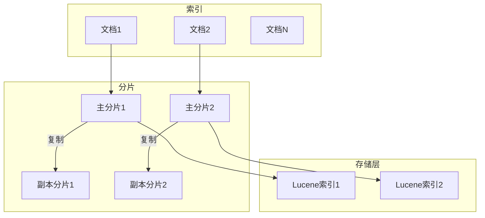

---

# 第三章：索引与管理

## 3.1 分片与副本机制

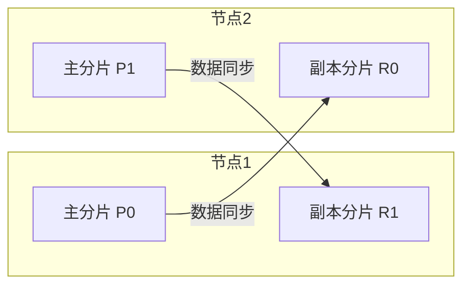

| 配置项 | 默认值 | 说明 |
|--------|--------|------|
| 主分片数 | 1 | 索引创建后不可更改 |
| 副本分片数 | 1 | 可动态调整 |
| 刷新间隔 | 1秒 | 文档可被搜索的延迟 |

## 3.2 映射类型

```bash
# 静态映射示例
$ curl -X PUT "http://localhost:9200/my_index" -H 'Content-Type: application/json' -d '
{
  "mappings": {
    "properties": {
      "title": {
        "type": "text",
        "analyzer": "standard"
      },
      "price": {
        "type": "double"
      },
      "created_at": {
        "type": "date"
      },
      "tags": {
        "type": "keyword"
      }
    }
  }
}'
```

| 类型 | 说明 | 示例 |
|------|------|------|
| text | 全文搜索 | 文章内容 |
| keyword | 精确匹配 | 标签、ID |
| long/double | 数值 | 价格、数量 |
| date | 日期时间 | 创建时间 |
| boolean | 布尔值 | 是否启用 |
| nested | 嵌套对象 | 数组对象 |

## 3.3 分析器原理

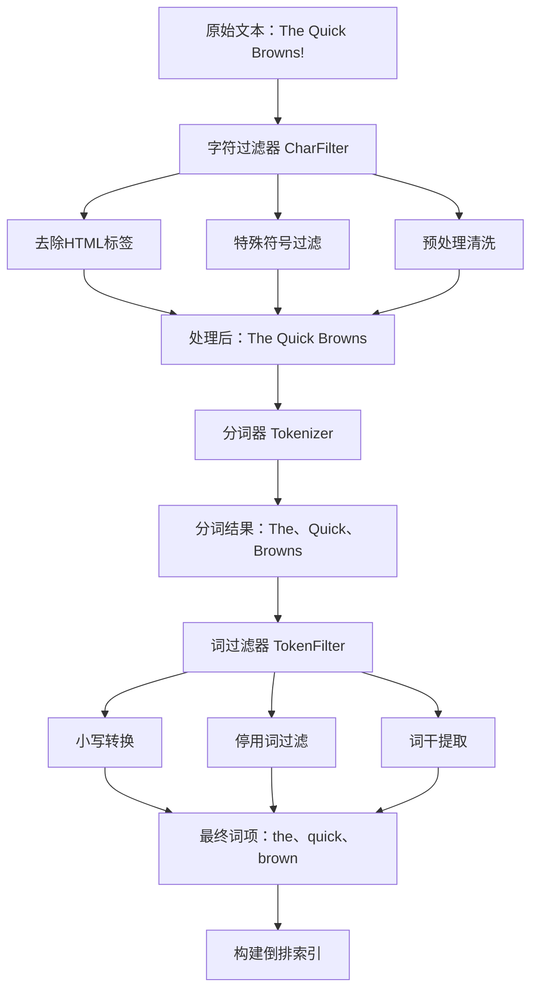

| 组件 | 作用 |
|------|------|
| Character Filter | 字符过滤（HTML标签、大小写） |
| Tokenizer | 分词（按空格、标点分割） |
| Token Filter | 词过滤（停用词、同义词、词干） |

---

# 第四章：查询详解

## 4.1 查询类型分类

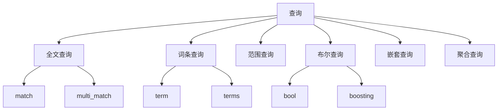

## 4.2 查询类型对比

| 类型 | 特点 | 使用场景 |
|------|------|----------|
| match | 全文搜索，会分析查询词 | 搜索文章内容 |
| term | 精确匹配，不分析词 | ID、状态、标签 |
| terms | 多值精确匹配 | 多标签查询 |
| range | 范围查询 | 价格区间、日期范围 |
| bool | 布尔组合 | 复杂条件组合 |

## 4.3 查询示例

```json
{
  "query": {
    "bool": {
      "must": [
        { "match": { "title": "Elasticsearch教程" } }
      ],
      "should": [
        { "term": { "featured": true } }
      ],
      "must_not": [
        { "term": { "status": "deleted" } }
      ],
      "filter": [
        { "range": { "price": { "gte": 100, "lte": 500 } } }
      ]
    }
  }
}
```

---

# 第五章：聚合分析

## 5.1 聚合架构

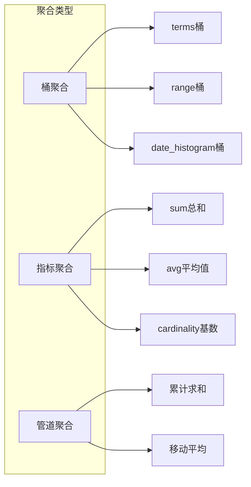

## 5.2 聚合示例

```bash
$ curl -X GET "http://localhost:9200/sales/_search" -H 'Content-Type: application/json' -d '
{
  "size": 0,
  "aggs": {
    "by_region": {
      "terms": { "field": "region.keyword" },
      "aggs": {
        "total_amount": { "sum": { "field": "sales_amount" } },
        "avg_quantity": { "avg": { "field": "quantity_sold" } }
      }
    },
    "by_category": {
      "terms": { "field": "product_category.keyword" }
    }
  }
}'
```

## 5.3 多重聚合桶

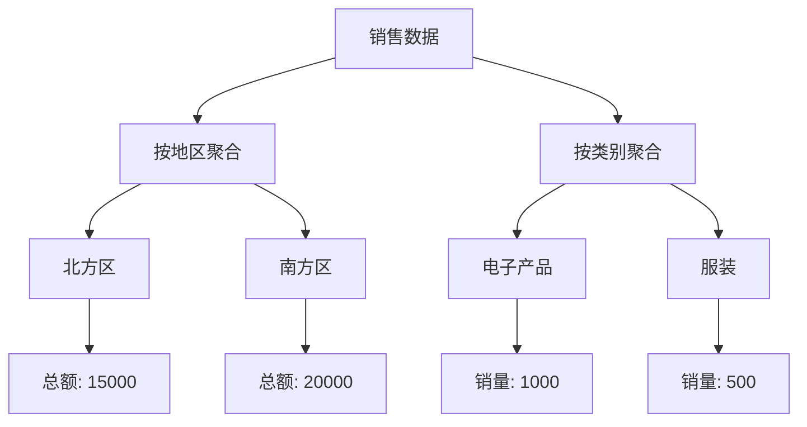

---

# 第六章：性能优化

## 6.1 性能问题场景

| 场景 | 问题原因 | 影响 |
|------|----------|------|
| 高写入吞吐量 | 写入速度超过处理能力 | 队列堆积、延迟增加 |
| 分片过多 | 管理开销增大 | 内存占用高 |
| 副本过多 | 写入复制成本 | 写入性能下降 |
| 深度分页 | 跳过大量数据 | 内存溢出、耗时剧增 |
| 复杂嵌套 | 解析和映射开销 | 查询性能下降 |
| 缓存未命中 | 查询参数频繁变化 | 每次全量计算 |

## 6.2 优化手段

| 优化项 | 建议 |
|--------|------|
| 副本数量 | 读多写少可增加副本，读性能线性提升 |
| 分片策略 | 单分片50GB左右，避免过多小分片 |
| 路由优化 | 使用routingKey减少搜索范围 |
| 字段类型 | 精确查询用keyword，避免text全文本 |
| 禁用动态映射 | 避免字段爆炸，控制存储 |
| 冷热分离 | 热数据用高性能节点，冷数据用大容量 |

## 6.3 缓存机制

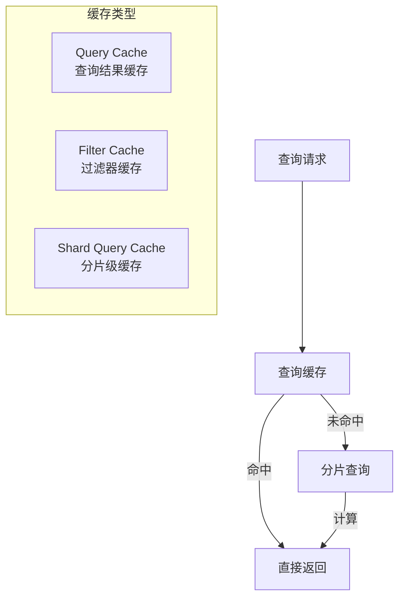

---

# 第七章：集群架构

## 7.1 集群特点

| 特点 | 说明 |
|------|------|
| 分布式存储 | 数据分散在多个节点 |
| 副本冗余 | 节点故障自动恢复 |
| 水平扩展 | 新节点自动均衡 |
| 故障转移 | Master选举自动进行 |

## 7.2 Master选举机制

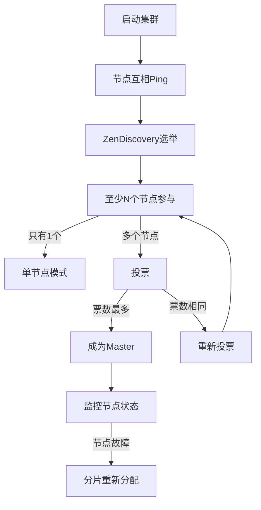

## 7.3 脑裂问题处理

| 参数 | 说明 |
|------|------|
| discovery.zen.minimum_master_nodes | 最小主节点数，防止脑裂 |
| 公式 | (N/2) + 1，N为合格节点数 |

---

# 第八章：底层原理

## 8.1 倒排索引原理

### 正排索引 vs 倒排索引

| 类型 | 结构 | 查询方式 |
|------|------|----------|
| 正排索引 | 文档 → 词列表 | 根据文档查词 |
| 倒排索引 | 词 → 文档列表 | 根据词查文档 |

### 倒排索引结构

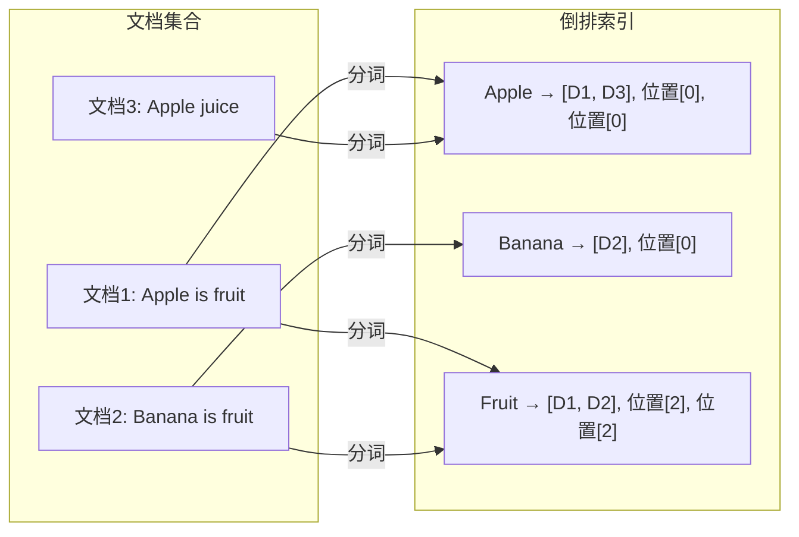

### 查询流程

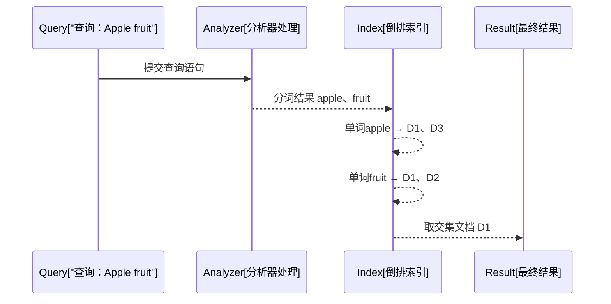

## 8.2 文档写入流程

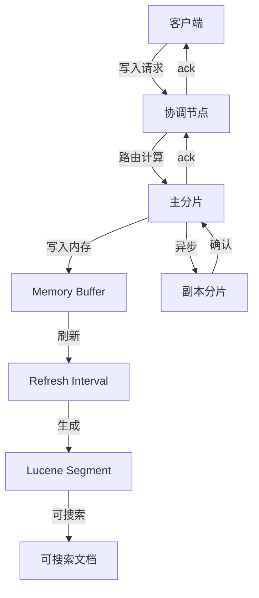

## 8.3 文档更新/删除流程

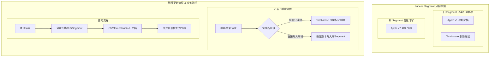

---

# 第九章：高级特性

## 9.1 深度分页方案

### 问题说明

| 方案 | 原理 | 限制 |
|------|------|------|
| from + size | 指定偏移和数量 | 最大10000条 |
| search_after | 基于上一页最后一条排序值 | 需指定排序字段 |
| scroll | 创建查询上下文 | 资源开销大，需清理 |

### search_after示例

```json
// 首页查询
{
  "query": { "match": { "title": "keyword" } },
  "sort": [{"id": "asc"}],
  "size": 10
}

// 后续查询
{
  "query": { "match": { "title": "keyword" } },
  "sort": [{"id": "asc"}],
  "search_after": [123],
  "size": 10
}
```

## 9.2 联表查询方案

### join数据类型

```json
{
  "mappings": {
    "properties": {
      "join_field": {
        "type": "join",
        "relations": {
          "customer": "order"
        }
      }
    }
  }
}
```

```json
// 查询某个客户的所有订单
{
  "query": {
    "has_parent": {
      "parent_type": "customer",
      "query": {
        "term": { "customer_id": "customer123" }
      }
    }
  }
}
```

## 9.3 多索引查询

```json
// 跨索引查询
{
  "query": {
    "bool": {
      "should": [
        {
          "bool": {
            "must": [
              { "term": { "index1.field1": "value1" } }
            ]
          }
        },
        {
          "bool": {
            "must": [
              { "term": { "index2.field2": "value2" } }
            ]
          }
        }
      ]
    }
  }
}
```

---

# 第十章：实战问题

## 10.1 为什么Elasticsearch查询快

| 原因 | 说明 |
|------|------|
| 倒排索引 | 词到文档的直接映射 |
| 缓存机制 | Query Cache、Filter Cache |
| 分片并行 | 多节点并行计算 |
| 文本分析 | 预处理的倒排索引 |
| 分布式架构 | 横向扩展能力 |

## 10.2 一致性保证

| 级别 | 说明 | 实现方式 |
|------|------|----------|
| 写入一致 | 写入主分片+指定数量副本 | wait_for_active_shards |
| 读取一致 | 读取主分片或副本 | preference参数 |
| 乐观锁 | 版本号控制并发 | if_seq_no + if_primary_term |

## 10.3 面试高频问题

| 问题 | 关键点 |
|------|--------|
| 索引文档过程 | 分片路由 → 写入缓存 → 刷新 → 可搜索 |
| 搜索过程 | 查询协调节点 → 并行搜索分片 → 结果汇总 |
| 分片分配 | Master决策 → 副本复制 → 负载均衡 |
| 性能优化 | 副本数、分片策略、缓存利用、字段类型 |
| 集群高可用 | 副本机制、故障转移、脑裂防护 |

---

# 相关资料

- [Elasticsearch官方文档](https://www.elastic.co/guide/en/elasticsearch/reference/current/index.html)
- [Elasticsearch: The Definitive Guide](https://www.elastic.co/guide/en/elasticsearch/guide/current/index.html)
- [10道不得不会的ElasticSearch面试题](https://cloud.tencent.com/developer/article/1964271)
