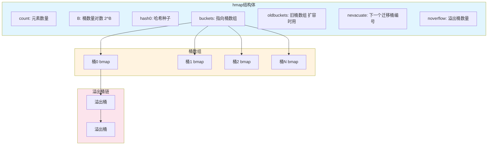

# Go语言map详解：从原理到实践


## 一、概念与使用场景

Go语言中的map是一种无序的键值对集合，它提供了快速的查找、插入和删除操作。map是基于哈希表实现的，可以在常数时间内完成基本操作，因此在很多场景中被广泛应用。

**主要使用场景：**
- **配置管理**：存储应用程序的配置项
- **缓存实现**：临时存储计算结果或远程数据
- **索引结构**：为数据集合提供快速查找能力
- **计数器**：统计元素出现的频率
- **映射关系存储**：如用户ID与用户信息的对应关系
- **分组操作**：按照特定条件对数据进行分组

## 二、基本使用

### 1. 创建与初始化

```go
// 方法1：使用make函数创建
m1 := make(map[string]int)  // 创建空map
m2 := make(map[string]int, 10)  // 创建指定初始容量的map

// 方法2：使用字面量创建
m3 := map[string]int{}
m4 := map[string]int{"a": 1, "b": 2, "c": 3}

// 方法3：创建nil map（不能直接使用，需要先make）
var m5 map[string]int  // 初始为nil
```

### 2. 基本操作

```go
// 插入/更新元素
m := make(map[string]int)
m["one"] = 1
m["two"] = 2

// 访问元素
value := m["one"]  // 如果键不存在，返回值类型的零值

// 检查键是否存在
value, exists := m["three"]  // exists为false时，表示键不存在
if exists {
    fmt.Println("键存在，值为:", value)
} else {
    fmt.Println("键不存在")
}

// 删除元素
delete(m, "one")

// 获取map长度
length := len(m)  // 获取map中元素的数量

// 遍历map
for k, v := range m {
    fmt.Printf("键: %s, 值: %d\n", k, v)
}
```

## 三、底层实现原理

Go语言的map实现是一个精巧的哈希表设计，主要由`hmap`结构体和`bmap`结构体组成。

### 1. hmap结构体

```go
// runtime/map.go
type hmap struct {
    count     int          // map中的元素数量
    B         uint8        // 桶数量的对数，桶数量为2^B
    buckets   unsafe.Pointer // 指向桶数组的指针
    oldbuckets unsafe.Pointer // 扩容时指向旧桶数组的指针
    nevacuate uintptr      // 下一个需要迁移的旧桶编号
    // 其他字段用于状态跟踪、迭代器、并发控制等
    flags     uint8
    hash0     uint32       // 哈希种子
    noverflow uint16       // 溢出桶的数量
    // ...
}
```

`hmap`是map的核心结构，它包含了map的基本元数据和指向桶数组的指针。桶数组由多个`bmap`结构组成，每个`bmap`可以存储多个键值对。

### hmap结构示意图



**图示说明：**
- **hmap结构体**：map的头部信息，管理整个哈希表
- **桶数组**：由2^B个bmap桶组成，每个桶存8个键值对
- **溢出桶链**：当桶满了，用链表连接额外桶

### 2. bmap（桶）结构

```go
// runtime/map.go
type bmap struct {
    tophash [bucketCnt]uint8  // 存储哈希值的高8位，用于快速判断键是否存在
    // 键值对数据（实际存储中在编译时会添加键值对的字段）
    // 存储格式：key1, key2, ..., value1, value2, ...
    // 最后是一个指向溢出桶的指针：overflow *bmap
}
```

每个`bmap`桶可以存储最多8个键值对。当一个桶中的键值对数量超过8个时，会创建溢出桶来存储额外的键值对。

### 3. 哈希值的处理

当我们向map中插入或查询一个键值对时，Go会执行以下步骤：

1. 计算键的哈希值（使用`hash0`作为种子）
2. 使用哈希值的低B位确定桶的位置（桶数量为2^B）
3. 使用哈希值的高8位填充到`tophash`数组中，用于快速比较
4. 在对应的桶中查找或插入键值对

#### key定位桶的详细计算过程

**步骤1：计算哈希值**

```go
// 伪代码
hash = hash_function(key, h.hash0)  // 使用hash0作为种子计算哈希值
```

假设 `hash("apple") = 0x12345678` (二进制: 0001 0010 0011 0100 0101 0110 0111 1000)

**步骤2：确定桶数量**

```go
// B是桶数量的对数，桶数量 = 2^B
// 如果 B = 3，则桶数量 = 2^3 = 8 个桶
bucket_count = 1 << h.B  // 即 2^B
```

**步骤3：计算桶索引（取低B位）**

```
hash = 0x12345678 = 二进制: 0001 0010 0011 0100 0101 0110 0111 1000

如果 B = 3（8个桶），取低3位：
hash & (bucket_count - 1) = hash & 7
                         = 0x12345678 & 0x00000007
                         = 0x00000000
                         = 0  →  桶0

如果 B = 4（16个桶），取低4位：
hash & 15 = 0x12345678 & 0x0000000F
          = 0x00000008
          = 8  →  桶8
```

**为什么用位运算而不是取模？**

```go
// 取模运算（慢）
bucket_index = hash % bucket_count

// 位运算（快）- 只有桶数量是2的幂时才成立
bucket_index = hash & (bucket_count - 1)
```

因为桶数量一定是2的幂（2^B），所以可以用位运算代替取模，速度更快。

**完整示例：**

```go
m := make(map[string]int)  // 初始B=0，桶数量=1

// 随着元素增加，B会增长
// B=0: 桶数量=1   (2^0)
// B=1: 桶数量=2   (2^1)  
// B=2: 桶数量=4   (2^2)
// B=3: 桶数量=8   (2^3)
// B=4: 桶数量=16  (2^4)

// 假设当前 B=2（4个桶）
m["apple"] = 1   // hash("apple") = 0x12345678
                // 桶索引 = 0x12345678 & (4-1) = 0x12345678 & 3 = 0 → 桶0

m["grape"] = 2   // hash("grape") = 0xABCDEF00  
                // 桶索引 = 0xABCDEF00 & 3 = 0 → 桶0（冲突！）

m["peach"] = 3   // hash("peach") = 0x99999999
                // 桶索引 = 0x99999999 & 3 = 1 → 桶1
```

**步骤4：使用tophash快速比较**

```
hash = 0x12345678

高8位 = (hash >> 24) & 0xFF = 0x12
tophash[0] = 0x12  // 存储在桶的tophash数组中

查找时先比较tophash，如果不同就不用比较key了
```

哈希冲突处理：Go使用链地址法处理哈希冲突。当多个键被映射到同一个桶时，它们会被存储在同一个桶或其对应的溢出桶链中。

#### 哈希冲突示例详解

**什么是哈希冲突？**

哈希冲突是指**不同的key，经过哈希函数计算后，得到了相同的哈希值**（或者哈希值不同，但取模后映射到了同一个桶位置）。

**具体例子：**

```go
m := make(map[string]int, 4)  // 创建容量为4的map
m["apple"] = 1   // 假设 hash("apple") = 100,  100 % 4 = 0 → 桶0
m["grape"] = 2   // 假设 hash("grape") = 104,  104 % 4 = 0 → 桶0  ← 冲突！
m["peach"] = 3   // 假设 hash("peach") = 101,  101 % 4 = 1 → 桶1
```

在这个例子中：
- `"apple"` 和 `"grape"` 是两个完全不同的字符串
- 但它们的哈希值取模后都是0，都要存到**桶0**
- 这就是**哈希冲突**

**Go如何解决？—— 链地址法**

```
桶0: [apple:1] → [grape:2] → nil
     ↑主桶(第1个)  ↑主桶(第2个)

桶1: [peach:3] → nil
     ↑主桶(第1个)

桶2: nil

桶3: nil
```

**冲突更严重时——溢出桶：**

```go
m["berry"] = 4   // hash("berry") % 4 = 0 → 桶0
m["mango"] = 5   // hash("mango") % 4 = 0 → 桶0
m["lemon"] = 6   // hash("lemon") % 4 = 0 → 桶0
// ... 继续往桶0塞数据
```

每个桶最多存8个键值对，超过就要挂**溢出桶**：

```
桶0: [apple:1] → [grape:2] → [berry:4] → [mango:5] → ... (最多8个)
     ↑主桶bmap
                              ↓
                         溢出桶overflow
                         [lemon:6] → [orange:7] → ... → nil
```

**查找过程：**

当执行 `value := m["grape"]` 时：
1. 计算 `hash("grape") % 4 = 0` → 去桶0找
2. 遍历桶0中的所有键，比较 `"grape"`
3. 找到了，返回值 `2`
4. 如果没找到，继续去溢出桶找

### 4. 源码角度的关键函数

```go
// 查找键值对
tfunc mapaccess1(t *maptype, h *hmap, key unsafe.Pointer) unsafe.Pointer

// 插入键值对
tfunc mapassign(t *maptype, h *hmap, key unsafe.Pointer) unsafe.Pointer

// 删除键值对
tfunc mapdelete(t *maptype, h *hmap, key unsafe.Pointer)
```

## 四、扩容机制

Go语言的map采用了一种称为"渐进式扩容"的策略，这种策略可以避免在大数据量下一次性扩容带来的性能抖动。

### 1. 翻倍扩容（Growing）

当map的负载因子（`count/(2^B)`）超过阈值6.5时，会触发翻倍扩容。翻倍扩容会创建一个新的桶数组，容量是原来的两倍。

```go
// 触发翻倍扩容的条件
if h.count > bucketCntLoadFactor || tooManyOverflowBuckets(h.noverflow, h.B) {
    // 执行扩容
    hashGrow(t, h)
}
```

### 2. 等量扩容（Shrinking）

当map中的元素被大量删除后，溢出桶数量过多时，会触发等量扩容。等量扩容会创建一个与原桶数量相同的新桶数组，但会重新排列元素，使元素分布更加紧凑。

触发条件：溢出桶数量超过常规桶数量。

### 3. 渐进式扩容的实现

渐进式扩容不会一次性迁移所有元素，而是在后续的操作（查找、插入、删除、遍历）中逐步迁移：

```go
// 渐进式扩容中的桶迁移
func evacuated(b *bmap) bool {
    // 判断桶是否已经迁移完成
    return b.tophash[0] == evacuatedX || b.tophash[0] == evacuatedY
}

// 在操作中进行元素迁移
if h.oldbuckets != nil {
    // 尝试迁移一个桶
    evacuate(t, h, oldbucket)
}
```

这种设计确保了即使在处理大量数据时，map的性能也能保持稳定，不会因为扩容操作而导致明显的性能下降。

## 五、哈希表理论基础

### 1. 哈希函数

哈希函数是将任意大小的输入映射到固定大小输出的函数。一个好的哈希函数应该具有以下特性：
- **均匀分布**：将输入均匀地分布在输出空间
- **确定性**：相同的输入总是产生相同的输出
- **雪崩效应**：输入的微小变化会导致输出的显著变化

Go语言对不同类型的键使用不同的哈希函数，以确保良好的分布性。

### 2. 哈希冲突及解决方法

哈希冲突是指两个不同的输入产生相同哈希值的情况。常见的解决方法包括：

- **链地址法（Separate Chaining）**：Go语言采用的方法，将冲突的键值对存储在同一个桶或溢出桶链中
- **开放地址法（Open Addressing）**：当发生冲突时，寻找其他空位存储
- **再哈希法（Rehashing）**：使用另一个哈希函数重新计算位置
- **建立公共溢出区**：将所有冲突的记录都放入一个公共溢出区

### 3. 负载因子

负载因子是衡量哈希表填充程度的指标，计算公式为：`负载因子 = 元素数量 / 桶数量`。负载因子过高会导致哈希冲突增加，影响性能；负载因子过低则会浪费空间。

Go语言选择了6.5作为负载因子阈值，这是在时间效率和空间效率之间的权衡。

## 六、常见问题与注意事项

### 1. 并发安全问题

Go语言的map不是并发安全的。如果在多个goroutine中同时读写同一个map，会导致数据竞争和未定义行为。

#### 为什么map不是并发安全的？

从底层实现来看，map的并发不安全主要源于以下几个方面：

1. **hmap结构体的并发访问**：map的核心结构`hmap`包含多个字段（如count、buckets等），这些字段在并发读写时没有原子性保证
2. **扩容期间的竞态条件**：在渐进式扩容过程中，读写操作可能同时访问新旧桶数组，导致数据不一致
3. **哈希计算的竞态**：多个goroutine同时写入可能导致哈希冲突处理出现问题
4. **性能考虑**：如果map内置锁机制，在单goroutine场景下会带来不必要的性能开销

#### 并发访问会导致的问题

```go
// 危险示例：并发写入会导致panic
func dangerousConcurrentWrite() {
    m := make(map[int]int)
    
    for i := 0; i < 100; i++ {
        go func(n int) {
            m[n] = n  // fatal error: concurrent map writes
        }(i)
    }
    
    time.Sleep(time.Second)
}
```

运行结果：
```
fatal error: concurrent map writes
```

#### 解决方案一：使用互斥锁（sync.RWMutex）

适用场景：读多写少的场景，性能较好

```go
type SafeMap struct {
    mu   sync.RWMutex
    data map[string]int
}

func NewSafeMap() *SafeMap {
    return &SafeMap{
        data: make(map[string]int),
    }
}

func (sm *SafeMap) Get(key string) (int, bool) {
    sm.mu.RLock()
    defer sm.mu.RUnlock()
    val, ok := sm.data[key]
    return val, ok
}

func (sm *SafeMap) Set(key string, value int) {
    sm.mu.Lock()
    defer sm.mu.Unlock()
    sm.data[key] = value
}

func (sm *SafeMap) Delete(key string) {
    sm.mu.Lock()
    defer sm.mu.Unlock()
    delete(sm.data, key)
}

func (sm *SafeMap) Range(f func(key string, value int) bool) {
    sm.mu.RLock()
    defer sm.mu.RUnlock()
    for k, v := range sm.data {
        if !f(k, v) {
            break
        }
    }
}
```

#### 解决方案二：使用sync.Map

`sync.Map`是Go 1.9引入的并发安全的map实现，专为高并发场景优化。

**特点：**
- 空间换时间：使用冗余的数据结构来减少锁竞争
- 读写分离：读操作使用原子操作，写操作使用互斥锁
- 适合读多写少、key相对稳定的场景

**API差异：**
```go
// sync.Map的方法
type Map struct { ... }

func (m *Map) Store(key, value interface{})        // 存储
func (m *Map) Load(key interface{}) (value interface{}, ok bool)  // 读取
func (m *Map) Delete(key interface{})              // 删除
func (m *Map) Range(f func(key, value interface{}) bool)  // 遍历
func (m *Map) LoadOrStore(key, value interface{}) (actual interface{}, loaded bool)  // 读取或存储
```

**使用示例：**

```go
func useSyncMap() {
    var m sync.Map
    
    // 存储
    m.Store("name", "Alice")
    m.Store("age", 25)
    
    // 读取
    if value, ok := m.Load("name"); ok {
        fmt.Println("name:", value)
    }
    
    // 读取或存储（原子操作）
    actual, loaded := m.LoadOrStore("city", "Beijing")
    fmt.Println("city:", actual, "loaded:", loaded)
    
    // 遍历
    m.Range(func(key, value interface{}) bool {
        fmt.Printf("%v: %v\n", key, value)
        return true
    })
    
    // 删除
    m.Delete("age")
}
```

**sync.Map性能对比：**

```go
func benchmarkMapComparison() {
    const n = 100000
    
    // 测试1：sync.RWMutex + map
    rwMap := NewSafeMap()
    start := time.Now()
    
    var wg sync.WaitGroup
    for i := 0; i < 10; i++ {
        wg.Add(1)
        go func(id int) {
            defer wg.Done()
            for j := 0; j < n/10; j++ {
                key := fmt.Sprintf("key-%d-%d", id, j)
                rwMap.Set(key, j)
                rwMap.Get(key)
            }
        }(i)
    }
    wg.Wait()
    fmt.Printf("RWMutex+map: %v\n", time.Since(start))
    
    // 测试2：sync.Map
    var syncMap sync.Map
    start = time.Now()
    
    for i := 0; i < 10; i++ {
        wg.Add(1)
        go func(id int) {
            defer wg.Done()
            for j := 0; j < n/10; j++ {
                key := fmt.Sprintf("key-%d-%d", id, j)
                syncMap.Store(key, j)
                syncMap.Load(key)
            }
        }(i)
    }
    wg.Wait()
    fmt.Printf("sync.Map: %v\n", time.Since(start))
}
```

#### 解决方案三：分片锁（Sharding）

对于超高并发场景，可以使用分片锁来减少锁竞争：

```go
type ShardedMap struct {
    shards [16]struct {
        sync.RWMutex
        data map[string]int
    }
}

func NewShardedMap() *ShardedMap {
    sm := &ShardedMap{}
    for i := 0; i < 16; i++ {
        sm.shards[i].data = make(map[string]int)
    }
    return sm
}

func (sm *ShardedMap) getShard(key string) int {
    hash := fnv32(key)
    return int(hash % 16)
}

func (sm *ShardedMap) Get(key string) (int, bool) {
    shard := sm.getShard(key)
    sm.shards[shard].RLock()
    defer sm.shards[shard].RUnlock()
    val, ok := sm.shards[shard].data[key]
    return val, ok
}

func (sm *ShardedMap) Set(key string, value int) {
    shard := sm.getShard(key)
    sm.shards[shard].Lock()
    defer sm.shards[shard].Unlock()
    sm.shards[shard].data[key] = value
}

func fnv32(key string) uint32 {
    hash := uint32(2166136261)
    const prime32 = uint32(16777619)
    for i := 0; i < len(key); i++ {
        hash *= prime32
        hash ^= uint32(key[i])
    }
    return hash
}
```

#### 实际应用场景示例

**场景1：缓存系统**

```go
type Cache struct {
    mu    sync.RWMutex
    items map[string]interface{}
}

func (c *Cache) Get(key string) (interface{}, bool) {
    c.mu.RLock()
    defer c.mu.RUnlock()
    item, found := c.items[key]
    return item, found
}

func (c *Cache) Set(key string, value interface{}, ttl time.Duration) {
    c.mu.Lock()
    defer c.mu.Unlock()
    c.items[key] = value
    
    // 异步清理过期缓存
    go func() {
        time.Sleep(ttl)
        c.mu.Lock()
        defer c.mu.Unlock()
        delete(c.items, key)
    }()
}
```

**场景2：计数器**

```go
type Counter struct {
    mu    sync.Mutex
    counts map[string]int64
}

func (c *Counter) Incr(key string) int64 {
    c.mu.Lock()
    defer c.mu.Unlock()
    c.counts[key]++
    return c.counts[key]
}

func (c *Counter) Get(key string) int64 {
    c.mu.Lock()
    defer c.mu.Unlock()
    return c.counts[key]
}
```

**场景3：并发安全的配置管理**

```go
type Config struct {
    mu     sync.RWMutex
    values map[string]interface{}
}

func (c *Config) Load(filename string) error {
    data, err := os.ReadFile(filename)
    if err != nil {
        return err
    }
    
    var config map[string]interface{}
    if err := json.Unmarshal(data, &config); err != nil {
        return err
    }
    
    c.mu.Lock()
    defer c.mu.Unlock()
    c.values = config
    return nil
}

func (c *Config) Get(key string) interface{} {
    c.mu.RLock()
    defer c.mu.RUnlock()
    return c.values[key]
}
```

#### 最佳实践总结

1. **选择合适的方案**：
   - 读多写少：使用`sync.RWMutex`
   - key集合稳定、大量并发读：使用`sync.Map`
   - 超高并发：使用分片锁

2. **避免锁粒度过大**：
   - 不要在持有锁时执行耗时操作（如I/O、网络请求）
   - 尽量减少锁的持有时间

3. **注意死锁**：
   - 避免在持有锁时调用可能获取同一锁的其他函数
   - 使用`defer`确保锁一定会释放

4. **性能测试**：
   - 在实际场景中进行基准测试，选择最适合的方案
   - 关注锁竞争的指标（如mutex等待时间）

### 2. 内存泄漏问题

如果map中的值是指针或包含指针的结构体，当删除键时，值所指向的内存不会自动释放，可能导致内存泄漏。

预防措施：
- 删除键时，将值设为nil，帮助GC识别可以回收的内存
- 当map不再需要时，将整个map设为nil

```go
// 避免内存泄漏的做法
m := make(map[string]*LargeStruct)
// ... 使用map ...
// 删除键时清理值
m["key"] = nil
delete(m, "key")
// 或直接将map置为nil
m = nil
```

### 3. 遍历顺序的随机性

Go语言规范保证了每次遍历map时，顺序可能不同。这是故意设计的，以防止程序依赖于特定的遍历顺序。

如果需要稳定的遍历顺序，可以将键存储在切片中，并对切片进行排序后再遍历。

```go
// 有序遍历map的方法
m := map[string]int{"c": 3, "a": 1, "b": 2}

// 提取键到切片
keys := make([]string, 0, len(m))
for k := range m {
    keys = append(keys, k)
}

// 对键进行排序
sort.Strings(keys)

// 按排序后的键遍历map
for _, k := range keys {
    fmt.Printf("%s: %d\n", k, m[k])
}
```

### 4. nil map的使用

声明但未初始化的map是nil的，对nil map进行读操作是安全的，但写操作会导致运行时错误。

```go
var m map[string]int  // nil map
fmt.Println(m["key"])  // 安全，返回0
m["key"] = 1  // 运行时错误：assignment to entry in nil map

// 正确的做法是先初始化
m = make(map[string]int)
m["key"] = 1  // 现在安全了
```

## 七、性能优化策略

### 1. 合理设置初始容量

在创建map时，如果能预估元素数量，最好指定初始容量，这样可以减少后续的扩容操作，提高性能。

```go
// 预估需要存储1000个元素
m := make(map[string]int, 1000)
```

### 2. 选择合适的键类型

使用内置类型（如int、string）作为键比使用自定义类型更高效，因为Go对内置类型有专门的哈希函数优化。

如果使用自定义类型作为键，确保实现了高效的`==`比较操作。

### 3. 批量操作

尽可能使用批量操作而不是单个操作，减少函数调用开销。

### 4. 预分配空间

在向map中添加大量数据时，可以预先分配足够的空间，避免多次扩容。

## 八、总结

Go语言的map是一个功能强大且高效的数据结构，它通过精心设计的哈希表实现，提供了快速的查找、插入和删除操作。其渐进式扩容策略确保了即使在处理大量数据时也能保持良好的性能。

在使用map时，需要注意它不是并发安全的，以及可能存在的内存泄漏问题。通过合理设置初始容量、选择合适的键类型和采用适当的并发控制机制，可以充分发挥map的性能优势。

从理论角度看，Go的map实现巧妙地平衡了时间效率和空间效率，是哈希表数据结构在实际应用中的优秀范例。

## 参考资料

- [Go语言官方文档](https://golang.org/doc/)
- [Go源码：runtime/map.go](https://github.com/golang/go/blob/master/src/runtime/map.go)
- [吃透Golang的map底层数据结构及其实现原理](https://www.modb.pro/db/171834)
- [map解析](https://qcrao.com/post/dive-into-go-map/)
- [Go语言高性能编程](https://geektutu.com/post/high-performance-go.html)
- [map内存泄漏](https://zhuanlan.zhihu.com/p/582982078)