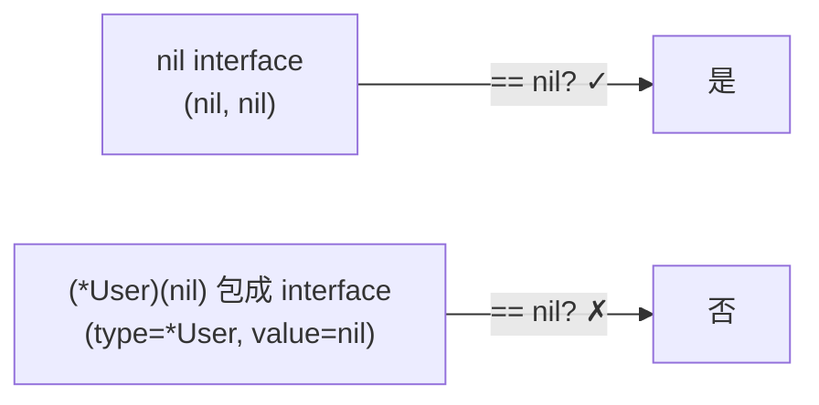

# Go 容易踩坑的点

> 本章汇总 Go 语言中常见的、容易在生产环境引发问题的踩坑点。每条都附**反例 → 正确写法 → 原理**,帮助识别和规避。深入原理请参考各专题文件。

## 目录

- [一、切片踩坑](#一切片踩坑)
- [二、map 踩坑](#二map-踩坑)
- [三、闭包与循环变量](#三闭包与循环变量)
- [四、nil 与 interface](#四nil-与-interface)
- [五、defer 踩坑](#五defer-踩坑)
- [六、channel 踩坑](#六channel-踩坑)
- [七、方法接收者](#七方法接收者)
- [八、变量遮蔽 shadow](#八变量遮蔽-shadow)
- [九、浮点比较](#九浮点比较)
- [十、range 值拷贝](#十range-值拷贝)
- [十一、time.After 内存泄漏](#十一timeafter-内存泄漏)
- [十二、Mutex 不可重入](#十二mutex-不可重入)
- [十三、recover 位置限制](#十三recover-位置限制)
- [十四、string 不可变](#十四string-不可变)
- [十五、整数溢出](#十五整数溢出)
- [十六、nil map vs 空 map](#十六nil-map-vs-空-map)
- [十七、struct tag 格式](#十七struct-tag-格式)
- [十八、面试速查](#十八面试速查)

## 一、切片踩坑

详见 [slice.md](./slice.md),这里汇总高频坑。

### 1.1 append 返回新切片,原切片不感知

```go
// ❌ 反例:丢失 append 结果
func appendBad(s []int) {
    s = append(s, 1) // s 是局部变量,调用方看不到
}
func main() {
    s := []int{}
    appendBad(s)
    fmt.Println(s) // []
}
```

```go
// ✅ 正确:返回或用指针
func appendGood(s []int) []int {
    return append(s, 1)
}
s = appendGood(s)
```

**原理**:切片是 `[(ptr, len, cap)]` 三元组的值传递,append 可能扩容返回新底层数组,但调用方的 slice header 不变。

### 1.2 多个切片共享底层数组

```go
// ❌ 反例:append 后两个切片看到不同状态,以为独立
a := make([]int, 3, 5) // [0 0 0], cap=5
b := a[:2]             // [0 0]
b = append(b, 99)      // 写到 a 的 index 2 位置
fmt.Println(a) // [0 0 99]  ← a 被改了!
```

```go
// ✅ 正确:要独立就用 copy
a := make([]int, 3, 5)
b := make([]int, 2)
copy(b, a[:2])
b = append(b, 99)
fmt.Println(a) // [0 0 0]
```

### 1.3 切片作为函数参数的"伪引用"

切片是值类型(传 slice header 的拷贝),但底层数组共享:

```go
func modify(s []int) {
    s[0] = 99   // ✓ 改的是底层数组,调用方可见
    s = append(s, 1) // ✗ 改的是局部 header,调用方不可见
}
```

| 操作 | 调用方可见? | 原因 |
|------|------------|------|
| `s[i] = v` | ✓ | 修改共享的底层数组 |
| `append(s, v)` | ✗ | 可能扩容到新数组 |
| `s = s[:n]` | ✗ | 改的是局部 header |

## 二、map 踩坑

详见 [map.md](./map.md),高频坑如下。

### 2.1 并发写 panic

```go
// ❌ 反例:并发写 map 会 panic
m := map[int]int{}
for i := 0; i < 10; i++ {
    go func(n int) {
        m[n] = n // fatal error: concurrent map writes
    }(i)
}
```

```go
// ✅ 正确:sync.Map 或加锁
var m sync.Map
m.Store(1, 1)
v, _ := m.Load(1)

// 或
var mu sync.Mutex
m := map[int]int{}
mu.Lock(); m[1] = 1; mu.Unlock()
```

**原理**:Go runtime 检测到并发写会主动 panic(不是数据错乱),保护程序。

### 2.2 取零值不报错,误判 key 存在

```go
m := map[string]int{"a": 1}
v := m["b"] // 0,但不报错
if v == 0 {
    // 是不存在,还是值为 0?无法区分!
}
```

```go
// ✅ 正确:用 comma-ok
if v, ok := m["b"]; ok {
    fmt.Println("存在", v)
} else {
    fmt.Println("不存在")
}
```

### 2.3 对 map 的 value 取地址

```go
// ❌ 反例:编译错误
m := map[string]int{"a": 1}
p := &m["a"] // cannot take the address of m["a"]
```

**原理**:map 的 value 可能随 rehash 移动,Go 禁止取地址,避免悬垂指针。

## 三、闭包与循环变量

### 3.1 Go 1.22 之前的经典坑

```go
// ❌ Go 1.22 之前:所有 goroutine 都打印 3
func main() {
    for i := 0; i < 3; i++ {
        go func() {
            fmt.Println(i)
        }()
    }
    time.Sleep(time.Second)
}
// 输出:3 3 3(顺序不定)
```

**原理**:Go 1.22 之前,循环变量 `i` 在整个 for 中是**同一个变量**;goroutine 闭包捕获的是引用,执行时 i 已是 3。

```go
// ✅ Go 1.22 之前:显式传参
for i := 0; i < 3; i++ {
    go func(n int) {
        fmt.Println(n)
    }(i)
}

// 或加局部变量
for i := 0; i < 3; i++ {
    i := i // 新建局部变量
    go func() { fmt.Println(i) }()
}
```

### 3.2 Go 1.22 修复

Go 1.22 起,for 循环**每次迭代创建新变量**,上述闭包坑自动消失:

```go
// Go 1.22+:输出 0 1 2(顺序不定)
for i := 0; i < 3; i++ {
    go func() { fmt.Println(i) }()
}
```

| 版本 | for 变量语义 | 闭包捕获 |
|------|------------|---------|
| Go < 1.22 | 整个 for 共用一个变量 | 共享,需手动 `i := i` |
| Go ≥ 1.22 | 每次迭代新变量 | 独立 |

> 老项目升级 Go 1.22+ 后,以前写的 `i := i` 是冗余但无害,可保留。

## 四、nil 与 interface

### 4.1 nil 接口不等于含 nil 的接口

```go
// ❌ 反例:返回 nil 指针包装成 interface,!= nil
func getUser() *User {
    return nil
}
func main() {
    var i interface{} = getUser()
    if i == nil {
        // 不会进入!i 不是 nil,而是 (type=*User, value=nil)
    }
}
```

```go
// ✅ 正确:用显式类型返回,或返回前判 nil
func getUser() interface{} {
    u := lookup()
    if u == nil {
        return nil // 真正的 nil interface
    }
    return u
}
```

**原理**:interface 内部是 `(type, value)` 二元组,**只有两者都为 nil 才等于 nil**。`*User(nil)` 包成 interface 后,type 非空,整体 ≠ nil。



### 4.2 nil slice / map 可读不可写

```go
var s []int
fmt.Println(len(s), cap(s)) // 0 0
fmt.Println(s == nil)        // true
s[0]                         // panic
s = append(s, 1)             // ✓ 合法,append 自动分配

var m map[string]int
m["a"] = 1 // panic: assignment to entry in nil map
_ = m["a"] // ✓ 读返回零值
```

| 类型 | 读 | 写 |
|------|----|----|
| nil slice | panic(索引越界) | append 合法 |
| nil map | 返回零值 | panic |

## 五、defer 踩坑

详见 [defer.md](./defer.md)。

### 5.1 参数在 defer 声明时求值

```go
// ❌ 反例:以为 defer 看到 i 的最终值
func main() {
    i := 1
    defer fmt.Println(i) // 输出 1,不是 2
    i = 2
}
```

```go
// ✅ 正确:用闭包捕获最终值
func main() {
    i := 1
    defer func() { fmt.Println(i) }() // 输出 2
    i = 2
}
```

| defer 形式 | 求值时机 |
|----------|---------|
| `defer fmt.Println(i)` | defer 声明时 |
| `defer func() { fmt.Println(i) }()` | 执行时 |

### 5.2 defer 在循环中累积

```go
// ❌ 反例:1 万个文件句柄同时打开
for _, path := range paths {
    f, _ := os.Open(path)
    defer f.Close() // 函数退出才关闭,期间累积大量句柄
}
```

```go
// ✅ 正确:拆成函数,函数返回即关闭
for _, path := range paths {
    process(path)
}
func process(path string) {
    f, _ := os.Open(path)
    defer f.Close()
    // ...
}
```

## 六、channel 踩坑

详见 [channel.md](./channel.md)。

### 6.1 向已 close 的 channel 发送会 panic

```go
ch := make(chan int, 1)
close(ch)
ch <- 1 // panic: send on closed channel
```

**最佳实践**:由**发送方**关闭,不要在接收方关。

### 6.2 nil channel 阻塞

```go
var ch chan int // nil
ch <- 1         // 永久阻塞
<-ch            // 永久阻塞
close(ch)       // panic
```

**用法**:在 select 中用 nil channel **禁用**某个分支:

```go
select {
case v := <-ch1: // ch1 为 nil 时该分支永不命中
    use(v)
case v := <-ch2:
    use(v)
}
```

### 6.3 range channel 直到 close 才退出

```go
// ❌ 反例:不 close 则 goroutine 永久阻塞,泄漏
func consume(ch <-chan int) {
    for v := range ch { // 只有 close(ch) 才退出
        use(v)
    }
}
```

```go
// ✅ 正确:发送方完成后 close
go func() {
    defer close(ch)
    for _, v := range data {
        ch <- v
    }
}()
```

## 七、方法接收者

### 7.1 指针接收者 vs 值接收者方法集

```go
type User struct{ name string }
func (u User)  GetName() string { return u.name } // 值接收者
func (u *User) SetName(s string) { u.name = s }  // 指针接收者

var u User
u.GetName()  // ✓
u.SetName("a") // ✓ Go 自动取地址 &u

var p *User
p.GetName()  // ✓ Go 自动解引用
```

**坑点**:实现接口时方法集不同:

```go
type Namer interface{ GetName() string }
type Setter interface{ SetName(string) }

var u User
var _ Namer = u  // ✓ 值接收者可在值上实现接口
var _ Setter = u // ✗ 指针接收者只在 *User 上实现
var _ Setter = &u // ✓
```

| 接口要求 | User 满足 | *User 满足 |
|---------|---------|----------|
| 全值接收者 | ✓ | ✓ |
| 含指针接收者 | ✗ | ✓ |

### 7.2 大结构体值接收者拷贝代价

```go
// ❌ 反例:每次调用拷贝 1KB
type Big struct{ data [1024]byte }
func (b Big) Sum() int { ... }

// ✅ 正确:用指针接收者
func (b *Big) Sum() int { ... }
```

## 八、变量遮蔽 shadow

### 8.1 `:=` 误覆盖

```go
// ❌ 反例:err 被局部覆盖,外层判断失效
func work() (err error) {
    f, err := os.Open("a")
    if err != nil {
        return err
    }
    defer f.Close()

    g, err := os.Open("b") // 这里 := 新建了 err
    // 但如果 work 已声明 err,实际是赋值给外层
    // 真正的坑是变量名相同,理解容易混乱
    return nil
}
```

更典型的坑:

```go
// ❌ 反例:if 内的 err 是新变量,外层 err 没被更新
var err error
if cond {
    x, err := some() // 新建 err,不写外层
    _ = x
}
fmt.Println(err) // 还是 nil
```

```go
// ✅ 正确:用 = 而非 :=
var x int
if cond {
    x, err = some()
}
```

### 8.2 for 循环变量遮蔽

```go
// ❌ 反例:外层 i 被内层遮蔽,逻辑混乱
i := 10
for i := 0; i < 3; i++ { // 新 i
    fmt.Println(i) // 0 1 2
}
fmt.Println(i) // 10
```

> 用 `go vet -shadow` 可检测遮蔽。

## 九、浮点比较

```go
// ❌ 反例:浮点 == 不可靠
a := 0.1 + 0.2
b := 0.3
fmt.Println(a == b) // false

// ✅ 正确:用 epsilon
const eps = 1e-9
func equal(a, b float64) bool {
    return math.Abs(a-b) < eps
}
```

**原理**:IEEE 754 浮点无法精确表示 0.1,累加误差。

| 类型 | 比较 |
|------|------|
| 整数 | `==` 安全 |
| 字符串 | `==` 安全 |
| 浮点 | 用 epsilon |
| 复数 | 比实虚部,用 epsilon |

## 十、range 值拷贝

```go
// ❌ 反例:修改 v 不影响原 slice
users := []User{{"a"}, {"b"}}
for _, v := range users {
    v.name = "x" // 改的是拷贝
}
fmt.Println(users) // [{a} {b}]

// ✅ 正确 1:用索引
for i := range users {
    users[i].name = "x"
}

// ✅ 正确 2:用指针 slice
users := []*User{{"a"}, {"b"}}
for _, v := range users {
    v.name = "x" // v 是 *User,改的是底层
}
```

| range 元素 | 拷贝内容 | 修改原对象 |
|----------|---------|----------|
| `[]T` | 值拷贝 | ✗ 需 `s[i]` |
| `[]*T` | 指针拷贝 | ✓ `v.X = ...` |
| `map[K]V` | 值拷贝 | ✗ 需 `m[k] = ...` |

## 十一、time.After 内存泄漏

```go
// ❌ 反例:每次循环创建 time.After,未命中则泄漏到超时
for {
    select {
    case v := <-ch:
        use(v)
    case <-time.After(3 * time.Second):
        return
    }
}
```

**原理**:`time.After` 在底层注册 timer,直到触发前不会被 GC。高频循环会累积大量未触发 timer。

```go
// ✅ 正确:复用 timer
timer := time.NewTimer(3 * time.Second)
defer timer.Stop()
for {
    timer.Reset(3 * time.Second)
    select {
    case v := <-ch:
        use(v)
    case <-timer.C:
        return
    }
}
```

## 十二、Mutex 不可重入

详见 [Mutex.md](./Mutex.md)。

```go
// ❌ 反例:死锁
var mu sync.Mutex
func A() {
    mu.Lock()
    B() // B 又 Lock → 死锁
    mu.Unlock()
}
func B() {
    mu.Lock()
    // ...
    mu.Unlock()
}
```

**原理**:Go 的 `sync.Mutex` 不是可重入锁,同 goroutine 二次 Lock 会永久阻塞。

```go
// ✅ 正确:拆分锁方法
func A() {
    mu.Lock()
    aInner() // 不持锁
    mu.Unlock()
}
func aInner() {
    // 业务逻辑
}
```

## 十三、recover 位置限制

```go
// ❌ 反例:直接调用 recover 无效
func work() {
    defer recover() // 没有命名返回,无效
    panic("x")
}

// ❌ 反例:嵌套也无效
func work() {
    defer func() {
        defer func() {
            recover() // ✗ 不在最外层 defer
        }()
    }()
    panic("x")
}
```

```go
// ✅ 正确:必须在 defer 函数直接调用
func work() {
    defer func() {
        if r := recover(); r != nil {
            log.Println("recovered:", r)
        }
    }()
    panic("x")
}
```

| recover 位置 | 是否生效 |
|------------|---------|
| 直接在 defer 函数中 | ✓ |
| 嵌套 defer 中 | ✗ |
| 非 defer 上下文 | ✗ |

## 十四、string 不可变

```go
// ❌ 反例:想修改 string 字符
s := "hello"
// s[0] = 'H' // 编译错误

// ✅ 正确:转 []byte 或 []rune
b := []byte(s)
b[0] = 'H'
s = string(b) // "Hello"

// 中文要用 []rune
s := "你好"
r := []rune(s)
r[0] = '坏'
s = string(r)
```

| 转换 | 适用 | 性能 |
|------|------|------|
| `[]byte(s)` | ASCII | 拷贝 |
| `[]rune(s)` | UTF-8 多字节 | 拷贝 |

**性能陷阱**:`string(b)` 和 `[]byte(s)` 都会拷贝,循环中频繁转换是热点。用 `strings.Builder` 或 unsafe(谨慎)。

## 十五、整数溢出

```go
// ❌ 反例:无检测的累加
func sum(nums []int) int {
    var s int
    for _, n := range nums {
        s += n // int64 累加可能溢出,符号反转
    }
    return s
}
```

**原理**:Go 整数溢出**不报错**,环绕(wrap-around)产生错误结果。

```go
// ✅ 正确:用 math.CheckedAdd(Go 1.17+)或手动判断
func addChecked(a, b int64) (int64, bool) {
    if b > 0 && a > math.MaxInt64-b {
        return 0, false
    }
    if b < 0 && a < math.MinInt64-b {
        return 0, false
    }
    return a + b, true
}
```

| 类型 | 范围 |
|------|------|
| int (64位) | ±9.2 × 10¹⁸ |
| int32 | ±2.1 × 10⁹ |
| uint | 0 ~ 1.8 × 10¹⁹ |

## 十六、nil map vs 空 map

```go
// ❌ 反例:nil map 写 panic
var m map[string]int
m["a"] = 1 // panic

// ✅ 正确 1:用 make
m := make(map[string]int)
m["a"] = 1 // ✓

// ✅ 正确 2:字面量(空但非 nil)
m := map[string]int{}
m["a"] = 1 // ✓
```

| 形式 | nil? | 可写? | JSON 序列化 |
|------|------|------|------------|
| `var m map[string]int` | ✓ | ✗ panic | `null` |
| `make(map[string]int)` | ✗ | ✓ | `{}` |
| `map[string]int{}` | ✗ | ✓ | `{}` |

> API 返回 JSON 时:nil map → `null`,空 map → `{}`,前端处理可能不同。

## 十七、struct tag 格式

```go
// ❌ 反例:tag 格式错误,静默失效
type User struct {
    Name string `json:name`      // 缺引号,无效
    Age  int    `json:"age"`     // 正确
    Addr string `json:"addr,omitempty"` // 正确
}
```

**tag 语法**:`key:"value" key:"value"`,空格分隔,整体用反引号包裹。

```go
// ✅ 正确
type User struct {
    Name     string `json:"name" validate:"required"`
    Age      int    `json:"age,omitempty"`
    Internal string `json:"-"` // 不序列化
}
```

| tag | 作用 |
|-----|------|
| `json:"name"` | 序列化字段名 |
| `json:"name,omitempty"` | 零值时省略 |
| `json:"-"` | 跳过该字段 |
| `validate:"required"` | 校验库(如 go-playground/validator) |

**坑点**:tag 写错不报错,只在运行时发现字段不匹配。

## 十八、面试速查

### 18.1 高频踩坑题

| 场景 | 坑点 | 关键字 |
|------|------|--------|
| for + goroutine | 闭包捕获循环变量 | Go 1.22 修复 |
| interface 包装 nil | `(type, value)` 不全 nil | 显式判空 |
| map 并发写 | runtime 主动 panic | sync.Map |
| append 切片 | 返回新 slice | 接收返回值 |
| defer + 参数 | 声明时求值 | 闭包捕获延迟求值 |
| nil map 写 | panic | make 初始化 |
| time.After | 累积未触发 timer | NewTimer + Reset |
| Mutex 重入 | 死锁 | 拆分锁方法 |
| recover | 仅在最外层 defer 生效 | 直接在 defer 函数中调 |
| range 修改 | 值拷贝 | `s[i]` 或 `[]*T` |
| 浮点 == | 不可靠 | epsilon |
| 整数溢出 | 环绕不报错 | CheckedAdd |

### 18.2 易混点

1. **slice 是值类型**——但底层数组共享,看起来像引用。
2. **map 是引用类型**——但并发写会 panic,不是数据错乱。
3. **interface 是隐式实现**——但 nil 判断有坑。
4. **string 是值类型**——不可变,改字符要转 `[]byte`/`[]rune`。
5. **channel 是引用类型**——但 nil channel 永久阻塞。

### 18.3 排查工具

| 工具 | 用途 |
|------|------|
| `go vet` | 静态检查,shadow、printf 等 |
| `go vet -shadow` | 检测变量遮蔽 |
| `staticcheck` | 更严格的静态分析 |
| `go test -race` | 数据竞争检测 |
| `pprof` | 详见 [pprof.md](./pprof.md) |
| `go tool trace` | 调度追踪 |

### 18.4 防御性编码建议

1. map 并发场景一律用 `sync.Map` 或 `sync.RWMutex`
2. for + goroutine 项目用 Go 1.22+ 或显式传参
3. interface 返回 nil 前显式判空
4. defer 文件/锁关闭必须配对
5. 大结构体方法用指针接收者
6. channel 由发送方 close
7. 浮点比较永远用 epsilon
8. 整数累加用 int64 并检测溢出

## 相关专题

- [slice.md](./slice.md) 切片原理
- [map.md](./map.md) map 实现
- [channel.md](./channel.md) channel 模式
- [defer.md](./defer.md) defer 原理
- [Mutex.md](./Mutex.md) 互斥锁
- [协程泄漏.md](./协程泄漏.md) goroutine 泄漏排查
- [PassByReferenceOrValue.md](./PassByReferenceOrValue.md) 值传递与引用传递
- [性能.md](./性能.md) 性能优化
