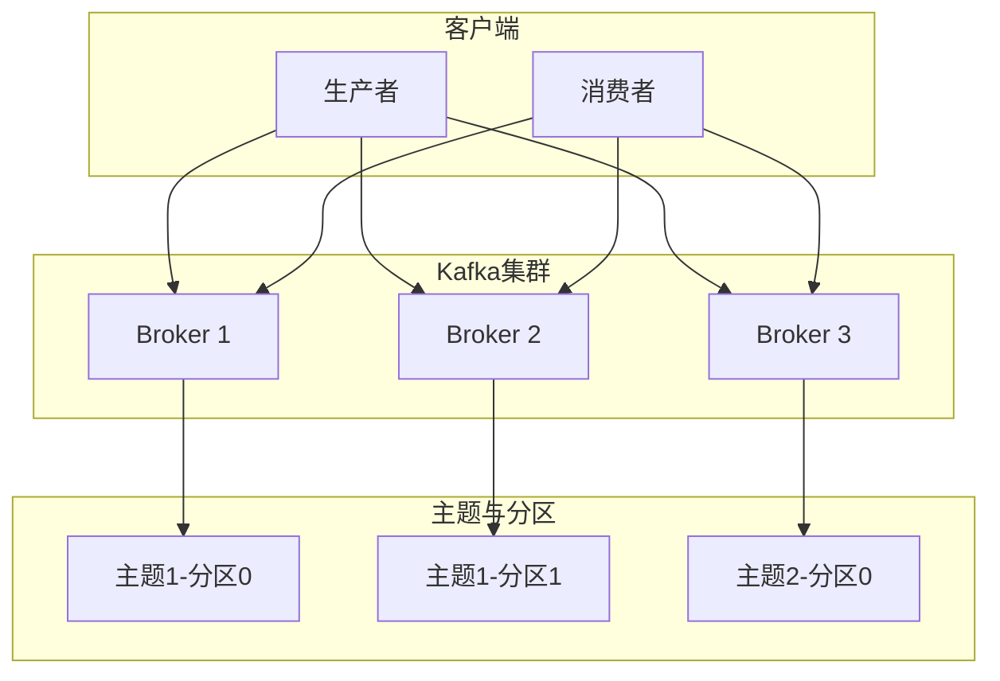
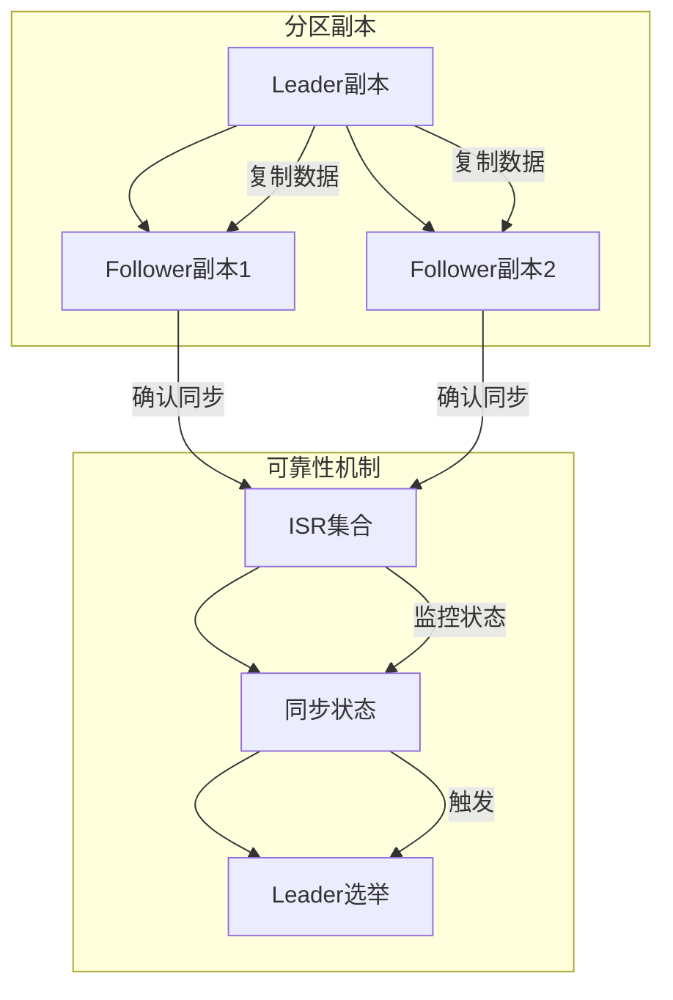
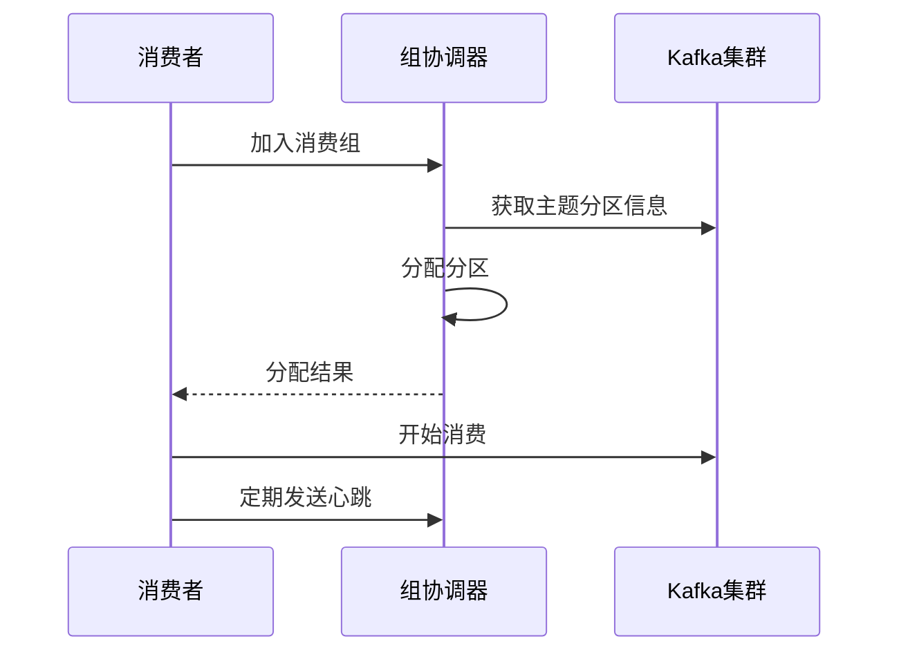

## 一、Kafka 核心概念

### 1. 基本概念

- **主题（Topic）**：消息的分类，每条消息都属于一个主题
- **分区（Partition）**：主题的物理分组，提高并行处理能力
- **消息（Record）**：Kafka 中的基本数据单元，包含键、值和时间戳
- **生产者（Producer）**：消息的发送者，负责将消息发送到 Kafka 集群
- **消费者（Consumer）**：消息的接收者，从 Kafka 集群订阅并消费消息
- **消费者组（Consumer Group）**：一组协同工作的消费者，实现负载均衡和故障转移
- **Broker**：Kafka 服务器节点，存储消息并处理客户端请求
- **副本（Replica）**：分区的备份，分为 Leader 副本和 Follower 副本
- **偏移量（Offset）**：消息在分区中的唯一标识，用于跟踪消费进度
- **协调者（Coordinator）**：负责管理消费者组的状态和重平衡
- **控制器（Controller）**：Kafka 集群的中心管理器，负责 Leader 选举等操作
- **重平衡（Rebalance）**：消费者组内分区的重新分配过程

### 2. 核心 API

1. **Producer API**：生产者 API，用于发送消息
2. **Consumer API**：消费者 API，用于消费消息
3. **Streams API**：流处理 API，用于实时数据处理
4. **Connector API**：连接器 API，用于与外部系统集成

## 二、Kafka 架构与原理

### 1. 系统架构

**Kafka 架构**由以下组件组成：

- **生产者（Producer）**：发送消息到 Kafka 集群
- **消费者（Consumer）**：从 Kafka 集群订阅并消费消息
- **Broker**：Kafka 服务器节点，存储消息
- **主题（Topic）**：消息的分类
- **分区（Partition）**：主题的物理分组
- **副本（Replica）**：分区的备份
- **Zookeeper/KRaft**：集群协调和元数据管理

### 2. 消息存储原理

- **分区存储**：每个主题分为多个分区，每个分区是一个有序的日志文件
- **日志文件**：消息以追加方式写入分区日志文件
- **索引文件**：维护消息偏移量和物理位置的映射，加速消息查找
- **页缓存（PageCache）**：利用操作系统的页缓存提高读写性能
- **零拷贝**：减少数据复制次数，提高传输效率

### 3. 副本机制

- **Leader 副本**：负责处理读写请求
- **Follower 副本**：从 Leader 副本同步数据，作为冗余
- **ISR（In-Sync Replicas）**：与 Leader 保持同步的副本集合
- **Leader 选举**：当 Leader 副本故障时，从 ISR 中选举新的 Leader

### 4. 消费者组原理

- **组协调器（Group Coordinator）**：负责管理消费者组的状态
- **重平衡触发条件**：
  - 消费者数量变化
  - 分区数量变化
  - 订阅的主题变化
- **重平衡过程**：
  1. 选择组协调器
  2. 加入消费组（JOIN GROUP）
  3. 同步组状态（SYNC GROUP）
- **分区分配策略**：
  1. **Range**：按范围分配分区
  2. **RoundRobin**：轮询分配分区
  3. **Sticky**：粘性分配，尽量保持原有分配

## 三、核心概念详解

### 1. 主题与分区

**主题（Topic）**是消息的逻辑分类，类似于数据库中的表。每个主题可以分为多个**分区（Partition）**，分区是消息的物理存储单元。

- **分区的作用**：
  - 提高并行处理能力
  - 实现数据的水平扩展
  - 便于数据的负载均衡
  - 支持顺序消息的局部有序性

- **分区的特性**：
  - 每个分区内的消息是有序的
  - 不同分区之间的消息顺序不保证
  - 分区数量可以在创建主题时指定，也可以后续增加

### 2. 生产者与消费者

**生产者（Producer）**负责将消息发送到 Kafka 集群，**消费者（Consumer）**负责从 Kafka 集群订阅并消费消息。

- **生产者的职责**：
  - 选择消息发送到哪个分区
  - 处理消息发送失败的情况
  - 确保消息的可靠性

- **消费者的职责**：
  - 订阅一个或多个主题
  - 消费消息并处理
  - 提交消费偏移量
  - 处理消费异常

### 3. 消费者组

**消费者组（Consumer Group）**是一组协同工作的消费者，共同消费一个或多个主题的消息。

- **消费者组的特性**：
  - 每个消费者组有一个唯一的组 ID
  - 组内的消费者共享订阅的主题
  - 每个分区只能被组内的一个消费者消费
  - 当消费者数量变化时，会触发重平衡

- **消费者组的优势**：
  - 实现负载均衡
  - 提供故障转移能力
  - 支持水平扩展

### 4. 副本机制

**副本（Replica）**是分区的备份，用于提高数据的可靠性和可用性。

- **副本的类型**：
  - **Leader 副本**：负责处理读写请求
  - **Follower 副本**：从 Leader 副本同步数据

- **ISR（In-Sync Replicas）**：
  - 与 Leader 保持同步的副本集合
  - 只有 ISR 中的副本才有资格被选举为 Leader
  - 确保数据的一致性

### 5. 偏移量管理

**偏移量（Offset）**是消息在分区中的唯一标识，用于跟踪消费者的消费进度。

- **偏移量的存储**：
  - 旧版本：存储在 ZooKeeper
  - 新版本：存储在 `__consumer_offsets` 主题

- **偏移量的提交**：
  - **自动提交**：定期自动提交
  - **手动提交**：由消费者控制提交时机

## 四、常见问题与解答

### 1. 主题和分区的关系

**Q**：一个主题可以有多少个分区？
**A**：理论上可以有任意多个分区，但实际上受限于集群资源和管理复杂度。一般建议根据预期吞吐量和消费者数量来设置分区数。

### 2. 副本的作用

**Q**：为什么需要副本？
**A**：副本用于提高数据的可靠性和可用性。当 Leader 副本故障时，可以从 Follower 副本中选举新的 Leader，确保服务不中断。

### 3. 消费者组的工作原理

**Q**：消费者组如何实现负载均衡？
**A**：消费者组通过重平衡机制，将分区均匀分配给组内的消费者。每个分区只能被组内的一个消费者消费，确保消息不被重复处理。

### 4. 偏移量的作用

**Q**：偏移量有什么作用？
**A**：偏移量用于跟踪消费者的消费进度。当消费者重启或发生故障时，可以从上次提交的偏移量继续消费，避免消息重复处理或丢失。

## 五、总结

Kafka 的核心概念是理解其工作原理的基础。通过本文档，您已经了解了 Kafka 的基本概念、架构原理和核心组件。

**核心要点**：
- 主题和分区是 Kafka 消息存储的基本单元
- 生产者负责发送消息，消费者负责消费消息
- 消费者组实现了消息的负载均衡和故障转移
- 副本机制提高了数据的可靠性和可用性
- 偏移量管理确保了消费进度的连续性

理解这些核心概念，将帮助您更好地使用和配置 Kafka，构建可靠、高效的消息系统。