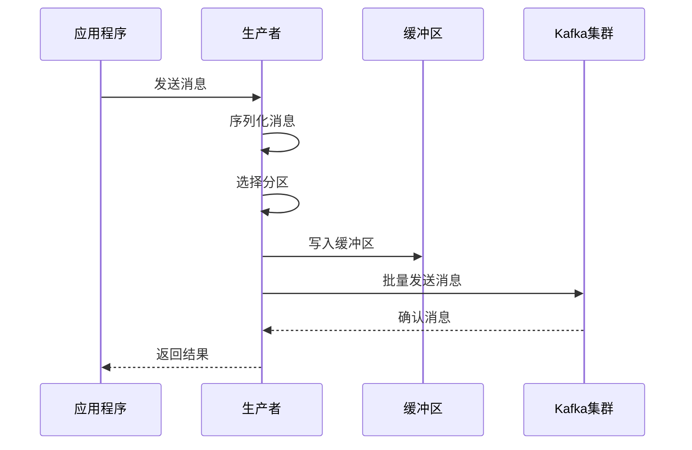

## 一、Kafka 生产者简介

### 1. 什么是 Kafka 生产者

**Kafka 生产者**是负责将消息发送到 Kafka 集群的客户端应用程序。它可以将数据从各种数据源发送到 Kafka 主题，是 Kafka 生态系统中的重要组成部分。

### 2. 生产者的作用

- **数据采集**：从各种数据源采集数据并发送到 Kafka
- **消息格式转换**：将数据转换为 Kafka 支持的消息格式
- **分区选择**：决定消息发送到哪个分区
- **可靠性保证**：确保消息可靠地发送到 Kafka 集群

## 二、生产者工作原理

### 1. 生产者架构

Kafka 生产者由以下组件组成：

- **生产者客户端**：应用程序使用的 API
- **消息序列化器**：将消息对象转换为字节数组
- **分区器**：决定消息发送到哪个分区
- **缓冲区**：临时存储待发送的消息
- **发送线程**：负责将消息发送到 Kafka 集群

### 2. 消息发送流程



## 三、消息发送模式

### 1. 发后即忘（Fire-and-Forget）

**特点**：发送消息后不关心结果，可靠性最低

**适用场景**：对可靠性要求不高的场景，如日志收集

**代码示例**：

```java
producer.send(new ProducerRecord<>("topic", "key", "value"));
```

### 2. 同步发送

**特点**：发送消息后等待响应，可靠性高，延迟较大

**适用场景**：对可靠性要求高的场景，如金融交易

**代码示例**：

```java
RecordMetadata metadata = producer.send(new ProducerRecord<>("topic", "key", "value")).get();
System.out.println("Message sent to partition " + metadata.partition() + ", offset " + metadata.offset());
```

### 3. 异步发送

**特点**：发送消息时指定回调函数，可靠性和延迟平衡

**适用场景**：大多数场景，兼顾可靠性和性能

**代码示例**：

```java
producer.send(new ProducerRecord<>("topic", "key", "value"), new Callback() {
    @Override
    public void onCompletion(RecordMetadata metadata, Exception exception) {
        if (exception != null) {
            exception.printStackTrace();
        } else {
            System.out.println("Message sent to partition " + metadata.partition() + ", offset " + metadata.offset());
        }
    }
});
```

## 四、分区策略

### 1. 手动指定分区

**特点**：生产者明确指定消息发送到哪个分区

**适用场景**：需要精确控制消息分区的场景

**代码示例**：

```java
// 手动指定分区为 0
ProducerRecord<String, String> record = new ProducerRecord<>("topic", 0, "key", "value");
producer.send(record);
```

### 2. 按 Key 分区

**特点**：根据消息 Key 的哈希值与分区数取模

**适用场景**：需要相同 Key 的消息发送到同一分区的场景

**代码示例**：

```java
// 相同 key 的消息会发送到同一分区
ProducerRecord<String, String> record = new ProducerRecord<>("topic", "user1", "value");
producer.send(record);
```

### 3. 轮询分区

**特点**：顺序轮询分配分区

**适用场景**：消息不需要特定分区的场景

**代码示例**：

```java
// 没有指定 key，使用轮询分区策略
ProducerRecord<String, String> record = new ProducerRecord<>("topic", "value");
producer.send(record);
```

### 4. 自定义分区器

**特点**：实现自定义的分区逻辑

**适用场景**：需要特殊分区逻辑的场景

**代码示例**：

```java
// 自定义分区器
public class CustomPartitioner implements Partitioner {
    @Override
    public int partition(String topic, Object key, byte[] keyBytes, Object value, byte[] valueBytes, Cluster cluster) {
        // 自定义分区逻辑
        List<PartitionInfo> partitions = cluster.partitionsForTopic(topic);
        int numPartitions = partitions.size();
        if (key == null) {
            return ThreadLocalRandom.current().nextInt(numPartitions);
        } else {
            return Math.abs(key.hashCode()) % numPartitions;
        }
    }
    
    @Override
    public void close() {}
    
    @Override
    public void configure(Map<String, ?> configs) {}
}

// 配置自定义分区器
props.put(ProducerConfig.PARTITIONER_CLASS_CONFIG, "com.example.CustomPartitioner");
```

## 五、可靠性保证

### 1. ACK 机制

- **acks=0**：发送后不等待确认，可能丢失消息
- **acks=1**：等待 Leader 确认，Leader 故障可能丢失消息
- **acks=all**：等待所有 ISR 副本确认，可靠性最高

**配置示例**：

```java
// 设置 acks 为 all
props.put(ProducerConfig.ACKS_CONFIG, "all");
```

### 2. 重试机制

**特点**：发送失败后自动重试

**配置示例**：

```java
// 设置重试次数
props.put(ProducerConfig.RETRIES_CONFIG, 10);
// 设置重试间隔
props.put(ProducerConfig.RETRY_BACKOFF_MS_CONFIG, 100);
```

### 3. 幂等性生产者

**特点**：通过 PID 和序列号确保消息不重复

**配置示例**：

```java
// 启用幂等性
props.put(ProducerConfig.ENABLE_IDEMPOTENCE_CONFIG, true);
// 设置 acks 为 all
props.put(ProducerConfig.ACKS_CONFIG, "all");
```

### 4. 事务生产者

**特点**：提供原子性的消息发送

**代码示例**：

```java
// 初始化事务
producer.initTransactions();
try {
    // 开始事务
    producer.beginTransaction();
    // 发送消息
    producer.send(new ProducerRecord<>("topic", "key", "value"));
    // 提交事务
    producer.commitTransaction();
} catch (Exception e) {
    // 中止事务
    producer.abortTransaction();
}
```

## 六、性能优化

### 1. 批量发送

**特点**：将多条消息批量发送，减少网络开销

**配置示例**：

```java
// 设置批量大小
props.put(ProducerConfig.BATCH_SIZE_CONFIG, 16384); // 16KB
// 设置 linger.ms
props.put(ProducerConfig.LINGER_MS_CONFIG, 10); // 10ms
```

### 2. 消息压缩

**特点**：减少网络传输开销

**配置示例**：

```java
// 设置压缩类型
props.put(ProducerConfig.COMPRESSION_TYPE_CONFIG, "snappy");
```

### 3. 缓冲区配置

**特点**：合理设置缓冲区大小，提高发送效率

**配置示例**：

```java
// 设置缓冲区大小
props.put(ProducerConfig.BUFFER_MEMORY_CONFIG, 33554432); // 32MB
```

### 4. 并发发送

**特点**：控制并发发送的请求数

**配置示例**：

```java
// 设置每个连接的最大并发请求数
props.put(ProducerConfig.MAX_IN_FLIGHT_REQUESTS_PER_CONNECTION, 5);
```

## 七、代码示例

### 1. 基本生产者示例

```java
import org.apache.kafka.clients.producer.*;
import java.util.Properties;

public class SimpleProducer {
    public static void main(String[] args) {
        Properties props = new Properties();
        props.put(ProducerConfig.BOOTSTRAP_SERVERS_CONFIG, "localhost:9092");
        props.put(ProducerConfig.KEY_SERIALIZER_CLASS_CONFIG, "org.apache.kafka.common.serialization.StringSerializer");
        props.put(ProducerConfig.VALUE_SERIALIZER_CLASS_CONFIG, "org.apache.kafka.common.serialization.StringSerializer");
        
        Producer<String, String> producer = new KafkaProducer<>(props);
        
        try {
            for (int i = 0; i < 10; i++) {
                ProducerRecord<String, String> record = 
                    new ProducerRecord<>("test-topic", "key-" + i, "value-" + i);
                
                // 异步发送
                producer.send(record, new Callback() {
                    @Override
                    public void onCompletion(RecordMetadata metadata, Exception exception) {
                        if (exception != null) {
                            exception.printStackTrace();
                        } else {
                            System.out.println("Message sent to partition " + metadata.partition() + ", offset " + metadata.offset());
                        }
                    }
                });
            }
        } finally {
            producer.close();
        }
    }
}
```

### 2. 可靠生产者示例

```java
import org.apache.kafka.clients.producer.*;
import java.util.Properties;

public class ReliableProducer {
    public static void main(String[] args) {
        Properties props = new Properties();
        props.put(ProducerConfig.BOOTSTRAP_SERVERS_CONFIG, "localhost:9092");
        props.put(ProducerConfig.KEY_SERIALIZER_CLASS_CONFIG, "org.apache.kafka.common.serialization.StringSerializer");
        props.put(ProducerConfig.VALUE_SERIALIZER_CLASS_CONFIG, "org.apache.kafka.common.serialization.StringSerializer");
        
        // 可靠性配置
        props.put(ProducerConfig.ACKS_CONFIG, "all");
        props.put(ProducerConfig.RETRIES_CONFIG, 10);
        props.put(ProducerConfig.ENABLE_IDEMPOTENCE_CONFIG, true);
        props.put(ProducerConfig.MAX_IN_FLIGHT_REQUESTS_PER_CONNECTION, 1);
        
        // 性能配置
        props.put(ProducerConfig.BATCH_SIZE_CONFIG, 16384);
        props.put(ProducerConfig.LINGER_MS_CONFIG, 10);
        props.put(ProducerConfig.COMPRESSION_TYPE_CONFIG, "snappy");
        
        Producer<String, String> producer = new KafkaProducer<>(props);
        
        try {
            for (int i = 0; i < 10; i++) {
                String messageId = "msg-" + i;
                ProducerRecord<String, String> record = 
                    new ProducerRecord<>("test-topic", messageId, "Message " + i);
                
                // 同步发送
                RecordMetadata metadata = producer.send(record).get();
                System.out.println("Sent message: " + messageId + 
                    " to partition " + metadata.partition() + 
                    " with offset " + metadata.offset());
            }
        } catch (Exception e) {
            e.printStackTrace();
        } finally {
            producer.close();
        }
    }
}
```

## 八、常见问题与解决方案

### 1. 消息发送失败

**问题**：消息发送失败，抛出异常

**解决方案**：
- 检查网络连接
- 验证 Kafka 服务是否正常运行
- 检查主题是否存在
- 增加重试次数

### 2. 消息重复

**问题**：由于重试机制，消息可能重复发送

**解决方案**：
- 启用生产者幂等性
- 在消费者端实现消息去重
- 使用事务确保精确一次语义

### 3. 性能问题

**问题**：生产者发送消息速度慢

**解决方案**：
- 启用批量发送
- 使用消息压缩
- 合理设置缓冲区大小
- 增加并发发送数

### 4. 内存使用过高

**问题**：生产者内存使用过高

**解决方案**：
- 合理设置缓冲区大小
- 控制批量大小
- 及时关闭生产者

## 九、总结

Kafka 生产者是将数据发送到 Kafka 集群的重要组件。通过本文档，您已经了解了 Kafka 生产者的工作原理、消息发送模式、分区策略、可靠性保证和性能优化等内容。

**核心要点**：
- 选择合适的消息发送模式（发后即忘、同步发送、异步发送）
- 根据业务需求选择合适的分区策略
- 配置适当的可靠性保证（ACK 机制、重试机制、幂等性、事务）
- 进行性能优化（批量发送、消息压缩、缓冲区配置）
- 处理常见问题（消息发送失败、消息重复、性能问题）

通过合理的配置和实现，您可以构建一个既可靠又高性能的 Kafka 生产者，满足不同业务场景的需求。