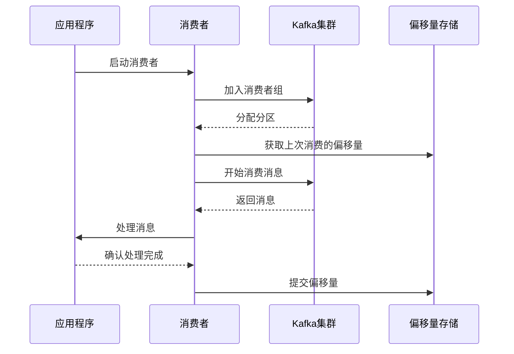

## 一、Kafka 消费者简介

### 1. 什么是 Kafka 消费者

**Kafka 消费者**是负责从 Kafka 集群订阅并消费消息的客户端应用程序。它可以从一个或多个主题中读取消息，并对消息进行处理，是 Kafka 生态系统中的重要组成部分。

### 2. 消费者的作用

- **数据消费**：从 Kafka 集群读取消息
- **消息处理**：对读取的消息进行业务处理
- **偏移量管理**：跟踪消费进度，确保消息不被重复处理
- **故障恢复**：在故障后从上次消费的位置继续处理

## 二、消费者工作原理

### 1. 消费者架构

Kafka 消费者由以下组件组成：

- **消费者客户端**：应用程序使用的 API
- **消息反序列化器**：将字节数组转换为消息对象
- **消费组协调器**：管理消费者组的状态和重平衡
- **偏移量管理器**：管理消费偏移量
- **消息处理器**：处理消费的消息

### 2. 消息消费流程



## 三、消费模式

### 1. 单消费者模式

**特点**：单个消费者消费一个或多个主题的所有分区

**适用场景**：简单的应用，不需要负载均衡

**代码示例**：

```java
// 单消费者模式
Properties props = new Properties();
props.put(ConsumerConfig.BOOTSTRAP_SERVERS_CONFIG, "localhost:9092");
props.put(ConsumerConfig.GROUP_ID_CONFIG, "single-consumer-group");
props.put(ConsumerConfig.KEY_DESERIALIZER_CLASS_CONFIG, "org.apache.kafka.common.serialization.StringDeserializer");
props.put(ConsumerConfig.VALUE_DESERIALIZER_CLASS_CONFIG, "org.apache.kafka.common.serialization.StringDeserializer");

KafkaConsumer<String, String> consumer = new KafkaConsumer<>(props);
consumer.subscribe(Collections.singletonList("test-topic"));

while (true) {
    ConsumerRecords<String, String> records = consumer.poll(Duration.ofMillis(100));
    for (ConsumerRecord<String, String> record : records) {
        System.out.println("Consumed message: " + record.value() + ", partition: " + record.partition() + ", offset: " + record.offset());
    }
}
```

### 2. 消费者组模式

**特点**：多个消费者组成一个消费者组，共同消费一个或多个主题

**适用场景**：需要负载均衡和故障转移的场景

**代码示例**：

```java
// 消费者组模式
Properties props = new Properties();
props.put(ConsumerConfig.BOOTSTRAP_SERVERS_CONFIG, "localhost:9092");
props.put(ConsumerConfig.GROUP_ID_CONFIG, "consumer-group-1");
props.put(ConsumerConfig.KEY_DESERIALIZER_CLASS_CONFIG, "org.apache.kafka.common.serialization.StringDeserializer");
props.put(ConsumerConfig.VALUE_DESERIALIZER_CLASS_CONFIG, "org.apache.kafka.common.serialization.StringDeserializer");

KafkaConsumer<String, String> consumer = new KafkaConsumer<>(props);
consumer.subscribe(Collections.singletonList("test-topic"));

while (true) {
    ConsumerRecords<String, String> records = consumer.poll(Duration.ofMillis(100));
    for (ConsumerRecord<String, String> record : records) {
        System.out.println("Consumer " + consumer.groupMetadata().groupInstanceId() + " consumed message: " + record.value() + ", partition: " + record.partition() + ", offset: " + record.offset());
    }
}
```

## 四、偏移量管理

### 1. 自动提交偏移量

**特点**：定期自动提交偏移量，配置简单

**适用场景**：对消息处理顺序和完整性要求不高的场景

**配置示例**：

```java
// 启用自动提交
props.put(ConsumerConfig.ENABLE_AUTO_COMMIT_CONFIG, "true");
// 设置自动提交间隔
props.put(ConsumerConfig.AUTO_COMMIT_INTERVAL_MS_CONFIG, "5000");
```

### 2. 手动提交偏移量

**特点**：由应用程序控制提交时机，可靠性更高

**适用场景**：对消息处理顺序和完整性要求高的场景

**代码示例**：

```java
// 禁用自动提交
props.put(ConsumerConfig.ENABLE_AUTO_COMMIT_CONFIG, "false");

// 手动同步提交
while (true) {
    ConsumerRecords<String, String> records = consumer.poll(Duration.ofMillis(100));
    for (ConsumerRecord<String, String> record : records) {
        // 处理消息
        System.out.println("Consumed message: " + record.value());
    }
    // 同步提交偏移量
    consumer.commitSync();
}

// 手动异步提交
while (true) {
    ConsumerRecords<String, String> records = consumer.poll(Duration.ofMillis(100));
    for (ConsumerRecord<String, String> record : records) {
        // 处理消息
        System.out.println("Consumed message: " + record.value());
    }
    // 异步提交偏移量
    consumer.commitAsync(new OffsetCommitCallback() {
        @Override
        public void onComplete(Map<TopicPartition, OffsetAndMetadata> offsets, Exception exception) {
            if (exception != null) {
                System.err.println("Commit failed: " + exception.getMessage());
            }
        }
    });
}
```

### 3. 提交特定偏移量

**特点**：精确控制提交的偏移量

**适用场景**：需要精确控制消费进度的场景

**代码示例**：

```java
// 提交特定偏移量
Map<TopicPartition, OffsetAndMetadata> offsets = new HashMap<>();
for (ConsumerRecord<String, String> record : records) {
    // 处理消息
    System.out.println("Consumed message: " + record.value());
    // 记录偏移量
    offsets.put(new TopicPartition(record.topic(), record.partition()), new OffsetAndMetadata(record.offset() + 1));
}
// 提交特定偏移量
consumer.commitSync(offsets);
```

## 五、分区分配策略

### 1. Range 策略

**特点**：按主题的分区范围分配

**适用场景**：主题数量较少的场景

**配置示例**：

```java
// 设置分区分配策略为 Range
props.put(ConsumerConfig.PARTITION_ASSIGNMENT_STRATEGY_CONFIG, "org.apache.kafka.clients.consumer.RangeAssignor");
```

### 2. RoundRobin 策略

**特点**：轮询分配分区

**适用场景**：主题数量较多的场景

**配置示例**：

```java
// 设置分区分配策略为 RoundRobin
props.put(ConsumerConfig.PARTITION_ASSIGNMENT_STRATEGY_CONFIG, "org.apache.kafka.clients.consumer.RoundRobinAssignor");
```

### 3. Sticky 策略

**特点**：粘性分配，尽量保持原有分配

**适用场景**：需要减少重平衡开销的场景

**配置示例**：

```java
// 设置分区分配策略为 Sticky
props.put(ConsumerConfig.PARTITION_ASSIGNMENT_STRATEGY_CONFIG, "org.apache.kafka.clients.consumer.StickyAssignor");
```

### 4. CooperativeSticky 策略

**特点**：协作式粘性分配，支持增量重平衡

**适用场景**：需要最小化重平衡影响的场景

**配置示例**：

```java
// 设置分区分配策略为 CooperativeSticky
props.put(ConsumerConfig.PARTITION_ASSIGNMENT_STRATEGY_CONFIG, "org.apache.kafka.clients.consumer.CooperativeStickyAssignor");
```

## 六、可靠性保证

### 1. 消费语义

- **至少一次**：消息可能被重复消费
- **至多一次**：消息可能丢失
- **精确一次**：消息只被消费一次

### 2. 消费者可靠性配置

**配置示例**：

```java
// 禁用自动提交
props.put(ConsumerConfig.ENABLE_AUTO_COMMIT_CONFIG, "false");
// 设置会话超时时间
props.put(ConsumerConfig.SESSION_TIMEOUT_MS_CONFIG, "30000");
// 设置心跳间隔
props.put(ConsumerConfig.HEARTBEAT_INTERVAL_MS_CONFIG, "10000");
// 设置最大轮询间隔
props.put(ConsumerConfig.MAX_POLL_INTERVAL_MS_CONFIG, "300000");
// 设置最大轮询记录数
props.put(ConsumerConfig.MAX_POLL_RECORDS_CONFIG, "500");
```

### 3. 消息去重

**特点**：处理消息重复的情况

**实现方法**：
- 使用消息ID去重
- 使用数据库唯一约束
- 使用分布式缓存

**代码示例**：

```java
// 使用 Redis 去重
private Set<String> processedMessages = ConcurrentHashMap.newKeySet();

public void processMessage(ConsumerRecord<String, String> record) {
    String messageId = record.key();
    if (!processedMessages.contains(messageId)) {
        // 处理消息
        System.out.println("Processing message: " + record.value());
        // 标记为已处理
        processedMessages.add(messageId);
        // 定期清理过期记录
        cleanupExpiredRecords();
    }
}
```

## 七、性能优化

### 1. 批量消费

**特点**：批量处理消息，减少处理开销

**配置示例**：

```java
// 设置最大轮询记录数
props.put(ConsumerConfig.MAX_POLL_RECORDS_CONFIG, "500");
```

### 2. 并发消费

**特点**：使用多个消费者实例并行消费

**实现方法**：
- 增加消费者组中的消费者数量
- 确保分区数大于或等于消费者数量

### 3. 消息处理优化

**特点**：优化消息处理逻辑，提高处理速度

**实现方法**：
- 异步处理消息
- 使用线程池处理消息
- 批量处理数据库操作

### 4. 网络优化

**特点**：优化网络传输，减少延迟

**配置示例**：

```java
// 设置接收缓冲区大小
props.put(ConsumerConfig.RECEIVE_BUFFER_CONFIG, "65536");
// 设置发送缓冲区大小
props.put(ConsumerConfig.SEND_BUFFER_CONFIG, "65536");
```

## 八、代码示例

### 1. 基本消费者示例

```java
import org.apache.kafka.clients.consumer.*;
import org.apache.kafka.common.TopicPartition;
import java.time.Duration;
import java.util.Collections;
import java.util.Properties;

public class SimpleConsumer {
    public static void main(String[] args) {
        Properties props = new Properties();
        props.put(ConsumerConfig.BOOTSTRAP_SERVERS_CONFIG, "localhost:9092");
        props.put(ConsumerConfig.GROUP_ID_CONFIG, "simple-consumer-group");
        props.put(ConsumerConfig.KEY_DESERIALIZER_CLASS_CONFIG, "org.apache.kafka.common.serialization.StringDeserializer");
        props.put(ConsumerConfig.VALUE_DESERIALIZER_CLASS_CONFIG, "org.apache.kafka.common.serialization.StringDeserializer");
        props.put(ConsumerConfig.ENABLE_AUTO_COMMIT_CONFIG, "true");
        props.put(ConsumerConfig.AUTO_COMMIT_INTERVAL_MS_CONFIG, "5000");
        
        KafkaConsumer<String, String> consumer = new KafkaConsumer<>(props);
        consumer.subscribe(Collections.singletonList("test-topic"));
        
        try {
            while (true) {
                ConsumerRecords<String, String> records = consumer.poll(Duration.ofMillis(100));
                for (ConsumerRecord<String, String> record : records) {
                    System.out.println("Consumed message: " + record.value() + ", partition: " + record.partition() + ", offset: " + record.offset());
                }
            }
        } finally {
            consumer.close();
        }
    }
}
```

### 2. 可靠消费者示例

```java
import org.apache.kafka.clients.consumer.*;
import org.apache.kafka.common.TopicPartition;
import java.time.Duration;
import java.util.Collections;
import java.util.HashMap;
import java.util.Map;
import java.util.Properties;

public class ReliableConsumer {
    public static void main(String[] args) {
        Properties props = new Properties();
        props.put(ConsumerConfig.BOOTSTRAP_SERVERS_CONFIG, "localhost:9092");
        props.put(ConsumerConfig.GROUP_ID_CONFIG, "reliable-consumer-group");
        props.put(ConsumerConfig.KEY_DESERIALIZER_CLASS_CONFIG, "org.apache.kafka.common.serialization.StringDeserializer");
        props.put(ConsumerConfig.VALUE_DESERIALIZER_CLASS_CONFIG, "org.apache.kafka.common.serialization.StringDeserializer");
        
        // 可靠性配置
        props.put(ConsumerConfig.ENABLE_AUTO_COMMIT_CONFIG, "false");
        props.put(ConsumerConfig.SESSION_TIMEOUT_MS_CONFIG, "30000");
        props.put(ConsumerConfig.HEARTBEAT_INTERVAL_MS_CONFIG, "10000");
        props.put(ConsumerConfig.MAX_POLL_INTERVAL_MS_CONFIG, "300000");
        props.put(ConsumerConfig.MAX_POLL_RECORDS_CONFIG, "500");
        
        KafkaConsumer<String, String> consumer = new KafkaConsumer<>(props);
        consumer.subscribe(Collections.singletonList("test-topic"));
        
        try {
            while (true) {
                ConsumerRecords<String, String> records = consumer.poll(Duration.ofMillis(100));
                Map<TopicPartition, OffsetAndMetadata> offsets = new HashMap<>();
                
                for (ConsumerRecord<String, String> record : records) {
                    // 处理消息
                    System.out.println("Consumed message: " + record.value() + ", partition: " + record.partition() + ", offset: " + record.offset());
                    
                    // 记录偏移量
                    offsets.put(new TopicPartition(record.topic(), record.partition()), new OffsetAndMetadata(record.offset() + 1));
                }
                
                // 手动提交偏移量
                if (!offsets.isEmpty()) {
                    consumer.commitSync(offsets);
                    System.out.println("Committed offsets: " + offsets);
                }
            }
        } finally {
            consumer.close();
        }
    }
}
```

## 九、常见问题与解决方案

### 1. 消费速度慢

**问题**：消费者消费消息的速度跟不上生产者生产消息的速度

**解决方案**：
- 增加消费者数量
- 提高消费者处理能力
- 优化消息处理逻辑
- 调整批量消费配置

### 2. 消息重复消费

**问题**：由于故障或重平衡，消息被重复消费

**解决方案**：
- 实现幂等性处理
- 使用消息ID去重
- 合理设置提交偏移量的时机

### 3. 重平衡频繁

**问题**：消费者组频繁发生重平衡

**解决方案**：
- 增加会话超时时间
- 确保消费者及时发送心跳
- 避免消费者处理时间过长
- 使用 CooperativeSticky 分配策略

### 4. 消费者组不可用

**问题**：消费者组无法正常工作

**解决方案**：
- 检查网络连接
- 验证 Kafka 服务是否正常运行
- 检查消费者组配置
- 查看消费者日志

## 十、总结

Kafka 消费者是从 Kafka 集群读取消息的重要组件。通过本文档，您已经了解了 Kafka 消费者的工作原理、消费模式、偏移量管理、分区分配策略、可靠性保证和性能优化等内容。

**核心要点**：
- 选择合适的消费模式（单消费者、消费者组）
- 合理配置偏移量管理策略（自动提交、手动提交）
- 选择合适的分区分配策略
- 实现可靠的消息处理
- 进行性能优化
- 处理常见问题（消费速度慢、消息重复、重平衡频繁）

通过合理的配置和实现，您可以构建一个既可靠又高性能的 Kafka 消费者，满足不同业务场景的需求。