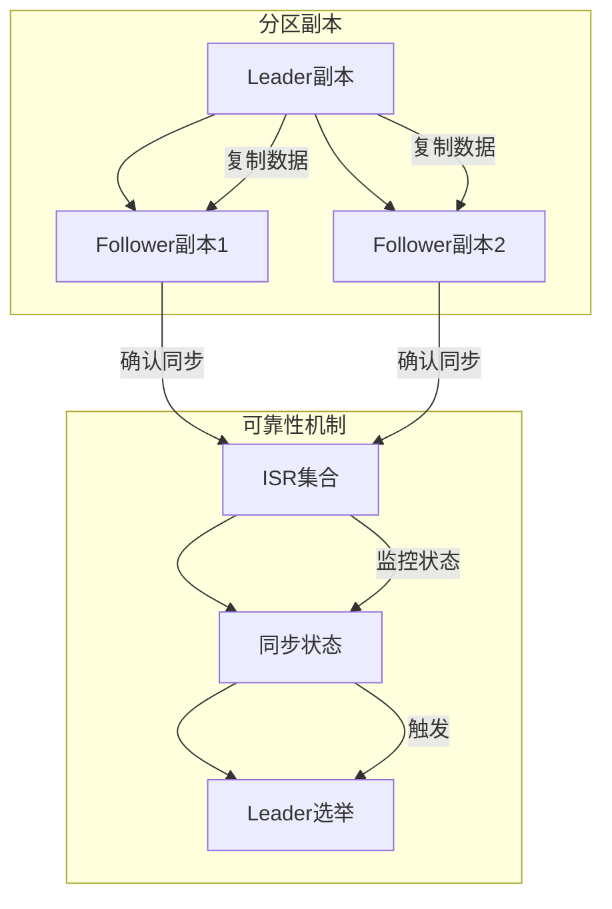
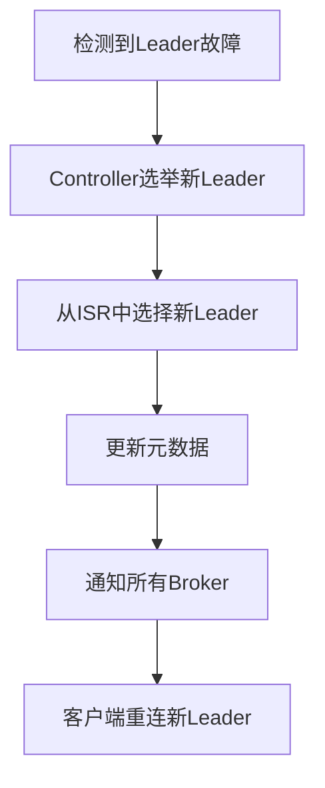

## 一、Kafka 可靠性简介

### 1. 什么是 Kafka 可靠性

**Kafka 可靠性**是指 Kafka 能够确保消息在各种故障情况下不丢失，并且被正确处理的能力。可靠性是 Kafka 作为消息系统的核心特性之一，对于金融、电商等关键业务场景尤为重要。

### 2. 可靠性的重要性

- **数据完整性**：确保消息不丢失，保证业务数据的完整性
- **系统稳定性**：在故障情况下能够正常运行，提高系统的可用性
- **业务连续性**：确保业务流程不中断，提高用户体验
- **合规性**：满足监管要求，避免因数据丢失而导致的法律风险

## 二、Kafka 可靠性机制

### 1. 生产者可靠性

#### 1.1 ACK 机制

**ACK 机制**是生产者向 Kafka 集群发送消息时的确认机制，用于确保消息被正确接收。

- **acks=0**：生产者发送消息后不等待确认，可能丢失消息
- **acks=1**：等待 Leader 副本确认，Leader 故障可能丢失消息
- **acks=all**：等待所有 ISR 副本确认，可靠性最高

**配置示例**：

```java
// 设置 acks 为 all
props.put(ProducerConfig.ACKS_CONFIG, "all");
```

#### 1.2 重试机制

**重试机制**是当消息发送失败时，生产者会自动重试发送消息。

**配置示例**：

```java
// 设置重试次数
props.put(ProducerConfig.RETRIES_CONFIG, 10);
// 设置重试间隔
props.put(ProducerConfig.RETRY_BACKOFF_MS_CONFIG, 100);
```

#### 1.3 幂等性生产者

**幂等性生产者**通过 PID（Producer ID）和序列号确保消息不重复。

**配置示例**：

```java
// 启用幂等性
props.put(ProducerConfig.ENABLE_IDEMPOTENCE_CONFIG, true);
// 设置 acks 为 all
props.put(ProducerConfig.ACKS_CONFIG, "all");
```

#### 1.4 事务生产者

**事务生产者**提供原子性的消息发送，确保一组消息要么全部成功，要么全部失败。

**代码示例**：

```java
// 初始化事务
producer.initTransactions();
try {
    // 开始事务
    producer.beginTransaction();
    // 发送消息
    producer.send(new ProducerRecord<>("topic1", "key1", "value1"));
    producer.send(new ProducerRecord<>("topic2", "key2", "value2"));
    // 提交事务
    producer.commitTransaction();
} catch (Exception e) {
    // 中止事务
    producer.abortTransaction();
}
```

### 2. 服务端可靠性

#### 2.1 副本机制

**副本机制**是 Kafka 保证数据可靠性的核心机制，通过多副本确保数据不丢失。

- **Leader 副本**：负责处理读写请求
- **Follower 副本**：从 Leader 副本同步数据，作为冗余



#### 2.2 ISR 机制

**ISR（In-Sync Replicas）**是与 Leader 副本保持同步的副本集合。

- **同步条件**：Follower 副本与 Leader 副本的滞后时间不超过 `replica.lag.time.max.ms`
- **作用**：确保只有同步的副本才能被选举为 Leader，保证数据一致性

**配置示例**：

```properties
# 设置副本滞后时间阈值
replica.lag.time.max.ms=10000
```

#### 2.3 领导者选举

**领导者选举**是当 Leader 副本故障时，从 ISR 中选举新的 Leader 副本。

- **选举过程**：
  1. 检测到 Leader 故障
  2. Controller 从 ISR 中选择新的 Leader
  3. 更新元数据
  4. 通知所有 Broker
  5. 客户端重连新的 Leader



#### 2.4 日志同步

**日志同步**是 Follower 副本从 Leader 副本同步消息的过程。

- **同步方式**：Follower 向 Leader 发送拉取请求，Leader 返回消息
- **同步保证**：只有 ISR 中的副本都同步了消息，Leader 才会确认消息

### 3. 消费者可靠性

#### 3.1 偏移量管理

**偏移量管理**是消费者跟踪消费进度的机制，确保消息不被重复消费。

- **自动提交**：定期自动提交偏移量
- **手动提交**：由应用程序控制提交时机

**配置示例**：

```java
// 禁用自动提交
props.put(ConsumerConfig.ENABLE_AUTO_COMMIT_CONFIG, "false");
// 手动提交
consumer.commitSync();
```

#### 3.2 消费语义

**消费语义**是消费者处理消息的保证级别。

- **至少一次**：消息可能被重复消费
- **至多一次**：消息可能丢失
- **精确一次**：消息只被消费一次

#### 3.3 消息去重

**消息去重**是处理消息重复的机制。

- **实现方法**：
  - 使用消息ID去重
  - 使用数据库唯一约束
  - 使用分布式缓存

## 三、Kafka 可靠性配置

### 1. 生产者可靠性配置

| 配置项 | 描述 | 推荐值 |
| --- | --- | --- |
| `acks` | 确认级别 | `all` |
| `retries` | 重试次数 | `10` |
| `retry.backoff.ms` | 重试间隔 | `100` |
| `enable.idempotence` | 启用幂等性 | `true` |
| `max.in.flight.requests.per.connection` | 每个连接的最大并发请求数 | `1`（启用幂等性时） |
| `delivery.timeout.ms` | 消息发送超时时间 | `120000` |

### 2. 服务端可靠性配置

| 配置项 | 描述 | 推荐值 |
| --- | --- | --- |
| `replica.lag.time.max.ms` | 副本滞后时间阈值 | `10000` |
| `min.insync.replicas` | 最小同步副本数 | `2` |
| `unclean.leader.election.enable` | 允许非 ISR 副本被选举为 Leader | `false` |
| `log.retention.hours` | 日志保留时间 | `168`（7天） |
| `log.retention.bytes` | 日志保留大小 | `1073741824`（1GB） |

### 3. 消费者可靠性配置

| 配置项 | 描述 | 推荐值 |
| --- | --- | --- |
| `enable.auto.commit` | 启用自动提交 | `false` |
| `auto.commit.interval.ms` | 自动提交间隔 | `5000` |
| `session.timeout.ms` | 会话超时时间 | `30000` |
| `heartbeat.interval.ms` | 心跳间隔 | `10000` |
| `max.poll.interval.ms` | 最大轮询间隔 | `300000` |
| `max.poll.records` | 最大轮询记录数 | `500` |

## 四、Kafka 可靠性实践

### 1. 生产者可靠性实践

**最佳实践**：
- 使用 `acks=all` 确保消息被所有 ISR 副本确认
- 启用幂等性和事务，确保消息不重复
- 合理设置重试次数和超时时间
- 实现异步发送并处理回调

**代码示例**：

```java
Properties props = new Properties();
props.put(ProducerConfig.BOOTSTRAP_SERVERS_CONFIG, "localhost:9092");
props.put(ProducerConfig.KEY_SERIALIZER_CLASS_CONFIG, "org.apache.kafka.common.serialization.StringSerializer");
props.put(ProducerConfig.VALUE_SERIALIZER_CLASS_CONFIG, "org.apache.kafka.common.serialization.StringSerializer");

// 可靠性配置
props.put(ProducerConfig.ACKS_CONFIG, "all");
props.put(ProducerConfig.RETRIES_CONFIG, 10);
props.put(ProducerConfig.ENABLE_IDEMPOTENCE_CONFIG, true);
props.put(ProducerConfig.MAX_IN_FLIGHT_REQUESTS_PER_CONNECTION, 1);

// 性能配置
props.put(ProducerConfig.BATCH_SIZE_CONFIG, 16384);
props.put(ProducerConfig.LINGER_MS_CONFIG, 10);
props.put(ProducerConfig.COMPRESSION_TYPE_CONFIG, "snappy");

KafkaProducer<String, String> producer = new KafkaProducer<>(props);

// 异步发送消息
producer.send(new ProducerRecord<>("topic", "key", "value"), new Callback() {
    @Override
    public void onCompletion(RecordMetadata metadata, Exception exception) {
        if (exception != null) {
            // 处理发送失败
            exception.printStackTrace();
        } else {
            // 处理发送成功
            System.out.println("Message sent to partition " + metadata.partition() + ", offset " + metadata.offset());
        }
    }
});

producer.close();
```

### 2. 消费者可靠性实践

**最佳实践**：
- 禁用自动提交，手动控制偏移量提交
- 实现幂等性处理，避免消息重复
- 合理设置会话超时和心跳间隔
- 处理消费异常，确保消息不丢失

**代码示例**：

```java
Properties props = new Properties();
props.put(ConsumerConfig.BOOTSTRAP_SERVERS_CONFIG, "localhost:9092");
props.put(ConsumerConfig.GROUP_ID_CONFIG, "consumer-group");
props.put(ConsumerConfig.KEY_DESERIALIZER_CLASS_CONFIG, "org.apache.kafka.common.serialization.StringDeserializer");
props.put(ConsumerConfig.VALUE_DESERIALIZER_CLASS_CONFIG, "org.apache.kafka.common.serialization.StringDeserializer");

// 可靠性配置
props.put(ConsumerConfig.ENABLE_AUTO_COMMIT_CONFIG, "false");
props.put(ConsumerConfig.SESSION_TIMEOUT_MS_CONFIG, "30000");
props.put(ConsumerConfig.HEARTBEAT_INTERVAL_MS_CONFIG, "10000");
props.put(ConsumerConfig.MAX_POLL_INTERVAL_MS_CONFIG, "300000");

KafkaConsumer<String, String> consumer = new KafkaConsumer<>(props);
consumer.subscribe(Collections.singletonList("topic"));

try {
    while (true) {
        ConsumerRecords<String, String> records = consumer.poll(Duration.ofMillis(100));
        for (ConsumerRecord<String, String> record : records) {
            try {
                // 处理消息
                System.out.println("Consumed message: " + record.value());
            } catch (Exception e) {
                // 处理消费异常
                e.printStackTrace();
            }
        }
        // 手动提交偏移量
        consumer.commitSync();
    }
} finally {
    consumer.close();
}
```

### 3. 服务端可靠性实践

**最佳实践**：
- 设置合理的副本因子（至少 2）
- 配置最小同步副本数（至少 2）
- 禁用非 ISR 副本的 Leader 选举
- 合理设置日志保留策略
- 监控 ISR 状态

**配置示例**：

```properties
# server.properties
# 副本因子
default.replication.factor=3
# 最小同步副本数
min.insync.replicas=2
# 禁用非 ISR 副本的 Leader 选举
unclean.leader.election.enable=false
# 副本滞后时间阈值
replica.lag.time.max.ms=10000
# 日志保留时间
log.retention.hours=168
# 日志保留大小
log.retention.bytes=1073741824
```

## 五、Kafka 可靠性故障案例

### 1. 消息丢失案例

**案例**：生产者设置 `acks=1`，Leader 副本故障，Follower 副本未同步消息

**解决方案**：
- 使用 `acks=all` 确保消息被所有 ISR 副本确认
- 设置 `min.insync.replicas` 为 2 或更多

### 2. 消息重复案例

**案例**：生产者重试机制导致消息重复

**解决方案**：
- 启用幂等性生产者
- 在消费者端实现消息去重

### 3. 服务不可用案例

**案例**：Leader 副本故障，ISR 为空，无法选举新 Leader

**解决方案**：
- 确保 ISR 不为空
- 合理设置 `replica.lag.time.max.ms`
- 监控 ISR 状态

### 4. 性能与可靠性平衡案例

**案例**：为了追求性能，牺牲了可靠性

**解决方案**：
- 根据业务需求平衡性能和可靠性
- 对于关键业务，优先保证可靠性
- 对于非关键业务，可以适当降低可靠性要求以提高性能

## 六、Kafka 可靠性监控

### 1. 监控指标

- **生产者指标**：
  - `producer-metrics:record-error-rate`：消息发送错误率
  - `producer-metrics:record-retry-rate`：消息重试率
  - `producer-metrics:outgoing-byte-rate`：发送字节率

- **服务端指标**：
  - `kafka.server:type=ReplicaManager,name=UnderReplicatedPartitions`：未完全复制的分区数
  - `kafka.server:type=ReplicaManager,name=IsrShrinksPerSec`：ISR 缩小率
  - `kafka.server:type=ReplicaManager,name=IsrExpandsPerSec`：ISR 扩大率
  - `kafka.controller:type=KafkaController,name=LeaderElectionRateAndTimeMs`：Leader 选举率和时间

- **消费者指标**：
  - `consumer-metrics:records-lag`：消费滞后量
  - `consumer-metrics:records-lag-max`：最大消费滞后量
  - `consumer-metrics:commit-latency-avg`：提交偏移量的平均延迟

### 2. 监控工具

- **Prometheus + Grafana**：监控 Kafka 集群状态
- **Kafka Manager**：管理和监控 Kafka 集群
- **Confluent Control Center**：监控和管理 Kafka 生态系统

## 七、总结

Kafka 的可靠性是其作为消息系统的核心特性之一。通过本文档，您已经了解了 Kafka 的可靠性机制、配置选项和最佳实践。

**核心要点**：
- 生产者可靠性：ACK 机制、重试机制、幂等性、事务
- 服务端可靠性：副本机制、ISR 机制、领导者选举、日志同步
- 消费者可靠性：偏移量管理、消费语义、消息去重
- 可靠性配置：合理设置生产者、服务端和消费者的配置
- 可靠性实践：根据业务需求平衡性能和可靠性
- 可靠性监控：监控关键指标，及时发现问题

通过合理的配置和实践，您可以构建一个既可靠又高性能的 Kafka 系统，满足不同业务场景的需求。