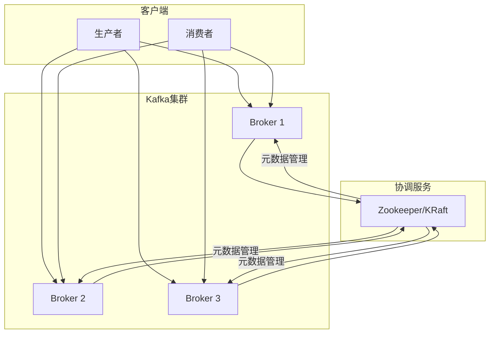
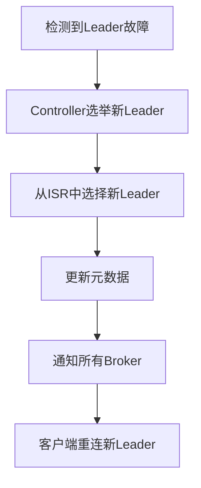

## 一、Kafka 高可用简介

### 1. 什么是 Kafka 高可用

**Kafka 高可用**是指 Kafka 集群在面临各种故障时，仍然能够保持服务可用的能力。高可用性是 Kafka 作为企业级消息系统的重要特性，对于保证业务连续性至关重要。

### 2. 高可用的重要性

- **业务连续性**：确保服务不中断，保证业务正常运行
- **数据可靠性**：防止数据丢失，确保数据安全
- **用户体验**：避免服务中断给用户带来的不良体验
- **系统稳定性**：提高系统的整体稳定性和可靠性

## 二、Kafka 高可用架构

### 1. 架构设计

**Kafka 高可用架构**主要包括以下组件：

- **Broker 集群**：多个 Kafka 服务器节点，提供消息存储和处理服务
- **Zookeeper/KRaft**：集群协调和元数据管理
- **副本机制**：通过多副本确保数据可靠性
- **Leader 选举**：在 Leader 故障时快速选举新的 Leader
- **消费者组**：实现消费端的负载均衡和故障转移



### 2. 关键组件

#### 2.1 Broker

**Broker** 是 Kafka 服务器节点，负责存储消息和处理客户端请求。

- **作用**：
  - 存储消息
  - 处理生产者和消费者的请求
  - 复制数据到其他副本
  - 参与 Leader 选举

- **高可用设计**：
  - 多个 Broker 组成集群
  - 每个主题的分区分布在不同的 Broker 上
  - 每个分区有多个副本

#### 2.2 Controller

**Controller** 是 Kafka 集群的中心管理器，负责管理集群的状态。

- **作用**：
  - 监控 Broker 的状态
  - 处理 Leader 选举
  - 更新集群元数据
  - 协调重平衡

- **高可用设计**：
  - 只有一个 Controller 处于活动状态
  - 当 Controller 故障时，会选举新的 Controller

#### 2.3 Zookeeper/KRaft

**Zookeeper** 是 Kafka 早期版本使用的集群协调服务，**KRaft** 是 Kafka 2.8.0 引入的内置协调服务。

- **作用**：
  - 存储集群元数据
  - 管理 Broker 状态
  - 协调 Leader 选举
  - 管理消费者组

- **高可用设计**：
  - Zookeeper：至少 3 个节点的集群
  - KRaft：至少 3 个控制器节点的集群

## 三、Kafka 高可用机制

### 1. 副本机制

**副本机制**是 Kafka 保证高可用的核心机制，通过多副本确保数据不丢失。

- **副本类型**：
  - **Leader 副本**：负责处理读写请求
  - **Follower 副本**：从 Leader 副本同步数据

- **副本分布**：
  - 副本分布在不同的 Broker 上
  - 每个 Broker 上的副本数量相对均衡

- **副本同步**：
  - Follower 副本定期从 Leader 副本拉取数据
  - Leader 副本等待 ISR 中的副本确认

### 2. Leader 选举

**Leader 选举**是当 Leader 副本故障时，从 ISR 中选举新的 Leader 副本。

- **选举触发条件**：
  - Leader 副本故障
  - Broker 重启
  - 分区重新分配

- **选举过程**：
  1. Controller 检测到 Leader 故障
  2. Controller 从 ISR 中选择新的 Leader
  3. Controller 更新集群元数据
  4. Controller 通知所有 Broker
  5. 客户端重连新的 Leader

- **选举策略**：
  - 优先从 ISR 中选择
  - 选择最接近 Leader 的 Follower
  - 避免非 ISR 副本被选举为 Leader



### 3. 故障转移

**故障转移**是当 Broker 故障时，系统自动将服务转移到其他 Broker 的过程。

- **故障检测**：
  - Controller 通过 Zookeeper/KRaft 监控 Broker 状态
  - 当 Broker 心跳超时，认为 Broker 故障

- **故障处理**：
  - 对于故障 Broker 上的 Leader 副本，选举新的 Leader
  - 对于故障 Broker 上的 Follower 副本，重新分配副本

- **恢复过程**：
  - 故障 Broker 恢复后，重新加入集群
  - 从新的 Leader 副本同步数据
  - 成为 Follower 副本

### 4. 消费者组重平衡

**消费者组重平衡**是当消费者数量变化时，重新分配分区的过程。

- **重平衡触发条件**：
  - 消费者加入消费者组
  - 消费者离开消费者组
  - 分区数量变化
  - 订阅的主题变化

- **重平衡过程**：
  1. 消费者加入或离开消费者组
  2. 组协调器触发重平衡
  3. 重新分配分区
  4. 消费者开始消费新分配的分区

- **重平衡策略**：
  - Range：按范围分配分区
  - RoundRobin：轮询分配分区
  - Sticky：粘性分配，尽量保持原有分配
  - CooperativeSticky：协作式粘性分配，支持增量重平衡

## 四、Kafka 高可用部署

### 1. 部署架构

**Kafka 高可用部署**通常采用多节点集群，确保服务的高可用性。

- **单数据中心部署**：
  - 所有 Broker 部署在同一个数据中心
  - 优点：部署简单，网络延迟低
  - 缺点：数据中心故障会导致服务不可用

- **多数据中心部署**：
  - Broker 部署在多个数据中心
  - 优点：数据中心故障时服务仍可用
  - 缺点：部署复杂，网络延迟高

- **云部署**：
  - 部署在云平台上
  - 优点：弹性扩展，管理简单
  - 缺点：成本较高，依赖云服务

### 2. 部署配置

**Kafka 高可用部署**的关键配置包括：

- **Broker 配置**：
  - `broker.id`：Broker 唯一标识
  - `listeners`：监听地址和端口
  - `log.dirs`：日志存储目录
  - `num.partitions`：默认分区数
  - `default.replication.factor`：默认副本因子

- **Zookeeper 配置**：
  - `zookeeper.connect`：Zookeeper 连接地址
  - `zookeeper.session.timeout.ms`：会话超时时间

- **KRaft 配置**：
  - `process.roles`：进程角色（controller, broker）
  - `node.id`：节点 ID
  - `controller.quorum.voters`：控制器投票者

### 3. 部署示例

**Docker 部署示例**（KRaft 模式）：

```bash
# 拉取镜像
docker pull bitnami/kafka:3.9.0

# 创建网络
docker network create kafka-network

# 运行控制器节点 1
docker run -d --name kafka-controller-1 --hostname kafka-controller-1 \
    --network kafka-network \
    -p 9092:9092 \
    -p 9093:9093 \
    -e KAFKA_CFG_NODE_ID=1 \
    -e KAFKA_CFG_PROCESS_ROLES=controller \
    -e KAFKA_CFG_LISTENERS=PLAINTEXT://:9092,CONTROLLER://:9093 \
    -e KAFKA_CFG_LISTENER_SECURITY_PROTOCOL_MAP=CONTROLLER:PLAINTEXT,PLAINTEXT:PLAINTEXT \
    -e KAFKA_CFG_CONTROLLER_QUORUM_VOTERS=1@kafka-controller-1:9093,2@kafka-controller-2:9093,3@kafka-controller-3:9093 \
    -e KAFKA_CFG_CONTROLLER_LISTENER_NAMES=CONTROLLER \
    bitnami/kafka:3.9.0

# 运行控制器节点 2
docker run -d --name kafka-controller-2 --hostname kafka-controller-2 \
    --network kafka-network \
    -p 9094:9092 \
    -p 9095:9093 \
    -e KAFKA_CFG_NODE_ID=2 \
    -e KAFKA_CFG_PROCESS_ROLES=controller \
    -e KAFKA_CFG_LISTENERS=PLAINTEXT://:9092,CONTROLLER://:9093 \
    -e KAFKA_CFG_LISTENER_SECURITY_PROTOCOL_MAP=CONTROLLER:PLAINTEXT,PLAINTEXT:PLAINTEXT \
    -e KAFKA_CFG_CONTROLLER_QUORUM_VOTERS=1@kafka-controller-1:9093,2@kafka-controller-2:9093,3@kafka-controller-3:9093 \
    -e KAFKA_CFG_CONTROLLER_LISTENER_NAMES=CONTROLLER \
    bitnami/kafka:3.9.0

# 运行控制器节点 3
docker run -d --name kafka-controller-3 --hostname kafka-controller-3 \
    --network kafka-network \
    -p 9096:9092 \
    -p 9097:9093 \
    -e KAFKA_CFG_NODE_ID=3 \
    -e KAFKA_CFG_PROCESS_ROLES=controller \
    -e KAFKA_CFG_LISTENERS=PLAINTEXT://:9092,CONTROLLER://:9093 \
    -e KAFKA_CFG_LISTENER_SECURITY_PROTOCOL_MAP=CONTROLLER:PLAINTEXT,PLAINTEXT:PLAINTEXT \
    -e KAFKA_CFG_CONTROLLER_QUORUM_VOTERS=1@kafka-controller-1:9093,2@kafka-controller-2:9093,3@kafka-controller-3:9093 \
    -e KAFKA_CFG_CONTROLLER_LISTENER_NAMES=CONTROLLER \
    bitnami/kafka:3.9.0

# 运行 Broker 节点 1
docker run -d --name kafka-broker-1 --hostname kafka-broker-1 \
    --network kafka-network \
    -p 9098:9092 \
    -e KAFKA_CFG_NODE_ID=4 \
    -e KAFKA_CFG_PROCESS_ROLES=broker \
    -e KAFKA_CFG_LISTENERS=PLAINTEXT://:9092 \
    -e KAFKA_CFG_CONTROLLER_QUORUM_VOTERS=1@kafka-controller-1:9093,2@kafka-controller-2:9093,3@kafka-controller-3:9093 \
    bitnami/kafka:3.9.0

# 运行 Broker 节点 2
docker run -d --name kafka-broker-2 --hostname kafka-broker-2 \
    --network kafka-network \
    -p 9099:9092 \
    -e KAFKA_CFG_NODE_ID=5 \
    -e KAFKA_CFG_PROCESS_ROLES=broker \
    -e KAFKA_CFG_LISTENERS=PLAINTEXT://:9092 \
    -e KAFKA_CFG_CONTROLLER_QUORUM_VOTERS=1@kafka-controller-1:9093,2@kafka-controller-2:9093,3@kafka-controller-3:9093 \
    bitnami/kafka:3.9.0

# 运行 Broker 节点 3
docker run -d --name kafka-broker-3 --hostname kafka-broker-3 \
    --network kafka-network \
    -p 9100:9092 \
    -e KAFKA_CFG_NODE_ID=6 \
    -e KAFKA_CFG_PROCESS_ROLES=broker \
    -e KAFKA_CFG_LISTENERS=PLAINTEXT://:9092 \
    -e KAFKA_CFG_CONTROLLER_QUORUM_VOTERS=1@kafka-controller-1:9093,2@kafka-controller-2:9093,3@kafka-controller-3:9093 \
    bitnami/kafka:3.9.0
```

## 五、Kafka 高可用监控

### 1. 监控指标

**Kafka 高可用监控**的关键指标包括：

- **Broker 指标**：
  - `kafka.server:type=BrokerTopicMetrics,name=MessagesInPerSec`：消息入站速率
  - `kafka.server:type=BrokerTopicMetrics,name=BytesInPerSec`：字节入站速率
  - `kafka.server:type=BrokerTopicMetrics,name=BytesOutPerSec`：字节出站速率
  - `kafka.server:type=ReplicaManager,name=UnderReplicatedPartitions`：未完全复制的分区数
  - `kafka.server:type=ReplicaManager,name=IsrShrinksPerSec`：ISR 缩小率
  - `kafka.server:type=ReplicaManager,name=IsrExpandsPerSec`：ISR 扩大率

- **Controller 指标**：
  - `kafka.controller:type=KafkaController,name=LeaderElectionRateAndTimeMs`：Leader 选举率和时间
  - `kafka.controller:type=KafkaController,name=UncleanLeaderElectionsPerSec`：非干净 Leader 选举率

- **Zookeeper/KRaft 指标**：
  - `zookeeper_server:type=ConnectionStats,name=OutstandingRequests`：未处理的请求数
  - `zookeeper_server:type=ZooKeeperServer,name=NumAliveConnections`：活跃连接数

### 2. 监控工具

**Kafka 高可用监控**的常用工具包括：

- **Prometheus + Grafana**：监控 Kafka 集群状态，提供可视化面板
- **Kafka Manager**：管理和监控 Kafka 集群，查看集群状态和消费组信息
- **Confluent Control Center**：监控和管理 Kafka 生态系统，提供全面的监控和管理功能
- **Datadog**：云原生监控平台，提供 Kafka 监控集成
- **New Relic**：应用性能监控平台，提供 Kafka 监控集成

### 3. 监控最佳实践

**Kafka 高可用监控**的最佳实践包括：

- **设置合理的告警阈值**：
  - UnderReplicatedPartitions > 0 持续 5 分钟
  - IsrShrinksPerSec > 0 持续 10 分钟
  - LeaderElectionRateAndTimeMs 选举时间 > 1000ms

- **监控集群健康状态**：
  - 定期检查 Broker 状态
  - 监控 ISR 状态
  - 跟踪 Leader 选举情况

- **性能监控**：
  - 监控消息吞吐量
  - 监控延迟
  - 监控资源使用情况

## 六、Kafka 高可用故障处理

### 1. 常见故障

**Kafka 高可用**的常见故障包括：

- **Broker 故障**：
  - 硬件故障
  - 网络故障
  - 软件故障

- **Controller 故障**：
  - Controller 节点故障
  - 控制器选举失败

- **Zookeeper/KRaft 故障**：
  - Zookeeper 集群故障
  - KRaft 控制器集群故障

- **网络故障**：
  - 网络分区
  - 网络延迟

### 2. 故障处理流程

**Kafka 高可用故障处理**的流程包括：

- **故障检测**：
  - 通过监控系统检测故障
  - 通过日志分析发现异常

- **故障定位**：
  - 确定故障类型
  - 定位故障节点
  - 分析故障原因

- **故障恢复**：
  - 重启故障节点
  - 重新配置集群
  - 恢复数据

- **故障预防**：
  - 定期检查系统状态
  - 优化配置
  - 升级系统

### 3. 故障处理示例

**Broker 故障处理**：

1. **检测故障**：监控系统告警，发现 Broker 不可用
2. **定位故障**：检查 Broker 日志，确定故障原因
3. **故障恢复**：
   - 如果是硬件故障，更换硬件
   - 如果是软件故障，重启 Broker
   - 如果是网络故障，修复网络
4. **验证恢复**：检查 Broker 状态，确认服务恢复

**Leader 选举故障处理**：

1. **检测故障**：监控系统告警，发现 Leader 选举失败
2. **定位故障**：检查 Controller 日志，确定选举失败原因
3. **故障恢复**：
   - 检查 ISR 状态
   - 确保 ISR 不为空
   - 重启 Controller 节点
4. **验证恢复**：检查 Leader 状态，确认选举成功

## 七、Kafka 高可用最佳实践

### 1. 架构设计最佳实践

- **合理规划集群规模**：
  - 根据业务需求确定 Broker 数量
  - 确保每个 Broker 的硬件资源充足
  - 合理分布副本，避免单点故障

- **选择合适的协调服务**：
  - 对于新部署，推荐使用 KRaft 模式
  - 对于现有部署，可考虑从 Zookeeper 迁移到 KRaft

- **网络设计**：
  - 使用高速网络
  - 避免网络瓶颈
  - 实现网络冗余

### 2. 配置最佳实践

- **Broker 配置**：
  - 设置合理的副本因子（至少 2）
  - 配置最小同步副本数（至少 2）
  - 禁用非 ISR 副本的 Leader 选举
  - 合理设置日志保留策略

- **客户端配置**：
  - 生产者：使用 `acks=all`，启用幂等性
  - 消费者：禁用自动提交，手动控制偏移量
  - 合理设置超时时间和重试策略

### 3. 部署最佳实践

- **多数据中心部署**：
  - 在多个数据中心部署 Broker
  - 确保跨数据中心的网络连接可靠
  - 配置适当的复制策略

- **容器化部署**：
  - 使用 Docker 或 Kubernetes 部署
  - 实现自动扩缩容
  - 配置健康检查

- **云部署**：
  - 使用云服务提供商的托管 Kafka 服务
  - 利用云服务的弹性和可靠性
  - 配置适当的安全措施

### 4. 运维最佳实践

- **定期维护**：
  - 定期检查 Broker 状态
  - 定期清理日志
  - 定期备份数据

- **监控与告警**：
  - 部署全面的监控系统
  - 设置合理的告警阈值
  - 建立故障响应机制

- **灾难恢复**：
  - 制定灾难恢复计划
  - 定期进行灾难恢复演练
  - 确保数据备份安全可靠

## 八、总结

Kafka 的高可用架构是其作为企业级消息系统的重要特性。通过本文档，您已经了解了 Kafka 的高可用架构设计、关键组件、故障处理机制、部署策略和监控等内容。

**核心要点**：
- 副本机制：通过多副本确保数据可靠性
- Leader 选举：在 Leader 故障时快速选举新的 Leader
- 故障转移：当 Broker 故障时自动将服务转移到其他 Broker
- 消费者组重平衡：实现消费端的负载均衡和故障转移
- 高可用部署：采用多节点集群，确保服务的高可用性
- 监控与告警：及时发现和处理故障
- 故障处理：快速定位和恢复故障
- 最佳实践：合理设计架构，优化配置，定期维护

通过合理的架构设计、配置优化和运维管理，您可以构建一个高可用的 Kafka 系统，确保业务的连续性和数据的可靠性。