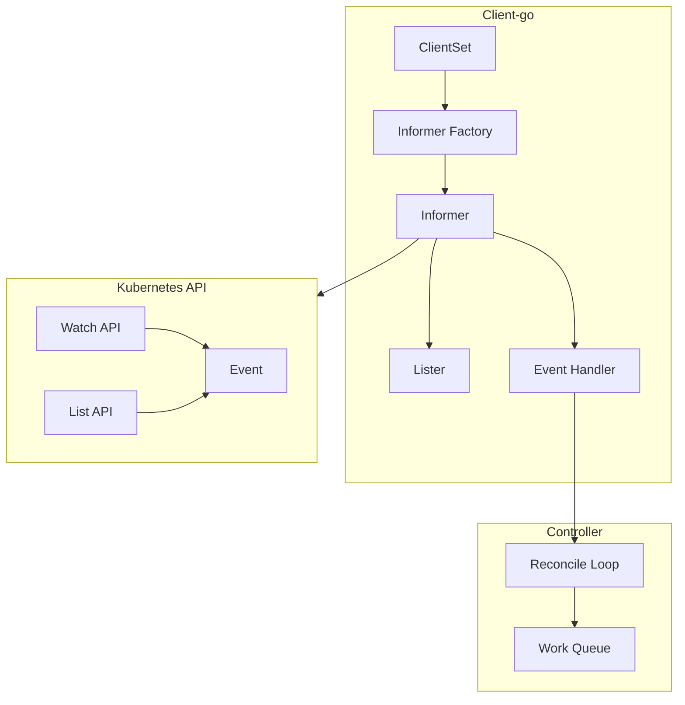
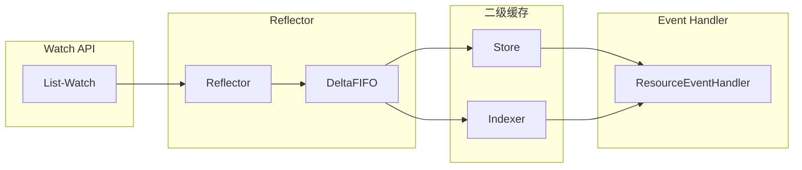

## 目录

- [一、创建自定义资源](#一创建自定义资源)
- [二、基于自定义资源实现控制器](#二基于自定义资源实现控制器)
- [三、客户端注册与监听机制](#三客户端注册与监听机制)
- [四、List-Watch机制与Informer](#四list-watch机制与informer)
- [五、Q&A](#五qa)
- [六、参考资料](#六参考资料)

## 一、创建自定义资源

### 1.1 创建CRD定义

``` bash
touch resourcedefinition.yaml
```

``` yaml
apiVersion: apiextensions.k8s.io/v1
kind: CustomResourceDefinition
metadata:
  name: crontabs.stable.example.com
spec:
  group: stable.example.com
  versions:
    - name: v1
      served: true
      storage: true
      schema:
        openAPIV3Schema:
          type: object
          properties:
            spec:
              type: object
              properties:
                cronSpec:
                  type: string
                image:
                  type: string
                replicas:
                  type: integer
  scope: Namespaced
  names:
    plural: crontabs
    singular: crontab
    kind: CronTab
    shortNames:
    - ct
```

### 1.2 CRD字段说明

| 字段 | 说明 |
|------|------|
| `group` | REST API路径：`/apis/<组>/<版本>` |
| `version` | 版本号，支持多个版本独立启用 |
| `served` | 是否启用该版本 |
| `storage` | 只有一个版本标记为存储版本 |
| `scope` | Namespaced（命名空间级别）或Cluster（集群级别） |
| `plural` | REST API中的复数名称 |
| `kind` | 驼峰命名，资源清单使用 |
| `shortNames` | 命令行简短别名 |

### 1.3 使用CRD资源

``` bash
# 应用CRD定义
kubectl apply -f resourcedefinition.yaml

# 验证CRD已创建
kubectl get CronTab
kubectl get ct

# 创建自定义资源对象
kubectl apply -f my-crontab.yaml
kubectl get crontab
kubectl get ct -o yaml
```

``` yaml
# my-crontab.yaml
apiVersion: "stable.example.com/v1"
kind: CronTab
metadata:
  name: my-new-cron-object
spec:
  cronSpec: "* * * * */5"
  image: my-awesome-cron-image
```

``` bash
# 删除CRD
kubectl delete -f resourcedefinition.yaml
```

## 二、基于自定义资源实现控制器

### 2.1 QuickStart概述

基于sample-controller示例，从代码生成到编译控制器，运行控制器查看监听事件，以及Informer设计。

``` bash
# 基于版本v1.27.2
git clone https://github.com/kubernetes/kubernetes.git
git checkout v1.27.2
cd /kubernetes/staging/src/k8s.io/sample-controller
```

### 2.2 项目结构

```
samplecontroller
├── register.go           # 定义包package名称
└── v1alpha1
    ├── doc.go           # 声明要使用deepcopy-gen以及groupName
    ├── register.go      # 注册资源
    └── types.go         # 定义CRD资源对应的Go结构体
```

### 2.3 代码生成

``` bash
# 执行code generation生成代码
cd kubernetes/staging/src/k8s.io/sample-controller
sh ./hack/update-codegen.sh
```

### 2.4 生成后的文件

```
├── apis
│   └── samplecontroller
│       ├── register.go
│       └── v1alpha1
│           ├── doc.go
│           ├── register.go
│           ├── types.go
│           └── zz_generated.deepcopy.go    # 生成的深拷贝方法
├── generated
│   ├── clientset         # 与Kubernetes API交互的Go客户端库
│   ├── informers         # Kubernetes API资源上监视和响应的高级客户端库
│   └── listers           # 本地缓存用于资源查询
```

### 2.5 编译与运行

``` bash
# 设置目标平台
go env -w GOOS="linux"
go env -w GOARCH="amd64"

# 编译控制器
cd kubernetes/staging/src/k8s.io/sample-controller
go build .
```

### 2.6 部署测试

``` bash
# 确认kubectl版本匹配
kubelet --version
# Kubernetes v1.27.2

# 应用CRD定义
kubectl apply -f kubernetes/staging/src/k8s.io/sample-controller/artifacts/examples/crd.yaml

# 应用示例资源
kubectl apply -f kubernetes/staging/src/k8s.io/sample-controller/artifacts/examples/example-foo.yaml

# 启动控制器查看CRD监听事件
./sample-controller --kubeconfig=/root/.kube/config
```

## 三、客户端注册与监听机制

### 3.1 架构流程



### 3.2 核心代码

```go
// 注册clientset客户端
// 用于生成informer启动
informers.NewSharedInformerFactory(clientset.NewForConfig(cfg)).Start(ctx)

// clientset注入控制器后启动
Controller.run()
```

## 四、List-Watch机制与Informer

### 4.1 List-Watch原理

| 机制 | 说明 |
|------|------|
| List | HTTP短连接，获取资源全量数据 |
| Watch | HTTP长连接，持续监听资源变化事件 |

### 4.2 Informer核心概念

Informer是Client-go中的核心工具包，二级缓存设计：



### 4.3 Informer特性

1. 依赖Kubernetes List/Watch API
2. 可监听事件并触发回调函数的二级缓存工具包
3. Informer只会调用Kubernetes List和Watch两种类型的API
4. List/Get Kubernetes中的Object时，Informer不会去请求Kubernetes API，而是查找缓存在本地内存中的数据
5. Informer完全依赖Watch API维护缓存，没有任何resync机制
6. Informer通过Kubernetes Watch API监听某种resource下的所有事件

### 4.4 Informer回调函数

```go
type ResourceEventHandler interface {
    OnAdd(obj interface{})       // 资源添加
    OnUpdate(oldObj, newObj interface{})  // 资源更新
    OnDelete(obj interface{})     // 资源删除
}
```

### 4.5 缓存机制

| 缓存 | 说明 |
|------|------|
| DeltaFIFO | 存储对象变更事件（Add/Update/Delete） |
| LocalStore | 一级缓存，存储对象的本地副本 |
| Indexer | 索引器，加速数据的检索 |

### 4.6 Reflector工作流程

1. ListerWatcher监听Kubernetes API的Event
2. Reflector处理Event后以Delta结果转入DeltaFIFO
3. Informer从DeltaFIFO中取出Delta进行处理

## 五、Q&A

### 5.1 spec.scope是做什么的

Kubernetes中的spec.scope用于指定资源对象的范围：
- `Namespaced`：资源对象在命名空间级别，可通过namespace隔离
- `Cluster`：资源对象在集群级别，全局唯一

### 5.2 metadata是做什么的

metadata提供Kubernetes对象的元数据：
- `name`：对象的名称
- `namespace`：对象所处的命名空间
- `labels`：用于标识和分类对象
- `annotations`：提供额外的对象描述信息

### 5.3 spec是什么

spec描述Kubernetes对象的所需状态和属性：
- 是Kubernetes控制器的核心输入对象
- 控制器根据spec中的规范，将实际状态调整为期望状态
- 例如Deployment的spec指定容器镜像、副本数、滚动更新策略等

## 六、参考资料

- [Kubernetes源码 v1.27.2](https://github.com/kubernetes/kubernetes/tree/v1.27.2)
- [理解K8S的List-Watch机制和Informer模块](https://zhuanlan.zhihu.com/p/59660536)
- [理解K8S-Informer机制](https://blog.csdn.net/ChrisYoung95/article/details/111598273)
- [k8s之Informer设计](https://zhuanlan.zhihu.com/p/416371779)
- [code-generator](https://github.com/kubernetes/code-generator)
- [code-generator简单介绍](https://juejin.cn/post/7096484178128011277)
- [client-go](https://github.com/kubernetes/client-go)
- [Kubernetes文档/定制资源](https://kubernetes.io/zh-cn/docs/concepts/extend-kubernetes/api-extension/custom-resources/)
- [Kubernetes文档/使用CustomResourceDefinition扩展KubernetesAPI](https://kubernetes.io/zh-cn/docs/tasks/extend-kubernetes/custom-resources/custom-resource-definitions/)
- [sample-controller](https://github.com/kubernetes/sample-controller)
