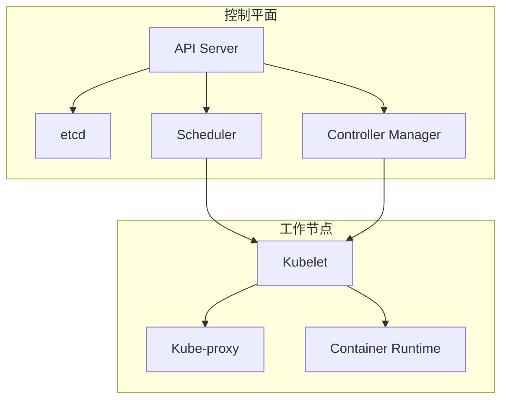
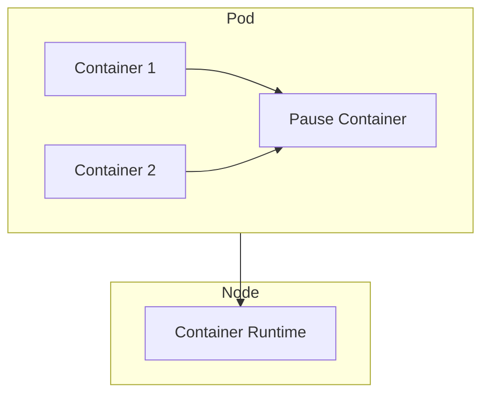
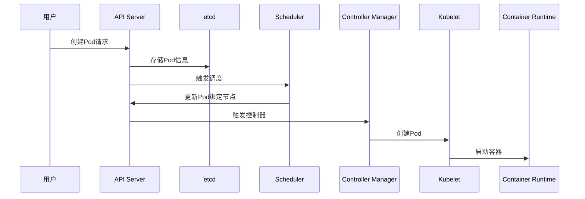
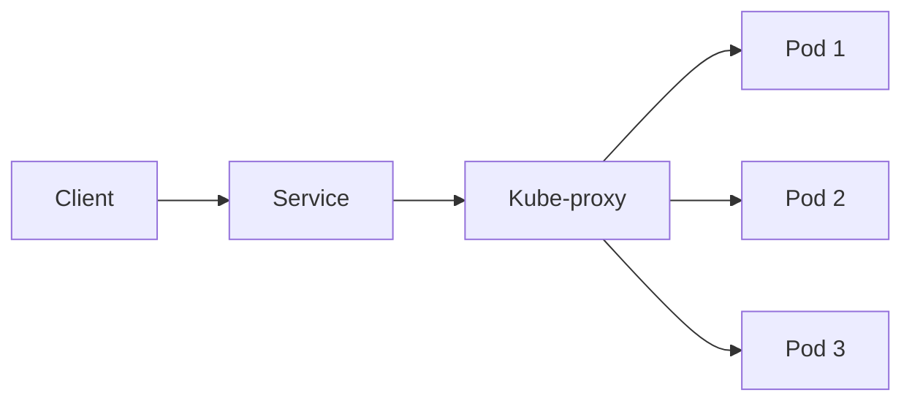

## 目录

- [一、组件概述](#一组件概述)
- [二、控制平面组件](#二控制平面组件)
- [三、工作节点组件](#三工作节点组件)
- [四、核心概念](#四核心概念)
- [五、组件调用关系](#五组件调用关系)

## 一、组件概述

Kubernetes集群架构分为控制平面（Control Plane）和工作节点（Node）两大部分：

## 二、控制平面组件

### 2.1 API Server

| 特性 | 说明 |
|------|------|
| 功能 | 集群操作的入口，所有请求都通过API Server处理 |
| 通信 | 提供RESTful API，支持kubectl、客户端库等方式访问 |
| 存储 | 与etcd通信，持久化集群数据 |

### 2.2 etcd

| 特性 | 说明 |
|------|------|
| 功能 | 分布式键值存储，保存集群所有数据 |
| 特点 | 高可用、一致性强 |
| 访问 | 仅API Server能直接访问etcd |

### 2.3 Scheduler

| 特性 | 说明 |
|------|------|
| 功能 | 负责Pod调度，将Pod分配到合适的节点 |
| 考虑因素 | 资源需求、亲和性、污点容忍等 |
| 工作方式 | 监听未分配节点的Pod，为其选择最优节点 |

### 2.4 Controller Manager

| 特性 | 说明 |
|------|------|
| 功能 | 维护集群状态，执行各种控制器逻辑 |
| 控制器类型 | Node Controller、Replication Controller、Endpoints Controller等 |
| 工作方式 | 通过API Server协调集群状态 |

## 三、工作节点组件

### 3.1 Kubelet

| 特性 | 说明 |
|------|------|
| 功能 | 维护容器生命周期，确保容器运行在预期状态 |
| 工作方式 | 在节点上运行，与API Server通信 |
| 职责 | 挂载卷、日志收集、容器健康检查等 |

### 3.2 Kube-proxy

| 特性 | 说明 |
|------|------|
| 功能 | 集群内部服务发现和负载均衡 |
| 工作模式 | iptables或IPVS |
| 职责 | 为Service维护网络规则，转发流量 |

### 3.3 Container Runtime

| 特性 | 说明 |
|------|------|
| 功能 | 负责运行容器 |
| 支持类型 | containerd、CRI-O、Docker等 |
| 接口 | CRI（Container Runtime Interface） |

## 四、核心概念

### 4.1 核心术语

| 术语 | 说明 |
|------|------|
| Master | 控制平面节点，负责集群管理 |
| Node | 工作节点，运行Pod的服务器 |
| Pod | Kubernetes最小调度单位，包含一个或多个容器 |
| Controller | 控制器，维护资源的期望状态 |
| Service | 服务发现，暴露Pod访问入口 |
| Label | 标签，用于资源选择和分组 |
| Namespace | 命名空间，资源隔离机制 |

### 4.2 Pod与容器的关系

## 五、组件调用关系

### 5.1 Pod创建流程

### 5.2 详细流程说明

1. **集群启动**：Master和Node信息存储到etcd
2. **API Server**：接收用户发送的创建Pod请求
3. **Scheduler**：决定Pod安装到哪个Node（查询etcd节点信息按算法判定），告知API Server
4. **Controller-Manager**：API Server调用Controller-Manager去调用Node节点安装Pod
5. **Kubelet**：Kubelet通知Container Runtime启动Pod
6. **Kube-proxy**：Pod启动后，通过kube-proxy对Pod产生访问代理

### 5.3 服务访问流程

1. Service通过Label Selector选择后端Pod
2. Kube-proxy为Service创建虚拟IP（ClusterIP）
3. 客户端访问Service时，流量被Kube-proxy转发到后端Pod
