# Kubernetes LoadBalancer与网络插件

## 目录

- [一、Kubernetes网络模型](#一kubernetes网络模型)
- [二、CNI插件概述](#二cni插件概述)
- [三、Flannel插件](#三flannel插件)
- [四、Cilium插件](#四cilium插件)
- [五、Pod到Service网络路径](#五pod到service网络路径)
- [六、Service类型与暴露方式](#六service类型与暴露方式)
- [七、LoadBalancer插件](#七loadbalancer插件)
- [八、网络架构总览](#八网络架构总览)
- [九、相关资料](#九相关资料)

---

## 一、Kubernetes网络模型

### 1.1 网络原则

Kubernetes网络模型遵循以下原则：

| 原则 | 说明 |
|------|------|
| Pod间通信 | 每个Pod都有独立的IP，Pod间可直接通信 |
| 节点与Pod通信 | 节点与Pod可直接通信，无需NAT |
| Pod内部通信 | 同一Pod内的容器通过localhost通信 |
| Service抽象 | Service提供稳定的虚拟IP，屏蔽后端Pod变化 |

### 1.2 网络分层架构

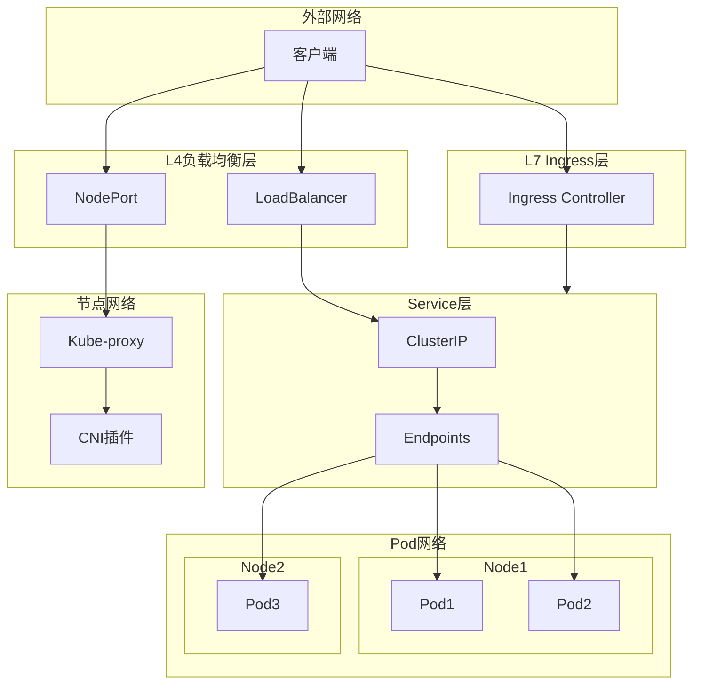

---

## 二、CNI插件概述

### 2.1 CNI定义

CNI（Container Network Interface）是Kubernetes网络插件的标准接口：

| 组件 | 说明 |
|------|------|
| CNI插件 | 负责为Pod分配IP地址，实现网络连通 |
| CNI配置文件 | 定义网络名称、插件类型、子网分配 |
| 插件类型 | Bridge、Host-local、Flannel、Cilium等 |

### 2.2 主流CNI插件对比

| 插件 | 模式 | 性能 | 安全 | 功能 |
|------|------|------|------|------|
| Flannel | VXLAN/UDP | 中等 | 一般 | 基础网络 |
| Cilium | eBPF | 高 | 高 | 透明加密、网络策略、限速 |
| Calico | BGP/IPIP | 高 | 高 | 网络策略、带宽管理 |
| Weave | 加密隧道 | 中等 | 高 | 自动发现、加密 |

---

## 三、Flannel插件

### 3.1 架构原理

Flannel是Kubernetes最常用的CNI插件之一，使用Overlay网络实现跨节点通信：

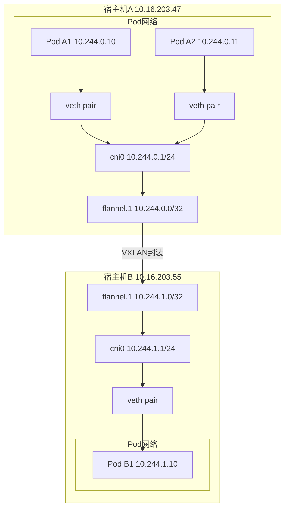

### 3.2 通信流程

**同节点通信（Pod A1 → Pod A2）**：
1. Pod A1发送数据包到目的IP 10.244.0.11
2. 容器内的路由表将数据包发往cni0网桥
3. cni0网桥根据MAC地址直接转发到veth pair
4. 数据包到达Pod A2

**跨节点通信（Pod A1 → Pod B1）**：
1. Pod A1发送数据包到目的IP 10.244.1.10
2. 路由匹配到目标网段10.244.1.0/24
3. 数据包发送到flannel.1网卡
4. flannel.1通知flanneld进程
5. flanneld将数据包封装为VXLAN UDP报文
6. 通过宿主机物理网卡发送到目标节点
7. 目标节点flanneld解封装，交给flannel.1
8. flannel.1转发到cni0，最终到达Pod B1

### 3.3 后端类型

| 类型 | 说明 | 端口 |
|------|------|------|
| VXLAN | 推荐使用，Linux内核支持 | 8472 |
| UDP | 性能较差，仅用于调试 | 8285 |
| host-gw | 直接路由，性能好但需二层连通 | - |
| aws-vpc | AWS环境专用 | - |

---

## 四、Cilium插件

### 4.1 架构原理

Cilium是基于eBPF（Extended Berkeley Packet Filter）的高性能网络插件：

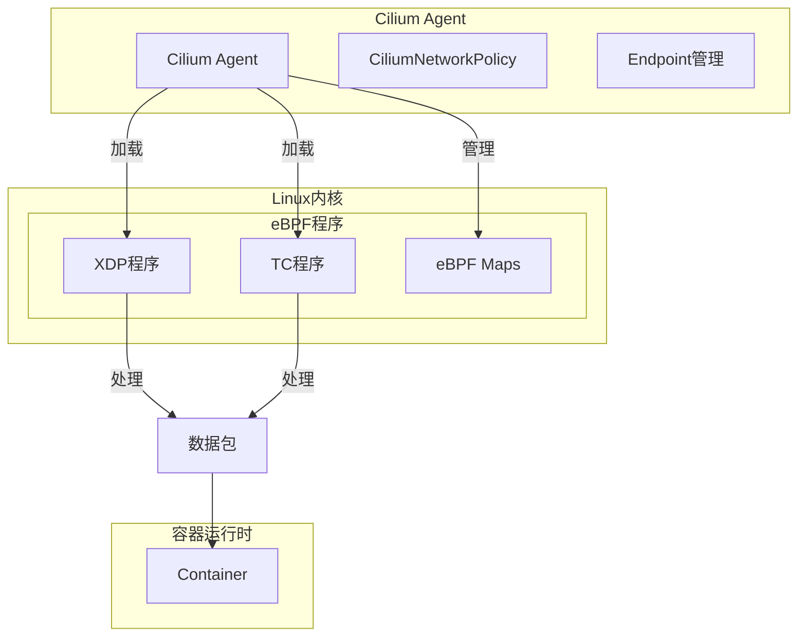

### 4.2 eBPF工作原理

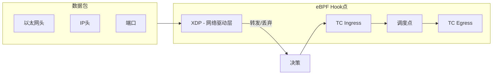

### 4.3 Flannel与Cilium对比

| 对比项 | Flannel | Cilium |
|--------|---------|--------|
| 数据平面 | VXLAN Overlay | eBPF |
| 性能 | 中等 | 高（零拷贝、XDP） |
| 网络策略 | 依赖kube-proxy | 原生支持L3-L7策略 |
| 加密 | 无 | 透明WireGuard加密 |
| 可观测性 | 基础指标 | 完整可观测性 |
| 依赖 | 无特殊依赖 | 需要较高内核版本 |

### 4.4 Cilium核心优势

1. **XDP（Express Data Path）**：在网卡驱动层处理数据包，性能接近线速
2. **透明加密**：基于WireGuard的内端到端加密
3. **身份安全**：基于工作负载身份的细粒度安全策略
4. **服务感知**：eBPF直接感知服务变化，无需iptables

---

## 五、Pod到Service网络路径

### 5.1 路径总览

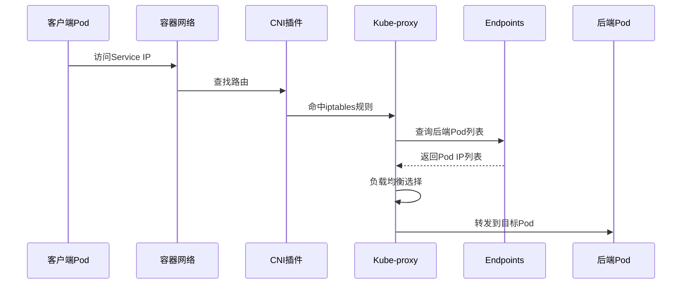

### 5.2 kube-proxy模式

| 模式 | 原理 | 性能 |
|------|------|------|
| iptables | 规则匹配 | O(n) |
| IPVS | 哈希表查找 | O(1) |
| kernelspace | 内核空间处理 | 高 |

### 5.3 Service到Endpoints

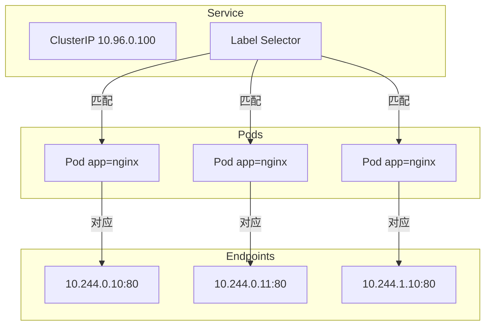

---

## 六、Service类型与暴露方式

### 6.1 Service类型对比

| 类型 | ClusterIP | NodePort | LoadBalancer | ExternalName |
|------|-----------|----------|--------------|--------------|
| 访问范围 | 集群内部 | 集群外部 | 集群外部 | 集群外部 |
| 虚拟IP | ✓ | ✓ | ✓ | ✗ |
| 端口范围 | 自动分配 | 30000-32767 | 云厂商分配 | - |
| 依赖 | 无 | 无 | 云厂商支持 | 无 |

### 6.2 NodePort原理

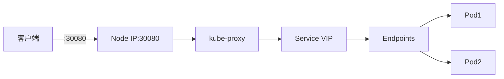

### 6.3 LoadBalancer原理

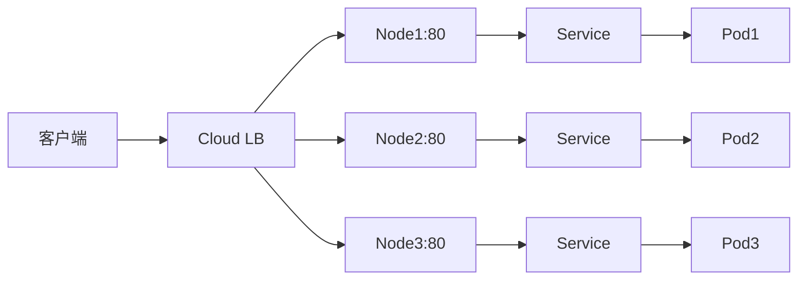

---

## 七、LoadBalancer插件

### 7.1 云厂商插件

| 插件 | 云平台 | 说明 |
|------|--------|------|
| Cloud Provider | AWS/GCP/Azure | K8s内置支持 |
| Cloud Controller Manager | 多云 | 官方云控制器 |
| CBS/CNS | 腾讯云 | 腾讯云CBS插件 |
| ALB Ingress | 阿里云 | 阿里云ALB |

### 7.2 私有环境插件

| 插件 | 说明 |
|------|------|
| MetalLB | 适用于裸金属服务器的LoadBalancer |
| Cilium LB | Cilium内置负载均衡 |
| kube-vip | 虚拟IP负载均衡 |

### 7.3 MetalLB架构

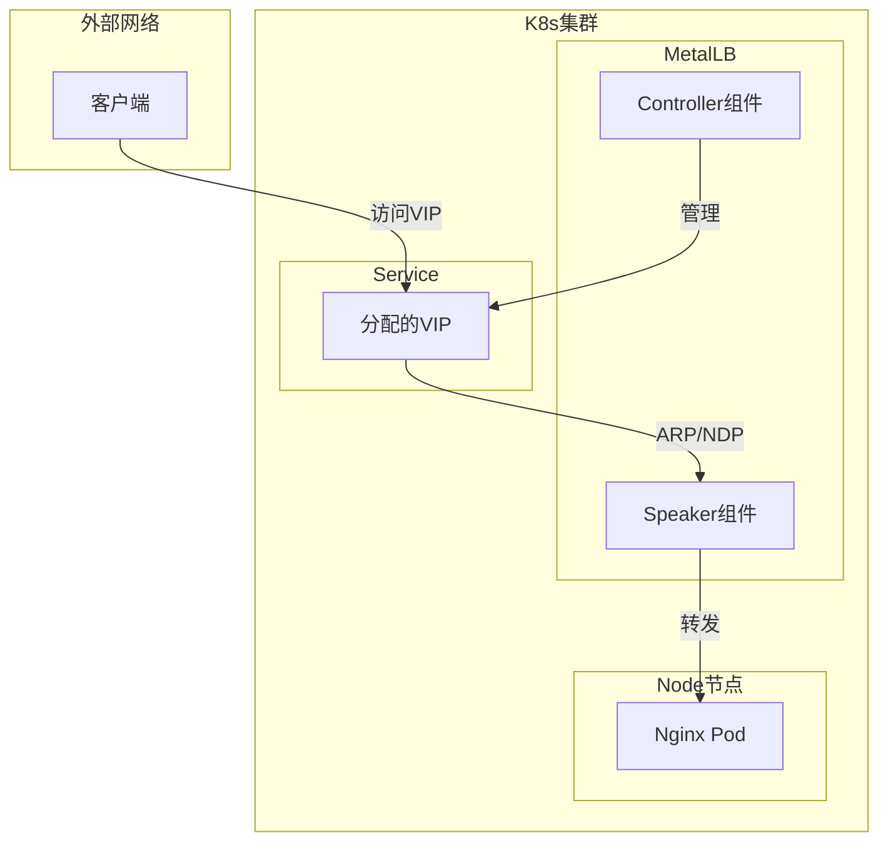

**工作原理**：
1. MetalLB Controller监听Service创建事件
2. 从配置的地址池中分配IP给LoadBalancer类型Service
3. Speaker组件通过ARP/NDP（Layer2模式）或BGP（Layer3模式）广播IP
4. 客户端请求到达VIP，被转发到对应节点

### 7.4 kube-vip架构

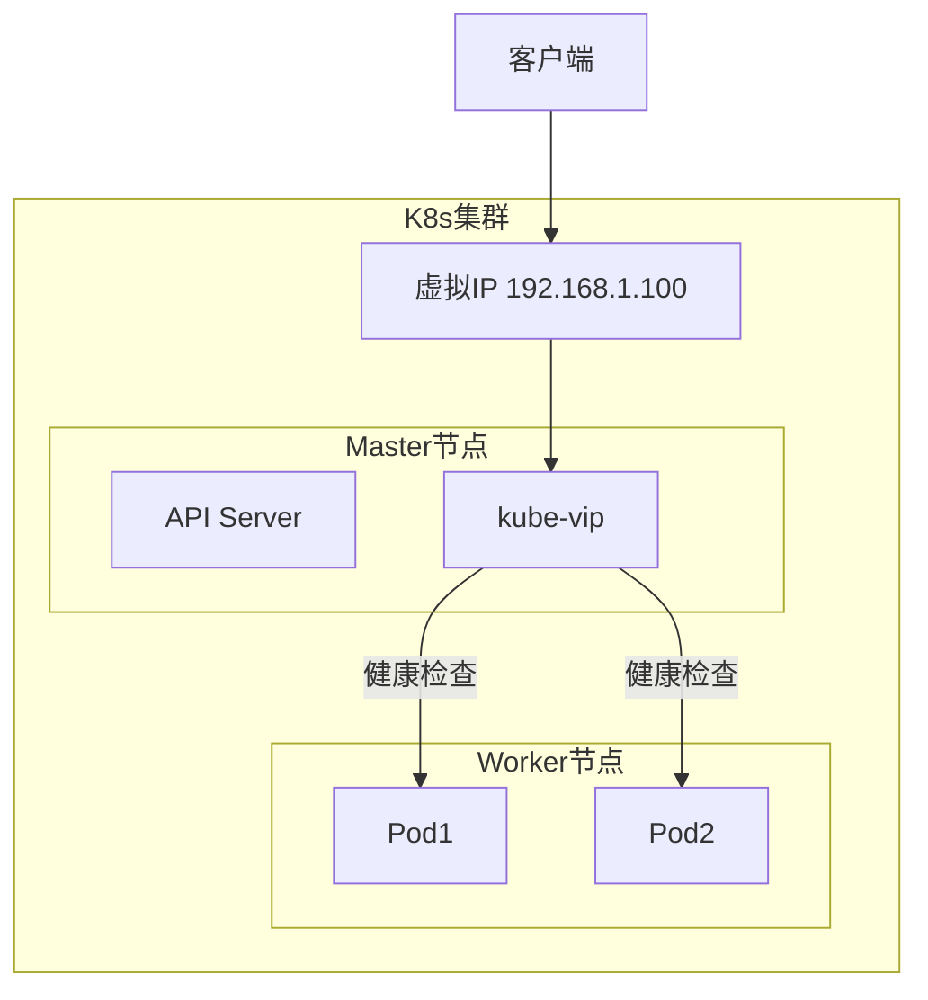

---

## 八、网络架构总览

### 8.1 完整流量路径

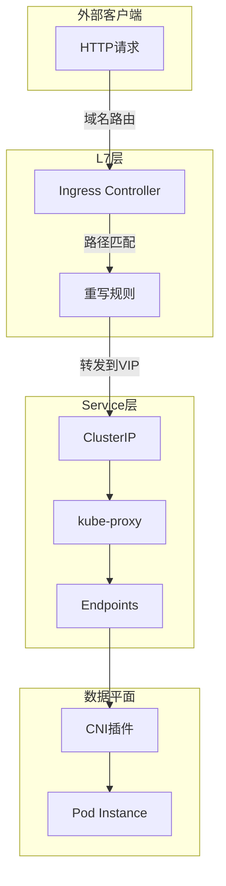

### 8.2 组件职责矩阵

| 层级 | 组件 | 职责 |
|------|------|------|
| 接入层 | Ingress/Nginx/Traefik | HTTP/HTTPS路由、SSL终结 |
| 负载均衡 | LoadBalancer/NodePort | 流量入口、跨节点分发 |
| 服务发现 | Service/Endpoints | 虚拟IP、Pod寻址 |
| 流量控制 | kube-proxy | iptables/IPVS规则 |
| 网络插件 | Flannel/Cilium | Pod网络、跨节点通信 |

### 8.3 插件选型建议

| 场景 | 推荐插件 | 原因 |
|------|----------|------|
| 简单集群 | Flannel + MetalLB | 部署简单，资源占用低 |
| 高性能场景 | Cilium | eBPF高性能，原生安全策略 |
| 多租户安全 | Calico | 成熟的网络策略， BGP支持 |
| 混合云 | Flannel + Cloud LB | 兼容性好 |

---

## 九、相关资料

- [Kubernetes网络官方文档](https://kubernetes.io/zh-cn/docs/concepts/cluster-administration/networking/)
- [Flannel官方文档](https://github.com/flannel-io/flannel)
- [Cilium官方文档](https://docs.cilium.io/)
- [MetalLB官方文档](https://metallb.universe.tf/)
- [kube-vip官方文档](https://kube-vip.io/)
- [CNI插件对比](https://itnext.io/benchmark-results-of-kubernetes-network-plugins-cni-over-kubernetes-1-19-1b6516f05435)
