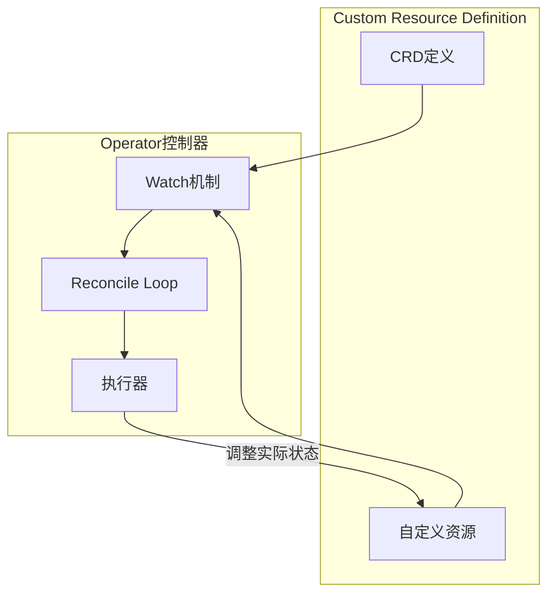

# Operator

## 目录

- [一、常见用法](#一常见用法)
- [二、底层原理](#二底层原理)
- [三、快速开始](#三快速开始)
- [四、相关资料](#四相关资料)

## 一、常见用法

### 1.1 主要应用场景

| 场景 | 说明 |
|------|------|
| 自定义资源管理 | 创建自定义资源、自定义控制器协同工作 |
| 复杂应用部署 | 复杂应用的部署、升级和回滚 |
| 运维自动化 | 资源自动伸缩、备份和恢复操作 |

### 1.2 Operator模式优势

1. **声明式API**：使用声明式方式定义资源的期望状态
2. **自动化运维**：根据资源状态自动执行相应操作
3. **领域知识编码**：将运维经验编码到控制器中

## 二、底层原理

### 2.1 核心组件



### 2.2 CRD与Controller

| 组件 | 说明 |
|------|------|
| CRD | 定义新的资源类型及其schema |
| Controller | 监听资源变化，调节实际状态到期望状态 |

### 2.3 工作流程

1. **资源定义**：通过CRD定义新的资源类型
2. **控制器监听**：控制器监听自定义资源的变化事件
3. **状态调节**：控制器比较期望状态与实际状态，执行相应操作
4. **持续协调**：控制器持续监控并保持期望状态

## 三、快速开始

### 3.1 使用Kubebuilder

``` bash
# 安装kubebuilder
# 参考：https://book.kubebuilder.io/quick-start.html#installation

# 创建项目
$ kubebuilder init --domain example.com

# 创建API
$ kubebuilder create api --group webapp --version v1 --kind Guestbook
```

### 3.2 使用Operator SDK

``` bash
# 安装operator-sdk
# 参考：https://github.com/operator-framework/operator-sdk

# 创建项目
$ operator-sdk init --project-version 3

# 创建API和控制器
$ operator-sdk create api --group apps --version v1alpha1 --kind MyApp
```

### 3.3 部署Nginx Operator示例

1. 创建Operator项目
2. 创建自定义资源定义（CRD）
3. 实现Operator逻辑
4. 构建并部署Operator
5. 使用自定义资源部署Nginx

## 四、相关资料

- [Kubernetes: 深入理解Kubernetes Operator](https://cloud.tencent.com/developer/article/2414118)
- [什么是Kubernetes Operator](https://www.redhat.com/zh/topics/containers/what-is-a-kubernetes-operator)
- [快速上手K8S Operator](https://cloud.tencent.com/developer/article/2345698)
- [Kubebuilder快速开始](https://book.kubebuilder.io/quick-start.html#installation)
- [Operator SDK](https://github.com/operator-framework/operator-sdk)
- [从零开始Kubernetes Operator](https://cloud.tencent.com/developer/article/1692392)
- [基于Helm和Operator的K8S应用管理的分享](https://www.infoq.cn/article/uV28wdyJsS6mtQqYelvU)
- [Linux下operator-sdk的安装步骤](https://www.cnblogs.com/FengZeng666/p/14956178.html)
