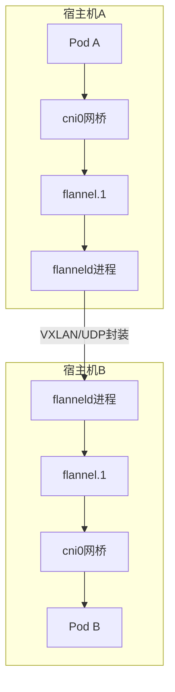
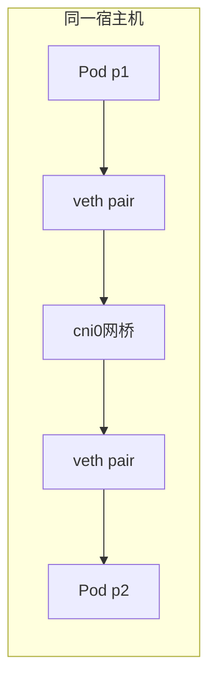
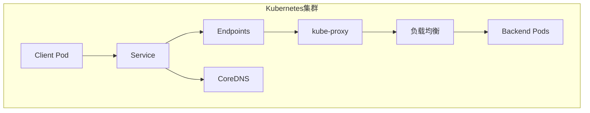

> kubernetes网络解决方案flannel如何使用，拓扑图理解

## 目录

- [一、概述](#一概述)
- [二、安装flannel](#二安装flannel)
- [三、通信原理](#三通信原理)
- [四、网卡网桥查看](#四网卡网桥查看)
- [五、网络通信实验](#五网络通信实验)
- [六、Service与Flannel](#六service与flannel)
- [七、Q&A](#七qa)
- [八、相关资料](#八相关资料)

## 一、概述

Flannel是Kubernetes集群中常用的CNI（容器网络接口）插件，为Pod提供网络通信解决方案。它在每个宿主机上运行flanneld进程，负责为宿主机预先分配子网并为Pod分配IP地址。

## 二、安装flannel

### 2.1 前置要求

安装cni-plugins网络插件，然后安装flannel：

``` bash
# 参考官方文档
# https://kubernetes.io/zh-cn/docs/concepts/extend-kubernetes/compute-storage-net/network-plugins/
# https://github.com/containerd/containerd/blob/main/script/setup/install-cni
# https://github.com/flannel-io/flannel#deploying-flannel-with-kubectl
```

### 2.2 部署方式

``` bash
# kubectl部署
kubectl apply -f https://raw.githubusercontent.com/flannel-io/flannel/master/Documentation/kube-flannel.yml

# helm部署
helm upgrade --install flannel flannel \
  --repo https://flannel.github.io/flannel \
  --namespace kube-system
```

## 三、通信原理

### 3.1 原理概述



### 3.2 通信流程

1. 同一个Pod内的所有容器共享网络命名空间，可以直接使用localhost通信
2. 每宿主机上运行flanneld，负责为宿主机预先分配一个子网，并为Pod分配IP地址
3. 同一个宿主机上Pod的网卡通过veth pair连接到cni0网桥（或docker0网桥）
4. 当访问本机cni0网段的Pod IP时，路由表直接指向本机网关cni0
5. 当访问其他宿主机上的Pod时，路由表将数据指向flannel.1网卡
6. flannel.1网卡将数据交给flanneld进程处理
7. Flannel根据路由表将数据包封装成特定协议（如VXLAN或UDP），发送到目标节点
8. 目标节点的flanneld接收并解封装，将数据交给flannel.1处理

## 四、网卡网桥查看

### 4.1 网卡说明

| 网卡/设备 | 说明 |
|----------|------|
| cni0 | 网桥设备，连接宿主机和Pod |
| flannel.1 | overlay网络设备，处理VXLAN报文封包解包 |
| veth pair | Pod与网桥的连接对，一端在Pod中（eth0），另一端在网桥中 |
| enp1s0 | 宿主机物理网卡 |

### 4.2 宿主机A网卡信息

``` bash
$ ip a

1: enp1s0: <BROADCAST,MULTICAST,UP,LOWER_UP> mtu 1500 qdisc fq_codel state UP
    link/ether d0:0d:f8:2a:2f:b2 brd ff:ff:ff:ff:ff:ff
    inet 10.16.203.47/21 brd 10.16.207.255 scope global dynamic noprefixroute enp1s0

2: flannel.1: <BROADCAST,MULTICAST,UP,LOWER_UP> mtu 1450 qdisc noqueue state UNKNOWN
    link/ether d6:62:0a:2f:b4:29 brd ff:ff:ff:ff:ff:ff
    inet 10.244.0.0/32 brd 10.244.0.0 scope global flannel.1

3: cni0: <BROADCAST,MULTICAST,UP,LOWER_UP> mtu 1450 qdisc noqueue state UP
    link/ether ae:87:60:9d:63:ac brd ff:ff:ff:ff:ff:ff
    inet 10.244.0.1/24 brd 10.244.0.255 scope global cni0
4: veth6c306fc3@if3:
5: vethda0af07c@if3:
```

### 4.3 容器内网络

``` bash
# 进入宿主机A上的容器
kubectl exec -it loki-0 -n loki -- /bin/sh

# loki的网络是 inet 10.244.0.12 属于宿主机A的网段 10.244.0.1/24
# 宿主机B的网段是 10.244.1.1/24
$ ip a
3: eth0@if18: <BROADCAST,MULTICAST,UP,LOWER_UP,M-DOWN> mtu 1450 qdisc noqueue state UP
    link/ether 5e:54:5a:33:85:5d brd ff:ff:ff:ff:ff:ff
    inet 10.244.0.12/24 brd 10.244.0.255 scope global eth0
```

### 4.4 宿主机B网卡信息

``` bash
$ ip a

1: enp1s0: <BROADCAST,MULTICAST,UP,LOWER_UP> mtu 1500 qdisc fq_codel state UP
    link/ether d0:0d:29:05:8f:ed brd ff:ff:ff:ff:ff:ff
    inet 10.16.203.55/21 brd 10.16.207.255 scope global dynamic noprefixroute enp1s0

2: flannel.1: <BROADCAST,MULTICAST,UP,LOWER_UP> mtu 1450 qdisc noqueue state UNKNOWN
    link/ether 0e:99:60:d8:96:e6 brd ff:ff:ff:ff:ff:ff
    inet 10.244.1.0/32 brd 10.244.1.0 scope global flannel.1

3: cni0: <BROADCAST,MULTICAST,UP,LOWER_UP> mtu 1450 qdisc noqueue state UP
    link/ether e2:e2:ee:49:c5:c8 brd ff:ff:ff:ff:ff:ff
    inet 10.244.1.1/24 brd 10.244.1.255 scope global cni0
```

### 4.5 网桥信息

``` bash
# 查看网桥及连接的接口
$ brctl show

bridge name     bridge id               STP enabled     interfaces
cni0            8000.ae87609d63ac       no              veth6c306fc3
                                                        vethda0af07c
```

### 4.6 路由表查看

``` bash
# 登陆宿主机B查看路由
$ ip route

# 默认路由
default via 10.16.207.254 dev enp1s0 proto dhcp metric 100

# 直连路由
10.16.200.0/21 dev enp1s0 proto kernel scope link src 10.16.203.55 metric 100

# 静态路由：目标为10.244.0.0/24的数据包通过flannel.1发送到10.244.0.0
10.244.0.0/24 via 10.244.0.0 dev flannel.1 onlink

# 直连路由
10.244.1.0/24 dev cni0 proto kernel scope link src 10.244.1.1
```

## 五、网络通信实验

### 5.1 同节点Pod通信

#### 原理说明

在容器启动前，会为容器创建一个虚拟Ethernet接口对（veth pair），类似于管道两端：
- 一端在主机命名空间中（连接网桥）
- 另一端在容器命名空间中，命名为eth0

网桥的地址段会取IP赋值给容器的eth0接口。

#### 实验步骤

利用nodeName特性将Pod调度到相同的node节点上（亲和性）：

``` yaml
# p1.yaml
apiVersion: v1
kind: Pod
metadata:
  labels:
    run: nginx
  name: p1
  namespace: default
spec:
  nodeName: k8s-node1
  containers:
  - image: busybox
    name: c1
    command:
    - "ping"
    - "baidu.com"
```

``` yaml
# p2.yaml
apiVersion: v1
kind: Pod
metadata:
  labels:
    run: busybox
  name: p2
  namespace: default
spec:
  nodeName: k8s-node1
  containers:
  - image: busybox
    name: c2
    command:
    - "ping"
    - "baidu.com"
```

``` bash
kubectl apply -f p1.yaml -f p2.yaml
kubectl get pod p{1,2} -o wide

# p1 ping p2
kubectl exec -it p1 -- ping 10.244.1.230

# 查看容器路由
kubectl exec -it p1 -c c1 -- ip route
kubectl exec -it p2 -c c2 -- ip route
```

#### 通信流程



1. 源容器向目标容器发送数据，数据首先发送给cni0网桥
2. cni0网桥接受到数据后，将其转交给flannel.1虚拟网卡处理
3. flannel.1接受到数据后，对数据进行封装，并发给宿主机的ens33，再通过ens33出外网，或者访问不同node节点上的pod


## 六、Service与Flannel

### 6.1 Service转发原理



1. Service提供DNS解析、Pod动态追踪更新转发表
2. Service域名规则：`{服务名}.{namespace}.svc.{集群名称}`
3. kube-proxy维护iptables规则并转发流量
4. 仅支持UDP和TCP协议，ICMP协议（如ping）无法使用

``` bash
# 查看Endpoints
kubectl get endpoints <service-name> -n <namespace>
```


### 6.2 kube-proxy的作用

| 功能 | 说明 |
|------|------|
| 服务发现 | 维护Service与Endpoint的映射关系 |
| 负载均衡 | 将流量分发到后端多个Pod |
| 网络代理 | 为Service创建虚拟IP并监听 |

### 6.3 kube-proxy与Flannel的关系

| 组件 | 职责 |
|------|------|
| Flannel | Pod间的网络通信，分配Pod IP，实现跨节点通信 |
| kube-proxy | Service服务发现和负载均衡，创建虚拟IP并转发流量 |

## 七、Q&A

### 7.1 什么叫做直连路由

1. 目的地与源地址直接相连的路由
2. 同一个子网中，可直接发送到目的地，不需要任何中转设备或路由器
3. 在物理层或链路层上直接相连
4. 示例：`173.8.8.0/24 dev br2 proto kernel scope link src 173.8.8.1`（因为本机网桥br2就是`inet 173.8.8.1`）

### 7.2 ip route和route -n区别是什么

| 区别 | `route -n` | `ip route` |
|------|----------|------------|
| 来源 | net-tools软件包 | iproute2软件包 |
| 格式 | 显示广播地址 | CIDR表示法 |
| 推荐度 | 旧工具 | 推荐使用 |

### 7.3 flannel.1网卡接收到的流量会发给谁

1. flannel.1网卡是用于虚拟网络通信的网络接口
2. 当flannel.1网卡接收到流量时，将流量转发给flannel进程
3. flannel进程负责将流量封装并发送到其他节点上的flannel进程
4. 流量到达目标节点的flannel进程，并被解封装交给目标节点的网络接口处理

### 7.4 flannel.1接收到的流量是否走iptables

1. Flannel不会根据iptables或其他转发规则对流量进行处理
2. Flannel通过隧道技术发送数据包
3. 容器发送网络请求时，数据包会经过容器的网卡（容器内部会根据iptable转发）
4. 数据包到达宿主机的Flannel网卡（flannel.1）
5. Flannel.1收到数据到flanneld，根据自己路由表，将数据包封装成特定协议（如VXLAN或UDP）

### 7.5 kube-proxy在flannel网络之中有什么用

1. 提供服务的负载均衡和网络代理功能
2. Service和其对应的多个Endpoint使用kube-proxy
3. 将集群外部的请求转发到内部的服务（kube-proxy为Service创建虚拟IP并监听该IP）
4. kube-proxy可以选择使用IPVS模式（比默认iptables性能更高）

### 7.6 kube-proxy为每个Service创建一个虚拟IP是什么意思

1. kube-proxy负责实现服务发现和负载均衡功能
2. kube-proxy会为Service创建虚拟IP（Virtual IP），用于代表该Service在集群内的访问地址
3. Pod访问svc域名时会转发到该虚拟IP上
4. kube-proxy监听该IP并转发数据到svc的Endpoint
5. svc的虚拟IP可以实现后端Pod的变动与Service的访问地址解耦

### 7.7 ipvsadm -Ln是什么意思

`ipvsadm -Ln`用于查看Linux系统上IPVS（IP Virtual Server）的配置和状态信息。

IPVS是Linux内核提供的高性能负载均衡技术，可作为kube-proxy的一种模式来实现负载均衡和代理转发功能。

## 八、相关资料

- [Kubernetes（k8s）CNI（flannel）网络模型原理](https://mp.weixin.qq.com/s/18bMpQjXFodfegWH3xNeKQ)
- [《蹲坑学K8S》之19-3：Flannel通信原理](https://baijiahao.baidu.com/s?id=1677418078665703072)
- [Kubernetes网络模型和网络通信](https://atbug.com/deep-dive-k8s-network-mode-and-communication/)
- [从Flannel学习Kubernetes overlay网络](https://atbug.com/cross-node-traffic-on-flannel-vxlan-network/)
