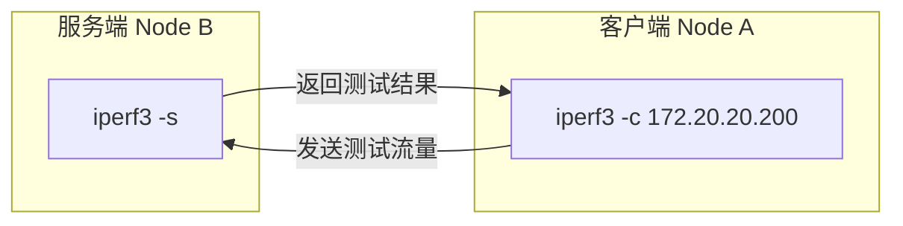

> iperf压测网速

## 目录

- [一、工具用途](#一工具用途)
- [二、安装方式](#二安装方式)
- [三、带宽测试](#三带宽测试)
- [四、Kubernetes中使用iperf3](#四kubernetes中使用iperf3)
- [五、测试指标解读](#五测试指标解读)
- [六、相关资料](#六相关资料)

## 一、工具用途

iperf是一款广泛使用的网络带宽测试工具，主要用于评估网络性能。它能够测量TCP和UDP协议的吞吐量、延迟、抖动等关键指标。

| 工具 | 主要用途 | 特点 |
|------|----------|------|
| iperf | 带宽测试 | 支持TCP/UDP，可测试双向带宽 |
| scp | 文件传输 | 基于SSH，测试实际文件传输速度 |
| wget | 下载测试 | 测试下载速度，适合外网带宽 |

## 二、安装方式

### 2.1 包管理工具安装

``` bash
# Debian/Ubuntu
apt install iperf3

# RHEL/CentOS
yum install iperf3
```

### 2.2 源码编译安装

``` bash
yum -y install gcc make wget
cd /tmp
wget https://iperf.fr/download/source/iperf-3.1.3-source.tar.gz
tar zxvf iperf-3.1.3-source.tar.gz
cd iperf-3.1.3
./configure
make
make install
```

## 三、带宽测试

### 3.1 客户端与服务端模式

iperf3采用客户端-服务端架构进行测试：



### 3.2 基本使用

``` bash
# 服务端：监听5201端口，等待客户端连接
iperf3 -s

# 客户端：连接服务端并开始测试
iperf3 -c 172.20.20.200

# 客户端：指定测试时长（30秒）
iperf3 -c 172.20.20.200 -t 30

# 客户端：指定带宽上限（例如100Mbps）
iperf3 -c 172.20.20.200 -b 100M

# 客户端：反向测试（服务端发送，客户端接收）
iperf3 -c 172.20.20.200 -R
```

### 3.3 常用参数

| 参数 | 说明 |
|------|------|
| `-s` | 服务端模式 |
| `-c host` | 客户端模式，指定服务端地址 |
| `-p port` | 指定端口（默认5201） |
| `-t time` | 测试时长（秒） |
| `-b bandwidth` | 带宽限制 |
| `-R` | 反向模式（服务端发送） |
| `-J` | JSON格式输出 |
| `-f` | 输出格式（k/K/m/M/g/G） |

[iperf3详细参数说明](https://www.cnblogs.com/yingsong/p/5682080.html)

## 四、Kubernetes中使用iperf3

### 4.1 部署iperf3服务端

``` yaml
apiVersion: v1
kind: Pod
metadata:
  name: iperf3-server
  labels:
    app: iperf3
spec:
  containers:
  - name: iperf3
    image: networkstatic/iperf3:latest
    args:
    - -s
    ports:
    - containerPort: 5201
      name: iperf
---
apiVersion: v1
kind: Service
metadata:
  name: iperf3-server
spec:
  selector:
    app: iperf3
  ports:
  - protocol: TCP
    port: 5201
    targetPort: 5201
  type: ClusterIP
```

### 4.2 执行测试

``` bash
# 获取服务端IP
kubectl get svc iperf3-server -o wide

# 运行客户端测试
kubectl run iperf3-client --rm -ti --image=networkstatic/iperf3:latest -- \
  -c iperf3-server -t 30
```

## 五、测试指标解读

### 5.1 输出示例

```
Connecting to host 172.17.0.2, port 5201
[  5] local 172.17.0.3 port 33370 connected to 172.17.0.2 port 5201
[ ID] Interval           Transfer     Bitrate         Retr  Cwnd
[  5]   0.00-1.00   sec  3.55 GBytes  30.5 Gbits/sec    0    185 MBytes
[  5]   1.00-2.00   sec  3.54 GBytes  30.5 Gbits/sec  25972    185 MBytes
[  5]   2.00-3.00   sec  3.57 GBytes  30.6 Gbits/sec    0    185 MBytes
[  5]   3.00-4.00   sec  3.57 GBytes  30.7 Gbits/sec    0    185 MBytes
[  5]   4.00-5.00   sec  3.58 GBytes  30.7 Gbits/sec    0    185 MBytes
[  5]   5.00-6.00   sec  3.54 GBytes  30.4 Gbits/sec    0    185 MBytes
[  5]   6.00-7.00   sec  3.49 GBytes  30.0 Gbits/sec    0    185 MBytes
[  5]   7.00-8.00   sec  3.55 GBytes  30.5 Gbits/sec    0    185 MBytes
[  5]   8.00-9.00   sec  3.52 GBytes  30.2 Gbits/sec    0    185 MBytes
[  5]   9.00-10.00  sec  3.54 GBytes  30.4 Gbits/sec  4294941326   0.00 Bytes
```

### 5.2 指标说明

| 指标 | 说明 |
|------|------|
| Interval | 测试的时间间隔 |
| Transfer | 在该间隔内传输的数据量 |
| Bitrate | 传输速率（bits/sec） |
| Retr | 重传的数据包数量 |
| Cwnd | 拥塞窗口大小 |
| Jitter | 网络抖动，连续发送数据包时延差值的平均值，越小说明网络质量越好 |
| Lost/Total | 丢失的数据包与发送的总数据包的比例 |

## 六、相关资料

- [iperf下载](https://iperf.fr/iperf-download.php)
- [IPerf3 Docker Build 用于网络性能和带宽测试](https://github.com/nerdalert/iperf3)
- [iperf-3.1.3-source.tar.gz](https://iperf.fr/download/source/iperf-3.1.3-source.tar.gz)
