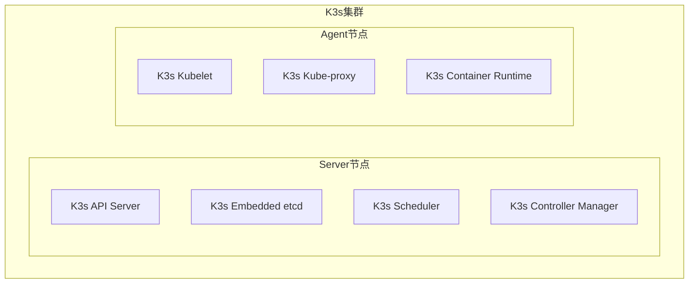
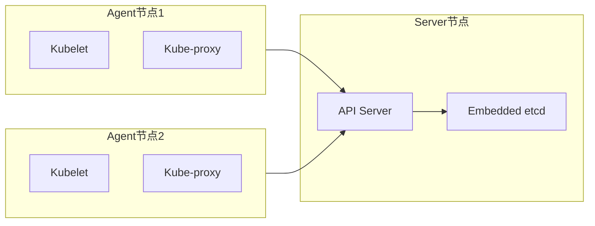

# K3s架构

## 目录

- [一、概述](#一概述)
- [二、架构特点](#二架构特点)
- [三、核心组件](#三核心组件)
- [四、与标准K8s对比](#四与标准k8s对比)
- [五、部署架构](#五部署架构)
- [六、高可用方案](#六高可用方案)
- [七、相关资料](#七相关资料)

## 一、概述

K3s是Rancher Labs开发的轻量级Kubernetes发行版，专为边缘计算、资源受限环境和简化的Kubernetes体验而设计。

| 特性 | 说明 |
|------|------|
| 二进制文件 | 单个约50MB的二进制文件 |
| 内存需求 | 最低512MB RAM |
| 启动速度 | 快速启动，几秒内完成 |
| 打包方式 | 所有K8s组件打包为一个进程 |

## 二、架构特点

### 2.1 简化设计



### 2.1 关键特性

| 特性 | 说明 |
|------|------|
| 嵌入式组件 | etcd、API Server、Scheduler集成到单一二进制 |
| 容器运行时 | 内置containerd，无需Docker |
| 自动签发证书 | 内置Tailscale WireGuard证书自动管理 |
| 简化网络 | 默认使用kube-router或flannel |

## 三、核心组件

### 3.1 K3s Server

K3s Server包含所有控制平面组件：

| 组件 | 说明 |
|------|------|
| API Server | 集群操作入口 |
| etcd | 嵌入式分布式存储 |
| Scheduler | Pod调度器 |
| Controller Manager | 控制器管理 |
| Cloud Controller Manager | 云控制器（可选） |

### 3.2 K3s Agent

K3s Agent运行在工作节点上：

| 组件 | 说明 |
|------|------|
| Kubelet | 容器生命周期管理 |
| Kube-proxy | 服务发现与负载均衡 |
| Container Runtime | 内置containerd |

### 3.3 额外组件

| 组件 | 说明 |
|------|------|
| SQLite | 默认数据存储（替代etcd用于轻量场景） |
| Traefik | 默认Ingress控制器 |
| Service LB | 默认负载均衡器 |
| Klipper | 内置负载均衡器 |

## 四、与标准K8s对比

| 对比项 | 标准K8s | K3s |
|--------|----------|-----|
| 二进制文件大小 | 多个组件，约数百MB | 单个文件，约50MB |
| 内存需求 | 至少2GB | 最低512MB |
| 依赖组件 | etcd、Docker等独立组件 | 零外部依赖 |
| 证书管理 | 手动或外部工具 | 自动管理 |
| 默认网络 | 需要配置CNI | 内置flannel |
| 适用场景 | 数据中心 | 边缘、物联网、CI |

## 五、部署架构

### 5.1 单节点部署

```bash
# 安装K3s
curl -sfL https://get.k3s.io | sh -

# 查看节点
kubectl get nodes

# 查看集群状态
k3s check-config
```

### 5.2 多节点部署

```bash
# Server节点
curl -sfL https://get.k3s.io | K3S_URL=https://server:6443 K3S_TOKEN=<token> sh -

# 获取token
cat /var/lib/rancher/k3s/server/node-token
```

### 5.3 架构图



## 六、高可用方案

### 6.1 内置HA模式

K3s支持多Server节点实现高可用：

```bash
# 第一个Server节点
curl -sfL https://get.k3s.io | sh - server --cluster-init

# 后续Server节点
curl -sfL https://get.k3s.io | sh - server --server https://<first-server>:6443
```

### 6.2 K3s集群角色

| 角色 | 说明 |
|------|------|
| Leader | 选举产生的领导者，处理集群协调工作 |
| Follower | 其他Server节点，接受领导者的协调 |

## 七、相关资料

- [K3s官方文档](https://docs.k3s.io/)
- [K3s GitHub仓库](https://github.com/k3s-io/k3s)
- [Rancher官方](https://www.rancher.com/)
