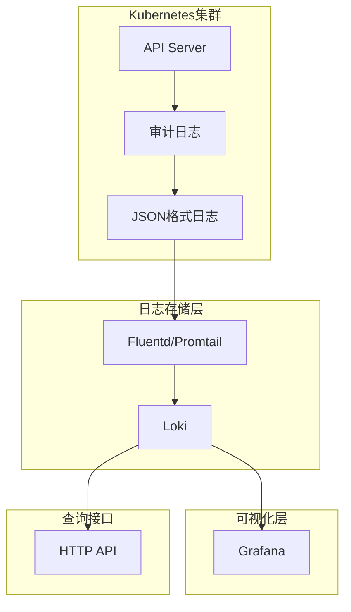

## 目录

- [一、审计日志策略](#一审计日志策略)
- [二、启用审计日志](#二启用审计日志)
- [三、审计日志架构](#三审计日志架构)
- [四、日志记录策略配置](#四日志记录策略配置)
- [五、日志写入策略](#五日志写入策略)
- [六、Loki采集审计日志](#六loki采集审计日志)
- [七、HTTP接口查看Loki日志](#七http接口查看loki日志)
- [八、Docker搭建Loki](#八docker搭建loki)
- [九、Q&A](#九qa)

## 一、审计日志策略

### 1.1 日志记录阶段

kube-apiserver负责接收及响应用户请求，每一个请求都会有几个阶段，每个阶段都有对应的日志：

| 阶段 | 说明 |
|------|------|
| RequestReceived | apiserver接收到请求后、在将请求下发之前生成审计日志 |
| ResponseStarted | 响应header发送后、响应body发送前生成日志（仅为长时间运行的请求生成，如watch） |
| ResponseComplete | 响应body发送完并且不再发送数据时生成 |
| Panic | 有panic发生时生成 |

> apiserver的每一个请求理论上会有多个阶段的审计日志生成

### 1.2 日志记录级别

| 级别 | 说明 |
|------|------|
| None | 不记录日志 |
| Metadata | 只记录Request的metadata（user、timestamp、resource、verb等），不记录Request或Response的body |
| Request | 记录Request的metadata和body |
| RequestResponse | 最全记录方式，记录所有metadata、Request和Response的body |

### 1.3 日志记录原则

- 一个请求不要重复记录，每个请求有多个阶段，只记录其中需要的阶段
- 不要记录所有的资源，不要记录一个资源的所有子资源
- 系统的请求不需要记录（kubelet、kube-proxy、kube-scheduler、kube-controller-manager等对kube-apiserver的请求）
- 对一些认证信息（secrets、configmaps、token等）的body不记录

## 二、启用审计日志

### 2.1 创建审计策略文件

``` bash
mkdir -p /etc/kubernetes/audit/
touch /etc/kubernetes/audit/audit-policy.yaml
```

``` yaml
# /etc/kubernetes/audit/audit-policy.yaml
apiVersion: audit.k8s.io/v1
kind: Policy
omitStages:
  - "ResponseStarted"
rules:
  # 记录用户对pod和statefulset的操作
  - level: RequestResponse
    resources:
    - group: ""
      resources: ["pods", "pods/status"]
    - group: "apps"
      resources: ["statefulsets", "statefulsets/scale"]
  # kube-controller-manager、kube-scheduler等已认证身份的请求不记录
  - level: None
    userGroups: ["system:authenticated"]
    nonResourceURLs:
    - "/api*"
    - "/version"
  # 对config、secret、token等认证信息不记录请求体和返回体
  - level: Metadata
    resources:
    - group: ""
      resources: ["secrets", "configmaps"]
```

### 2.2 配置kube-apiserver

``` yaml
# /etc/kubernetes/manifests/kube-apiserver.yaml
spec:
  containers:
  - command:
    - kube-apiserver
    - --audit-policy-file=/etc/kubernetes/audit/audit-policy.yaml
    - --audit-log-path=/var/log/containers/audit.log
    - --audit-log-format=json
    - --audit-log-maxage=7
    - --audit-log-maxbackup=5
    - --audit-log-maxsize=100
```

### 2.3 配置存储卷

``` yaml
volumeMounts:
- mountPath: /etc/kubernetes/audit
  name: etc-audit
  readOnly: true
- mountPath: /var/log/containers/
  name: audit-log
```

``` yaml
volumes:
- hostPath:
    path: /etc/kubernetes/audit
    type: DirectoryOrCreate
  name: etc-audit
- hostPath:
    path: /var/log/containers
    type: DirectoryOrCreate
  name: audit-log
```

> 更改后会自动重启kube-apiserver

### 2.4 审计日志查看

``` bash
kubectl get pod -A
kubectl logs kube-apiserver-k8s-master -n kube-system -f
```

### 2.5 日志文件说明

``` bash
# 日志文件位于/var/log/containers/目录
ls /var/log/containers/ | grep audit

# 日志文件展示
audit-2023-06-05T07-12-55.439.log  # 备份文件最大100MB
audit-2023-06-05T07-12-52.231.log
audit-2023-06-05T07-12-55.891.log
audit-2023-06-05T07-12-58.439.log
audit-2023-06-05T07-12-58.786.log
audit.log                             # 最新的日志文件，超过100MB自动轮转
```

## 三、审计日志架构




## 四、日志记录策略配置

### 4.1 原始日志结构

``` json
{
    "kind": "Event",
    "apiVersion": "audit.k8s.io/v1",
    "level": "",
    "auditID": "",
    "stage": "",
    "requestURI": "",
    "verb": "",
    "user": {
        "username": "",
        "groups": []
    },
    "sourceIPs": [""],
    "userAgent": "",
    "objectRef": {
        "resource": "",
        "namespace": "",
        "name": "",
        "apiGroup": "",
        "apiVersion": ""
    },
    "requestReceivedTimestamp": "",
    "stageTimestamp": ""
}
```

### 4.2 仅记录资源的delete/edit/add动作

``` yaml
# /etc/kubernetes/audit/audit-policy.yml
apiVersion: audit.k8s.io/v1
kind: Policy
omitStages:
  - "ResponseStarted"
  - "ResponseComplete"
rules:
  # 排除watch/get/list/patch
  - level: None
    verbs: ["watch", "get", "list", "patch"]
  # 排除特定角色
  - level: None
    users: ["system:kube-scheduler", "system:apiserver", "system:kube-controller-manager"]
  # 租约更新不需要
  - level: None
    resources:
    - group: "coordination.k8s.io"
      resources: ["leases"]
  - level: RequestResponse
```

### 4.3 规则验证源码

``` go
// k8s.io/apiserver
// pkg/audit/policy.EvaluatePolicyRule
// 规则验证，自上而下，遇到匹配的规则返回当前的路由日志的处理策略
func (p *policyRuleEvaluator) EvaluatePolicyRule(attrs authorizer.Attributes)

// 规则对象
type audit.PolicyRule
```

## 五、日志写入策略

日志写入标准输出，标准输出默认挂载至宿主机目录`/var/log/containers/`的文件`<POD-NAME>_<CONTAINER-NAME>_<CONTAINER-ID>.log`之中。

例如：`kube-apiserver-k8s-master_kube-system_kube-apiserver-xxx.log`

## 六、Loki采集审计日志

### 6.1 Loki架构


### 6.2 创建Loki服务

``` yaml
# loki.svc.yml
apiVersion: v1
kind: Service
metadata:
  name: loki-service
  namespace: loki
spec:
  type: NodePort
  selector:
    app: loki
  ports:
  - name: loki-port
    protocol: TCP
    port: 80
    targetPort: 3100
    nodePort: 30019
```

### 6.3 查询示例

``` bash
# 查询一段时间范围内的所有指标原始日志
curl http://localhost:3101/loki/api/v1/query_range \
  --data-urlencode 'query={container="evaluate-loki-flog-1"}| json| method="GET"' \
  --data-urlencode 'start=1685531767028752000' \
  --data-urlencode 'end=1685531767029752000'

# 获取所有用户名
curl 'http://localhost:3101/loki/api/v1/query?query=count(count_over_time({container="evaluate-loki-flog-1"}[5m] |json)) by (method)'
```

## 七、HTTP接口查看Loki日志

### 7.1 Loki HTTP API

| 接口 | 说明 |
|------|------|
| `/loki/api/v1/query` | 瞬时查询 |
| `/loki/api/v1/query_range` | 范围查询 |
| `/loki/api/v1/series` | 查看所有时间序列 |

### 7.2 范围查询示例

``` bash
curl http://localhost:3101/loki/api/v1/query_range \
  --data-urlencode 'query={container="evaluate-loki-flog-1"}| json| method="GET"' \
  --data-urlencode 'start=1685531767028752000' \
  --data-urlencode 'end=1685531767029752000'
```

### 7.3 取消身份校验

``` yaml
# 取消验证 disable the auth feature
# https://github.com/grafana/loki/issues/7081
auth_enabled: false
```

## 八、Docker搭建Loki

### 8.1 快速部署

``` bash
mkdir evaluate-loki
cd evaluate-loki

wget https://raw.githubusercontent.com/grafana/loki/main/examples/getting-started/loki-config.yaml -O loki-config.yaml
wget https://raw.githubusercontent.com/grafana/loki/main/examples/getting-started/promtail-local-config.yaml -O promtail-local-config.yaml
wget https://raw.githubusercontent.com/grafana/loki/main/examples/getting-started/docker-compose.yaml -O docker-compose.yaml

docker-compose up -d
```

### 8.2 访问地址

- Loki: http://localhost:3101/ready
- Grafana: http://localhost:3000

### 8.3 查询语句

``` logql
{container="evaluate-loki-flog-1"}
```

## 九、Q&A

### 9.1 范围查询的start时间格式

``` go
func Test_formatTS(t *testing.T) {
    // 时间戳纳秒格式字符串
    // 1685531472028872000
    ts := time.Now().Add(-1 * time.Minute)
    result := strconv.FormatInt(ts.UnixNano(), 10)
}
```

### 9.2 为什么开启审计日志后会有2条日志

``` json
# ResponseComplete /api/v1/namespaces/kube-system/configmaps?watch=true,"user":{"username":"system:node:k8s-master"}
# RequestReceived /api/v1/namespaces/kube-system/configmaps?watch=true, "user":{"username":"system:node:k8s-master"}
```

这是因为watch类型的请求会在RequestReceived和ResponseComplete两个阶段都生成日志。

### 9.3 如何获取所有用户名

``` bash
curl 'http://localhost:3101/loki/api/v1/query?query=count(count_over_time({container="evaluate-loki-flog-1"}[5m] |json)) by (method)'
```

## 参考资料

- [Kubernetes安装](https://weiqiangxu.github.io/2023/04/18/%E8%AF%AD%E9%9B%80k8s%E5%9F%BA%E7%A1%80%E5%85%A5%E9%97%A8/%E5%A6%82%E4%BD%95%E5%AE%89%E8%A3%85kubernetes/)
- [简书/kubernetes审计日志功能](https://www.jianshu.com/p/8117bc2fb966)
- [Kubernetes文档/任务/日志监控/审计](https://kubernetes.io/zh-cn/docs/tasks/debug/debug-cluster/audit/)
- [Grafana Loki查询语言LogQL使用](https://zhuanlan.zhihu.com/p/535482931)
- [Grafana Loki Getting Started](https://grafana.com/docs/loki/latest/getting-started/)
- [apiserver审计日志规则校验源码](https://github.com/kubernetes/apiserver/blob/v0.27.2/pkg/audit/policy/checker.go)
