# Kubernetes架构

## 一、Kubernetes架构概述

### 1. Kubernetes整体架构图

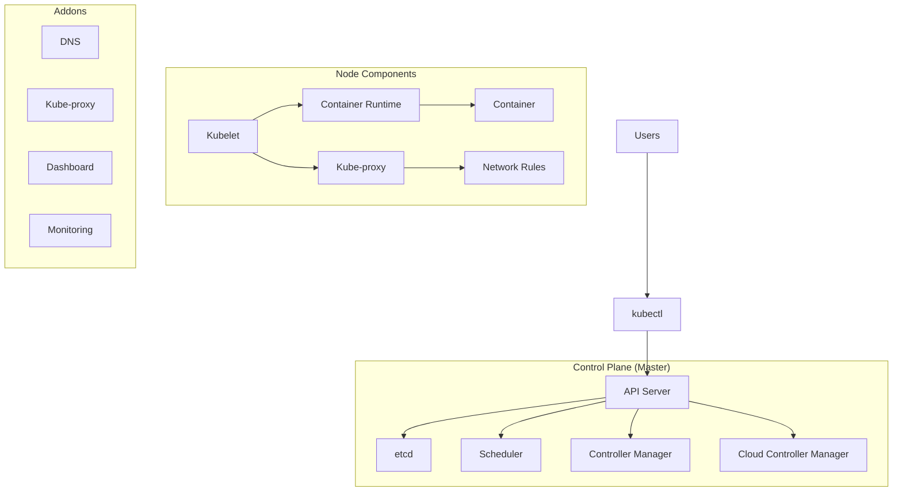

## 二、Control Plane组件

### 1. API Server（API服务器）

#### 1.1 功能
- Kubernetes Control Plane的前端组件
- 提供HTTP/HTTPS RESTful API接口
- 所有其他组件都通过API Server与etcd通信
- 是Kubernetes集群的入口

#### 1.2 实现原理
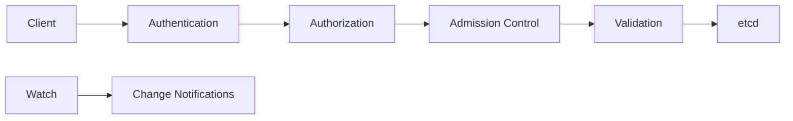

**核心机制**：
- **Authentication（认证）**：支持多种认证方式（X.509证书、Token、Bearer Token等）
- **Authorization（授权）**：基于RBAC的权限控制
- **Admission Control（准入控制）**：对请求进行拦截和修改
- **Validation（验证）**：验证资源的语义正确性

#### 1.3 核心特性
- **Watch机制**：支持实时监听资源变化
- **RESTful API**：标准的HTTP/HTTPS接口
- **乐观并发控制**：基于ResourceVersion实现
- **高可用**：支持多实例部署

### 2. etcd

#### 2.1 功能
- 分布式键值存储系统
- 存储Kubernetes集群的所有数据
- 提供可靠的数据存储和协调服务

#### 2.2 实现原理
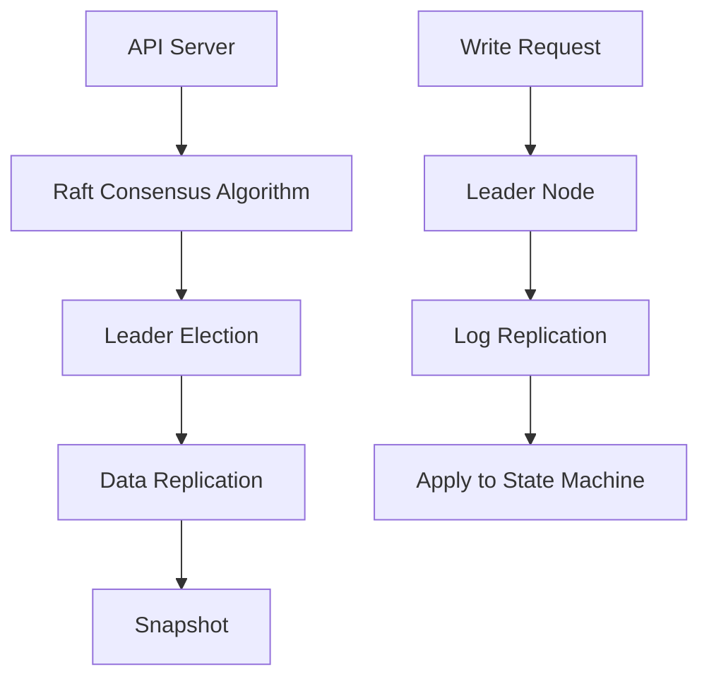

**核心特性**：
- **Raft共识算法**：保证分布式一致性
- **Leader选举**：确保高可用性
- **数据复制**：跨节点复制保证可靠性
- **MVCC**：多版本并发控制

#### 2.3 数据存储内容
```json
{
  "/registry/pods/": "Pod资源数据",
  "/registry/services/": "Service资源数据",
  "/registry/nodes/": "Node资源数据",
  "/registry/namespaces/": "Namespace资源数据",
  "/registry/deployments/": "Deployment资源数据"
}
```

### 3. Scheduler（调度器）

#### 3.1 功能
- 负责将Pod调度到合适的Node上
- 实现Pod的负载均衡
- 满足Pod的资源需求

#### 3.2 实现原理
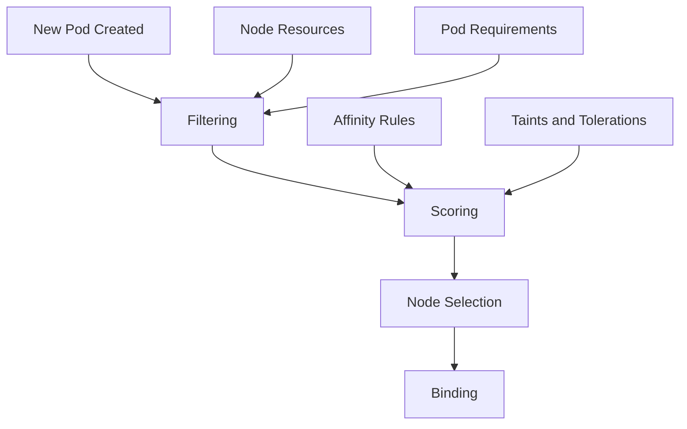

**调度流程**：
1. **Filtering（预选）**：过滤不符合条件的节点
2. **Scoring（评分）**：对通过预选的节点进行评分
3. **Node Selection（选择）**：选择评分最高的节点
4. **Binding（绑定）**：将Pod绑定到目标节点

#### 3.3 调度策略
- **资源需求**：CPU、内存
- **亲和性/反亲和性**：节点亲和性、Pod亲和性
- **污点和容忍**：Taints and Tolerations
- **拓扑约束**：拓扑域约束（Zone/Region）
- **优先级和抢占**：Priority and Preemption

### 4. Controller Manager（控制器管理器）

#### 4.1 功能
- 维护集群desired state（期望状态）
- 运行各种控制器来确保实际状态匹配期望状态
- 实现自动化的故障恢复和扩缩容

#### 4.2 控制器列表

| 控制器 | 功能 |
|--------|------|
| Node Controller | 节点生命周期管理 |
| Replication Controller | Pod副本数管理 |
| Deployment Controller | Deployment管理 |
| StatefulSet Controller | StatefulSet管理 |
| DaemonSet Controller | DaemonSet管理 |
| Job Controller | Job任务管理 |
| CronJob Controller | CronJob定时任务管理 |
| Endpoint Controller | Service和Pod的关联 |
| Service Account Controller | 服务账号管理 |
| Token Controller | Token管理 |

#### 4.3 实现原理
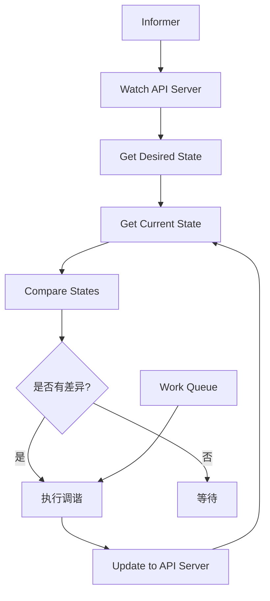

**核心机制**：
- **Informer机制**：订阅API Server的资源变化
- **Work Queue**：待处理工作队列
- **调谐循环**：Reconciliation Loop，持续调谐直到状态一致

### 5. Cloud Controller Manager（云控制器管理器）

#### 5.1 功能
- 与云提供商交互
- 管理云资源
- 实现云平台的负载均衡、路由等

#### 5.2 云控制器类型
- **Node Controller**：云平台节点管理
- **Route Controller**：云平台路由管理
- **Service Controller**：云平台负载均衡管理
- **Volume Controller**：云平台存储卷管理

## 三、Node组件

### 1. Kubelet

#### 1.1 功能
- 运行在每个Node上的代理
- 负责管理节点上容器的生命周期
- 向API Server注册节点
- 汇报节点状态

#### 1.2 实现原理
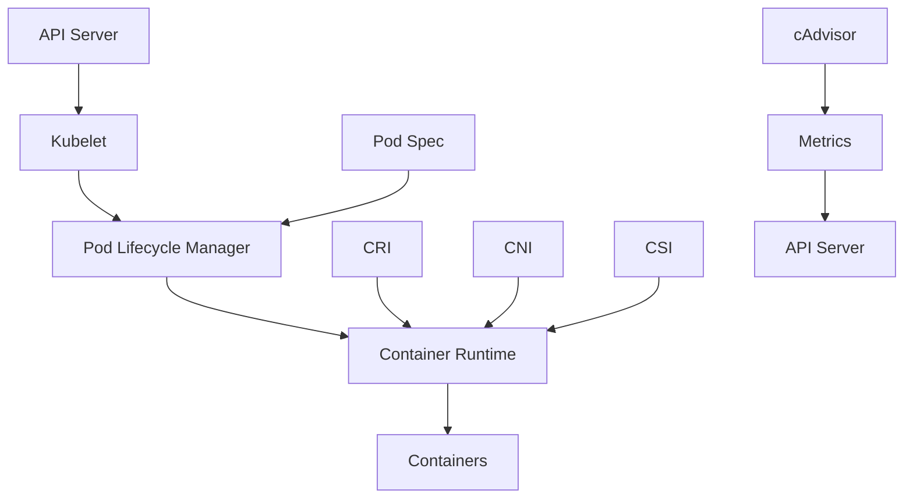

**核心职责**：
- **Pod管理**：创建、启动、停止容器
- **健康检查**：执行探针检测
- **资源监控**：收集节点和容器指标
- **卷管理**：挂载存储卷
- **日志收集**：收集容器日志

#### 1.3 Pod创建流程
1. API Server通过Watch机制通知Kubelet
2. Kubelet从API Server获取Pod规格
3. 预拉取容器镜像
4. 创建Pause容器（基础设施容器）
5. 创建应用容器
6. 配置网络（CNI插件）
7. 启动探针检测
8. 更新Pod状态到API Server

### 2. Container Runtime（容器运行时）

#### 2.1 功能
- 负责运行容器
- 管理容器镜像
- 实现容器生命周期管理

#### 2.2 Kubernetes支持的容器运行时
- **containerd**：轻量级容器运行时
- **CRI-O**：Kubernetes原生的容器运行时接口实现
- **Docker**：通过dockershim适配
- **其他CRI实现**：Frakti、gvisor等

#### 2.3 CRI（容器运行时接口）
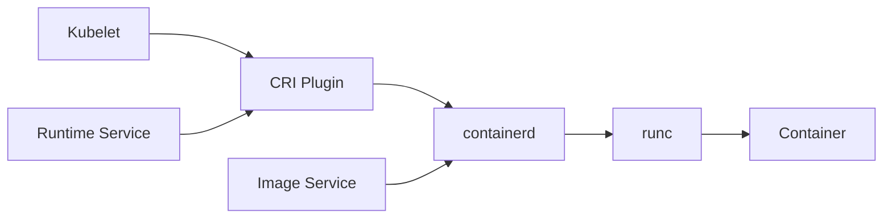

**CRI服务**：
- **RuntimeService**：容器生命周期管理
- **ImageService**：镜像管理

### 3. Kube-proxy

#### 3.1 功能
- 维护节点上的网络规则
- 实现Service的负载均衡
- 实现Service到Pod的映射

#### 3.2 实现原理
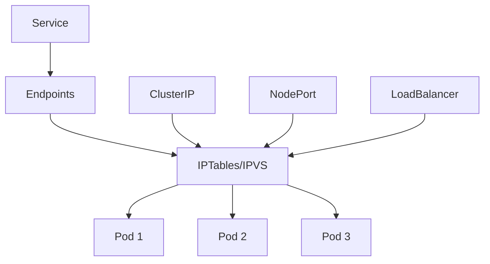

**工作模式**：
- **iptables模式**：默认模式，使用iptables规则
- **ipvs模式**：高性能模式，使用IPVS
- **userspace模式**：古老模式，较少使用

#### 3.3 负载均衡算法
- **轮询（Round Robin）**
- **最少连接（Least Connections）**
- **源地址哈希（Source Hashing）**
- **加权轮询（Weighted Round Robin）**

### 4. Container Network Interface（CNI）

#### 4.1 功能
- 容器网络配置
- 分配IP地址
- 设置网络策略

#### 4.2 常见CNI插件
| 插件 | 特点 |
|------|------|
| Flannel | 简单Overlay网络 |
| Calico | 高性能BGP路由 |
| Canal | Flannel+Calico |
| Weave | 去中心化网络 |
| Cilium | eBPF驱动 |

#### 4.3 CNI操作
- **ADD**：添加容器到网络
- **DEL**：从网络删除容器
- **CHECK**：检查网络配置
- **VERSION**：返回CNI版本

## 四、Addons（插件）

### 1. CoreDNS

#### 1.1 功能
- 为Service提供域名解析
- 实现服务发现
- 替代kube-dns

#### 1.2 实现原理
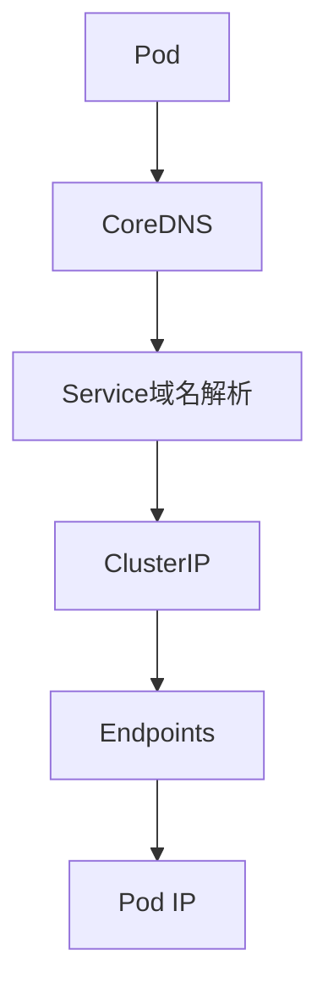

### 2. Kubernetes Dashboard

#### 2.1 功能
- Web UI管理界面
- 监控资源状态
- 部署和管理应用

### 3. Metrics Server

#### 3.1 功能
- 收集集群资源指标
- 支持kubectl top命令
- 为HPA提供指标数据

### 4. Ingress Controller

#### 4.1 功能
- HTTP/HTTPS负载均衡
- 基于域名的路由
- SSL/TLS终结

## 五、核心概念

### 1. Pod

#### 1.1 定义
- Kubernetes最小调度单位
- 包含一个或多个容器
- 共享网络和存储

#### 1.2 Pod生命周期
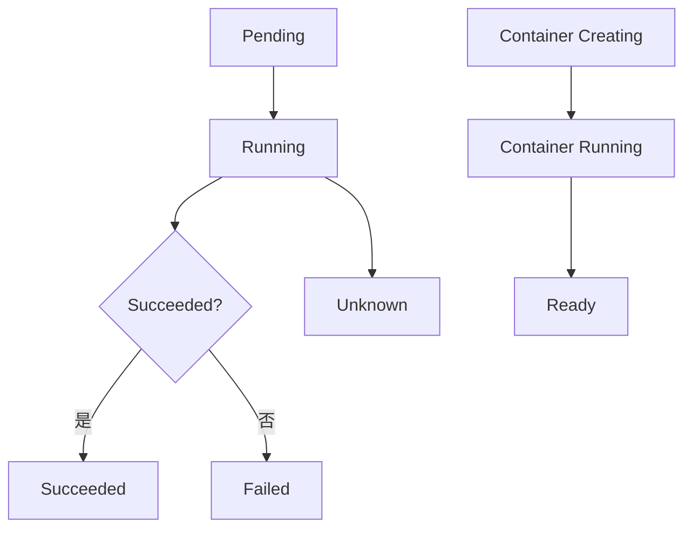

### 2. Service

#### 2.1 定义
- 抽象的Pod访问方式
- 提供负载均衡
- 支持多种类型

#### 2.2 Service类型
| 类型 | 说明 |
|------|------|
| ClusterIP | 内部虚拟IP（默认） |
| NodePort | 节点端口映射 |
| LoadBalancer | 云负载均衡器 |
| ExternalName | 外部域名映射 |

### 3. Deployment

#### 3.1 定义
- 声明式Pod副本管理
- 支持滚动更新
- 支持回滚

#### 3.2 工作原理
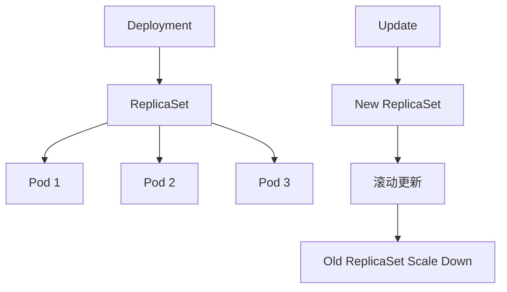

### 4. StatefulSet

#### 4.1 定义
- 有状态应用的部署管理
- 稳定的网络标识
- 稳定的持久存储

### 5. DaemonSet

#### 5.1 定义
- 每个节点运行一个Pod副本
- 常用于日志收集、监控等

### 6. Job/CronJob

#### 6.1 定义
- **Job**：一次性任务
- **CronJob**：定时任务

## 六、组件通信

### 1. 组件间通信架构

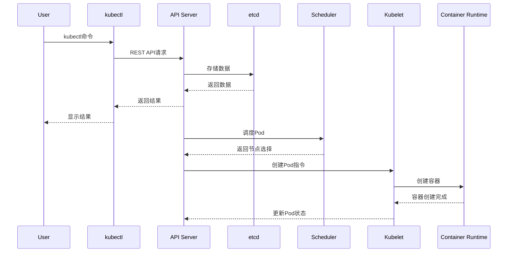

### 2. Watch机制

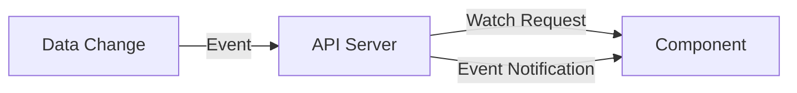

## 七、高可用架构

### 1. Multi-Master架构

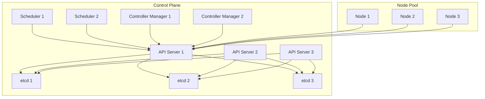

### 2. 高可用要点
- **API Server**：无状态，可水平扩展
- **Scheduler**：Leader选举，一个实例工作
- **Controller Manager**：Leader选举，一个实例工作
- **etcd**：Raft共识算法，保证一致性

## 八、资源协调流程

### 1. Pod调度完整流程

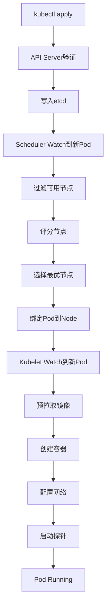

### 2. Service负载均衡流程

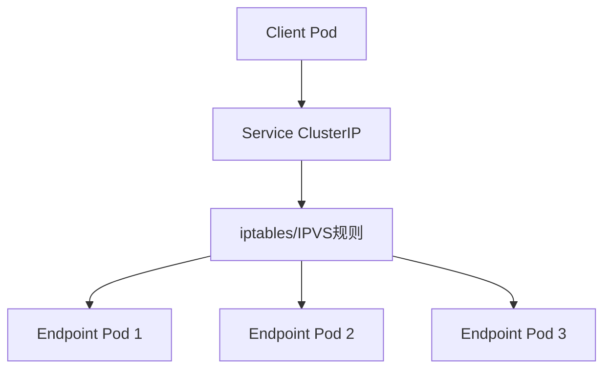

## 九、扩展Kubernetes

### 1. Custom Resource Definition (CRD)

```yaml
apiVersion: apiextensions.k8s.io/v1
kind: CustomResourceDefinition
metadata:
  name: myresources.mygroup.example.com
spec:
  group: mygroup.example.com
  names:
    kind: MyResource
    plural: myresources
  scope: Namespaced
  versions:
    - name: v1
      served: true
      storage: true
```

### 2. Operator模式

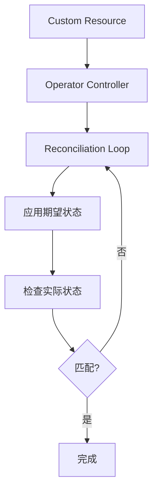

### 3. Aggregation Layer

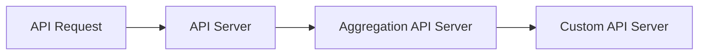

## 十、参考资料

- [Kubernetes官方文档](https://kubernetes.io/zh/docs/)
- [Kubernetes组件详解](https://kubernetes.io/docs/concepts/overview/components/)
- [API Server深入理解](https://kubernetes.io/docs/reference/command-line-tools-reference/kube-apiserver/)
- [Scheduler调度策略](https://kubernetes.io/zh/docs/concepts/scheduling-eviction/)
- [CNI规范](https://github.com/containernetworking/cni)
- [CRI规范](https://github.com/kubernetes/cri-api)
