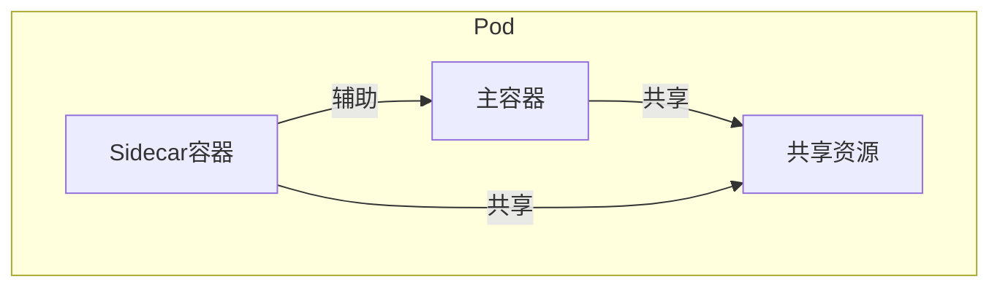
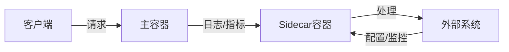

# Kubernetes Sidecar容器

## 目录

- [一、什么是Sidecar容器](#一什么是sidecar容器)
- [二、Sidecar的应用场景](#二sidecar的应用场景)
- [三、Sidecar架构模式](#三sidecar架构模式)
- [四、实现示例](#四实现示例)
- [五、最佳实践](#五最佳实践)
- [六、常见问题](#六常见问题)
- [七、相关资料](#七相关资料)

---

## 一、什么是Sidecar容器

### 1.1 定义

Sidecar（边车）容器是与主容器部署在同一个Pod中的辅助容器，它与主容器共享网络、存储等资源，但执行不同的功能。

### 1.2 核心特点

| 特点 | 说明 |
|------|------|
| 同Pod部署 | 与主容器在同一Pod中运行 |
| 共享资源 | 共享网络命名空间、存储卷 |
| 生命周期绑定 | 与主容器同生命周期 |
| 功能互补 | 为主容器提供辅助功能 |

### 1.3 与主容器的关系



---

## 二、Sidecar的应用场景

### 2.1 常见使用场景

| 场景 | 说明 | 示例 |
|------|------|------|
| 日志收集 | 收集主容器日志并发送到日志系统 | Fluentd、Filebeat |
| 监控代理 | 收集主容器指标并暴露给监控系统 | Prometheus Node Exporter |
| 网络代理 | 处理网络请求，如服务网格 | Envoy、Istio |
| 配置管理 | 管理配置文件，实现配置热更新 | Consul、ConfigMap Watcher |
| 安全防护 | 提供安全功能，如加密、认证 | Istio sidecar |
| 数据同步 | 同步数据到主容器或外部存储 | Rsync、DataDog |

### 2.2 典型案例

1. **Istio服务网格**：使用Envoy作为sidecar处理服务间通信
2. **日志收集**：Fluentd sidecar收集应用日志
3. **监控采集**：Prometheus Exporter采集应用指标
4. **配置管理**：Git同步配置到应用容器

---

## 三、Sidecar架构模式

### 3.1 基本架构



### 3.2 模式分类

| 模式 | 说明 | 适用场景 |
|------|------|----------|
| 代理模式 | Sidecar作为主容器的网络代理 | 服务网格、API网关 |
| 适配器模式 | 转换数据格式或协议 | 数据格式转换、协议适配 |
| 增强模式 | 为主容器添加新功能 | 监控、日志、安全 |
| 数据处理模式 | 处理主容器的输入/输出数据 | 数据压缩、加密、格式化 |

---

## 四、实现示例

### 4.1 日志收集示例

```yaml
apiVersion: v1
kind: Pod
metadata:
  name: app-with-logging
  labels:
    app: myapp
spec:
  containers:
  - name: app
    image: nginx:latest
    ports:
    - containerPort: 80
    volumeMounts:
    - name: logs
      mountPath: /var/log/nginx
  - name: fluentd
    image: fluent/fluentd:v1.12
    volumeMounts:
    - name: logs
      mountPath: /var/log/nginx
    - name: fluentd-config
      mountPath: /etc/fluentd
  volumes:
  - name: logs
    emptyDir: {}
  - name: fluentd-config
    configMap:
      name: fluentd-config
```

### 4.2 监控采集示例

```yaml
apiVersion: v1
kind: Pod
metadata:
  name: app-with-metrics
spec:
  containers:
  - name: app
    image: nginx:latest
    ports:
    - containerPort: 80
  - name: prometheus-exporter
    image: prom/node-exporter:latest
    ports:
    - containerPort: 9100
```

### 4.3 配置管理示例

```yaml
apiVersion: v1
kind: Pod
metadata:
  name: app-with-config
spec:
  containers:
  - name: app
    image: myapp:latest
    volumeMounts:
    - name: config
      mountPath: /app/config
  - name: config-watcher
    image: config-watcher:latest
    volumeMounts:
    - name: config
      mountPath: /app/config
    - name: config-source
      mountPath: /config-source
  volumes:
  - name: config
    emptyDir: {}
  - name: config-source
    configMap:
      name: app-config
```

---

## 五、最佳实践

### 5.1 设计原则

1. **单一职责**：Sidecar只负责一个功能，保持简洁
2. **资源限制**：为Sidecar设置合理的资源请求和限制
3. **健康检查**：为Sidecar添加健康检查，确保其正常运行
4. **启动顺序**：使用init containers或依赖关系确保启动顺序
5. **网络配置**：合理配置网络策略，控制Sidecar的网络访问

### 5.2 性能优化

| 优化项 | 建议 |
|--------|------|
| 资源分配 | 为Sidecar设置适当的CPU/内存限制 |
| 日志处理 | 合理配置日志轮转，避免磁盘空间耗尽 |
| 网络通信 | 尽量使用localhost通信，减少网络开销 |
| 镜像选择 | 使用轻量级镜像，减少启动时间 |

### 5.3 安全考虑

1. **最小权限**：Sidecar容器使用非root用户运行
2. **只读文件系统**：尽量使用只读文件系统
3. **网络隔离**：限制Sidecar的网络访问范围
4. **镜像安全**：使用官方或经过验证的镜像

---

## 六、常见问题

### 6.1 启动顺序问题

**问题**：主容器依赖Sidecar提供的服务，但Sidecar未就绪

**解决方案**：
- 使用init containers确保依赖服务就绪
- 使用健康检查和就绪探针
- 配置启动依赖关系

### 6.2 资源竞争

**问题**：Sidecar与主容器争夺资源

**解决方案**：
- 为每个容器设置资源限制
- 监控资源使用情况
- 合理分配资源比例

### 6.3 日志管理

**问题**：多个容器的日志混合，难以管理

**解决方案**：
- 使用结构化日志
- 为每个容器的日志添加标识
- 配置统一的日志收集系统

### 6.4 网络配置

**问题**：Sidecar与主容器的网络配置冲突

**解决方案**：
- 合理规划端口分配
- 使用不同的网络命名空间（如需）
- 配置网络策略

---

## 七、相关资料

- [Kubernetes官方文档：Pod设计](https://kubernetes.io/zh-cn/docs/concepts/workloads/pods/) 
- [Istio服务网格](https://istio.io/) 
- [Fluentd官方文档](https://docs.fluentd.org/)
- [Prometheus官方文档](https://prometheus.io/docs/)
- [Kubernetes最佳实践：Sidecar模式](https://kubernetes.io/blog/2015/06/the-distributed-system-toolkit-patterns/)
