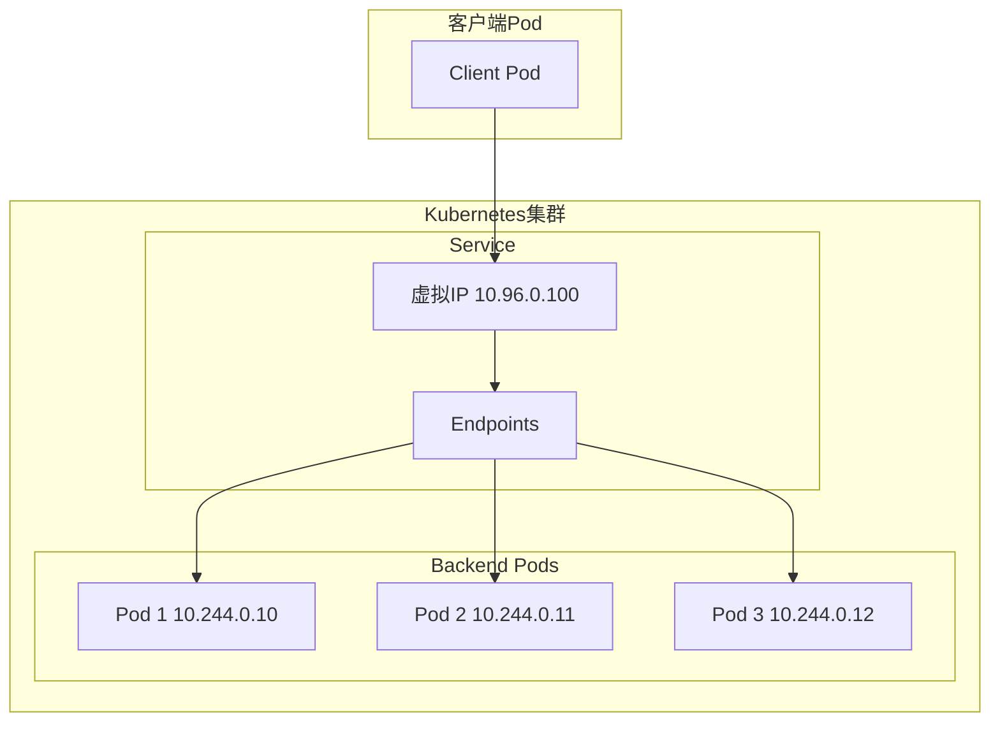
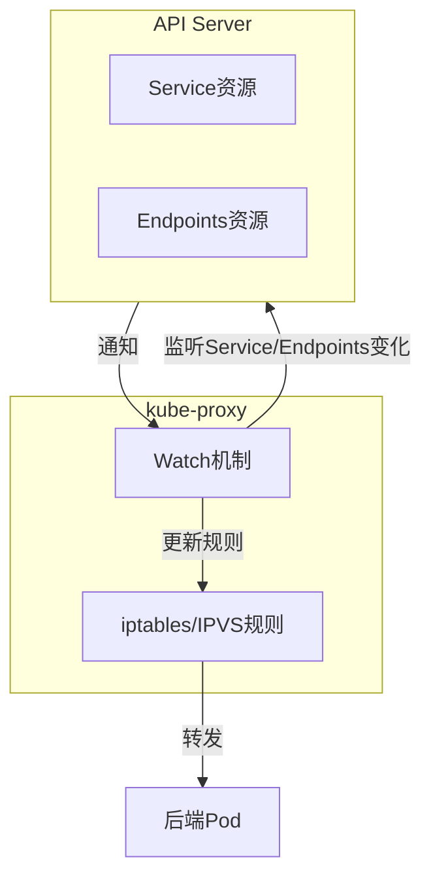
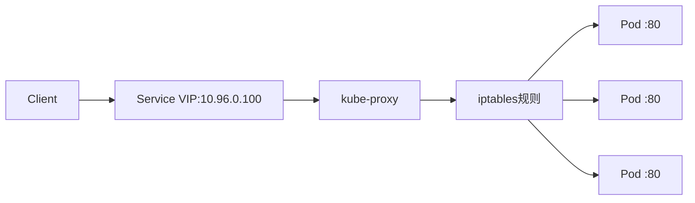

> 在docker或者k8s集群内部安装traefik并且配置ingress访问内部服务

## 目录

- [一、Docker配置Traefik](#一docker配置traefik)
- [二、Kubernetes配置Traefik](#二kubernetes配置traefik)
- [三、相关疑问](#三相关疑问)

---

## 一、Docker配置Traefik

### 1.1 Docker Compose配置

```yml
version: '3'

services:
  reverse-proxy:
    image: traefik:v2.10
    command: --api.insecure=true --providers.docker
    ports:
      - "80:80"
      - "8080:8080"
    volumes:
      - /var/run/docker.sock:/var/run/docker.sock
  nginx:
   image: nginx
   labels:
     - "traefik.http.routers.nginx.rule=Host(`yourdomain.com`)"
     - "traefik.http.services.nginx.loadbalancer.server.port=80"
   restart: always
```

### 1.2 启动服务

```bash
docker-compose up -d nginx
docker-compose up -d reverse-proxy
```

### 1.3 配置hosts

```bash
# 127.0.0.1 yourdomain.com
vim /etc/hosts
```

### 1.4 访问地址

- [访问Nginx服务yourdomain.com](yourdomain.com)
- [访问traefik可视化界面](http://127.0.0.1:8080/dashboard/#/)

---

## 二、Kubernetes配置Traefik

[Getting Started with Kubernetes and Traefik](https://doc.traefik.io/traefik/getting-started/quick-start-with-kubernetes/)

### 2.1 部署文件清单

```bash
[root@VM-8-4-centos ~]# ls -l
00-account.yml             # 创建账号
00-role.yml                # 创建角色
01-role-binding.yml        # 绑定账号角色
02-traefik-services.yml    # 创建traefik服务
02-traefik.yml             # traefik配置
03-whoami-services.yml     # 创建测试用的服务
03-whoami.yml              # 创建测试用的后端
04-whoami-ingress.yml      # 给service绑定ingress
```

---

## 三、相关疑问

### 3.1 Service的虚拟IP在集群内外都无法访问，那还有什么用

Service的虚拟IP（ClusterIP）主要作用是提供**稳定的访问入口**和**负载均衡**：

| 作用 | 说明 |
|------|------|
| 负载均衡 | 将请求分发到后端多个Pod |
| 服务发现 | 提供固定的VIP，Pod IP变化不影响访问 |
| 解耦 | 后端Pod变动与客户端访问解耦 |

> 虚拟IP本身是Kubernetes内部概念，集群外部无法直接访问，需要通过Ingress、NodePort或LoadBalancer等方式暴露

### 3.2 Service的虚拟IP作用架构图



**流程说明**：
1. 客户端通过Service名称或VIP访问服务
2. kube-proxy维护iptables/IPVS规则，将流量转发到后端Pod
3. Endpoints对象记录了所有后端Pod的IP和端口

### 3.3 Service虚拟IP负载均衡的源码理解



**核心逻辑**：
1. kube-proxy通过Watch机制监听API Server的Service和Endpoints变化
2. 根据Service信息更新iptables/IPVS规则
3. 客户端请求到达VIP时，根据规则负载均衡到后端Pod

### 3.4 集群带宽测试方法

| 方法 | 说明 |
|------|------|
| iperf/iperf3 | 在节点或容器中安装，直接测试网络带宽 |
| 网卡统计 | `ifconfig`查看网卡传输字节数 |
| Prometheus监控 | 使用NodeExporter采集网卡流量指标 |

```bash
# 使用iperf测试
# 服务端
$ iperf3 -s

# 客户端
$ iperf3 -c <server-ip> -t 30
```

### 3.5 通用集群暴露服务的方式

| 方式 | 适用场景 | 特点 |
|------|----------|------|
| Ingress | HTTP/HTTPS流量 | 支持域名、SSL、路径路由 |
| NodePort | 简单暴露 | 端口范围30000-32767 |
| LoadBalancer | 云环境 | 需要云厂商支持 |

**推荐使用Ingress**，原因：
- 统一使用HTTPS
- 支持自定义域名
- 支持路径路由和重写
- 可与Let's Encrypt等配合自动HTTPS

### 3.6 请求Service虚拟IP如何转发到后端Pod



**转发流程**：
1. 客户端请求到达Service VIP（10.96.0.100:80）
2. kube-proxy的iptables/IPVS规则捕获流量
3. 根据负载均衡策略选择一个后端Pod
4. 流量转发到选中的Pod IP:端口

### 3.7 配置Ingress-nginx监听宿主机80端口

| 部署方式 | 配置方法 |
|----------|----------|
| NodePort | 修改端口范围（不推荐生产环境） |
| HostNetwork | 将Pod运行在宿主机网络空间 |
| LoadBalancer | 云环境使用云厂商LoadBalancer |

**HostNetwork方式**：

```yaml
apiVersion: v1
kind: Pod
metadata:
  name: ingress-nginx
spec:
  hostNetwork: true
  containers:
  - name: nginx-ingress
    image: registry.k8s.io/ingress-nginx/controller:v1.8.2
```

### 3.8 Ingress服务端口暴露方式

| 方式 | 说明 |
|------|------|
| Deployment + NodePort/LoadBalancer | 通过Service暴露 |
| DaemonSet + HostNetwork | 直接使用宿主机网络 |
| DaemonSet + HostPort | 监听宿主机端口 |

**推荐：DaemonSet + HostNetwork**：

```yaml
apiVersion: v1
kind: DaemonSet
metadata:
  name: ingress-nginx
spec:
  template:
    spec:
      hostNetwork: true
      containers:
      - name: controller
        image: registry.k8s.io/ingress-nginx/controller:v1.8.2
```

### 3.9 Ingress-nginx监听宿主机80端口完整配置

```yaml
apiVersion: apps/v1
kind: DaemonSet
metadata:
  name: ingress-nginx
  namespace: ingress-nginx
spec:
  selector:
    matchLabels:
      app: ingress-nginx
  template:
    metadata:
      labels:
        app: ingress-nginx
    spec:
      hostNetwork: true
      containers:
      - name: controller
        image: registry.k8s.io/ingress-nginx/controller:v1.8.2
        args:
        - /nginx-ingress-controller
        - --ingress-class=nginx
        - --watch-ingress-without-class=true
        ports:
        - name: http
          containerPort: 80
          hostPort: 80
        - name: https
          containerPort: 443
          hostPort: 443
```

> 使用`hostPort`直接将容器端口映射到宿主机端口，外部可直接通过宿主机IP:80访问
