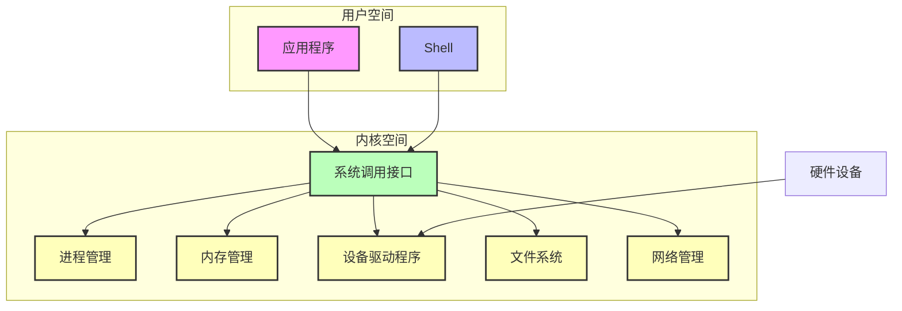
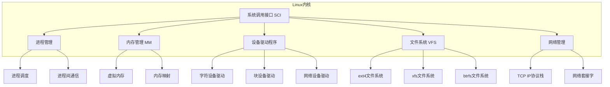
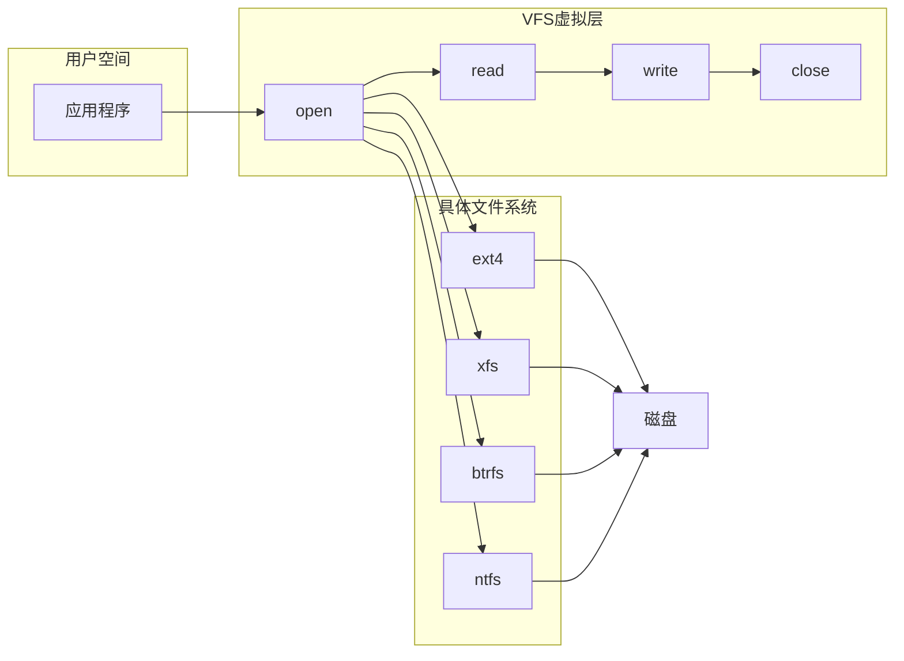
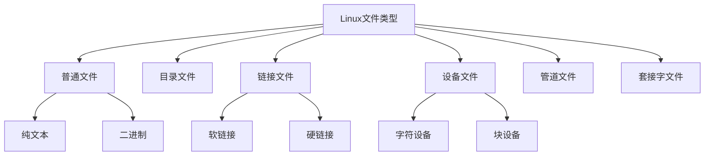
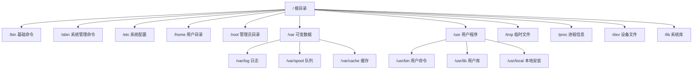
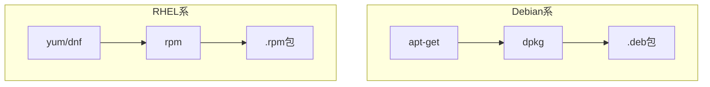

# Linux 结构组成

> Linux的文件系统目录结构理解，从内核到应用程序大致组成

## 一、Linux 系统架构

### 1.1 Linux 系统组成

Linux系统一般有四个主要部分：**内核（Kernel）**、**Shell**、**文件系统**、**应用程序**。

- **Shell** 是系统的用户界面，提供了用户与内核进行交互操作的接口，它接收用户输入的命令并将它送到内核去执行。

### 1.2 Linux 内核组成

Linux内核主要由以下部分组成：

| 组件 | 功能描述 |
|------|----------|
| **进程管理** | 创建、调度、终止进程，管理CPU时间片分配 |
| **内存管理** | 虚拟内存管理、内存映射、交换空间管理 |
| **设备驱动程序** | 与硬件设备交互的接口 |
| **文件系统** | 管理和访问磁盘上的文件 |
| **网络管理** | TCP/IP协议栈、网络套接字 |
| **系统调用接口** | 用户空间与内核空间的桥梁 |

## 二、虚拟文件系统（VFS）

### 2.1 VFS 概述

虚拟文件系统（Virtual File System）是Linux内核中的一个软件层，提供了 `open`、`close`、`read`、`write` 等统一的API，隐藏了各种具体文件系统的实现细节。

### 2.2 Linux 文件类型

| 文件类型 | 描述 | 示例 |
|----------|------|------|
| **普通文件** | 纯文本文件或二进制文件 | 代码、脚本、可执行文件 |
| **目录文件** | 存储文件的唯一地方 | `/home`, `/usr` |
| **链接文件** | 指向同一个文件或目录 | 软链接、硬链接 |
| **设备文件** | 与系统外设相关 | `/dev/sda`, `/dev/null` |
| **管道文件** | 提供进程间通信 | 命名管道（FIFO） |
| **套接字文件** | 与网络通信相关 | `/var/run/docker.sock` |

## 三、Linux 目录结构

### 3.1 目录层次结构

### 3.2 主要目录说明

| 目录 | 用途 |
|------|------|
| `/bin` | 基础用户命令，如 `ls`、`cp`、`mv` |
| `/sbin` | 系统管理命令，如 `fdisk`、`mkfs` |
| `/etc` | 系统配置文件，如 `passwd`、`fstab` |
| `/home` | 普通用户的家目录 |
| `/root` | 管理员（root）的家目录 |
| `/var` | 可变数据：日志、缓存、队列等 |
| `/usr` | 用户程序和库文件 |
| `/tmp` | 临时文件 |
| `/proc` | 进程信息和内核数据结构 |
| `/dev` | 设备文件 |
| `/lib` | 系统共享库 |

## 四、相关疑问

### 4.1 apt 和 apt-get 的关系

- **apt-get**：最早的包管理后端工具，功能强大但用户友好性较差
- **apt**：Debian 在 apt-get 基础上开发的更现代的命令行工具，提供了更友好的交互界面
- **关系**：apt 底层仍然调用 apt-get，提供更好的用户体验

### 4.2 rpm、apt、yum 的关系

| 包管理工具 | 发行版 | 底层命令 |
|------------|--------|----------|
| **rpm** | RHEL、CentOS | 底层包管理命令 |
| **yum** | CentOS 6/7 | 基于 rpm 的包管理器 |
| **dnf** | RHEL 8、CentOS 8 | yum 的下一代版本 |
| **apt** | Debian、Ubuntu | 底层 dpkg 的包管理器 |
| **apt-get** | Debian、Ubuntu | apt 的底层命令 |

## 五、相关资料

- [一文带你全面掌握Linux系统体系结构](https://www.zhihu.com/collection/307882235)