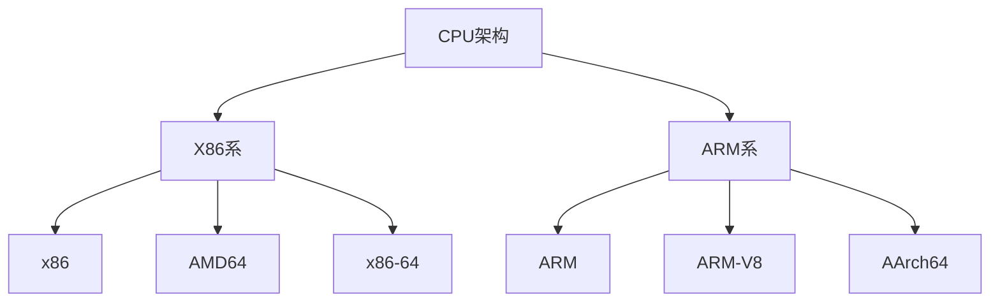
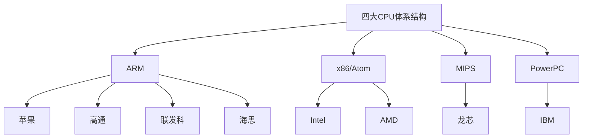
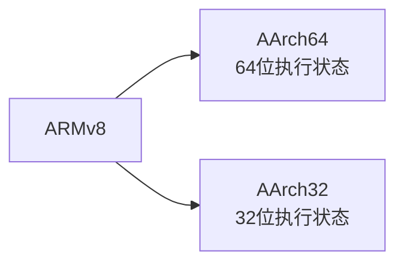
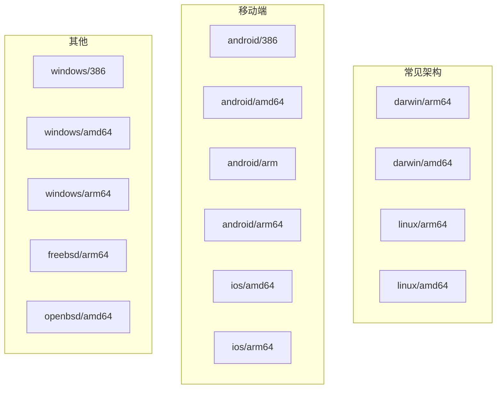

# CPU 架构

## 一、CPU 两大派系



## 二、主要 CPU 体系结构



## 三、指令集架构详解

### 3.1 X86 架构

| 类型 | 说明 |
|------|------|
| **x86** |  Intel/AMD 32位处理器 |
| **AMD64** | AMD 64位处理器 |
| **x86-64** | Intel/AMD 64位处理器（兼容32位） |

### 3.2 ARM 架构



| 类型 | 说明 |
|------|------|
| **ARM** | 32位处理器 |
| **ARM-V8** | 支持64位的ARM架构 |
| **AArch64** | ARMv8的64位执行状态 |

### 3.3 Darwin 系统

Darwin 是一个由苹果公司（Apple Inc.）开发的 UNIX 操作系统，基于 ARM 架构。

## 四、Go 语言支持的架构列表



| 平台 | 架构 | 说明 |
|------|------|------|
| **darwin** | amd64, arm64 | macOS |
| **linux** | 386, amd64, arm, arm64 | 常见服务器 |
| **windows** | 386, amd64, arm | PC |
| **android** | 386, amd64, arm, arm64 | Android |

```bash
# 查看 Go 支持的所有架构
go tool dist list
```

## 五、相关资料

- [CPU_X86架构和ARM架构入门篇](https://cloud.tencent.com/developer/article/1862717)
- [x86-64、amd64、arm、aarch64 都是些什么](https://blog.csdn.net/qq_24433609/article/details/125991550)