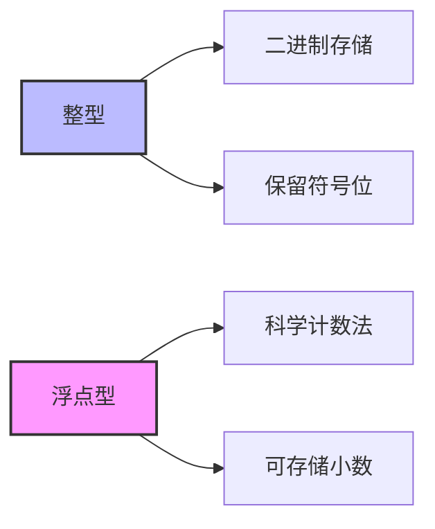
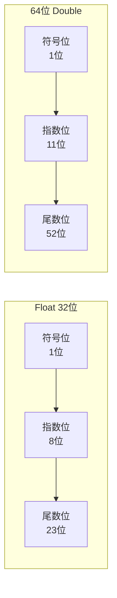
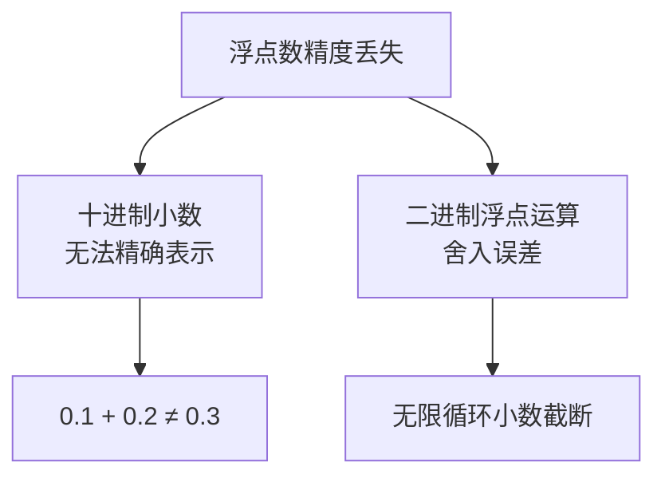

# 浮点数精度

> 整型用二进制存储数据，保留一个符号位；浮点数用科学计数法存储数据

## 一、整数 vs 浮点数存储



| 类型 | 存储方式 | 表示范围 |
|------|----------|----------|
| **int** | 二进制 | 有限整数 |
| **float** | 科学计数法 | 可表示小数和大范围数值 |

## 二、IEEE 754 浮点数格式

### 2.1 Float 32位结构



| 类型 | 符号位 | 指数位 | 尾数位 | 总位数 |
|------|--------|--------|--------|--------|
| **float** | 1 | 8 | 23 | 32 |
| **double** | 1 | 11 | 52 | 64 |

### 2.2 科学计数法表示

```
# 整数
1 = 10^0

# 小数
0.00001 = 1 × 10^-5

# 普通数字
610 = 6.1 × 10^2
0.13 = 1 × 10^-1 + 3 × 10^-2
```

## 三、浮点数精度问题



### 精度损失原因

1. **十进制转二进制**：某些十进制小数无法用二进制精确表示
2. **舍入运算**：浮点运算结果需要舍入到最近的可表示值

## 四、相关资料

- [float浮点数精度丢失问题分析](https://zhuanlan.zhihu.com/p/375156201)