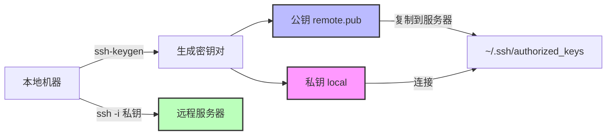
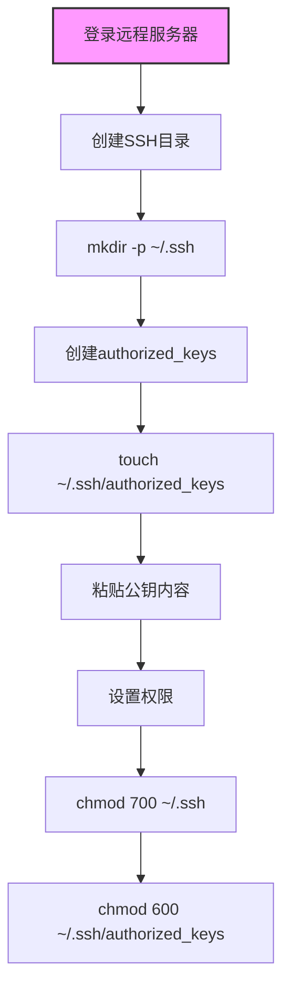
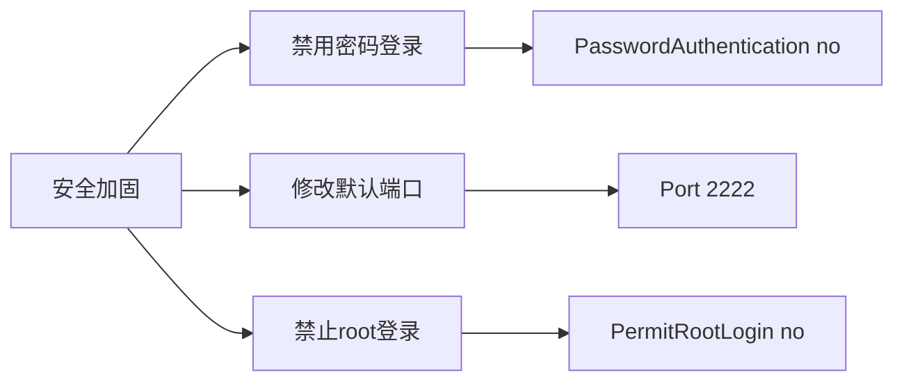

# Linux服务器SSH密钥

> 使用SSH密钥实现免密码登录服务器

## 一、SSH密钥登录流程



## 二、本地生成密钥

### 2.1 创建密钥

```bash
# 创建SSH目录
sudo mkdir -p ~/.ssh
cd ~/.ssh

# 生成RSA密钥对
ssh-keygen -t rsa
```

### 2.2 密钥生成示例

```bash
$ ssh-keygen -t rsa
Generating public/private rsa key pair.
Enter file in which to save the key: tencent
Enter passphrase: (直接回车)
Enter same passphrase again: (直接回车)

Your identification has been saved in tencent
Your public key has been saved in tencent.pub
```

```bash
$ ls -la | grep tencent
-rw-------   1 dofun  staff  2622  tencent       # 私钥
-rw-r--r--   1 dofun  staff   586  tencent.pub   # 公钥
```

| 文件 | 说明 |
|------|------|
| **tencent** | 私钥，妥善保管 |
| **tencent.pub** | 公钥，可随意分发 |

## 三、配置远程服务器



### 3.1 配置步骤

```bash
# 1. 登录远程服务器，创建目录
mkdir -p /root/.ssh

# 2. 创建并编辑authorized_keys
cd /root/.ssh
touch authorized_keys
vim authorized_keys
# 粘贴本地公钥内容

# 3. 设置权限
chmod 700 /root/.ssh
chmod 600 /root/.ssh/authorized_keys
```

### 3.2 启用密钥认证

```bash
# 编辑SSH配置
sudo vim /etc/ssh/sshd_config

# 确保以下配置开启
PubkeyAuthentication yes

# 重启SSH服务
systemctl restart sshd
```

## 四、连接服务器

### 4.1 密钥登录

```bash
ssh -i ~/.ssh/tencent root@[IP地址]

# 示例
ssh -i ~/.ssh/tencent root@43.156.75.90
```

### 4.2 密码登录

```bash
# 直接密码登录
ssh root@192.168.1.2
```

## 五、安全加固（可选）



```bash
# 编辑SSH配置
sudo vim /etc/ssh/sshd_config

# 禁用密码登录
PasswordAuthentication no

# 重启服务
systemctl restart sshd
```

## 六、相关命令速查

| 操作 | 命令 |
|------|------|
| **生成密钥** | `ssh-keygen -t rsa` |
| **登录服务器** | `ssh -i 私钥 root@IP` |
| **复制公钥** | 手动添加到authorized_keys |
| **重启SSH** | `systemctl restart sshd` |