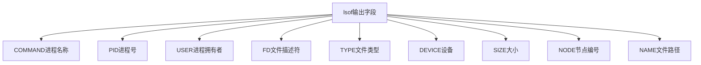
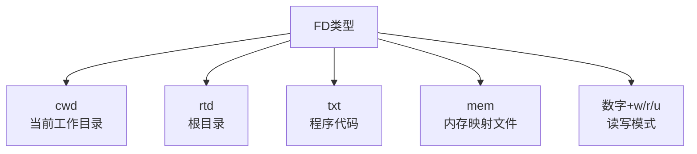
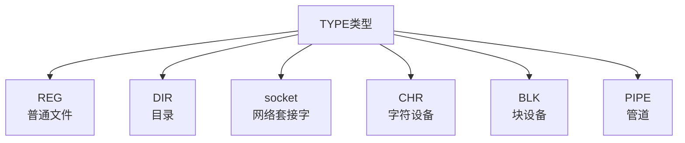

# lsof 命令

> lsof 查看进程打开了多少个文件或者网络套接字

## 一、lsof 输出字段解析



| 字段 | 说明 |
|------|------|
| **COMMAND** | 进程名称 |
| **PID** | 进程号 |
| **USER** | 进程拥有者 |
| **FD** | 文件描述符 |
| **TYPE** | 文件类型 |
| **SIZE/OFF** | 文件大小 |
| **NODE** | 文件节点编号 |
| **NAME** | 文件路径 |

## 二、FD 文件描述符类型



| FD | 说明 |
|----|------|
| **cwd** | 当前工作目录 |
| **rtd** | 根目录 |
| **txt** | 程序代码 |
| **mem** | 内存映射文件 |
| **8w** | 文件描述符8，只写模式 |
| **8r** | 文件描述符8，只读模式 |
| **8u** | 文件描述符8，读写模式 |

## 三、TYPE 文件类型



| TYPE | 说明 |
|------|------|
| **REG** | 普通磁盘文件 |
| **DIR** | 目录 |
| **socket** | 网络套接字 |
| **CHR** | 字符特殊文件 |
| **BLK** | 块特殊文件 |
| **PIPE** | 管道 |

## 四、常用命令

### 4.1 查看进程打开的文件

```bash
# 查看指定进程打开的文件
$ lsof -p 65191

# 示例输出
COMMAND   PID USER    FD      TYPE             DEVICE      SIZE/OFF  NODE      NAME
ovs-vswit 21764 root    cwd      DIR              253,3      4096       128 /
ovs-vswit 21764 root    rtd      DIR              253,3      4096       128 /
ovs-vswit 21764 root    txt      REG              253,3  16136816   1820044 /usr/sbin/ovs-vswitchd
ovs-vswit 21764 root    mem      REG              253,3   1531880      2546 /usr/lib64/libc-2.28.so
```

### 4.2 查看进程打开的 REG 文件

```bash
$ lsof -p 20329 | grep REG
COMMAND   PID USER    FD      TYPE             DEVICE      SIZE/OFF  NODE      NAME
java    20329 root    8w      REG             253,17      3531      338575098 warn-log.log
java    20329 root    9w      REG             253,17   5703411      338575103 info-log.log
```

### 4.3 查找端口占用

```bash
# 查找占用端口的进程
$ lsof -i :8080
```

## 五、命令速查

| 命令 | 说明 |
|------|------|
| `lsof -p pid` | 查看进程打开的文件 |
| `lsof -p pid \| grep REG` | 只看普通文件 |
| `lsof -i :port` | 查看端口占用 |
| `lsof -i tcp` | 查看TCP连接 |
| `lsof -u username` | 查看用户打开的文件 |