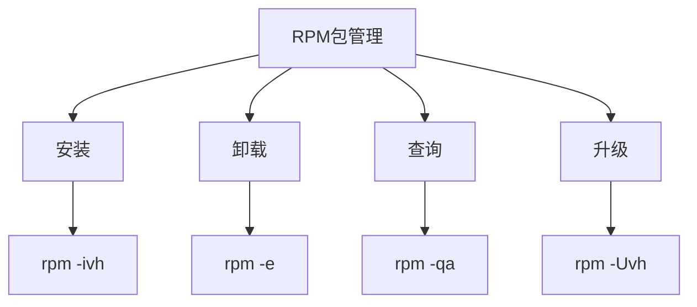
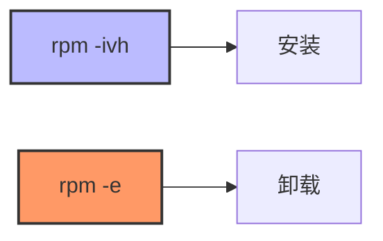
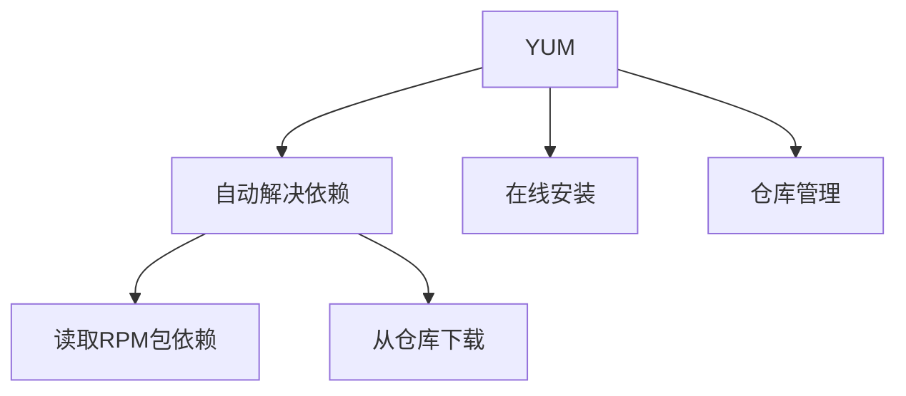
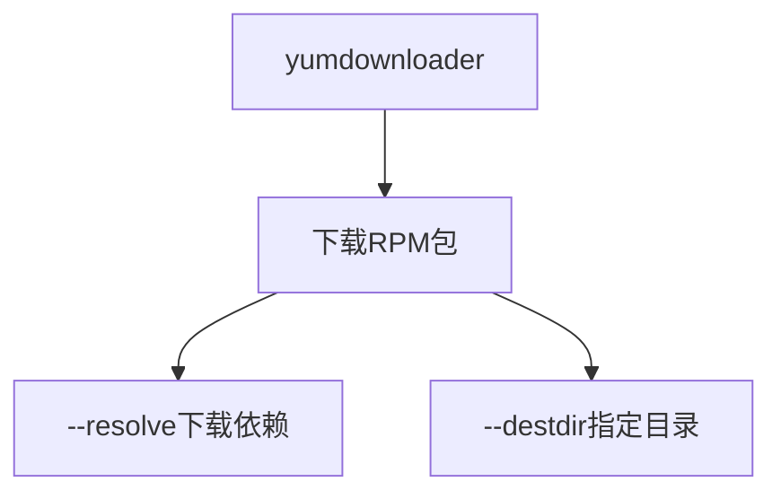
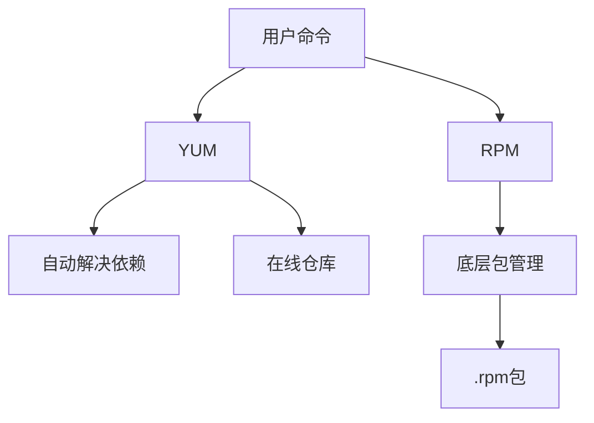

# RPM 包管理

> RPM（Red Hat Package Manager）红帽软件包管理工具

## 一、RPM 简介



## 二、RPM 命令

### 2.1 安装与卸载



| 命令 | 说明 |
|------|------|
| `rpm -ivh 包名.rpm` | 安装（i安装，v详细，h进度） |
| `rpm -e 包名` | 卸载 |

```bash
# 安装RPM包
$ rpm -ivh 包名.rpm

# 卸载RPM包
$ rpm -e 包名
```

## 三、YUM 包管理器

### 3.1 YUM 简介

YUM（Yellowdog Updater Modified）基于 RPM 的包管理器，自动处理依赖关系。



### 3.2 YUM 常用命令

```bash
# 查看所有仓库
$ cd /etc/yum.repos.d

# 安装包
$ yum install -y 包名

# 卸载包
$ yum remove -y 包名

# 升级包
$ yum update -y 包名

# 清理缓存
$ yum clean all
```

## 四、RPM 包下载

### 4.1 yumdownloader 下载包



```bash
# 安装yumdownloader工具
$ yum install -y yum-utils

# 下载RPM包及依赖
$ yumdownloader --resolve --destdir=./ initscripts
```

### 4.2 yum downloadonly

```bash
# 未安装的包
$ yum -y install --downloadonly --downloaddir=./ 包名

# 已安装的包
$ yum -y reinstall --downloadonly --downloaddir=./ 包名
```

## 五、RPM 与 YUM 关系



| 工具 | 层级 | 特点 |
|------|------|------|
| **YUM** | 上层 | 自动解决依赖，在线安装 |
| **RPM** | 底层 | 手动处理依赖，本地安装 |

## 六、相关文件路径

```bash
# YUM 仓库配置目录
/etc/yum.repos.d/

# RPM 数据库
/var/lib/rpm/
```