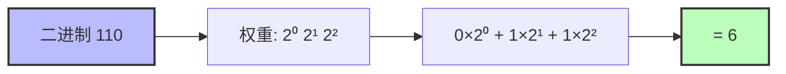
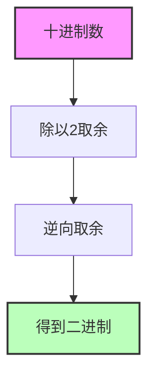
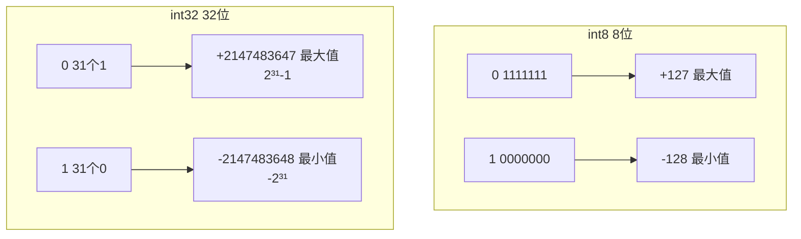
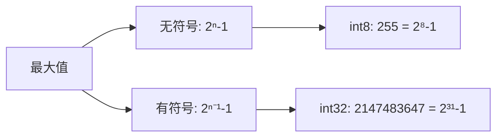
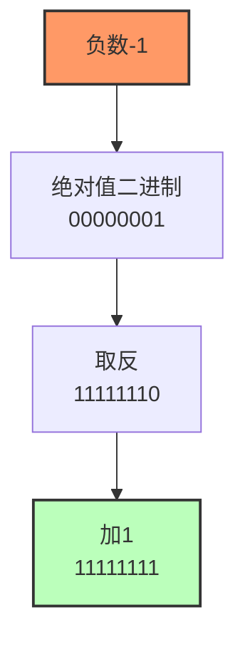
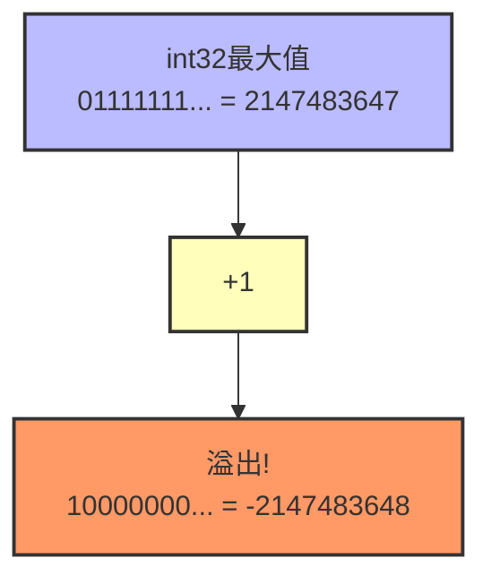
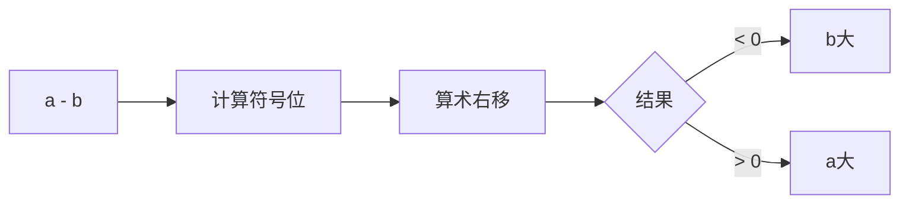
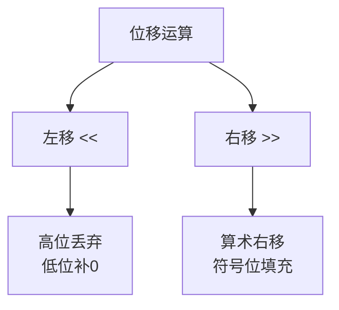

# 二进制

> 计算机中整数的表示方式：原码、反码、补码

## 一、二进制转换基础

### 1.1 二进制转十进制



### 1.2 十进制转二进制



## 二、有符号整数范围

### 2.1 int8/int32 取值范围



| 类型 | 范围 | 公式 |
|------|------|------|
| **int8** | -128 ~ +127 | -2⁷ ~ 2⁷-1 |
| **int32** | -2147483648 ~ +2147483647 | -2³¹ ~ 2³¹-1 |
| **uint8** | 0 ~ 255 | 0 ~ 2⁸-1 |

### 2.2 二进制最大值公式



## 三、补码表示法

### 3.1 负数的补码



### 3.2 溢出问题



> int32 最大值加1会变成最小值，这是二进制溢出的典型表现

## 四、Golang 移位比较大小

```go
// 通过符号位比较两个整数大小
func compare(a, b int) string {
    c := a - b
    z := (unsafe.Sizeof(c)-1)*8 + 7  // 计算符号位位置
    d := c >> z                      // 算术右移
    l := []string{"b大", "a大"}
    return l[d+1]
}
```



## 五、二进制位移运算



## 六、相关资料

- [RSA算法原理](https://zhuanlan.zhihu.com/p/75291280)
- [二进制运算详解](https://www.cnblogs.com/MinPage/p/14206580.html)